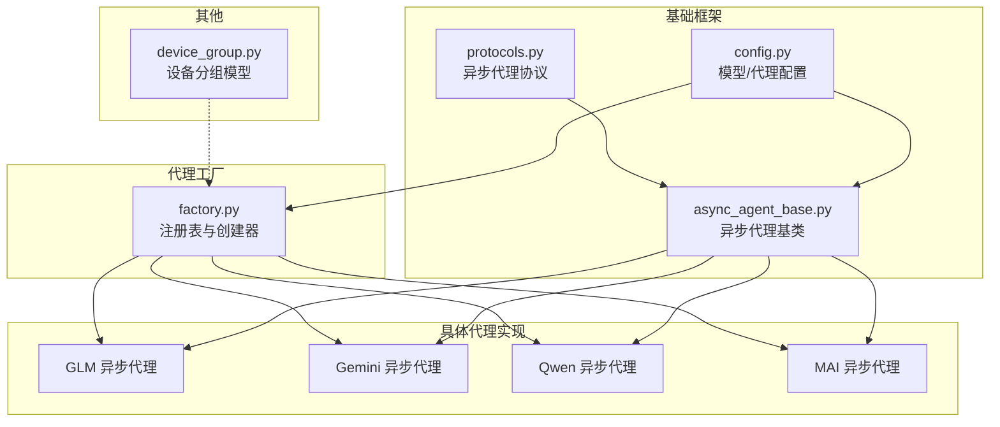
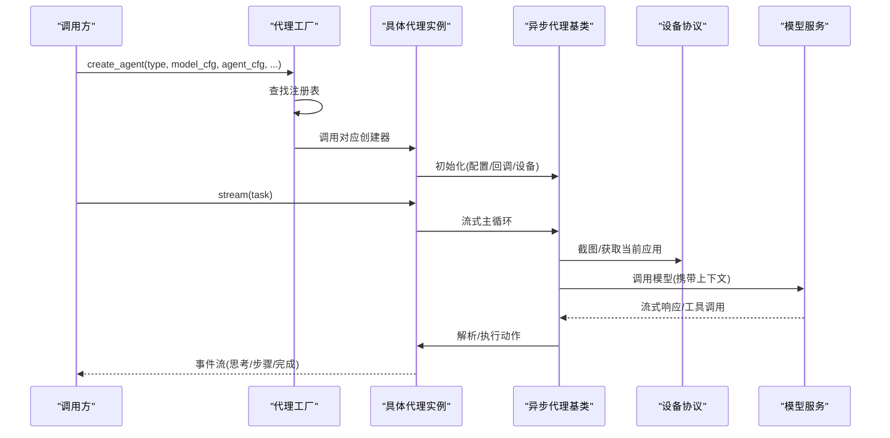
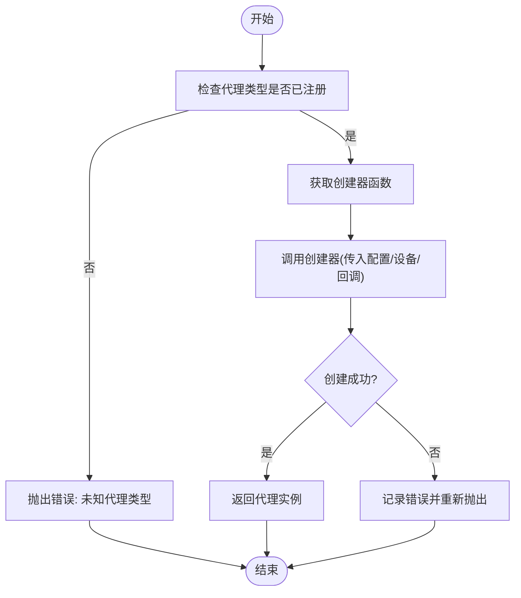
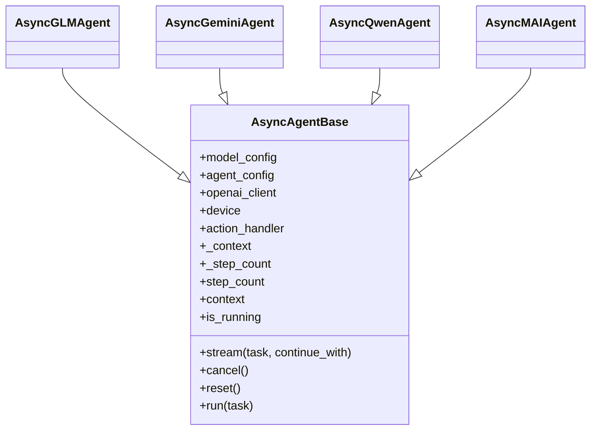
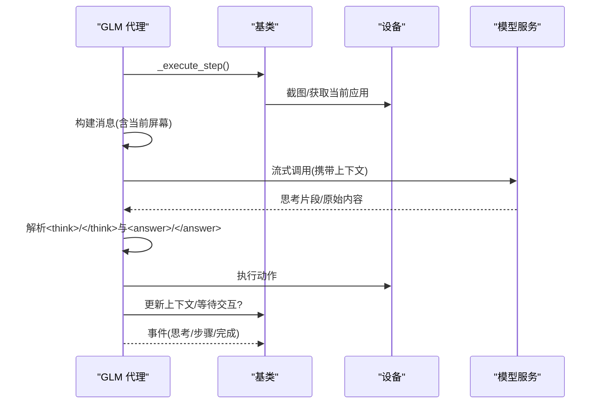
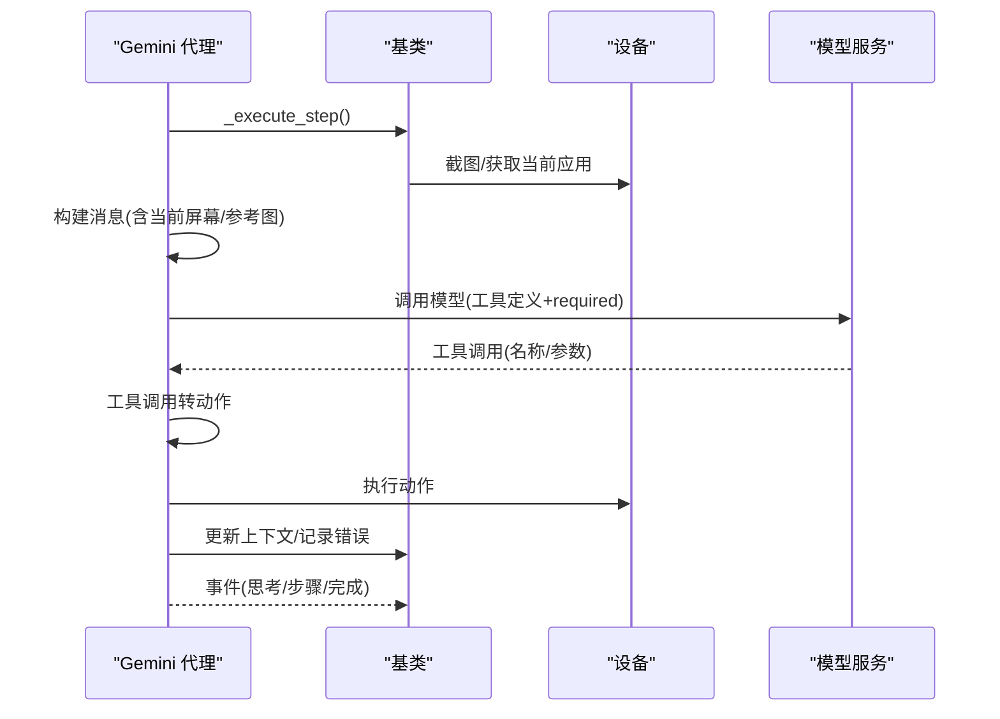
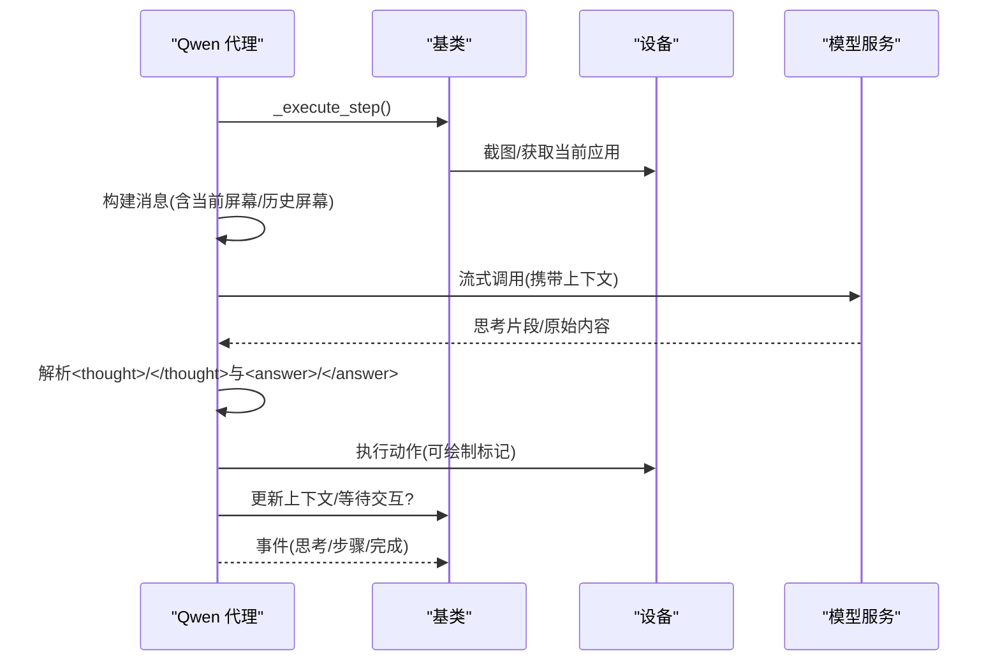
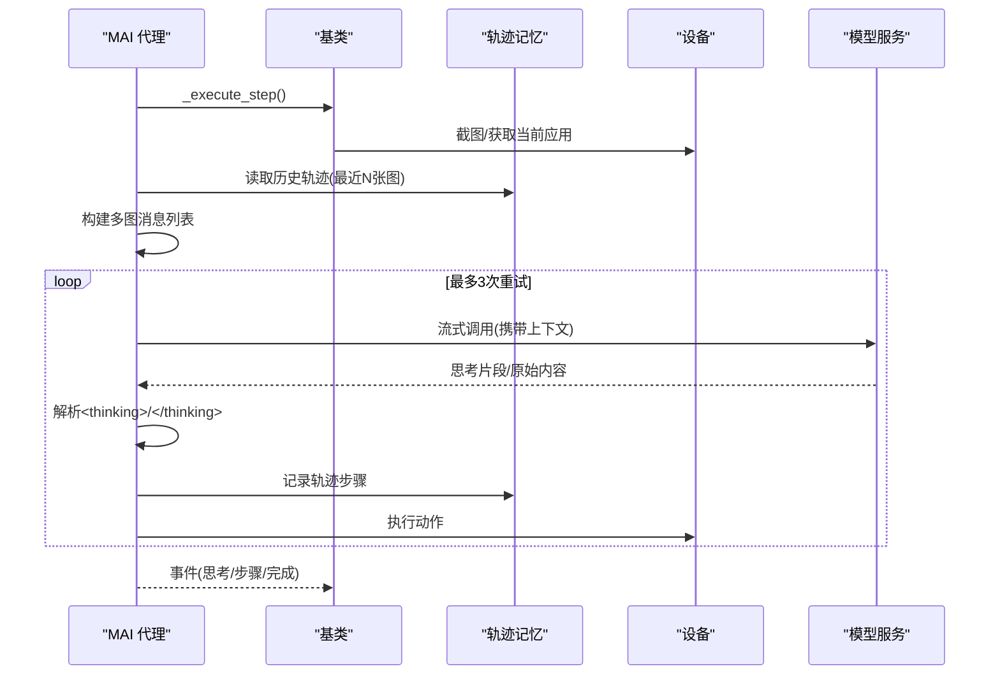
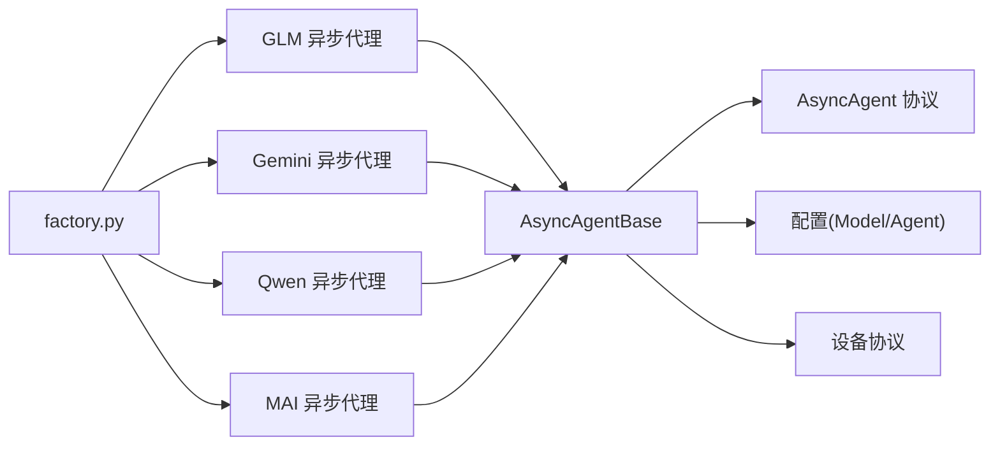

# 代理模型概览

<cite>
**本文档引用的文件**
- [factory.py](file://AutoGLM_GUI/agents/factory.py)
- [async_agent_base.py](file://AutoGLM_GUI/agents/base/async_agent_base.py)
- [protocols.py](file://AutoGLM_GUI/agents/protocols.py)
- [async_agent.py (GLM)](file://AutoGLM_GUI/agents/glm/async_agent.py)
- [async_agent.py (Gemini)](file://AutoGLM_GUI/agents/gemini/async_agent.py)
- [async_agent.py (Qwen)](file://AutoGLM_GUI/agents/qwen/async_agent.py)
- [async_agent.py (MAI)](file://AutoGLM_GUI/agents/mai/async_agent.py)
- [config.py](file://AutoGLM_GUI/config.py)
- [device_group.py](file://AutoGLM_GUI/models/device_group.py)
</cite>

## 目录
1. [简介](#简介)
2. [项目结构](#项目结构)
3. [核心组件](#核心组件)
4. [架构总览](#架构总览)
5. [详细组件分析](#详细组件分析)
6. [依赖关系分析](#依赖关系分析)
7. [性能考量](#性能考量)
8. [故障排查指南](#故障排查指南)
9. [结论](#结论)
10. [附录](#附录)

## 简介
本文件为 AutoGLM-GUI 的 AI 代理模型提供全面概览，重点介绍 GLM、Gemini、Qwen、MAI 四种代理模型的核心特点、技术架构与适用场景，并对比其性能表现、准确性与资源消耗。文档还解释代理工厂的设计原理与模型选择策略，提供模型能力矩阵与推荐使用场景，以及模型切换、配置管理与性能基准测试方法。

## 项目结构
AutoGLM-GUI 将代理模型按功能域组织，核心代理位于 AutoGLM_GUI/agents 下，采用“工厂模式 + 注册表”的方式统一创建与管理不同类型的代理。基础能力由 AsyncAgentBase 提供，协议定义于 protocols.py，配置参数由 config.py 提供。

**图表来源**
- [factory.py:1-283](file://AutoGLM_GUI/agents/factory.py#L1-L283)
- [async_agent_base.py:1-439](file://AutoGLM_GUI/agents/base/async_agent_base.py#L1-L439)
- [protocols.py:1-95](file://AutoGLM_GUI/agents/protocols.py#L1-L95)
- [config.py:1-89](file://AutoGLM_GUI/config.py#L1-L89)

**章节来源**
- [factory.py:1-283](file://AutoGLM_GUI/agents/factory.py#L1-L283)
- [async_agent_base.py:1-439](file://AutoGLM_GUI/agents/base/async_agent_base.py#L1-L439)
- [protocols.py:1-95](file://AutoGLM_GUI/agents/protocols.py#L1-L95)
- [config.py:1-89](file://AutoGLM_GUI/config.py#L1-L89)

## 核心组件
- 代理工厂与注册表：集中管理代理类型与创建器，支持动态注册与创建，便于扩展新代理类型。
- 异步代理基类：提供 OpenAI 客户端初始化、设备交互、流式主循环、取消与重置等通用能力。
- 代理协议：定义统一的异步接口，确保所有代理具备一致的流式输出、取消与生命周期管理能力。
- 具体代理实现：GLM、Gemini、Qwen、MAI 分别针对自身解析格式与上下文策略进行定制。

**章节来源**
- [factory.py:20-108](file://AutoGLM_GUI/agents/factory.py#L20-L108)
- [async_agent_base.py:32-110](file://AutoGLM_GUI/agents/base/async_agent_base.py#L32-L110)
- [protocols.py:9-95](file://AutoGLM_GUI/agents/protocols.py#L9-L95)

## 架构总览
下图展示代理工厂如何根据代理类型创建具体代理实例，以及代理如何通过基类与设备交互、调用模型 API 并执行动作。

**图表来源**
- [factory.py:49-98](file://AutoGLM_GUI/agents/factory.py#L49-L98)
- [async_agent_base.py:112-396](file://AutoGLM_GUI/agents/base/async_agent_base.py#L112-L396)
- [async_agent.py (GLM):81-339](file://AutoGLM_GUI/agents/glm/async_agent.py#L81-L339)
- [async_agent.py (Gemini):70-345](file://AutoGLM_GUI/agents/gemini/async_agent.py#L70-L345)
- [async_agent.py (Qwen):131-398](file://AutoGLM_GUI/agents/qwen/async_agent.py#L131-L398)
- [async_agent.py (MAI):80-318](file://AutoGLM_GUI/agents/mai/async_agent.py#L80-L318)

## 详细组件分析

### 代理工厂与模型选择策略
- 工厂注册表：以字符串键映射到创建器函数，支持覆盖与日志提示。
- 内置代理类型：
  - GLM：异步实现，别名 "glm-async"、"async-glm"
  - Gemini：通用视觉模型，别名 "gemini"、"general-vision"
  - Qwen：异步实现
  - MAI：异步实现，支持历史 N 张截图
  - DroidRun、Midscene：作为扩展代理类型注册
- 创建流程：校验类型存在性、调用创建器、传入模型配置、代理配置、设备与回调；异常捕获与日志记录。

**图表来源**
- [factory.py:49-98](file://AutoGLM_GUI/agents/factory.py#L49-L98)

**章节来源**
- [factory.py:20-108](file://AutoGLM_GUI/agents/factory.py#L20-L108)
- [factory.py:113-282](file://AutoGLM_GUI/agents/factory.py#L113-L282)

### 异步代理基类（AsyncAgentBase）
- 职责：统一初始化 OpenAI 客户端、ActionHandler、设备交互；提供流式主循环、取消与重置；内置看门狗防止重复动作与无进展。
- 关键能力：
  - 流式主循环：支持步骤上限、时长上限、取消事件、交互接管（Take_over/Interact）。
  - 看门狗：检测重复动作与无进展，自动终止任务。
  - 上下文管理：维护系统消息与对话上下文，支持参考图片附件。
- 与具体代理的关系：具体代理仅需实现三个抽象方法（默认系统提示、初始上下文准备、单步执行）。

**图表来源**
- [async_agent_base.py:32-439](file://AutoGLM_GUI/agents/base/async_agent_base.py#L32-L439)
- [async_agent.py (GLM):40-64](file://AutoGLM_GUI/agents/glm/async_agent.py#L40-L64)
- [async_agent.py (Gemini):29-44](file://AutoGLM_GUI/agents/gemini/async_agent.py#L29-L44)
- [async_agent.py (Qwen):49-73](file://AutoGLM_GUI/agents/qwen/async_agent.py#L49-L73)
- [async_agent.py (MAI):34-62](file://AutoGLM_GUI/agents/mai/async_agent.py#L34-L62)

**章节来源**
- [async_agent_base.py:32-439](file://AutoGLM_GUI/agents/base/async_agent_base.py#L32-L439)

### GLM 代理（AsyncGLMAgent）
- 核心特点：
  - 流式文本 + 自定义格式解析：通过标记识别思考与动作片段。
  - 首步合并任务与参考图：保持每次请求仅含当前屏幕一张图，避免冗余。
  - 用户交互支持：遇到 Take_over/Interact 时等待确认。
- 数据流：截图 → 构建消息 → 流式调用模型 → 解析思考与动作 → 执行动作 → 更新上下文 → 返回步骤结果。

**图表来源**
- [async_agent.py (GLM):81-339](file://AutoGLM_GUI/agents/glm/async_agent.py#L81-L339)

**章节来源**
- [async_agent.py (GLM):1-428](file://AutoGLM_GUI/agents/glm/async_agent.py#L1-L428)

### Gemini 代理（AsyncGeminiAgent）
- 核心特点：
  - OpenAI 兼容函数调用：通过工具定义与 tool_choice="required"，实现标准化动作调用。
  - 无效工具调用处理：连续失败达到阈值后停止并给出可重试提示。
  - 参考图与当前应用信息：首步附加参考图说明，后续步更新当前应用。
- 数据流：截图 → 构建消息 → 调用模型（工具调用）→ 转换为动作 → 执行动作 → 更新上下文 → 返回步骤结果。

**图表来源**
- [async_agent.py (Gemini):70-345](file://AutoGLM_GUI/agents/gemini/async_agent.py#L70-L345)

**章节来源**
- [async_agent.py (Gemini):1-453](file://AutoGLM_GUI/agents/gemini/async_agent.py#L1-L453)

### Qwen 代理（AsyncQwenAgent）
- 核心特点：
  - 流式文本 + 自定义格式解析：支持<thought>/</thought>与<answer>/</answer>。
  - 交互式调试：对点击类动作在截图上绘制标记点，便于可视化调试。
  - 多图历史上下文：每步构建包含当前屏幕与历史屏幕的消息列表。
- 数据流：截图 → 构建消息 → 流式调用模型 → 解析思考与动作 → 执行动作 → 更新上下文 → 返回步骤结果。

**图表来源**
- [async_agent.py (Qwen):131-398](file://AutoGLM_GUI/agents/qwen/async_agent.py#L131-L398)

**章节来源**
- [async_agent.py (Qwen):1-463](file://AutoGLM_GUI/agents/qwen/async_agent.py#L1-L463)

### MAI 代理（AsyncMAIAgent）
- 核心特点：
  - 多图历史上下文：保留最近 N 张截图，动态重建完整消息列表。
  - XML 格式解析：支持<thinking>与</thinking>包裹的思考过程。
  - 自动重试：解析失败或模型调用失败时最多重试 3 次。
  - 原生异步流式输出与取消。
- 数据流：截图 → 构建多图消息 → 流式调用模型 → 解析思考与动作 → 记录轨迹 → 执行动作 → 返回步骤结果。

**图表来源**
- [async_agent.py (MAI):80-318](file://AutoGLM_GUI/agents/mai/async_agent.py#L80-L318)

**章节来源**
- [async_agent.py (MAI):1-431](file://AutoGLM_GUI/agents/mai/async_agent.py#L1-L431)

## 依赖关系分析
- 代理工厂依赖配置与设备协议，通过创建器注入模型配置、代理配置、设备与回调。
- 具体代理均继承自 AsyncAgentBase，复用统一的流式主循环、取消与重置逻辑。
- 代理协议定义了统一接口，确保不同代理在 API 层面的一致性。

**图表来源**
- [factory.py:113-282](file://AutoGLM_GUI/agents/factory.py#L113-L282)
- [async_agent_base.py:32-110](file://AutoGLM_GUI/agents/base/async_agent_base.py#L32-L110)
- [protocols.py:9-95](file://AutoGLM_GUI/agents/protocols.py#L9-L95)
- [config.py:18-89](file://AutoGLM_GUI/config.py#L18-L89)

**章节来源**
- [factory.py:113-282](file://AutoGLM_GUI/agents/factory.py#L113-L282)
- [async_agent_base.py:32-110](file://AutoGLM_GUI/agents/base/async_agent_base.py#L32-L110)
- [protocols.py:9-95](file://AutoGLM_GUI/agents/protocols.py#L9-L95)
- [config.py:18-89](file://AutoGLM_GUI/config.py#L18-L89)

## 性能考量
- 流式调用与取消：四类代理均采用 OpenAI 兼容流式接口，支持实时思考片段输出与立即取消，降低延迟与资源占用。
- 上下文控制：基类统一清理历史消息中的图片附件，确保每次请求仅携带必要图像，减少 token 消耗与往返时间。
- 看门狗保护：重复动作与无进展检测可避免长时间无效轮询，提升整体稳定性。
- 解析与重试：MAI 在解析失败时自动重试，提高鲁棒性；GLM/Qwen 通过格式标记快速定位动作，减少后处理成本。
- 资源消耗建议：
  - 低延迟场景优先 Gemini（工具调用标准化）或 GLM（解析简单）。
  - 需要多步上下文与轨迹记忆时选择 MAI。
  - 对交互调试有需求时选择 Qwen（可视化标记）。

[本节为通用性能讨论，不直接分析特定文件]

## 故障排查指南
- 代理类型错误：检查代理类型是否已在工厂注册，查看可用类型列表。
- 设备错误：当无法获取截图或当前应用时，代理会返回错误事件并终止。
- 模型错误：通过错误序列化与追踪属性记录详细信息，便于定位问题。
- 工具调用无效：Gemini 代理对连续无效工具调用有限制，超过阈值会停止并提示重试。
- 取消与重置：使用 cancel() 立即中断，reset() 清理状态，避免状态污染。

**章节来源**
- [factory.py:76-98](file://AutoGLM_GUI/agents/factory.py#L76-L98)
- [async_agent.py (GLM):196-239](file://AutoGLM_GUI/agents/glm/async_agent.py#L196-L239)
- [async_agent.py (Gemini):155-181](file://AutoGLM_GUI/agents/gemini/async_agent.py#L155-L181)
- [async_agent.py (MAI):193-231](file://AutoGLM_GUI/agents/mai/async_agent.py#L193-L231)
- [async_agent_base.py:381-396](file://AutoGLM_GUI/agents/base/async_agent_base.py#L381-L396)

## 结论
AutoGLM-GUI 的代理体系通过工厂模式与协议统一，实现了 GLM、Gemini、Qwen、MAI 四类代理的灵活切换与一致体验。各代理在解析格式、上下文策略与交互能力上各有侧重：GLM 适合简洁解析，Gemini 适合标准化工具调用，Qwen 适合交互调试，MAI 适合多步上下文与轨迹记忆。结合配置管理与看门狗机制，可在不同场景下取得更优的性能与稳定性。

[本节为总结性内容，不直接分析特定文件]

## 附录

### 模型能力矩阵与推荐场景
- GLM
  - 优点：解析简单、首步优化、交互友好
  - 适用：轻量任务、低延迟要求、无需复杂工具调用
- Gemini
  - 优点：工具调用标准化、跨模型兼容
  - 适用：通用视觉模型、需要函数调用的复杂动作
- Qwen
  - 优点：多图历史、可视化调试、格式解析稳定
  - 适用：需要轨迹记忆与可视化验证的任务
- MAI
  - 优点：多图历史、自动重试、XML 解析
  - 适用：复杂多步任务、需要高鲁棒性的场景

[本节为概念性总结，不直接分析特定文件]

### 模型切换与配置管理
- 通过代理工厂的 create_agent 指定 agent_type 与配置，即可切换不同代理。
- 配置项包括模型端点、温度、采样参数、运行限制、语言与系统提示词等。
- 设备分组用于设备管理与调度，便于批量配置与运维。

**章节来源**
- [factory.py:49-98](file://AutoGLM_GUI/agents/factory.py#L49-L98)
- [config.py:18-89](file://AutoGLM_GUI/config.py#L18-L89)
- [device_group.py:15-67](file://AutoGLM_GUI/models/device_group.py#L15-L67)

### 性能基准测试方法
- 基准指标：首次响应时间、平均思考片段延迟、总执行时间、步骤数、取消响应时间、错误率。
- 测试流程：
  - 准备固定任务与截图样本，设置相同模型参数与运行限制。
  - 分别运行各代理，记录事件流与追踪数据。
  - 统计指标并对比，评估不同代理在相同负载下的表现。
- 注意事项：确保设备状态一致、网络环境稳定、禁用不必要的日志输出以减少干扰。

[本节为通用方法论，不直接分析特定文件]