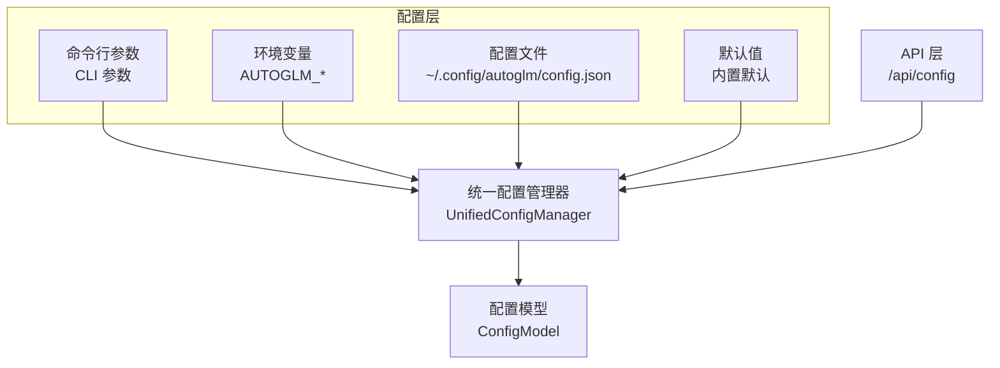
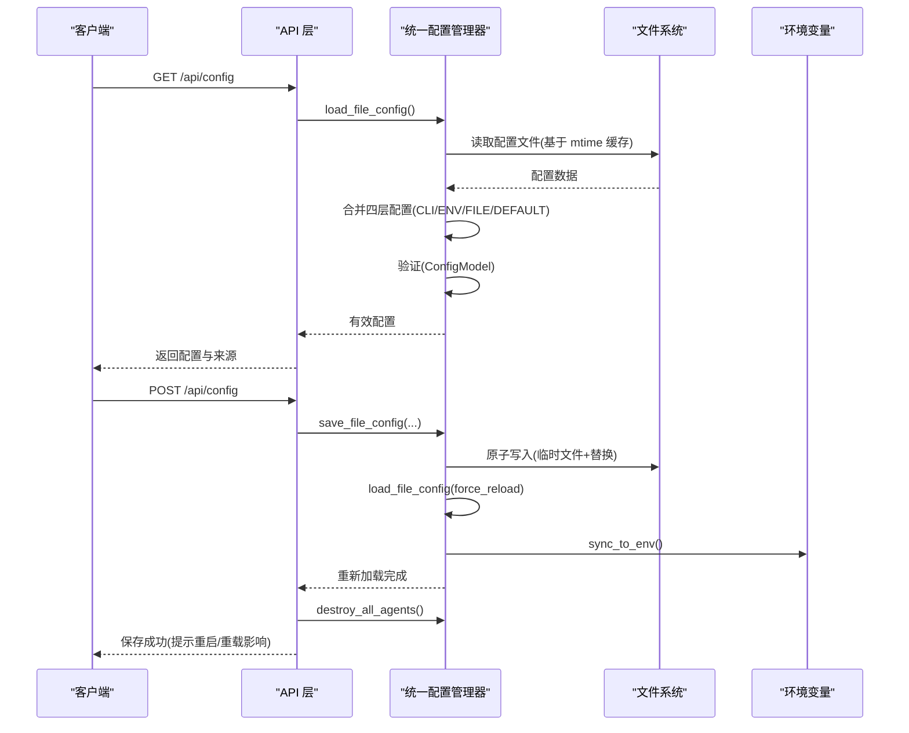
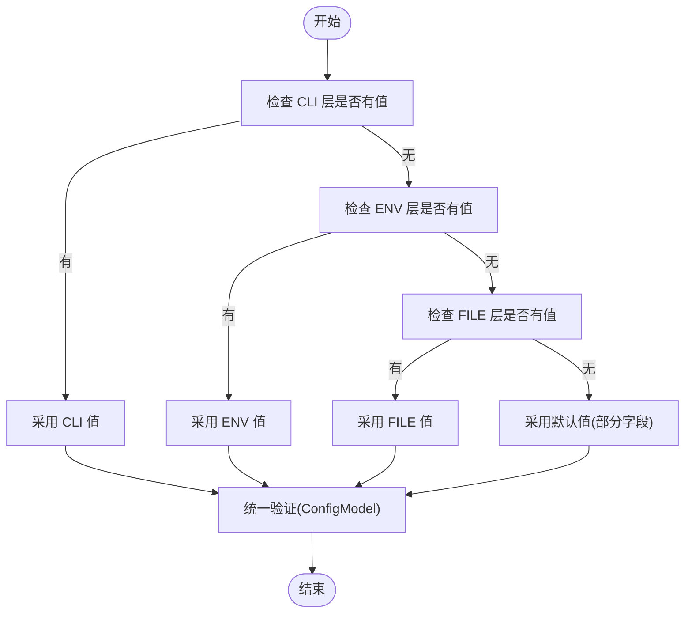
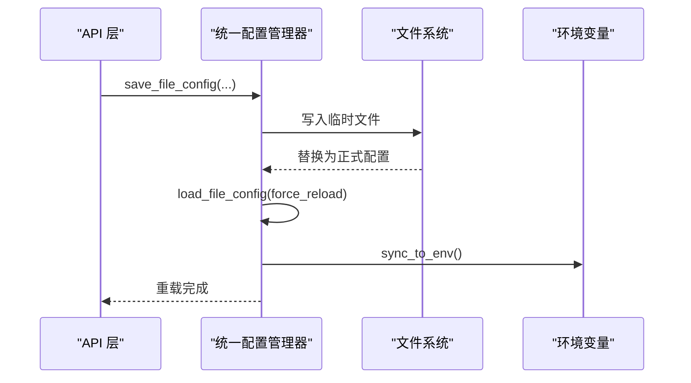
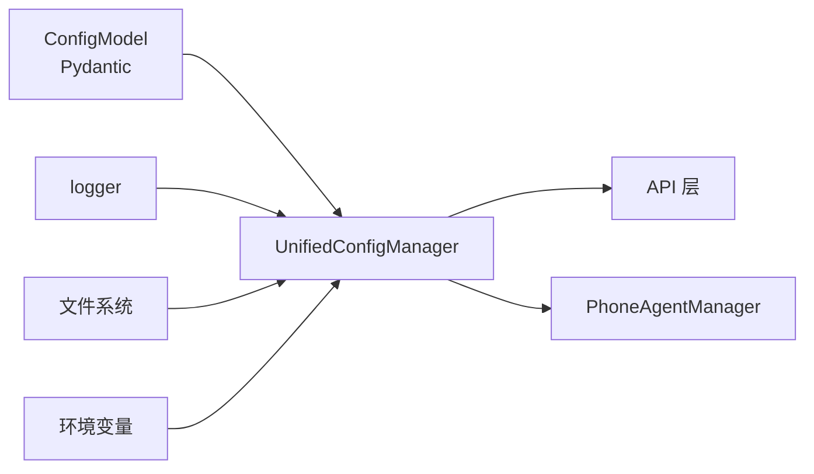

# 代理配置管理

<cite>
**本文引用的文件**
- [config.py](file://AutoGLM_GUI/config.py)
- [config_manager.py](file://AutoGLM_GUI/config_manager.py)
- [prompt_config.py](file://AutoGLM_GUI/prompt_config.py)
- [agents.py](file://AutoGLM_GUI/api/agents.py)
- [devices.py](file://AutoGLM_GUI/api/devices.py)
- [layered_agent.py](file://AutoGLM_GUI/api/layered_agent.py)
</cite>

## 目录
1. [简介](#简介)
2. [项目结构](#项目结构)
3. [核心组件](#核心组件)
4. [架构总览](#架构总览)
5. [详细组件分析](#详细组件分析)
6. [依赖分析](#依赖分析)
7. [性能考虑](#性能考虑)
8. [故障排查指南](#故障排查指南)
9. [结论](#结论)
10. [附录](#附录)

## 简介
本指南围绕 AutoGLM-GUI 的代理配置管理进行系统化说明，目标包括：
- 解析配置文件结构与参数语义
- 明确配置项优先级与继承关系
- 提供典型场景的配置模板与最佳实践
- 解释动态配置更新与热重载机制
- 覆盖配置验证、错误检查与回滚策略
- 在多代理环境下给出配置管理与一致性保障方法

## 项目结构
与代理配置管理直接相关的模块与文件如下：
- 配置定义与模型：config.py、config_manager.py
- 系统提示词与国际化：prompt_config.py
- API 接口：agents.py（配置读取/保存）、devices.py（设备侧信息聚合）、layered_agent.py（分层代理兼容流）

图表来源
- [config_manager.py:237-296](file://AutoGLM_GUI/config_manager.py#L237-L296)
- [agents.py:203-243](file://AutoGLM_GUI/api/agents.py#L203-L243)

章节来源
- [config_manager.py:1-120](file://AutoGLM_GUI/config_manager.py#L1-L120)
- [agents.py:203-243](file://AutoGLM_GUI/api/agents.py#L203-L243)

## 核心组件
- 配置模型与验证：使用 Pydantic 对配置进行强类型校验，确保字段格式与取值范围合法。
- 多层优先级：CLI > 环境变量 > 配置文件 > 默认值，逐层合并生成有效配置。
- 热重载与原子写入：基于文件 mtime 缓存避免频繁 IO；保存采用临时文件 + 原子替换。
- 冲突检测与环境同步：检测文件与 CLI/ENV 的冲突；uvicorn reload 场景下将有效配置同步至环境变量。

章节来源
- [config_manager.py:71-166](file://AutoGLM_GUI/config_manager.py#L71-L166)
- [config_manager.py:237-296](file://AutoGLM_GUI/config_manager.py#L237-L296)
- [config_manager.py:421-520](file://AutoGLM_GUI/config_manager.py#L421-L520)
- [config_manager.py:521-650](file://AutoGLM_GUI/config_manager.py#L521-L650)
- [config_manager.py:676-747](file://AutoGLM_GUI/config_manager.py#L676-L747)
- [config_manager.py:800-837](file://AutoGLM_GUI/config_manager.py#L800-L837)
- [config_manager.py:841-874](file://AutoGLM_GUI/config_manager.py#L841-L874)

## 架构总览
配置管理贯穿“配置层 → 统一管理器 → 配置模型 → API 层”的链路，支持热重载与环境同步，确保在多代理场景下的一致性。

图表来源
- [agents.py:203-243](file://AutoGLM_GUI/api/agents.py#L203-L243)
- [agents.py:246-394](file://AutoGLM_GUI/api/agents.py#L246-L394)
- [config_manager.py:421-520](file://AutoGLM_GUI/config_manager.py#L421-L520)
- [config_manager.py:521-650](file://AutoGLM_GUI/config_manager.py#L521-L650)
- [config_manager.py:841-874](file://AutoGLM_GUI/config_manager.py#L841-L874)

## 详细组件分析

### 配置文件结构与参数含义
- 基础模型配置
  - base_url：模型服务端点，必须以 http:// 或 https:// 开头，末尾斜杠会被规范化去除。
  - model_name：模型标识符，不能为空。
  - api_key：认证密钥，为空时内部以占位符表示。
- 代理类型与执行控制
  - agent_type：代理类型，如 "glm-async" 等；历史值 "glm" 会被自动迁移为 "glm-async"。
  - agent_config_params：代理特定参数字典。
  - run_limit_type：运行限制类型，可选 "steps"、"duration"、"unlimited"。
  - default_max_steps：单次任务最大步数，None 表示不限制。
  - default_max_duration_seconds：单次任务最大持续时间（秒），None 表示不限制。
  - layered_max_turns：分层代理最大轮数，默认值与最小值约束。
- 决策模型配置（分层代理）
  - decision_base_url、decision_model_name、decision_api_key：决策模型的端点、模型名与密钥，格式与非空校验同基础模型配置。

章节来源
- [config.py:18-44](file://AutoGLM_GUI/config.py#L18-L44)
- [config.py:48-70](file://AutoGLM_GUI/config.py#L48-L70)
- [config_manager.py:71-166](file://AutoGLM_GUI/config_manager.py#L71-L166)
- [config_manager.py:464-477](file://AutoGLM_GUI/config_manager.py#L464-L477)

### 配置优先级与继承关系
- 优先级顺序：CLI > 环境变量 > 配置文件 > 默认值
- 合并策略：按字段逐一检查各层，遇到首个非空值即采用；最终由 ConfigModel 进行统一验证
- 默认值来源：当配置文件缺失某些字段时，仅对部分字段使用默认值（如 base_url、model_name、api_key）

图表来源
- [config_manager.py:676-747](file://AutoGLM_GUI/config_manager.py#L676-L747)

章节来源
- [config_manager.py:267-285](file://AutoGLM_GUI/config_manager.py#L267-L285)
- [config_manager.py:702-736](file://AutoGLM_GUI/config_manager.py#L702-L736)
- [config_manager.py:738-746](file://AutoGLM_GUI/config_manager.py#L738-L746)

### 动态配置更新与热重载机制
- 热重载
  - 基于文件修改时间戳缓存，避免重复解析；支持强制重载
  - 保存配置后自动触发文件重载与环境同步
- 原子写入
  - 采用临时文件 + replace 的方式，降低损坏风险
- 环境同步（uvicorn reload 支持）
  - 将有效配置写入环境变量，新进程继承后可恢复配置

图表来源
- [config_manager.py:521-650](file://AutoGLM_GUI/config_manager.py#L521-L650)
- [config_manager.py:841-874](file://AutoGLM_GUI/config_manager.py#L841-L874)
- [agents.py:354-362](file://AutoGLM_GUI/api/agents.py#L354-L362)

章节来源
- [config_manager.py:421-520](file://AutoGLM_GUI/config_manager.py#L421-L520)
- [config_manager.py:521-650](file://AutoGLM_GUI/config_manager.py#L521-L650)
- [config_manager.py:841-874](file://AutoGLM_GUI/config_manager.py#L841-L874)
- [agents.py:351-362](file://AutoGLM_GUI/api/agents.py#L351-L362)

### 配置验证、错误检查与回滚策略
- 验证规则
  - base_url 与 decision_base_url 必须以 http:// 或 https:// 开头，末尾斜杠规范化去除
  - model_name 与 decision_model_name 非空校验
  - run_limit_type 限定集合校验
  - default_max_steps 与 default_max_duration_seconds 正数校验
  - layered_max_turns 下限校验
- 错误处理
  - JSON 解析失败、IO 异常等记录警告/错误日志，保持系统可用
- 回滚策略
  - 验证失败时降级为默认配置，避免服务中断

章节来源
- [config_manager.py:94-166](file://AutoGLM_GUI/config_manager.py#L94-L166)
- [config_manager.py:506-519](file://AutoGLM_GUI/config_manager.py#L506-L519)
- [config_manager.py:738-746](file://AutoGLM_GUI/config_manager.py#L738-L746)

### 多代理环境下的配置管理与一致性
- 配置来源追踪
  - 支持查询主要配置来源与字段来源，便于定位问题
- 冲突检测
  - 当配置文件与 CLI/ENV 存在不同值时，标记冲突并返回告警
- 代理重建
  - 保存配置后销毁所有已存在代理，确保后续使用时采用新配置
- 设备侧信息聚合
  - API 层在设备列表中聚合 Agent 状态，便于观察配置变更对代理的影响

章节来源
- [config_manager.py:748-787](file://AutoGLM_GUI/config_manager.py#L748-L787)
- [config_manager.py:800-837](file://AutoGLM_GUI/config_manager.py#L800-L837)
- [agents.py:357-381](file://AutoGLM_GUI/api/agents.py#L357-L381)
- [devices.py:51-86](file://AutoGLM_GUI/api/devices.py#L51-L86)

## 依赖分析
- 统一配置管理器依赖
  - 配置模型（Pydantic）：提供类型安全与校验
  - 日志模块：记录加载、验证、冲突与错误信息
  - 文件系统：读写配置文件
  - 环境变量：uvicorn reload 场景下的配置同步
- API 层依赖
  - 统一配置管理器：提供配置读取、保存、热重载与冲突检测
  - 代理管理器：保存配置后销毁代理，确保新配置生效

图表来源
- [config_manager.py:23-28](file://AutoGLM_GUI/config_manager.py#L23-L28)
- [agents.py:357-359](file://AutoGLM_GUI/api/agents.py#L357-L359)

章节来源
- [config_manager.py:23-28](file://AutoGLM_GUI/config_manager.py#L23-L28)
- [agents.py:357-359](file://AutoGLM_GUI/api/agents.py#L357-L359)

## 性能考虑
- 文件缓存：基于 mtime 的缓存减少重复解析，提升热重载效率
- 原子写入：避免部分写入导致的配置损坏
- 验证前置：在合并后一次性验证，减少后续运行期异常
- 代理重建：批量销毁代理以应用新配置，避免逐个重建的开销

## 故障排查指南
- 配置文件格式错误
  - 现象：读取失败或解析异常
  - 处理：检查 JSON 格式；查看日志警告；修复后自动重试
- 字段取值非法
  - 现象：验证失败，系统降级为默认配置
  - 处理：修正字段取值（如 base_url 前缀、run_limit_type 选择、正数限制）
- 冲突告警
  - 现象：返回冲突列表，提示某字段被 CLI/ENV 覆盖
  - 处理：统一来源或清理冲突来源
- 环境同步问题（uvicorn reload）
  - 现象：新进程未继承配置
  - 处理：确认已调用环境同步；检查环境变量是否被其他进程覆盖

章节来源
- [config_manager.py:506-519](file://AutoGLM_GUI/config_manager.py#L506-L519)
- [config_manager.py:738-746](file://AutoGLM_GUI/config_manager.py#L738-L746)
- [config_manager.py:800-837](file://AutoGLM_GUI/config_manager.py#L800-L837)
- [config_manager.py:841-874](file://AutoGLM_GUI/config_manager.py#L841-L874)

## 结论
AutoGLM-GUI 的代理配置管理通过“四层优先级 + 类型安全 + 热重载 + 冲突检测 + 环境同步”构建了稳定可靠的配置体系。结合代理重建与设备侧状态聚合，可在多代理环境中实现一致性的配置下发与验证。

## 附录

### 配置文件字段清单与含义
- base_url：模型服务端点（必填，需以 http(s) 开头）
- model_name：模型标识符（必填，非空）
- api_key：认证密钥（可选）
- agent_type：代理类型（如 "glm-async"；历史 "glm" 会迁移）
- agent_config_params：代理特定参数（字典）
- run_limit_type：运行限制类型（steps/duration/unlimited）
- default_max_steps：最大步数（None 表示不限制）
- default_max_duration_seconds：最大持续时间（秒，None 表示不限制）
- layered_max_turns：分层代理最大轮数（有最小值限制）
- decision_base_url：决策模型端点（可选）
- decision_model_name：决策模型标识符（可选，非空）
- decision_api_key：决策模型密钥（可选）

章节来源
- [config_manager.py:56-69](file://AutoGLM_GUI/config_manager.py#L56-L69)
- [config_manager.py:71-93](file://AutoGLM_GUI/config_manager.py#L71-L93)

### 典型场景配置模板与最佳实践
- 本地 Ollama/自建服务
  - base_url：指向本地服务端点
  - model_name：对应模型标识符
  - run_limit_type：根据任务复杂度选择 "steps" 或 "duration"
  - layered_max_turns：按需求设定，避免过长轮数
- 在线服务（如 OpenAI 兼容）
  - base_url：服务端点
  - api_key：按平台要求填写
  - run_limit_type：建议使用 "duration" 以控制成本
- 多设备/多代理
  - 通过设备侧聚合接口观察代理状态
  - 保存配置后触发代理重建，确保一致性
- 热重载与 CI/CD
  - 通过 API 保存配置并触发热重载
  - 在容器/热更新场景下启用环境同步

章节来源
- [agents.py:203-243](file://AutoGLM_GUI/api/agents.py#L203-L243)
- [agents.py:246-394](file://AutoGLM_GUI/api/agents.py#L246-L394)
- [devices.py:51-86](file://AutoGLM_GUI/api/devices.py#L51-L86)