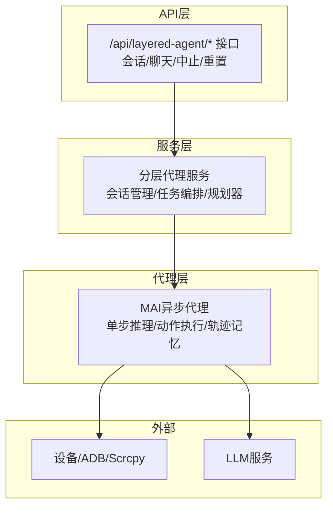
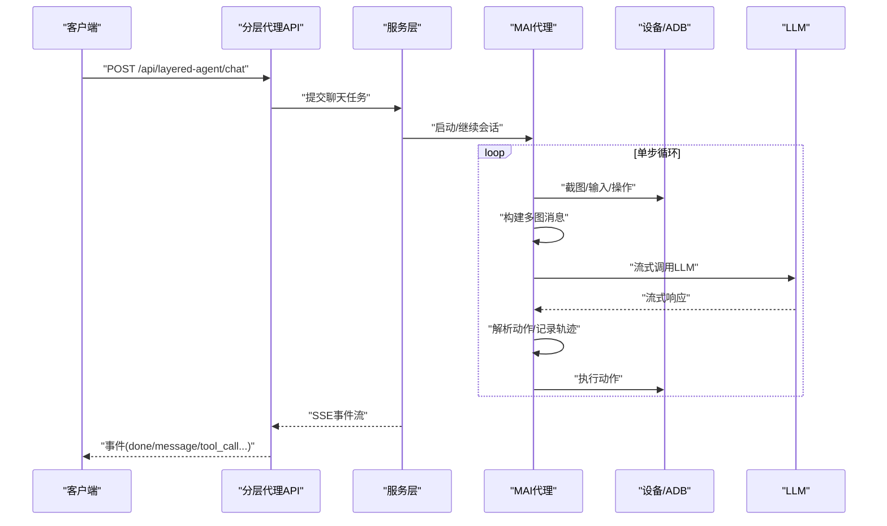
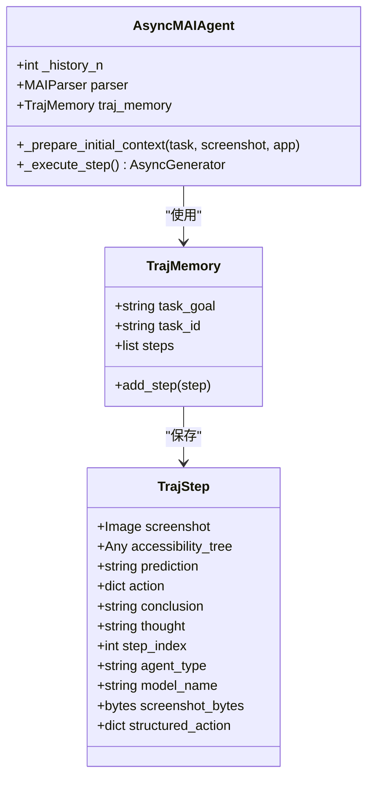
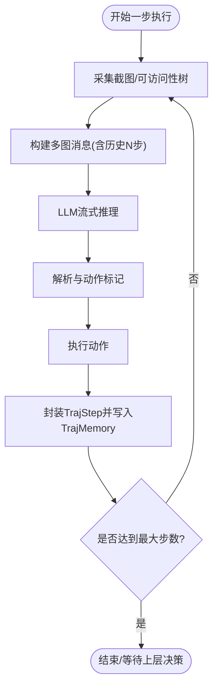
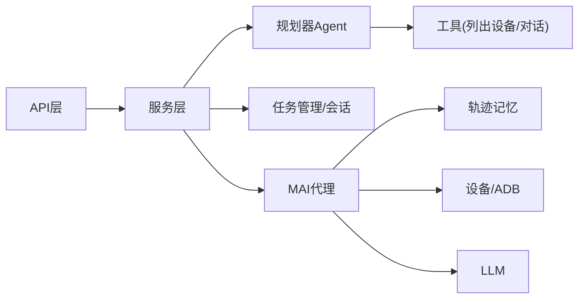

# 分层代理模式

<cite>
**本文引用的文件**
- [layered_agent.py](file://AutoGLM_GUI/api/layered_agent.py)
- [layered_agent_service.py](file://AutoGLM_GUI/layered_agent_service.py)
- [async_agent.py](file://AutoGLM_GUI/agents/mai/async_agent.py)
- [traj_memory.py](file://AutoGLM_GUI/agents/mai/traj_memory.py)
- [test_layered_agent_session_api.py](file://tests/test_layered_agent_session_api.py)
- [test_layered_max_turns_config.py](file://tests/test_layered_max_turns_config.py)
</cite>

## 目录
1. [简介](#简介)
2. [项目结构](#项目结构)
3. [核心组件](#核心组件)
4. [架构总览](#架构总览)
5. [详细组件分析](#详细组件分析)
6. [依赖关系分析](#依赖关系分析)
7. [性能考虑](#性能考虑)
8. [故障排查指南](#故障排查指南)
9. [结论](#结论)
10. [附录](#附录)

## 简介
本文件面向AutoGLM-GUI的“分层代理模式”，系统化阐述其架构设计、控制流与决策流程，重点说明MAI代理在分层模式中的角色与功能、轨迹记忆机制与经验学习过程，并提供配置方法、参数调优策略以及复杂任务分解、多步骤推理与结果验证的实现要点。同时覆盖监控、调试与性能分析方法，帮助开发者与使用者高效落地与维护该能力。

## 项目结构
分层代理模式由三层协同构成：
- API层：对外提供会话、聊天、中止与重置等接口，负责请求接入与事件流输出。
- 服务层：封装规划器Agent与设备/任务编排逻辑，负责会话生命周期管理与任务调度。
- 代理层：具体智能体（如MAI）执行单步推理与动作，结合轨迹记忆进行经验积累。

图表来源
- [layered_agent.py:150-218](file://AutoGLM_GUI/api/layered_agent.py#L150-L218)
- [layered_agent_service.py:389-430](file://AutoGLM_GUI/layered_agent_service.py#L389-L430)
- [async_agent.py:80-278](file://AutoGLM_GUI/agents/mai/async_agent.py#L80-L278)

章节来源
- [layered_agent.py:150-218](file://AutoGLM_GUI/api/layered_agent.py#L150-L218)
- [layered_agent_service.py:389-430](file://AutoGLM_GUI/layered_agent_service.py#L389-L430)
- [async_agent.py:80-278](file://AutoGLM_GUI/agents/mai/async_agent.py#L80-L278)

## 核心组件
- 分层代理API：提供SSE流式聊天、会话中止与重置等能力，统一入口与事件输出。
- 规划器Agent：基于OpenAI Chat Completions模型，具备列出设备、发起对话等工具，作为高层决策中枢。
- MAI异步代理：面向移动端的多模态智能体，支持多图历史上下文、坐标归一化、结构化解析与轨迹记忆。
- 轨迹记忆：以TrajStep/TrajMemory为核心的数据结构，记录每步的观察、思考、动作与模型信息，支撑经验学习。

章节来源
- [layered_agent.py:150-218](file://AutoGLM_GUI/api/layered_agent.py#L150-L218)
- [layered_agent_service.py:389-430](file://AutoGLM_GUI/layered_agent_service.py#L389-L430)
- [async_agent.py:43-278](file://AutoGLM_GUI/agents/mai/async_agent.py#L43-L278)
- [traj_memory.py:17-35](file://AutoGLM_GUI/agents/mai/traj_memory.py#L17-L35)

## 架构总览
分层代理的端到端流程如下：
- 客户端通过API提交复杂任务，服务层创建/解析会话并提交任务。
- 任务驱动MAI代理进入单步循环：截图采集 → 多图消息构建 → LLM流式推理 → 结构化解析 → 动作执行 → 轨迹写入。
- 规划器Agent在高层对设备与任务进行编排与决策，必要时介入工具调用（如列出设备、发起对话）。
- 服务层负责会话生命周期（中止/重置）、任务状态跟踪与事件流返回。

图表来源
- [layered_agent.py:150-218](file://AutoGLM_GUI/api/layered_agent.py#L150-L218)
- [layered_agent_service.py:389-430](file://AutoGLM_GUI/layered_agent_service.py#L389-L430)
- [async_agent.py:80-278](file://AutoGLM_GUI/agents/mai/async_agent.py#L80-L278)

## 详细组件分析

### MAI代理在分层模式中的角色与功能
- 角色定位：移动端多模态推理与执行的核心单元，负责将屏幕图像、可访问性树与历史轨迹整合为上下文，驱动下一步动作。
- 关键特性：
  - 多图历史上下文：通过历史N步截图与当前截图共同构建消息，提升空间理解与目标追踪能力。
  - 坐标归一化：内部采用0-999坐标系，解析阶段转换为0-1000范围，确保跨分辨率一致性。
  - 结构化解析：解析包含<thinking>与动作标记的复合响应，生成标准化动作字典。
  - 轨迹记忆：每步将截图、预测、动作、思考等信息写入TrajMemory，形成可回放、可复用的经验库。

图表来源
- [async_agent.py:43-278](file://AutoGLM_GUI/agents/mai/async_agent.py#L43-L278)
- [traj_memory.py:17-35](file://AutoGLM_GUI/agents/mai/traj_memory.py#L17-L35)

章节来源
- [async_agent.py:43-278](file://AutoGLM_GUI/agents/mai/async_agent.py#L43-L278)
- [traj_memory.py:17-35](file://AutoGLM_GUI/agents/mai/traj_memory.py#L17-L35)

### 轨迹记忆机制与经验学习过程
- 数据结构：
  - TrajStep：记录单步的截图、预测、动作、思考、模型名等关键字段。
  - TrajMemory：维护任务目标、任务ID与步骤列表，提供添加步骤的能力。
- 经验学习路径：
  - 每步执行后，将当前状态封装为TrajStep并写入TrajMemory。
  - 多步历史被用于下一次消息构建，形成“观察-思考-行动”的闭环。
  - 长期经验可用于后续任务的提示工程优化与动作策略微调（在系统其他模块中应用）。

图表来源
- [async_agent.py:80-278](file://AutoGLM_GUI/agents/mai/async_agent.py#L80-L278)
- [traj_memory.py:17-35](file://AutoGLM_GUI/agents/mai/traj_memory.py#L17-L35)

章节来源
- [async_agent.py:80-278](file://AutoGLM_GUI/agents/mai/async_agent.py#L80-L278)
- [traj_memory.py:17-35](file://AutoGLM_GUI/agents/mai/traj_memory.py#L17-L35)

### 复杂任务分解、多步骤推理与结果验证
- 任务分解：由高层规划器Agent根据设备状态与用户意图生成阶段性目标；MAI代理聚焦于“如何到达下一阶段”的具体操作。
- 多步骤推理：通过历史N步截图与当前截图共同构建上下文，增强空间理解与目标追踪；每步思考(thought)与结论(conclusion)便于回溯与验证。
- 结果验证：动作执行后即时截图对比、可访问性树变化检测、以及轨迹中的结论字段用于评估是否偏离预期。

章节来源
- [layered_agent_service.py:389-430](file://AutoGLM_GUI/layered_agent_service.py#L389-L430)
- [async_agent.py:80-278](file://AutoGLM_GUI/agents/mai/async_agent.py#L80-L278)

### 分层代理的配置方法与参数调优策略
- 会话与任务配置：
  - 通过API的聊天接口提交任务，服务层自动创建/解析兼容会话并提交任务。
  - 支持中止与重置：中止发送取消信号，重置清理会话并归档任务。
- MAI代理参数：
  - 历史步数(history_n)：影响上下文长度与内存占用，建议按任务复杂度调整。
  - 重试次数：默认最多3次，平衡稳定性与延迟。
  - 详细日志：开启verbose可输出每步动作与轨迹写入信息，便于调试。
- 规划器Agent配置：
  - 模型选择与工具集（如列出设备、发起对话）由服务层动态装配，配置变更会触发Agent热加载。

章节来源
- [layered_agent.py:150-218](file://AutoGLM_GUI/api/layered_agent.py#L150-L218)
- [layered_agent_service.py:404-430](file://AutoGLM_GUI/layered_agent_service.py#L404-L430)
- [async_agent.py:43-278](file://AutoGLM_GUI/agents/mai/async_agent.py#L43-L278)

### 监控、调试与性能分析
- 事件流监控：API以SSE形式推送tool_call/message/done等事件，便于前端实时展示与后端日志追踪。
- 会话生命周期：测试覆盖了中止与重置场景，验证任务状态与会话归档行为。
- 性能关注点：
  - 截图与消息构建：历史N步越多，计算与传输开销越大，需权衡上下文质量与延迟。
  - LLM重试：在不稳定网络或模型侧错误时提升成功率，但增加时延，应结合超时策略。
  - 轨迹写入：频繁IO可能成为瓶颈，建议在高并发场景下引入缓冲与批处理。

章节来源
- [layered_agent.py:150-218](file://AutoGLM_GUI/api/layered_agent.py#L150-L218)
- [test_layered_agent_session_api.py:180-216](file://tests/test_layered_agent_session_api.py#L180-L216)
- [test_layered_max_turns_config.py](file://tests/test_layered_max_turns_config.py)

## 依赖关系分析
- API层依赖服务层的任务管理与会话解析能力。
- 服务层依赖规划器Agent与设备/任务编排模块，负责配置热加载与会话生命周期。
- 代理层依赖设备接口与LLM服务，内部通过轨迹记忆实现经验沉淀。

图表来源
- [layered_agent.py:150-218](file://AutoGLM_GUI/api/layered_agent.py#L150-L218)
- [layered_agent_service.py:389-430](file://AutoGLM_GUI/layered_agent_service.py#L389-L430)
- [async_agent.py:80-278](file://AutoGLM_GUI/agents/mai/async_agent.py#L80-L278)

章节来源
- [layered_agent.py:150-218](file://AutoGLM_GUI/api/layered_agent.py#L150-L218)
- [layered_agent_service.py:389-430](file://AutoGLM_GUI/layered_agent_service.py#L389-L430)
- [async_agent.py:80-278](file://AutoGLM_GUI/agents/mai/async_agent.py#L80-L278)

## 性能考虑
- 上下文长度与内存：历史N步越多，消息体积越大，建议按任务复杂度动态调整。
- I/O与带宽：多图消息与轨迹写入涉及大量图片数据，建议在网络与磁盘IO受限环境下启用压缩与限流。
- 并发与超时：在高并发场景下，合理设置任务超时与重试上限，避免资源争用。
- 日志与追踪：利用trace_span与SSE事件流定位热点环节，持续优化关键路径。

## 故障排查指南
- 无法中止会话：确认active_task存在且任务管理器已接收取消信号。
- 重置无效：检查会话是否存在活动任务，若存在需先取消再归档。
- 事件流异常：检查SSE头部与编码，确保客户端正确处理text/event-stream。
- 配置不生效：服务层会根据配置哈希判断是否热加载，确认配置变更后Agent是否重新初始化。

章节来源
- [layered_agent.py:170-218](file://AutoGLM_GUI/api/layered_agent.py#L170-L218)
- [test_layered_agent_session_api.py:180-216](file://tests/test_layered_agent_session_api.py#L180-L216)

## 结论
分层代理模式通过API层、服务层与代理层的清晰分工，实现了从高层决策到低层执行的完整闭环。MAI代理凭借多图历史上下文与轨迹记忆，在复杂移动端任务中表现出色。配合规划器Agent与完善的会话/任务管理，系统在可扩展性、可观测性与可维护性方面均具备良好基础。建议在实际部署中结合任务特点调优历史步数、重试策略与超时参数，并持续完善经验学习与结果验证机制。

## 附录
- 关键实现位置参考：
  - 分层代理API：[layered_agent.py:150-218](file://AutoGLM_GUI/api/layered_agent.py#L150-L218)
  - 规划器Agent创建与热加载：[layered_agent_service.py:389-430](file://AutoGLM_GUI/layered_agent_service.py#L389-L430)
  - MAI代理单步执行与轨迹写入：[async_agent.py:80-278](file://AutoGLM_GUI/agents/mai/async_agent.py#L80-L278)
  - 轨迹记忆数据结构：[traj_memory.py:17-35](file://AutoGLM_GUI/agents/mai/traj_memory.py#L17-L35)
  - 会话中止/重置测试用例：[test_layered_agent_session_api.py:180-216](file://tests/test_layered_agent_session_api.py#L180-L216)
  - 最大轮次配置测试：[test_layered_max_turns_config.py](file://tests/test_layered_max_turns_config.py)