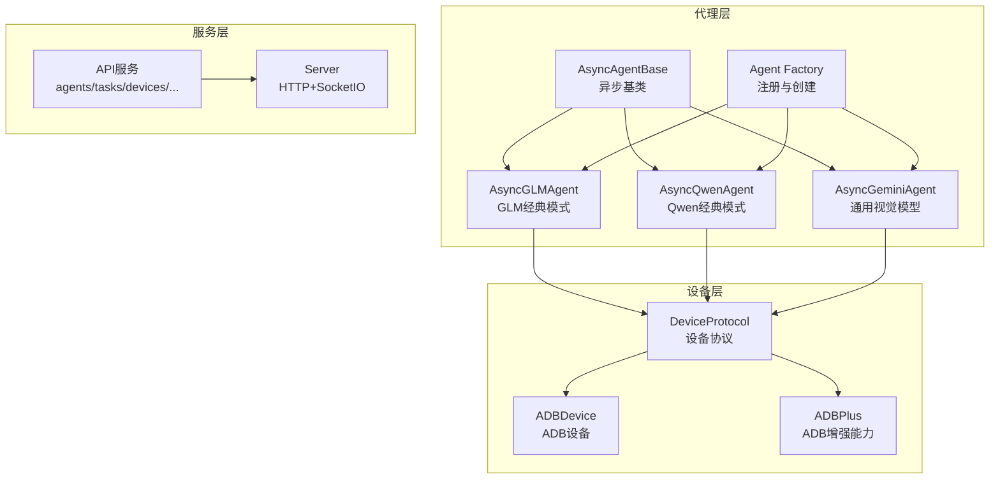
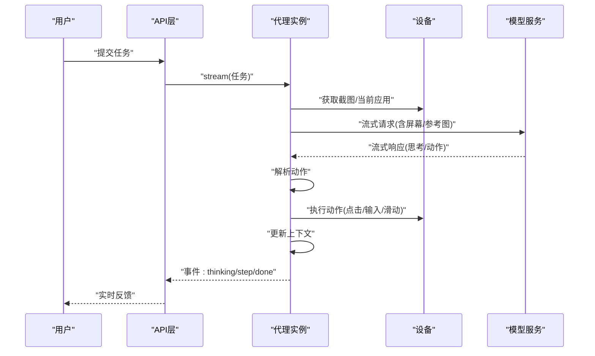
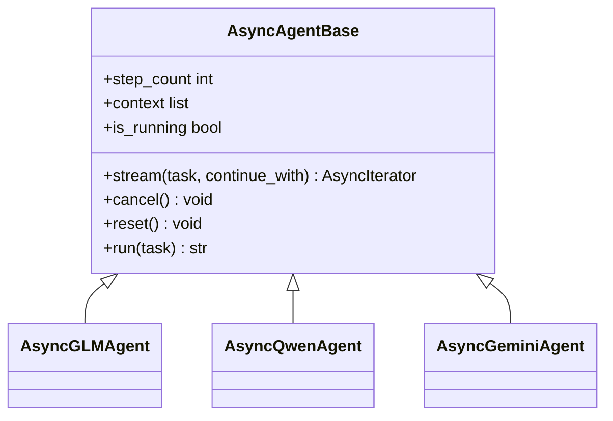
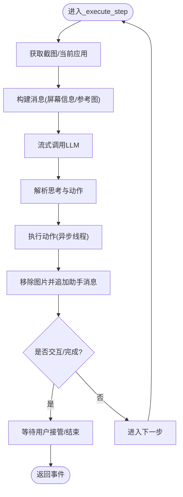
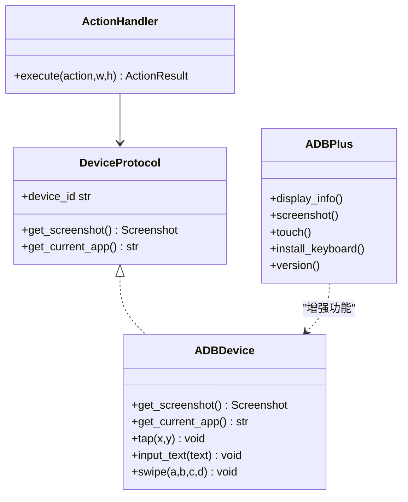
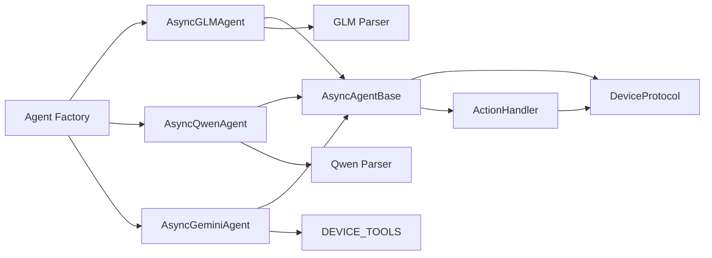

# 经典模式使用

<cite>
**本文引用的文件**
- [async_agent_base.py](file://AutoGLM_GUI/agents/base/async_agent_base.py)
- [async_agent.py（GLM）](file://AutoGLM_GUI/agents/glm/async_agent.py)
- [async_agent.py（Qwen）](file://AutoGLM_GUI/agents/qwen/async_agent.py)
- [async_agent.py（Gemini）](file://AutoGLM_GUI/agents/gemini/async_agent.py)
- [factory.py](file://AutoGLM_GUI/agents/factory.py)
- [prompt_config.py](file://AutoGLM_GUI/prompt_config.py)
- [prompt_config.py（GLM）](file://AutoGLM_GUI/agents/glm/prompts_en.py)
- [prompt_config.py（Qwen）](file://AutoGLM_GUI/agents/qwen/prompts_en.py)
- [prompt_config.py（Qwen）](file://AutoGLM_GUI/agents/qwen/prompts_zh.py)
- [parser.py（GLM）](file://AutoGLM_GUI/agents/glm/parser.py)
- [parser.py（Qwen）](file://AutoGLM_GUI/agents/qwen/parser.py)
- [action_handler.py](file://AutoGLM_GUI/actions/handler.py)
- [adb_device.py](file://AutoGLM_GUI/devices/adb_device.py)
- [device.py（ADB）](file://AutoGLM_GUI/adb/device.py)
- [screenshot.py（ADB）](file://AutoGLM_GUI/adb/screenshot.py)
- [input.py（ADB）](file://AutoGLM_GUI/adb/input.py)
- [connection.py（ADB）](file://AutoGLM_GUI/adb/connection.py)
- [timing.py（ADB）](file://AutoGLM_GUI/adb/timing.py)
- [device.py（ADB Plus）](file://AutoGLM_GUI/adb_plus/device.py)
- [display.py（ADB Plus）](file://AutoGLM_GUI/adb_plus/display.py)
- [screenshot.py（ADB Plus）](file://AutoGLM_GUI/adb_plus/screenshot.py)
- [touch.py（ADB Plus）](file://AutoGLM_GUI/adb_plus/touch.py)
- [keyboard_installer.py（ADB Plus）](file://AutoGLM_GUI/adb_plus/keyboard_installer.py)
- [version.py（ADB Plus）](file://AutoGLM_GUI/adb_plus/version.py)
- [device_protocol.py](file://AutoGLM_GUI/device_protocol.py)
- [config.py](file://AutoGLM_GUI/config.py)
- [logger.py](file://AutoGLM_GUI/logger.py)
- [trace.py](file://AutoGLM_GUI/trace.py)
- [metrics.py](file://AutoGLM_GUI/metrics.py)
- [experience_report.py](file://AutoGLM_GUI/experience_report.py)
- [experience_planner.py](file://AutoGLM_GUI/experience_planner.py)
- [history_manager.py](file://AutoGLM_GUI/history_manager.py)
- [task_manager.py](file://AutoGLM_GUI/task_manager.py)
- [workflow_manager.py](file://AutoGLM_GUI/workflow_manager.py)
- [phone_agent_manager.py](file://AutoGLM_GUI/phone_agent_manager.py)
- [device_manager.py](file://AutoGLM_GUI/device_manager.py)
- [device_group_manager.py](file://AutoGLM_GUI/device_group_manager.py)
- [scheduler_manager.py](file://AutoGLM_GUI/scheduler_manager.py)
- [api/agents.py](file://AutoGLM_GUI/api/agents.py)
- [api/tasks.py](file://AutoGLM_GUI/api/tasks.py)
- [api/devices.py](file://AutoGLM_GUI/api/devices.py)
- [api/health.py](file://AutoGLM_GUI/api/health.py)
- [api/workflows.py](file://AutoGLM_GUI/api/workflows.py)
- [api/metrics.py](file://AutoGLM_GUI/api/metrics.py)
- [api/experience.py](file://AutoGLM_GUI/api/experience.py)
- [api/history.py](file://AutoGLM_GUI/api/history.py)
- [api/terminal.py](file://AutoGLM_GUI/api/terminal.py)
- [api/scheduled_tasks.py](file://AutoGLM_GUI/api/scheduled_tasks.py)
- [api/mcp.py](file://AutoGLM_GUI/api/mcp.py)
- [api/media.py](file://AutoGLM_GUI/api/media.py)
- [api/layered_agent.py](file://AutoGLM_GUI/api/layered_agent.py)
- [api/version.py](file://AutoGLM_GUI/api/version.py)
- [api/control.py](file://AutoGLM_GUI/api/control.py)
- [api/controld.py](file://AutoGLM_GUI/api/controld.py)
- [api/version.py](file://AutoGLM_GUI/api/version.py)
- [__main__.py](file://AutoGLM_GUI/__main__.py)
- [server.py](file://AutoGLM_GUI/server.py)
- [socketio_server.py](file://AutoGLM_GUI/socketio_server.py)
- [adb_manager.py](file://AutoGLM_GUI/adb_manager.py)
- [adb_terminal_repl.py](file://AutoGLM_GUI/adb_terminal_repl.py)
- [adb_terminal_service.py](file://AutoGLM_GUI/adb_terminal_service.py)
- [config_manager.py](file://AutoGLM_GUI/config_manager.py)
- [prompt_config.py](file://AutoGLM_GUI/prompt_config.py)
- [prompts.py](file://AutoGLM_GUI/prompts.py)
- [types.py](file://AutoGLM_GUI/types.py)
- [schemas.py](file://AutoGLM_GUI/schemas.py)
- [exceptions.py](file://AutoGLM_GUI/exceptions.py)
- [i18n.py](file://AutoGLM_GUI/i18n.py)
- [version.py](file://AutoGLM_GUI/version.py)
- [platform_utils.py](file://AutoGLM_GUI/platform_utils.py)
- [scrcpy_protocol.py](file://AutoGLM_GUI/scrcpy_protocol.py)
- [scrcpy_stream.py](file://AutoGLM_GUI/scrcpy_stream.py)
- [layered_agent_service.py](file://AutoGLM_GUI/layered_agent_service.py)
- [events.py](file://AutoGLM_GUI/agents/events.py)
- [protocols.py](file://AutoGLM_GUI/agents/protocols.py)
- [__init__.py（GUI）](file://AutoGLM_GUI/__init__.py)
</cite>

## 目录
1. [简介](#简介)
2. [项目结构](#项目结构)
3. [核心组件](#核心组件)
4. [架构总览](#架构总览)
5. [详细组件分析](#详细组件分析)
6. [依赖分析](#依赖分析)
7. [性能考虑](#性能考虑)
8. [故障排查指南](#故障排查指南)
9. [结论](#结论)
10. [附录](#附录)

## 简介
本指南面向AutoGLM-GUI的经典模式AI代理使用，聚焦“异步GLM/Qwen代理”与“通用视觉模型（Gemini等）”两类经典模式。文档解释经典模式的工作原理与执行流程，提供配置与启动单个代理实例的方法，详解参数设置、提示词模板与响应处理机制，并给出典型使用场景、操作示例、状态监控、错误处理与性能优化建议，以及代理与设备交互的具体实现细节。

## 项目结构
AutoGLM-GUI采用模块化分层设计：
- 代理层：异步基类与多实现（GLM、Qwen、Gemini等），工厂注册与创建
- 设备层：ADB设备抽象与ADB Plus增强能力
- API层：HTTP/SocketIO服务端口与REST接口
- 工具与基础设施：日志、追踪、指标、历史、计划任务、工作流等

**图表来源**
- [async_agent_base.py:32-109](file://AutoGLM_GUI/agents/base/async_agent_base.py#L32-L109)
- [async_agent.py（GLM）:40-64](file://AutoGLM_GUI/agents/glm/async_agent.py#L40-L64)
- [async_agent.py（Qwen）:49-73](file://AutoGLM_GUI/agents/qwen/async_agent.py#L49-L73)
- [async_agent.py（Gemini）:29-44](file://AutoGLM_GUI/agents/gemini/async_agent.py#L29-L44)
- [factory.py:113-192](file://AutoGLM_GUI/agents/factory.py#L113-L192)
- [device_protocol.py](file://AutoGLM_GUI/device_protocol.py)
- [adb_device.py](file://AutoGLM_GUI/devices/adb_device.py)
- [adb_plus/device.py](file://AutoGLM_GUI/adb_plus/device.py)
- [server.py](file://AutoGLM_GUI/server.py)
- [api/agents.py](file://AutoGLM_GUI/api/agents.py)

**章节来源**
- [async_agent_base.py:1-439](file://AutoGLM_GUI/agents/base/async_agent_base.py#L1-L439)
- [factory.py:1-283](file://AutoGLM_GUI/agents/factory.py#L1-L283)

## 核心组件
- 异步代理基类：统一初始化、流式主循环、取消/重置、运行限制与看门狗保护
- 经典模式代理：
  - GLM：基于流式文本与自定义标记解析动作
  - Qwen：基于流式文本与标签对解析动作
  - Gemini：基于OpenAI兼容的function calling
- 设备交互：通过DeviceProtocol抽象，ADB设备与ADB Plus增强能力
- 工厂注册：按类型创建不同代理实例

**章节来源**
- [async_agent_base.py:42-109](file://AutoGLM_GUI/agents/base/async_agent_base.py#L42-L109)
- [async_agent.py（GLM）:40-64](file://AutoGLM_GUI/agents/glm/async_agent.py#L40-L64)
- [async_agent.py（Qwen）:49-73](file://AutoGLM_GUI/agents/qwen/async_agent.py#L49-L73)
- [async_agent.py（Gemini）:29-44](file://AutoGLM_GUI/agents/gemini/async_agent.py#L29-L44)
- [factory.py:113-192](file://AutoGLM_GUI/agents/factory.py#L113-L192)

## 架构总览
经典模式的核心执行链路如下：
- 初始化：构造AsyncAgentBase，注入ModelConfig、AgentConfig、DeviceProtocol
- 创建代理：通过工厂按类型创建具体代理（如“glm-async”）
- 流式执行：stream()主循环，每步执行“截图→LLM→解析→执行→更新上下文”
- 用户交互：遇到Take_over/Interact时暂停等待接管
- 结束条件：完成、取消、超时、步数上限、看门狗检测

**图表来源**
- [async_agent_base.py:112-396](file://AutoGLM_GUI/agents/base/async_agent_base.py#L112-L396)
- [async_agent.py（GLM）:81-340](file://AutoGLM_GUI/agents/glm/async_agent.py#L81-L340)
- [async_agent.py（Qwen）:131-398](file://AutoGLM_GUI/agents/qwen/async_agent.py#L131-L398)
- [async_agent.py（Gemini）:70-345](file://AutoGLM_GUI/agents/gemini/async_agent.py#L70-L345)

## 详细组件分析

### 组件A：异步代理基类（AsyncAgentBase）
- 职责：统一管理OpenAI客户端、ActionHandler、设备与上下文；提供流式主循环与运行限制
- 关键点：
  - 运行限制：步数上限或持续时间上限
  - 看门狗：重复动作计数与无进展检测
  - 取消机制：Event触发立即抛出CancelledError
  - 上下文：系统提示+历史消息，逐步更新
  - 事件输出：thinking/step/takeover/done/cancelled/error

**图表来源**
- [async_agent_base.py:32-109](file://AutoGLM_GUI/agents/base/async_agent_base.py#L32-L109)
- [async_agent.py（GLM）:40-64](file://AutoGLM_GUI/agents/glm/async_agent.py#L40-L64)
- [async_agent.py（Qwen）:49-73](file://AutoGLM_GUI/agents/qwen/async_agent.py#L49-L73)
- [async_agent.py（Gemini）:29-44](file://AutoGLM_GUI/agents/gemini/async_agent.py#L29-L44)

**章节来源**
- [async_agent_base.py:42-439](file://AutoGLM_GUI/agents/base/async_agent_base.py#L42-L439)

### 组件B：GLM经典模式（AsyncGLMAgent）
- 工作原理：
  - 首步合并任务与参考图，后续每步仅附加当前屏幕
  - 流式接收“思考片段”，直到动作标记出现
  - 解析<think>...</think><answer>...</answer>或finish/do(...)形式
  - 执行动作并更新上下文，支持Take_over/Interact等待用户接管
- 关键点：
  - 图像附件：每步仅保留当前截图，避免上下文膨胀
  - 错误处理：模型异常序列化追踪属性，返回error+step事件
  - 性能：异步线程池执行设备操作，避免阻塞LLM流

**图表来源**
- [async_agent.py（GLM）:81-340](file://AutoGLM_GUI/agents/glm/async_agent.py#L81-L340)

**章节来源**
- [async_agent.py（GLM）:40-428](file://AutoGLM_GUI/agents/glm/async_agent.py#L40-L428)

### 组件C：Qwen经典模式（AsyncQwenAgent）
- 工作原理：
  - 使用<thought>与<answer>标签对解析
  - 支持reasoning/thinking双通道思考输出
  - 可选调试：在截图上绘制点击标记点
- 关键点：
  - 解析器：QwenParser负责标签修复与AST解析
  - 事件：thinking/step/error等
  - 与GLM相似的上下文与执行流程

**章节来源**
- [async_agent.py（Qwen）:49-463](file://AutoGLM_GUI/agents/qwen/async_agent.py#L49-L463)

### 组件D：通用视觉模型（Gemini）模式（AsyncGeminiAgent）
- 工作原理：
  - 使用OpenAI兼容的function calling
  - 必须声明工具集，要求模型返回tool_call
  - 将tool_call映射为内部动作，支持连续无效校验与限次
- 关键点：
  - 工具映射：action_mapper将tool_call转为内部动作
  - 上下文：追加工具调用与工具结果消息
  - 错误恢复：连续无效tool_call达到阈值自动终止

**章节来源**
- [async_agent.py（Gemini）:29-453](file://AutoGLM_GUI/agents/gemini/async_agent.py#L29-L453)

### 组件E：代理工厂（Agent Factory）
- 功能：按类型注册与创建代理实例
- 支持类型：glm-async、async-glm、qwen、gemini、general-vision、mai、droidrun、midscene
- 使用：create_agent(agent_type, ...)返回AsyncAgent实例

**章节来源**
- [factory.py:49-98](file://AutoGLM_GUI/agents/factory.py#L49-L98)

### 组件F：提示词与消息构建
- 系统提示：从prompt_config与各语言提示文件加载
- 屏幕信息：MessageBuilder构建当前应用与屏幕尺寸
- 用户参考图：支持在首步附加参考图说明

**章节来源**
- [prompt_config.py](file://AutoGLM_GUI/prompt_config.py)
- [prompt_config.py（GLM）](file://AutoGLM_GUI/agents/glm/prompts_en.py)
- [prompt_config.py（Qwen）](file://AutoGLM_GUI/agents/qwen/prompts_en.py)
- [prompt_config.py（Qwen）](file://AutoGLM_GUI/agents/qwen/prompts_zh.py)
- [async_agent_base.py:73-75](file://AutoGLM_GUI/agents/base/async_agent_base.py#L73-L75)

### 组件G：动作执行与设备交互
- 动作处理器：ActionHandler封装设备操作（点击、输入、滑动等）
- 设备协议：DeviceProtocol抽象设备能力
- ADB设备：adb_device与adb_plus提供截图、输入、显示、触摸、键盘安装、版本查询等能力

**图表来源**
- [device_protocol.py](file://AutoGLM_GUI/device_protocol.py)
- [adb_device.py](file://AutoGLM_GUI/devices/adb_device.py)
- [adb_plus/device.py](file://AutoGLM_GUI/adb_plus/device.py)
- [adb_plus/screenshot.py](file://AutoGLM_GUI/adb_plus/screenshot.py)
- [adb_plus/touch.py](file://AutoGLM_GUI/adb_plus/touch.py)
- [adb_plus/keyboard_installer.py](file://AutoGLM_GUI/adb_plus/keyboard_installer.py)
- [action_handler.py](file://AutoGLM_GUI/actions/handler.py)

**章节来源**
- [device_protocol.py](file://AutoGLM_GUI/device_protocol.py)
- [adb_device.py](file://AutoGLM_GUI/devices/adb_device.py)
- [adb_plus/device.py](file://AutoGLM_GUI/adb_plus/device.py)
- [adb_plus/screenshot.py](file://AutoGLM_GUI/adb_plus/screenshot.py)
- [adb_plus/touch.py](file://AutoGLM_GUI/adb_plus/touch.py)
- [adb_plus/keyboard_installer.py](file://AutoGLM_GUI/adb_plus/keyboard_installer.py)
- [action_handler.py](file://AutoGLM_GUI/actions/handler.py)

## 依赖分析
- 组件耦合：
  - 代理基类与具体代理：继承关系，职责清晰
  - 代理与设备：通过DeviceProtocol解耦
  - 代理与动作：通过ActionHandler解耦
  - 工厂与代理：通过注册表解耦
- 外部依赖：
  - OpenAI兼容客户端（AsyncOpenAI）
  - ADB生态（adb/screenshot/input等）
  - 日志、追踪、指标、历史、计划任务等基础设施

**图表来源**
- [factory.py:113-192](file://AutoGLM_GUI/agents/factory.py#L113-L192)
- [async_agent_base.py:50-64](file://AutoGLM_GUI/agents/base/async_agent_base.py#L50-L64)
- [async_agent.py（GLM）:51-58](file://AutoGLM_GUI/agents/glm/async_agent.py#L51-L58)
- [async_agent.py（Qwen）:60-67](file://AutoGLM_GUI/agents/qwen/async_agent.py#L60-L67)
- [async_agent.py（Gemini）:24-26](file://AutoGLM_GUI/agents/gemini/async_agent.py#L24-L26)

**章节来源**
- [factory.py:1-283](file://AutoGLM_GUI/agents/factory.py#L1-L283)
- [async_agent_base.py:1-439](file://AutoGLM_GUI/agents/base/async_agent_base.py#L1-L439)

## 性能考虑
- 异步I/O与线程池：设备操作通过异步线程执行，避免阻塞LLM流
- 图像附件控制：每步仅保留当前截图，减少上下文大小
- 流式解析：边接收边解析，降低延迟
- 运行限制与看门狗：防止无限循环与卡死
- 模型参数：合理设置温度、top_p、频率惩罚等，平衡创造性与稳定性
- 日志与追踪：开启verbose有助于诊断，但会增加IO开销

[本节为通用指导，无需特定文件来源]

## 故障排查指南
- 设备错误：截图/应用信息获取失败时，代理会返回error+step事件，检查ADB连接与权限
- 模型错误：序列化模型异常并记录trace属性，查看错误详情
- 动作执行错误：捕获异常并以失败结果返回，必要时强制结束
- 取消与重置：通过cancel中断，reset清理上下文
- 看门狗：重复动作过多或长时间无进展会自动停止

**章节来源**
- [async_agent_base.py:297-333](file://AutoGLM_GUI/agents/base/async_agent_base.py#L297-L333)
- [async_agent.py（GLM）:97-111](file://AutoGLM_GUI/agents/glm/async_agent.py#L97-L111)
- [async_agent.py（Qwen）:147-161](file://AutoGLM_GUI/agents/qwen/async_agent.py#L147-L161)
- [async_agent.py（Gemini）:94-108](file://AutoGLM_GUI/agents/gemini/async_agent.py#L94-L108)

## 结论
经典模式通过异步基类与多种代理实现，提供了稳定、可扩展的自动化代理框架。GLM/Qwen模式适合结构化输出与标签解析，Gemini模式适合通用视觉模型的function calling。结合设备抽象与工厂注册，用户可以灵活配置与启动单个代理实例，并通过API进行状态监控与控制。

[本节为总结性内容，无需特定文件来源]

## 附录

### A. 经典模式工作原理与执行流程
- 启动：通过工厂创建代理实例，传入ModelConfig、AgentConfig、DeviceProtocol
- 首步：准备初始上下文（任务+屏幕信息+参考图）
- 循环：每步执行“截图→流式LLM→解析→执行→更新上下文”，直至完成或被接管
- 结束：返回done事件，携带最终消息与步数统计

**章节来源**
- [factory.py:113-192](file://AutoGLM_GUI/agents/factory.py#L113-L192)
- [async_agent_base.py:112-396](file://AutoGLM_GUI/agents/base/async_agent_base.py#L112-L396)
- [async_agent.py（GLM）:81-340](file://AutoGLM_GUI/agents/glm/async_agent.py#L81-L340)
- [async_agent.py（Qwen）:131-398](file://AutoGLM_GUI/agents/qwen/async_agent.py#L131-L398)
- [async_agent.py（Gemini）:70-345](file://AutoGLM_GUI/agents/gemini/async_agent.py#L70-L345)

### B. 配置与启动单个代理实例
- 选择代理类型：使用“glm-async”或“qwen”等类型
- 准备配置：
  - ModelConfig：base_url、api_key、model_name、max_tokens、temperature等
  - AgentConfig：lang、verbose、system_prompt、run_limit_type、max_steps、max_duration_seconds
  - DeviceProtocol：提供设备实例（ADB设备或远程设备）
- 创建代理：调用create_agent(type, model_config, agent_config, spec_config, device)
- 启动执行：调用agent.stream(task)获取事件流

**章节来源**
- [factory.py:49-98](file://AutoGLM_GUI/agents/factory.py#L49-L98)
- [config.py](file://AutoGLM_GUI/config.py)
- [device_protocol.py](file://AutoGLM_GUI/device_protocol.py)

### C. 参数设置与提示词模板
- 模型参数：在ModelConfig中设置，影响推理质量与速度
- 代理参数：在AgentConfig中设置，如语言、详细日志、系统提示、运行限制
- 提示词模板：从prompt_config与语言文件加载，默认系统提示可覆盖
- 屏幕信息：自动注入当前应用与屏幕尺寸

**章节来源**
- [prompt_config.py](file://AutoGLM_GUI/prompt_config.py)
- [prompt_config.py（GLM）](file://AutoGLM_GUI/agents/glm/prompts_en.py)
- [prompt_config.py（Qwen）](file://AutoGLM_GUI/agents/qwen/prompts_en.py)
- [prompt_config.py（Qwen）](file://AutoGLM_GUI/agents/qwen/prompts_zh.py)
- [async_agent_base.py:68-75](file://AutoGLM_GUI/agents/base/async_agent_base.py#L68-L75)

### D. 响应处理机制
- 事件类型：thinking（思考片段）、step（步骤结果）、error（错误）、done（完成）、cancelled（取消）、takeover（接管）
- GLM/Qwen：解析<think>/answer或<thought>/answer标签，识别finish/do动作
- Gemini：解析tool_call，映射为内部动作，支持连续无效tool_call限次

**章节来源**
- [async_agent.py（GLM）:185-239](file://AutoGLM_GUI/agents/glm/async_agent.py#L185-L239)
- [async_agent.py（Qwen）:233-271](file://AutoGLM_GUI/agents/qwen/async_agent.py#L233-L271)
- [async_agent.py（Gemini）:186-282](file://AutoGLM_GUI/agents/gemini/async_agent.py#L186-L282)

### E. 典型使用场景与操作示例
- 场景1：自动打开应用并执行点击
  - 代理解析动作后，ActionHandler调用设备的tap方法
- 场景2：输入文本
  - 代理解析动作后，ActionHandler调用设备的input_text方法
- 场景3：滑动/长按
  - 代理解析动作后，ActionHandler调用设备的swipe/长按方法
- 场景4：需要人工确认
  - 代理返回waiting_for_input，等待用户接管

**章节来源**
- [action_handler.py](file://AutoGLM_GUI/actions/handler.py)
- [adb_plus/touch.py](file://AutoGLM_GUI/adb_plus/touch.py)
- [adb_plus/screenshot.py](file://AutoGLM_GUI/adb_plus/screenshot.py)

### F. 代理状态监控与控制
- 实时事件：通过stream()返回的事件流监控进度
- 健康检查：API健康端点
- 取消任务：调用agent.cancel()中断执行
- 重置状态：调用agent.reset()清理上下文

**章节来源**
- [async_agent_base.py:406-419](file://AutoGLM_GUI/agents/base/async_agent_base.py#L406-L419)
- [api/health.py](file://AutoGLM_GUI/api/health.py)
- [api/agents.py](file://AutoGLM_GUI/api/agents.py)

### G. 与设备交互的具体实现细节
- 截图：adb/screenshot与adb_plus/screenshot提供截图能力
- 输入：adb/input与adb_plus键盘安装能力
- 触控：adb_plus/touch提供精确触控
- 显示：adb_plus/display提供分辨率与密度信息
- 版本：adb_plus/version提供ADB版本信息

**章节来源**
- [adb_plus/screenshot.py](file://AutoGLM_GUI/adb_plus/screenshot.py)
- [adb_plus/touch.py](file://AutoGLM_GUI/adb_plus/touch.py)
- [adb_plus/keyboard_installer.py](file://AutoGLM_GUI/adb_plus/keyboard_installer.py)
- [adb_plus/display.py](file://AutoGLM_GUI/adb_plus/display.py)
- [adb_plus/version.py](file://AutoGLM_GUI/adb_plus/version.py)