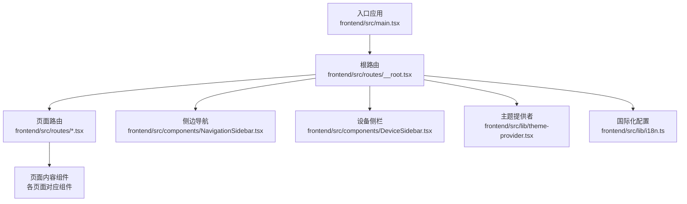
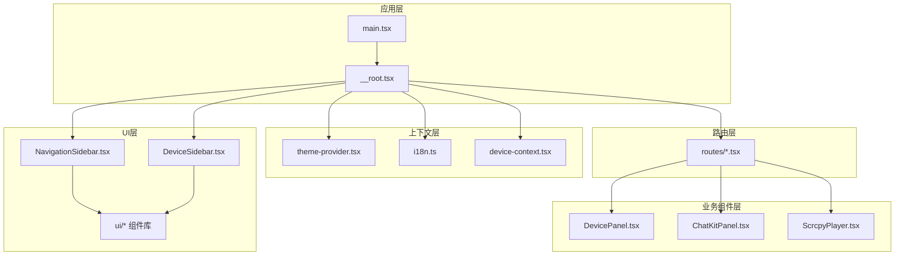
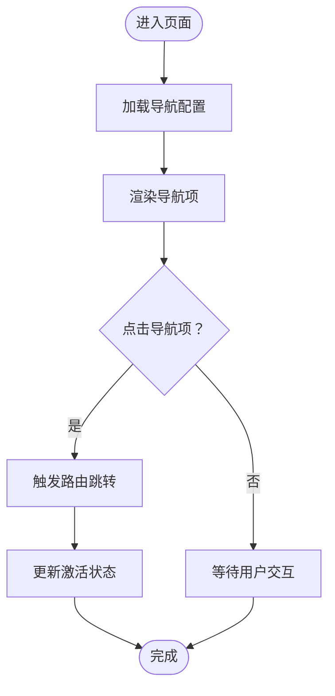
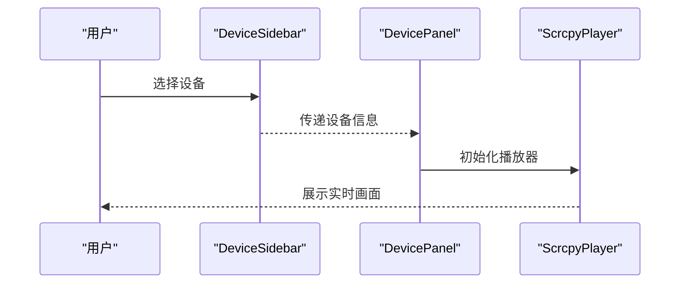
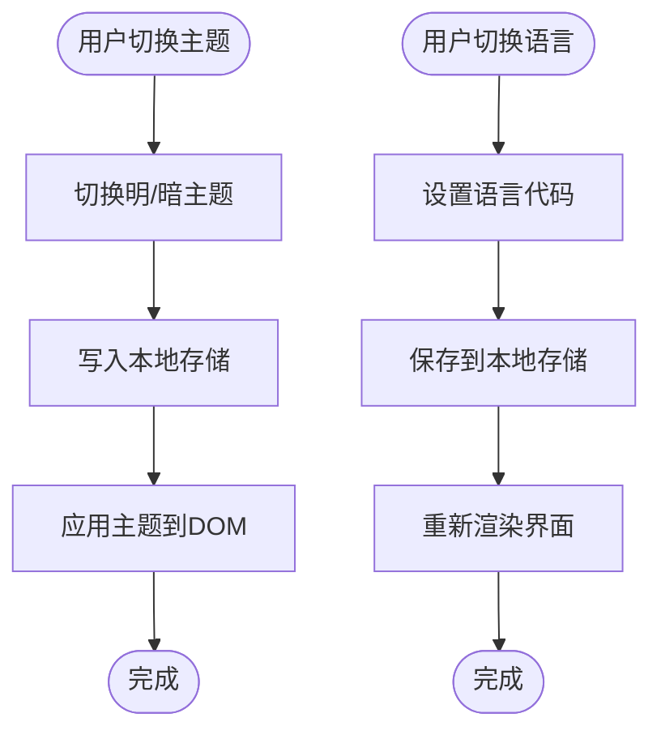
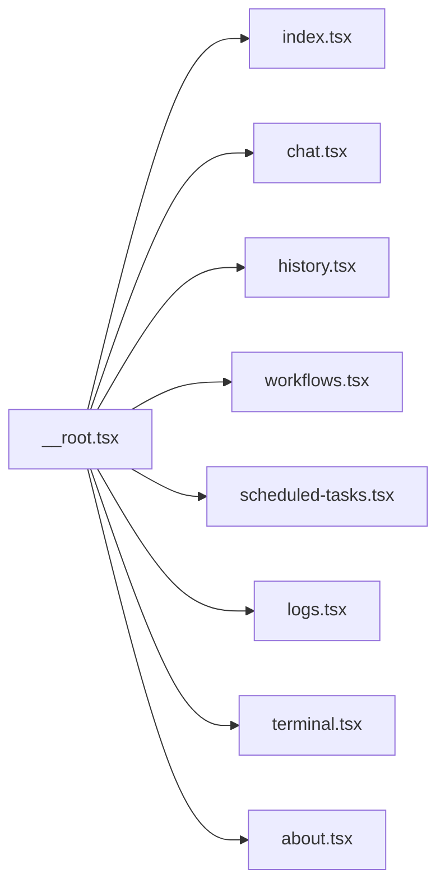
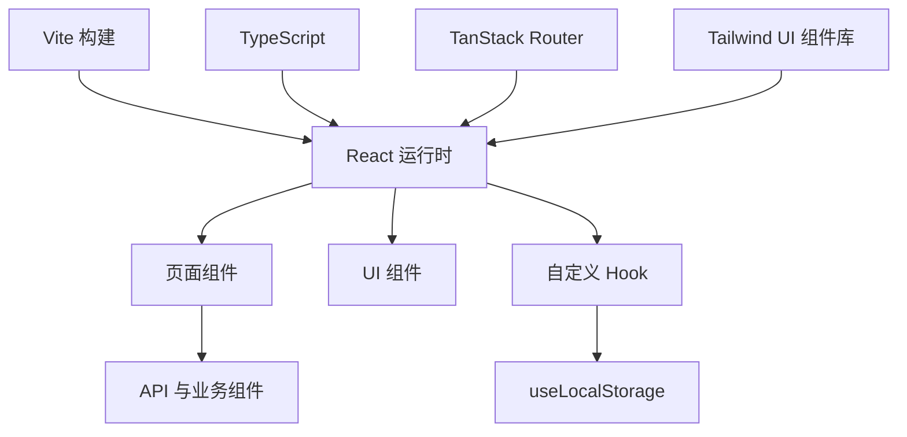

# Web界面概览

<cite>
**本文档引用的文件**
- [frontend/src/main.tsx](file://frontend/src/main.tsx)
- [frontend/src/routes/__root.tsx](file://frontend/src/routes/__root.tsx)
- [frontend/src/components/NavigationSidebar.tsx](file://frontend/src/components/NavigationSidebar.tsx)
- [frontend/src/components/ThemeToggle.tsx](file://frontend/src/components/ThemeToggle.tsx)
- [frontend/src/lib/i18n.ts](file://frontend/src/lib/i18n.ts)
- [frontend/src/lib/theme-provider.tsx](file://frontend/src/lib/theme-provider.tsx)
- [frontend/src/lib/device-context.tsx](file://frontend/src/lib/device-context.tsx)
- [frontend/src/components/ui/sidebar.tsx](file://frontend/src/components/ui/sidebar.tsx)
- [frontend/src/components/DeviceSidebar.tsx](file://frontend/src/components/DeviceSidebar.tsx)
- [frontend/src/components/DevicePanel.tsx](file://frontend/src/components/DevicePanel.tsx)
- [frontend/src/components/ChatKitPanel.tsx](file://frontend/src/components/ChatKitPanel.tsx)
- [frontend/src/components/ScrcpyPlayer.tsx](file://frontend/src/components/ScrcpyPlayer.tsx)
- [frontend/src/hooks/useLocalStorage.ts](file://frontend/src/hooks/useLocalStorage.ts)
- [frontend/src/routes/index.tsx](file://frontend/src/routes/index.tsx)
- [frontend/src/routes/chat.tsx](file://frontend/src/routes/chat.tsx)
- [frontend/src/routes/history.tsx](file://frontend/src/routes/history.tsx)
- [frontend/src/routes/workflows.tsx](file://frontend/src/routes/workflows.tsx)
- [frontend/src/routes/scheduled-tasks.tsx](file://frontend/src/routes/scheduled-tasks.tsx)
- [frontend/src/routes/logs.tsx](file://frontend/src/routes/logs.tsx)
- [frontend/src/routes/terminal.tsx](file://frontend/src/routes/terminal.tsx)
- [frontend/src/routes/about.tsx](file://frontend/src/routes/about.tsx)
- [frontend/package.json](file://frontend/package.json)
- [frontend/vite.config.js](file://frontend/vite.config.js)
- [frontend/tsconfig.json](file://frontend/tsconfig.json)
</cite>

## 目录
1. [简介](#简介)
2. [项目结构](#项目结构)
3. [核心组件](#核心组件)
4. [架构总览](#架构总览)
5. [详细组件分析](#详细组件分析)
6. [依赖关系分析](#依赖关系分析)
7. [性能考虑](#性能考虑)
8. [故障排除指南](#故障排除指南)
9. [结论](#结论)
10. [附录](#附录)

## 简介
本文件为AutoGLM-GUI的Web界面提供全面概览，重点介绍主界面布局、导航结构与核心组件，解释侧边栏导航、主题切换、国际化支持等基础功能，描述页面路由系统与组件架构，并提供新用户的快速上手指南。目标是帮助用户理解整体界面设计与基本操作流程。

## 项目结构
前端采用Vite + React + TypeScript技术栈，使用TanStack Router进行声明式路由管理。界面组件主要位于`src/components`，路由定义在`src/routes`，主题与国际化逻辑封装在`src/lib`中。

**图表来源**
- [frontend/src/main.tsx](file://frontend/src/main.tsx)
- [frontend/src/routes/__root.tsx](file://frontend/src/routes/__root.tsx)
- [frontend/src/components/NavigationSidebar.tsx](file://frontend/src/components/NavigationSidebar.tsx)
- [frontend/src/components/DeviceSidebar.tsx](file://frontend/src/components/DeviceSidebar.tsx)
- [frontend/src/lib/theme-provider.tsx](file://frontend/src/lib/theme-provider.tsx)
- [frontend/src/lib/i18n.ts](file://frontend/src/lib/i18n.ts)

**章节来源**
- [frontend/src/main.tsx](file://frontend/src/main.tsx)
- [frontend/src/routes/__root.tsx](file://frontend/src/routes/__root.tsx)
- [frontend/package.json](file://frontend/package.json)

## 核心组件
- 根容器与路由：通过根路由组织页面层级，统一注入主题、国际化与设备上下文。
- 导航侧边栏：提供页面级导航入口，支持折叠与展开。
- 设备侧栏：展示连接的设备列表，支持分组与筛选。
- 主题切换器：提供明暗主题切换，状态持久化到本地存储。
- 国际化：基于i18n库实现多语言支持，动态切换语言。
- 页面组件：首页、聊天、历史、工作流、计划任务、日志、终端、关于等页面。

**章节来源**
- [frontend/src/components/NavigationSidebar.tsx](file://frontend/src/components/NavigationSidebar.tsx)
- [frontend/src/components/DeviceSidebar.tsx](file://frontend/src/components/DeviceSidebar.tsx)
- [frontend/src/components/ThemeToggle.tsx](file://frontend/src/components/ThemeToggle.tsx)
- [frontend/src/lib/i18n.ts](file://frontend/src/lib/i18n.ts)
- [frontend/src/lib/theme-provider.tsx](file://frontend/src/lib/theme-provider.tsx)

## 架构总览
Web界面采用分层架构：应用入口负责初始化；根路由承载全局上下文（主题、国际化、设备）；页面路由按需加载具体页面；UI组件库提供通用控件；业务组件负责设备监控、聊天面板、播放器等。

**图表来源**
- [frontend/src/main.tsx](file://frontend/src/main.tsx)
- [frontend/src/routes/__root.tsx](file://frontend/src/routes/__root.tsx)
- [frontend/src/lib/theme-provider.tsx](file://frontend/src/lib/theme-provider.tsx)
- [frontend/src/lib/i18n.ts](file://frontend/src/lib/i18n.ts)
- [frontend/src/lib/device-context.tsx](file://frontend/src/lib/device-context.tsx)
- [frontend/src/components/NavigationSidebar.tsx](file://frontend/src/components/NavigationSidebar.tsx)
- [frontend/src/components/DeviceSidebar.tsx](file://frontend/src/components/DeviceSidebar.tsx)
- [frontend/src/components/DevicePanel.tsx](file://frontend/src/components/DevicePanel.tsx)
- [frontend/src/components/ChatKitPanel.tsx](file://frontend/src/components/ChatKitPanel.tsx)
- [frontend/src/components/ScrcpyPlayer.tsx](file://frontend/src/components/ScrcpyPlayer.tsx)

## 详细组件分析

### 根路由与上下文注入
- 负责挂载主题提供者、国际化提供者与设备上下文，确保所有子路由共享状态。
- 统一处理页面可见性、版本信息等横切关注点。

**章节来源**
- [frontend/src/routes/__root.tsx](file://frontend/src/routes/__root.tsx)
- [frontend/src/lib/theme-provider.tsx](file://frontend/src/lib/theme-provider.tsx)
- [frontend/src/lib/i18n.ts](file://frontend/src/lib/i18n.ts)
- [frontend/src/lib/device-context.tsx](file://frontend/src/lib/device-context.tsx)

### 导航侧边栏
- 提供页面级导航入口，支持折叠/展开，适配移动端与桌面端。
- 与路由系统联动，高亮当前激活项。

**图表来源**
- [frontend/src/components/NavigationSidebar.tsx](file://frontend/src/components/NavigationSidebar.tsx)

**章节来源**
- [frontend/src/components/NavigationSidebar.tsx](file://frontend/src/components/NavigationSidebar.tsx)

### 设备侧栏与设备面板
- 设备侧栏展示已连接设备，支持分组与筛选，便于多设备管理。
- 设备面板提供设备详情、实时预览与控制入口。

**图表来源**
- [frontend/src/components/DeviceSidebar.tsx](file://frontend/src/components/DeviceSidebar.tsx)
- [frontend/src/components/DevicePanel.tsx](file://frontend/src/components/DevicePanel.tsx)
- [frontend/src/components/ScrcpyPlayer.tsx](file://frontend/src/components/ScrcpyPlayer.tsx)

**章节来源**
- [frontend/src/components/DeviceSidebar.tsx](file://frontend/src/components/DeviceSidebar.tsx)
- [frontend/src/components/DevicePanel.tsx](file://frontend/src/components/DevicePanel.tsx)
- [frontend/src/components/ScrcpyPlayer.tsx](file://frontend/src/components/ScrcpyPlayer.tsx)

### 聊天面板
- 集成对话与指令输入，支持与设备交互的会话管理。
- 与后端服务通过API通信，支持消息流式输出。

**章节来源**
- [frontend/src/components/ChatKitPanel.tsx](file://frontend/src/components/ChatKitPanel.tsx)
- [frontend/src/routes/chat.tsx](file://frontend/src/routes/chat.tsx)

### 主题切换与国际化
- 主题切换器：提供明/暗主题切换，状态持久化至本地存储。
- 国际化：基于i18n配置，支持语言切换与文本渲染。

**图表来源**
- [frontend/src/components/ThemeToggle.tsx](file://frontend/src/components/ThemeToggle.tsx)
- [frontend/src/lib/theme-provider.tsx](file://frontend/src/lib/theme-provider.tsx)
- [frontend/src/lib/i18n.ts](file://frontend/src/lib/i18n.ts)
- [frontend/src/hooks/useLocalStorage.ts](file://frontend/src/hooks/useLocalStorage.ts)

**章节来源**
- [frontend/src/components/ThemeToggle.tsx](file://frontend/src/components/ThemeToggle.tsx)
- [frontend/src/lib/theme-provider.tsx](file://frontend/src/lib/theme-provider.tsx)
- [frontend/src/lib/i18n.ts](file://frontend/src/lib/i18n.ts)
- [frontend/src/hooks/useLocalStorage.ts](file://frontend/src/hooks/useLocalStorage.ts)

### 页面路由系统
- 使用TanStack Router进行声明式路由管理，支持嵌套路由与懒加载。
- 路由覆盖首页、聊天、历史、工作流、计划任务、日志、终端、关于等页面。

**图表来源**
- [frontend/src/routes/__root.tsx](file://frontend/src/routes/__root.tsx)
- [frontend/src/routes/index.tsx](file://frontend/src/routes/index.tsx)
- [frontend/src/routes/chat.tsx](file://frontend/src/routes/chat.tsx)
- [frontend/src/routes/history.tsx](file://frontend/src/routes/history.tsx)
- [frontend/src/routes/workflows.tsx](file://frontend/src/routes/workflows.tsx)
- [frontend/src/routes/scheduled-tasks.tsx](file://frontend/src/routes/scheduled-tasks.tsx)
- [frontend/src/routes/logs.tsx](file://frontend/src/routes/logs.tsx)
- [frontend/src/routes/terminal.tsx](file://frontend/src/routes/terminal.tsx)
- [frontend/src/routes/about.tsx](file://frontend/src/routes/about.tsx)

**章节来源**
- [frontend/src/routes/__root.tsx](file://frontend/src/routes/__root.tsx)
- [frontend/src/routes/index.tsx](file://frontend/src/routes/index.tsx)
- [frontend/src/routes/chat.tsx](file://frontend/src/routes/chat.tsx)
- [frontend/src/routes/history.tsx](file://frontend/src/routes/history.tsx)
- [frontend/src/routes/workflows.tsx](file://frontend/src/routes/workflows.tsx)
- [frontend/src/routes/scheduled-tasks.tsx](file://frontend/src/routes/scheduled-tasks.tsx)
- [frontend/src/routes/logs.tsx](file://frontend/src/routes/logs.tsx)
- [frontend/src/routes/terminal.tsx](file://frontend/src/routes/terminal.tsx)
- [frontend/src/routes/about.tsx](file://frontend/src/routes/about.tsx)

## 依赖关系分析
- 技术栈：Vite、React、TypeScript、TanStack Router、Tailwind CSS组件库。
- 关键依赖：路由、主题、国际化、设备上下文、本地存储钩子。
- 组件耦合：根路由聚合上下文，页面路由按需加载，UI组件保持低耦合。

**图表来源**
- [frontend/package.json](file://frontend/package.json)
- [frontend/vite.config.js](file://frontend/vite.config.js)
- [frontend/tsconfig.json](file://frontend/tsconfig.json)

**章节来源**
- [frontend/package.json](file://frontend/package.json)
- [frontend/vite.config.js](file://frontend/vite.config.js)
- [frontend/tsconfig.json](file://frontend/tsconfig.json)

## 性能考虑
- 路由懒加载：通过路由分片减少首屏体积，提升加载速度。
- 组件拆分：UI组件与业务组件分离，降低重渲染范围。
- 本地状态持久化：主题与语言偏好存入本地存储，避免每次刷新重算。
- 实时预览优化：设备画面播放器按需初始化，避免不必要的资源占用。

## 故障排除指南
- 主题不生效：检查主题提供者是否正确包裹根路由，确认本地存储中的主题键值。
- 语言切换无效：确认i18n配置与本地存储键一致，页面是否重新渲染。
- 设备列表为空：检查设备侧栏数据源与设备上下文，确认网络连接与权限。
- 路由跳转失败：查看路由配置与路径映射，确认__root.tsx中路由注册。

**章节来源**
- [frontend/src/lib/theme-provider.tsx](file://frontend/src/lib/theme-provider.tsx)
- [frontend/src/lib/i18n.ts](file://frontend/src/lib/i18n.ts)
- [frontend/src/lib/device-context.tsx](file://frontend/src/lib/device-context.tsx)
- [frontend/src/routes/__root.tsx](file://frontend/src/routes/__root.tsx)

## 结论
AutoGLM-GUI的Web界面以清晰的分层架构与模块化组件实现高可维护性与扩展性。通过根路由统一注入上下文、侧边导航与设备侧栏提供直观的导航体验、主题与国际化保障用户体验一致性，配合声明式路由系统实现良好的页面组织。建议新用户从首页与设备侧栏开始，逐步探索聊天、历史与工作流等功能。

## 附录
- 新用户快速上手步骤
  1. 打开首页，连接设备并查看设备侧栏。
  2. 在导航侧栏选择“聊天”或“工作流”，开始与设备交互。
  3. 使用右上角的主题切换器与语言切换器调整界面偏好。
  4. 在“历史”页面查看过往任务记录，在“日志”页面查看运行日志。
  5. 如需更多功能，访问“关于”页面获取版本与帮助信息。