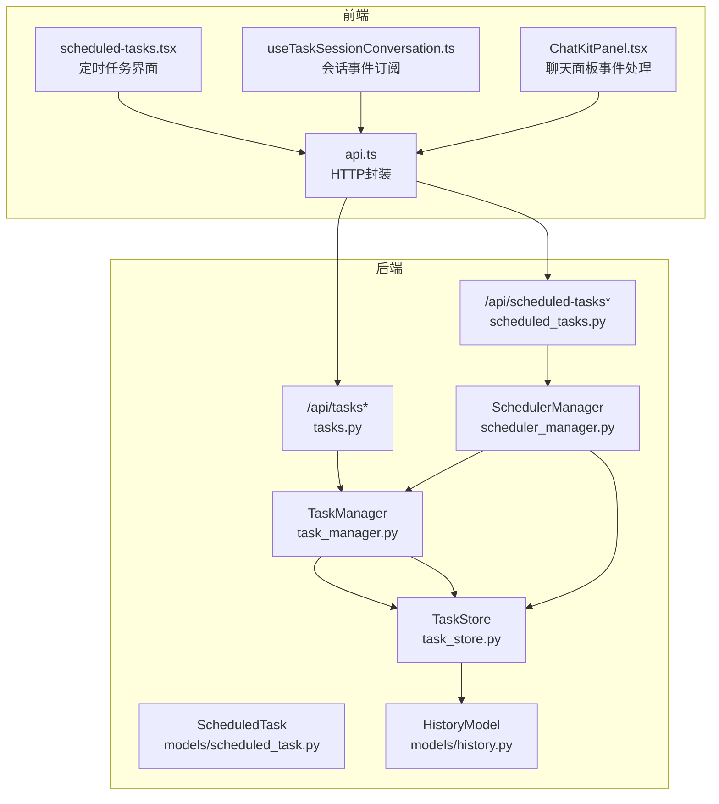
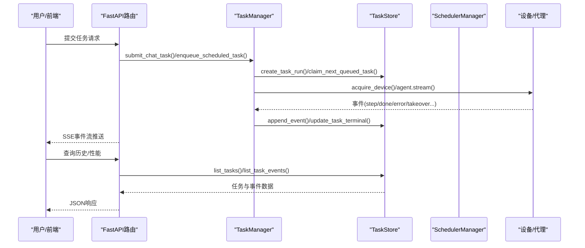
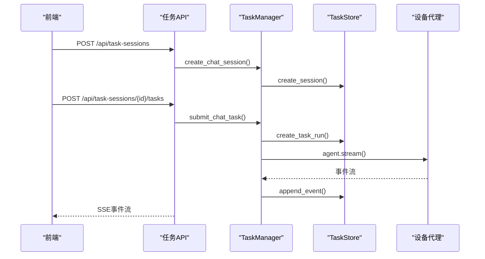
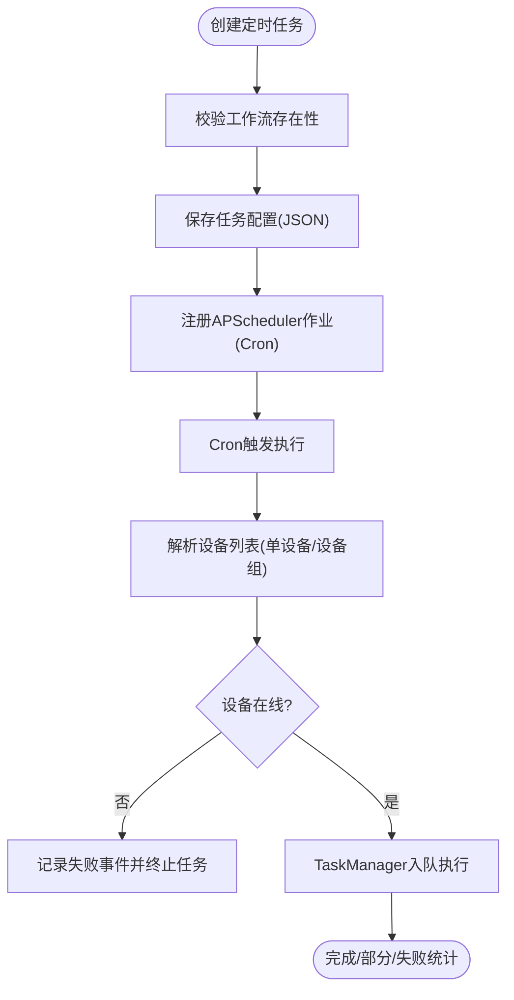
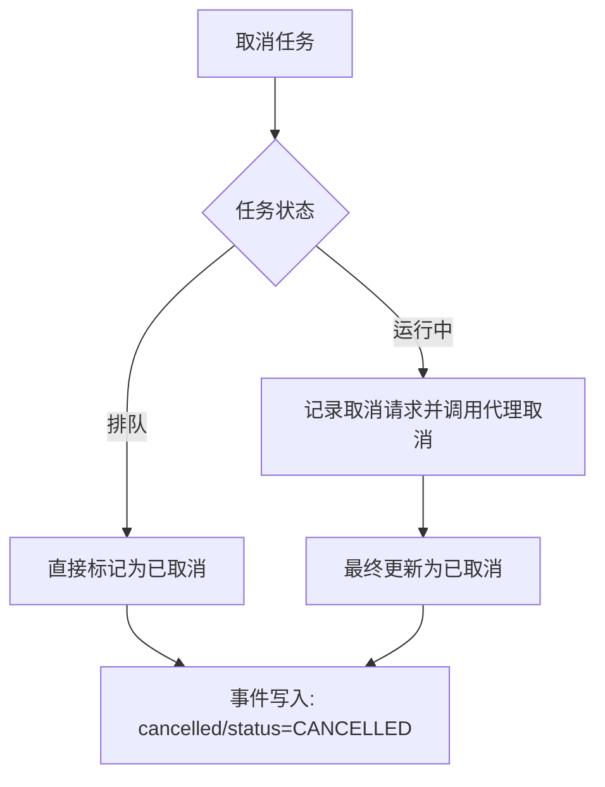
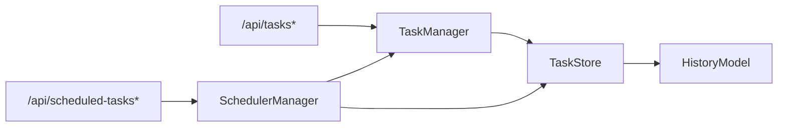

# 任务执行

<cite>
**本文引用的文件**
- [AutoGLM_GUI\task_manager.py](file://AutoGLM_GUI/task_manager.py)
- [AutoGLM_GUI\task_store.py](file://AutoGLM_GUI/task_store.py)
- [AutoGLM_GUI\scheduler_manager.py](file://AutoGLM_GUI/scheduler_manager.py)
- [AutoGLM_GUI\models\scheduled_task.py](file://AutoGLM_GUI/models/scheduled_task.py)
- [AutoGLM_GUI\models\history.py](file://AutoGLM_GUI/models/history.py)
- [AutoGLM_GUI\api\tasks.py](file://AutoGLM_GUI/api/tasks.py)
- [AutoGLM_GUI\api\scheduled_tasks.py](file://AutoGLM_GUI/api/scheduled_tasks.py)
- [frontend\src\routes\scheduled-tasks.tsx](file://frontend/src/routes/scheduled-tasks.tsx)
- [frontend\src\hooks\useTaskSessionConversation.ts](file://frontend/src/hooks/useTaskSessionConversation.ts)
- [frontend\src\components\ChatKitPanel.tsx](file://frontend/src/components/ChatKitPanel.tsx)
- [frontend\src\api.ts](file://frontend/src/api.ts)
- [tests\test_scheduler_manager.py](file://tests/test_scheduler_manager.py)
- [tests\test_scheduled_tasks_api.py](file://tests/test_scheduled_tasks_api.py)
</cite>

## 目录
1. [简介](#简介)
2. [项目结构](#项目结构)
3. [核心组件](#核心组件)
4. [架构总览](#架构总览)
5. [详细组件分析](#详细组件分析)
6. [依赖关系分析](#依赖关系分析)
7. [性能考量](#性能考量)
8. [故障排查指南](#故障排查指南)
9. [结论](#结论)
10. [附录](#附录)

## 简介
本指南面向AutoGLM-GUI的任务执行功能，提供从任务创建、配置、执行到监控的全流程操作说明。内容覆盖单次任务与批量/定时任务的区别与使用场景，任务优先级、超时与重试机制的现状与建议，任务状态跟踪与结果查看方法，以及中断、暂停、继续等控制操作。同时包含任务历史记录查看与性能分析能力，并给出复杂任务场景的实操示例。

## 项目结构
AutoGLM-GUI的任务执行体系由“任务管理器”“任务存储”“调度器”“API路由”“前端界面”等模块协同组成。后端通过FastAPI提供REST接口，前端通过SSE流实时接收任务事件，数据库采用SQLite持久化任务与会话状态。

图表来源
- [AutoGLM_GUI\api\tasks.py:1-365](file://AutoGLM_GUI/api/tasks.py#L1-L365)
- [AutoGLM_GUI\api\scheduled_tasks.py:1-137](file://AutoGLM_GUI/api/scheduled_tasks.py#L1-L137)
- [AutoGLM_GUI\task_manager.py:1-800](file://AutoGLM_GUI/task_manager.py#L1-L800)
- [AutoGLM_GUI\task_store.py:1-800](file://AutoGLM_GUI/task_store.py#L1-L800)
- [AutoGLM_GUI\scheduler_manager.py:1-523](file://AutoGLM_GUI/scheduler_manager.py#L1-L523)
- [AutoGLM_GUI\models\scheduled_task.py:1-121](file://AutoGLM_GUI/models/scheduled_task.py#L1-L121)
- [AutoGLM_GUI\models\history.py:1-275](file://AutoGLM_GUI/models/history.py#L1-L275)
- [frontend\src\routes\scheduled-tasks.tsx:474-530](file://frontend/src/routes/scheduled-tasks.tsx#L474-L530)
- [frontend\src\hooks\useTaskSessionConversation.ts:111-143](file://frontend/src/hooks/useTaskSessionConversation.ts#L111-L143)
- [frontend\src\components\ChatKitPanel.tsx:105-142](file://frontend/src/components/ChatKitPanel.tsx#L105-L142)

章节来源
- [AutoGLM_GUI\api\tasks.py:1-365](file://AutoGLM_GUI/api/tasks.py#L1-L365)
- [AutoGLM_GUI\api\scheduled_tasks.py:1-137](file://AutoGLM_GUI/api/scheduled_tasks.py#L1-L137)
- [AutoGLM_GUI\task_manager.py:1-800](file://AutoGLM_GUI/task_manager.py#L1-L800)
- [AutoGLM_GUI\task_store.py:1-800](file://AutoGLM_GUI/task_store.py#L1-L800)
- [AutoGLM_GUI\scheduler_manager.py:1-523](file://AutoGLM_GUI/scheduler_manager.py#L1-L523)
- [AutoGLM_GUI\models\scheduled_task.py:1-121](file://AutoGLM_GUI/models/scheduled_task.py#L1-L121)
- [AutoGLM_GUI\models\history.py:1-275](file://AutoGLM_GUI/models/history.py#L1-L275)
- [frontend\src\routes\scheduled-tasks.tsx:474-530](file://frontend/src/routes/scheduled-tasks.tsx#L474-L530)
- [frontend\src\hooks\useTaskSessionConversation.ts:111-143](file://frontend/src/hooks/useTaskSessionConversation.ts#L111-L143)
- [frontend\src\components\ChatKitPanel.tsx:105-142](file://frontend/src/components/ChatKitPanel.tsx#L105-L142)

## 核心组件
- 任务管理器（TaskManager）
  - 负责会话生命周期、任务提交、执行器注册、取消与等待、事件追加与追踪回放。
  - 支持经典模式与分层模式两种执行器，以及定时任务专用执行器。
- 任务存储（TaskStore）
  - 基于SQLite的任务、会话、事件持久化，提供队列化任务领取、状态更新、事件查询等。
- 调度管理器（SchedulerManager）
  - 基于APScheduler的定时任务管理，支持Cron表达式、设备选择（单设备或设备组）、执行模式（经典/分层）。
- 数据模型
  - ScheduledTask：定时任务定义与元数据。
  - ConversationRecord/MessageRecord：历史记录与消息结构，支持Trace统计。
- API路由
  - /api/tasks*：单次任务查询、事件流、取消。
  - /api/scheduled-tasks*：定时任务创建、查询、启停、删除。

章节来源
- [AutoGLM_GUI\task_manager.py:30-80](file://AutoGLM_GUI/task_manager.py#L30-L80)
- [AutoGLM_GUI\task_store.py:48-155](file://AutoGLM_GUI/task_store.py#L48-L155)
- [AutoGLM_GUI\scheduler_manager.py:31-90](file://AutoGLM_GUI/scheduler_manager.py#L31-L90)
- [AutoGLM_GUI\models\scheduled_task.py:30-121](file://AutoGLM_GUI/models/scheduled_task.py#L30-L121)
- [AutoGLM_GUI\models\history.py:165-275](file://AutoGLM_GUI/models/history.py#L165-L275)
- [AutoGLM_GUI\api\tasks.py:1-365](file://AutoGLM_GUI/api/tasks.py#L1-L365)
- [AutoGLM_GUI\api\scheduled_tasks.py:1-137](file://AutoGLM_GUI/api/scheduled_tasks.py#L1-L137)

## 架构总览
下图展示从用户发起任务到任务执行、事件流式推送与历史归档的整体流程。

图表来源
- [AutoGLM_GUI\task_manager.py:141-208](file://AutoGLM_GUI/task_manager.py#L141-L208)
- [AutoGLM_GUI\task_store.py:445-521](file://AutoGLM_GUI/task_store.py#L445-L521)
- [AutoGLM_GUI\scheduler_manager.py:355-467](file://AutoGLM_GUI/scheduler_manager.py#L355-L467)
- [AutoGLM_GUI\api\tasks.py:210-341](file://AutoGLM_GUI/api/tasks.py#L210-L341)

## 详细组件分析

### 单次任务与会话
- 会话创建与复用
  - 通过会话接口创建/获取会话，支持经典与分层两种模式。
  - 分层模式下可重置会话并清理上下文代理。
- 任务提交
  - 将消息与附件、经验上下文提交至对应执行器，自动入队并触发设备工作器执行。
- 事件流与状态
  - 通过SSE流实时推送事件类型（如status、step、done、error、cancelled、takeover），前端据此更新UI与状态。

图表来源
- [AutoGLM_GUI\api\tasks.py:133-231](file://AutoGLM_GUI/api/tasks.py#L133-L231)
- [AutoGLM_GUI\task_manager.py:89-208](file://AutoGLM_GUI/task_manager.py#L89-L208)
- [AutoGLM_GUI\task_store.py:445-521](file://AutoGLM_GUI/task_store.py#L445-L521)

章节来源
- [AutoGLM_GUI\api\tasks.py:133-231](file://AutoGLM_GUI/api/tasks.py#L133-L231)
- [AutoGLM_GUI\task_manager.py:89-208](file://AutoGLM_GUI/task_manager.py#L89-L208)
- [frontend\src\hooks\useTaskSessionConversation.ts:111-143](file://frontend/src/hooks/useTaskSessionConversation.ts#L111-L143)
- [frontend\src\components\ChatKitPanel.tsx:105-142](file://frontend/src/components/ChatKitPanel.tsx#L105-L142)

### 批量/定时任务（调度任务）
- 创建与配置
  - 指定工作流UUID、Cron表达式、目标设备（单设备或设备组）、执行模式（classic/layered）。
  - 后端校验工作流存在性，保存至本地JSON并注册APScheduler作业。
- 执行过程
  - 触发时解析设备列表，过滤在线设备，离线设备记录失败事件；在线设备通过TaskManager入队执行。
  - 根据执行模式选择执行器键（scheduled_workflow 或 scheduled_layered_workflow）。
- 状态与统计
  - 记录最近一次运行时间、成功数/总数、状态（success/partial/failure）与消息摘要。

图表来源
- [AutoGLM_GUI\api\scheduled_tasks.py:76-93](file://AutoGLM_GUI/api/scheduled_tasks.py#L76-L93)
- [AutoGLM_GUI\scheduler_manager.py:60-123](file://AutoGLM_GUI/scheduler_manager.py#L60-L123)
- [AutoGLM_GUI\scheduler_manager.py:355-467](file://AutoGLM_GUI/scheduler_manager.py#L355-L467)
- [AutoGLM_GUI\models\scheduled_task.py:30-121](file://AutoGLM_GUI/models/scheduled_task.py#L30-L121)

章节来源
- [AutoGLM_GUI\api\scheduled_tasks.py:70-137](file://AutoGLM_GUI/api/scheduled_tasks.py#L70-L137)
- [AutoGLM_GUI\scheduler_manager.py:60-123](file://AutoGLM_GUI/scheduler_manager.py#L60-L123)
- [AutoGLM_GUI\scheduler_manager.py:355-467](file://AutoGLM_GUI/scheduler_manager.py#L355-L467)
- [frontend\src\routes\scheduled-tasks.tsx:474-530](file://frontend/src/routes/scheduled-tasks.tsx#L474-L530)
- [tests\test_scheduler_manager.py:39-186](file://tests/test_scheduler_manager.py#L39-L186)
- [tests\test_scheduled_tasks_api.py:158-205](file://tests/test_scheduled_tasks_api.py#L158-L205)

### 任务优先级、超时与重试
- 优先级
  - 当前实现按“设备+创建时间+ID”的顺序从队列中领取任务，未显式支持任务优先级字段。
- 超时
  - 未内置全局任务超时控制；可通过前端轮询或SSE事件检测任务状态变化。
- 重试
  - 未内置自动重试逻辑；可在失败后重新提交任务或调整策略。

章节来源
- [AutoGLM_GUI\task_store.py:633-682](file://AutoGLM_GUI/task_store.py#L633-L682)
- [AutoGLM_GUI\task_manager.py:404-418](file://AutoGLM_GUI/task_manager.py#L404-L418)

### 任务控制：取消、中断、暂停/继续
- 取消（CANCEL）
  - 对于排队中任务：直接标记为已取消并写入事件。
  - 对于运行中任务：记录取消请求，调用代理取消回调，最终更新为已取消。
- 中断（INTERRUPT）
  - 服务重启时会将运行中任务标记为中断，避免悬挂。
- 暂停/继续
  - 未提供显式的“暂停/继续”控制；可通过“取消+重新提交”或“接管（takeover）”机制实现类似效果。

图表来源
- [AutoGLM_GUI\task_manager.py:420-444](file://AutoGLM_GUI/task_manager.py#L420-L444)
- [AutoGLM_GUI\task_store.py:735-781](file://AutoGLM_GUI/task_store.py#L735-L781)
- [AutoGLM_GUI\task_store.py:782-800](file://AutoGLM_GUI/task_store.py#L782-L800)

章节来源
- [AutoGLM_GUI\task_manager.py:420-444](file://AutoGLM_GUI/task_manager.py#L420-L444)
- [AutoGLM_GUI\task_store.py:735-781](file://AutoGLM_GUI/task_store.py#L735-L781)
- [AutoGLM_GUI\task_store.py:782-800](file://AutoGLM_GUI/task_store.py#L782-L800)

### 任务状态跟踪与结果查看
- 实时事件流
  - 使用SSE接口持续推送事件，前端根据事件类型更新UI与状态。
- 历史与性能
  - 通过任务事件接口获取事件列表，结合历史模型中的消息与Trace统计进行分析。
  - 前端会话事件处理包含对done/error/cancelled/takeover/status等事件的解析与状态更新。

章节来源
- [AutoGLM_GUI\api\tasks.py:277-341](file://AutoGLM_GUI/api/tasks.py#L277-L341)
- [AutoGLM_GUI\models\history.py:165-275](file://AutoGLM_GUI/models/history.py#L165-L275)
- [frontend\src\hooks\useTaskSessionConversation.ts:111-143](file://frontend/src/hooks/useTaskSessionConversation.ts#L111-L143)
- [frontend\src\components\ChatKitPanel.tsx:105-142](file://frontend/src/components/ChatKitPanel.tsx#L105-L142)

### 任务历史记录与性能分析
- 历史记录
  - 每次任务完成后写入历史记录，包含开始/结束时间、步骤数、耗时、消息与Trace统计。
- 性能分析
  - 任务执行期间生成Trace，结束后将Trace统计写入事件，可用于性能分析与回放。

章节来源
- [AutoGLM_GUI\models\history.py:165-275](file://AutoGLM_GUI/models/history.py#L165-L275)
- [AutoGLM_GUI\task_manager.py:491-530](file://AutoGLM_GUI/task_manager.py#L491-L530)
- [AutoGLM_GUI\task_manager.py:579-614](file://AutoGLM_GUI/task_manager.py#L579-L614)

## 依赖关系分析
- 组件耦合
  - TaskManager依赖TaskStore进行持久化与事件管理；调度器通过TaskManager入队定时任务。
  - API路由作为对外入口，统一调用TaskManager与SchedulerManager。
- 外部依赖
  - APScheduler用于定时任务调度；SQLite用于本地持久化；FastAPI提供HTTP接口与SSE。

图表来源
- [AutoGLM_GUI\api\tasks.py:1-365](file://AutoGLM_GUI/api/tasks.py#L1-L365)
- [AutoGLM_GUI\api\scheduled_tasks.py:1-137](file://AutoGLM_GUI/api/scheduled_tasks.py#L1-L137)
- [AutoGLM_GUI\task_manager.py:1-80](file://AutoGLM_GUI/task_manager.py#L1-L80)
- [AutoGLM_GUI\scheduler_manager.py:1-90](file://AutoGLM_GUI/scheduler_manager.py#L1-L90)
- [AutoGLM_GUI\task_store.py:1-80](file://AutoGLM_GUI/task_store.py#L1-L80)
- [AutoGLM_GUI\models\history.py:1-60](file://AutoGLM_GUI/models/history.py#L1-L60)

章节来源
- [AutoGLM_GUI\api\tasks.py:1-365](file://AutoGLM_GUI/api/tasks.py#L1-L365)
- [AutoGLM_GUI\api\scheduled_tasks.py:1-137](file://AutoGLM_GUI/api/scheduled_tasks.py#L1-L137)
- [AutoGLM_GUI\task_manager.py:1-80](file://AutoGLM_GUI/task_manager.py#L1-L80)
- [AutoGLM_GUI\scheduler_manager.py:1-90](file://AutoGLM_GUI/scheduler_manager.py#L1-L90)
- [AutoGLM_GUI\task_store.py:1-80](file://AutoGLM_GUI/task_store.py#L1-L80)
- [AutoGLM_GUI\models\history.py:1-60](file://AutoGLM_GUI/models/history.py#L1-L60)

## 性能考量
- 队列化与并发
  - 每个设备独立工作器，串行领取与执行任务，避免设备资源竞争。
- 事件写入与索引
  - SQLite WAL模式与多索引优化查询；事件按序写入，避免重复。
- Trace与指标
  - 任务执行期生成Trace，结束后写入事件与指标，便于性能分析与回放。

章节来源
- [AutoGLM_GUI\task_store.py:80-155](file://AutoGLM_GUI/task_store.py#L80-L155)
- [AutoGLM_GUI\task_manager.py:491-530](file://AutoGLM_GUI/task_manager.py#L491-L530)
- [AutoGLM_GUI\task_manager.py:579-614](file://AutoGLM_GUI/task_manager.py#L579-L614)

## 故障排查指南
- 任务未执行
  - 检查设备是否在线、是否被占用；查看任务事件中的错误消息。
- 无法取消
  - 若任务已完成或已取消，取消请求会被忽略；检查任务状态。
- 服务重启导致任务中断
  - 服务启动时会将运行中任务标记为中断，需重新提交任务。
- 定时任务未触发
  - 检查Cron表达式、设备选择与工作流有效性；查看最近一次运行统计。

章节来源
- [AutoGLM_GUI\task_store.py:782-800](file://AutoGLM_GUI/task_store.py#L782-L800)
- [AutoGLM_GUI\scheduler_manager.py:355-467](file://AutoGLM_GUI/scheduler_manager.py#L355-L467)
- [AutoGLM_GUI\api\scheduled_tasks.py:76-93](file://AutoGLM_GUI/api/scheduled_tasks.py#L76-L93)

## 结论
AutoGLM-GUI提供了完善的任务执行与调度能力：单次任务通过会话与执行器即时执行，定时任务通过APScheduler周期触发并支持设备组与分层模式。系统以事件驱动的方式实现状态跟踪与结果查看，并具备历史记录与Trace统计能力。当前未内置优先级、全局超时与自动重试机制，但可通过外部策略与重新提交实现类似效果。

## 附录

### 操作清单与最佳实践
- 单次任务
  - 创建会话 → 提交任务 → 订阅SSE事件 → 查看历史与性能。
- 批量/定时任务
  - 配置工作流与Cron → 选择设备或设备组 → 选择执行模式 → 启用任务 → 监控最近运行统计。
- 控制操作
  - 取消排队中的任务：直接取消；取消运行中的任务：请求取消并等待代理响应。
- 性能分析
  - 使用历史记录中的消息与Trace统计进行分析；关注步骤耗时分布。

章节来源
- [AutoGLM_GUI\api\tasks.py:210-341](file://AutoGLM_GUI/api/tasks.py#L210-L341)
- [AutoGLM_GUI\api\scheduled_tasks.py:70-137](file://AutoGLM_GUI/api/scheduled_tasks.py#L70-L137)
- [AutoGLM_GUI\models\history.py:165-275](file://AutoGLM_GUI/models/history.py#L165-L275)