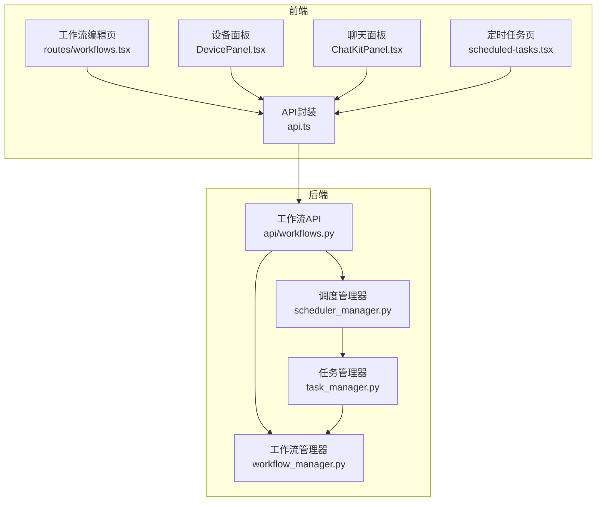
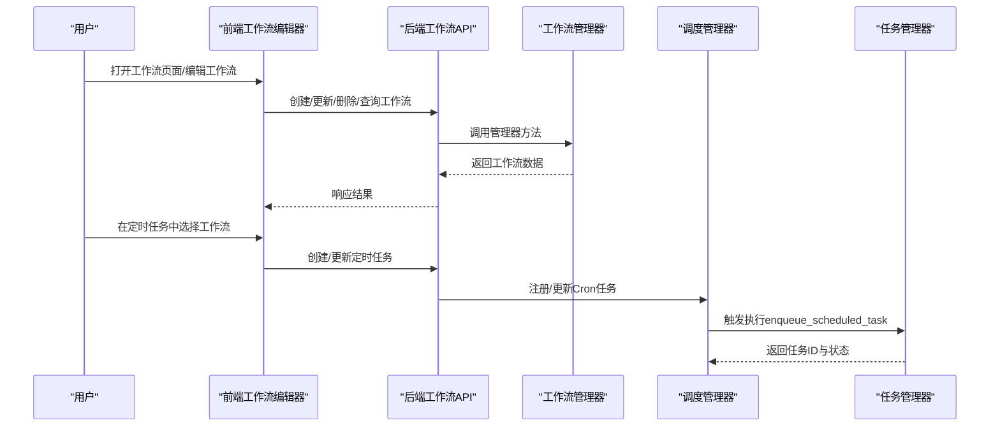
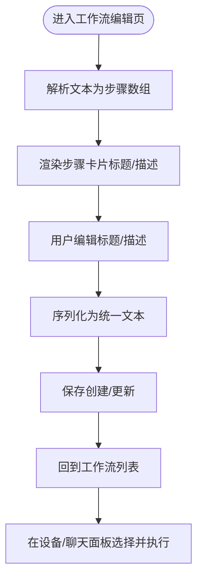
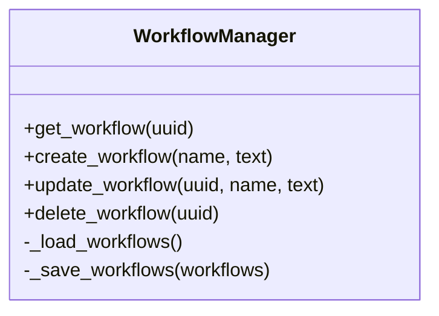
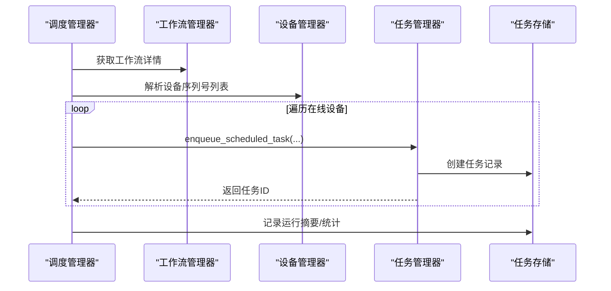
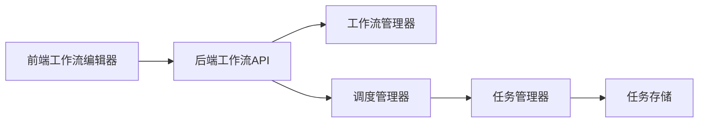

# 工作流管理

<cite>
**本文引用的文件**
- [workflow_manager.py](file://AutoGLM_GUI/workflow_manager.py)
- [workflows.py](file://AutoGLM_GUI/api/workflows.py)
- [workflows.tsx](file://frontend/src/routes/workflows.tsx)
- [api.ts](file://frontend/src/api.ts)
- [DevicePanel.tsx](file://frontend/src/components/DevicePanel.tsx)
- [ChatKitPanel.tsx](file://frontend/src/components/ChatKitPanel.tsx)
- [scheduler_manager.py](file://AutoGLM_GUI/scheduler_manager.py)
- [task_manager.py](file://AutoGLM_GUI/task_manager.py)
- [scheduled-tasks.tsx](file://frontend/src/routes/scheduled-tasks.tsx)
- [test_workflows_api.py](file://tests/test_workflows_api.py)
- [test_scheduler_manager.py](file://tests/test_scheduler_manager.py)
- [test_scheduled_tasks_api.py](file://tests/test_scheduled_tasks_api.py)
</cite>

## 目录
1. [简介](#简介)
2. [项目结构](#项目结构)
3. [核心组件](#核心组件)
4. [架构总览](#架构总览)
5. [详细组件分析](#详细组件分析)
6. [依赖分析](#依赖分析)
7. [性能考虑](#性能考虑)
8. [故障排查指南](#故障排查指南)
9. [结论](#结论)
10. [附录](#附录)

## 简介
本章节面向AutoGLM-GUI的工作流管理能力，系统性阐述工作流的设计理念、创建与配置流程、执行机制以及高级特性（如条件分支、循环控制、异常处理）。同时覆盖调度执行、调试与测试方法、版本与变更追踪建议，以及典型场景设计思路与最佳实践。

## 项目结构
工作流管理由后端存储与前端编辑器协同构成：
- 后端
  - 工作流持久化与管理：workflow_manager.py
  - 工作流API路由：api/workflows.py
  - 调度执行：scheduler_manager.py
  - 任务编排与等待：task_manager.py
- 前端
  - 工作流编辑页面：frontend/src/routes/workflows.tsx
  - 工作流列表与执行入口：frontend/src/components/DevicePanel.tsx、ChatKitPanel.tsx
  - 调度任务绑定工作流：frontend/src/routes/scheduled-tasks.tsx
  - API封装：frontend/src/api.ts

图表来源
- [workflows.tsx:1-314](file://frontend/src/routes/workflows.tsx#L1-L314)
- [DevicePanel.tsx:1409-1438](file://frontend/src/components/DevicePanel.tsx#L1409-L1438)
- [ChatKitPanel.tsx:1170-1197](file://frontend/src/components/ChatKitPanel.tsx#L1170-L1197)
- [scheduled-tasks.tsx:474-502](file://frontend/src/routes/scheduled-tasks.tsx#L474-L502)
- [api.ts:896-957](file://frontend/src/api.ts#L896-L957)
- [workflow_manager.py:61-195](file://AutoGLM_GUI/workflow_manager.py#L61-L195)
- [workflows.py](file://AutoGLM_GUI/api/workflows.py)
- [scheduler_manager.py:48-94](file://AutoGLM_GUI/scheduler_manager.py#L48-L94)
- [task_manager.py:378-418](file://AutoGLM_GUI/task_manager.py#L378-L418)

章节来源
- [workflows.tsx:1-314](file://frontend/src/routes/workflows.tsx#L1-L314)
- [DevicePanel.tsx:1409-1438](file://frontend/src/components/DevicePanel.tsx#L1409-L1438)
- [ChatKitPanel.tsx:1170-1197](file://frontend/src/components/ChatKitPanel.tsx#L1170-L1197)
- [scheduled-tasks.tsx:474-502](file://frontend/src/routes/scheduled-tasks.tsx#L474-L502)
- [api.ts:896-957](file://frontend/src/api.ts#L896-L957)
- [workflow_manager.py:61-195](file://AutoGLM_GUI/workflow_manager.py#L61-L195)
- [workflows.py](file://AutoGLM_GUI/api/workflows.py)
- [scheduler_manager.py:48-94](file://AutoGLM_GUI/scheduler_manager.py#L48-L94)
- [task_manager.py:378-418](file://AutoGLM_GUI/task_manager.py#L378-L418)

## 核心组件
- 工作流管理器（WorkflowManager）
  - 提供创建、查询、更新、删除工作流的能力
  - 使用文件系统进行持久化，支持mtime缓存与原子写入
- 工作流API（FastAPI）
  - 对外暴露REST接口，供前端调用
- 前端工作流编辑器
  - 支持多步骤文本编辑、标题与描述分块、序列化/反序列化
- 调度管理器（SchedulerManager）
  - 将工作流与设备/设备组按Cron表达式调度执行
  - 支持经典与分层两种执行模式
- 任务管理器（TaskManager）
  - 将调度触发转化为具体任务记录，支持等待与事件回传

章节来源
- [workflow_manager.py:61-195](file://AutoGLM_GUI/workflow_manager.py#L61-L195)
- [workflows.py](file://AutoGLM_GUI/api/workflows.py)
- [workflows.tsx:46-169](file://frontend/src/routes/workflows.tsx#L46-L169)
- [scheduler_manager.py:48-94](file://AutoGLM_GUI/scheduler_manager.py#L48-L94)
- [task_manager.py:378-418](file://AutoGLM_GUI/task_manager.py#L378-L418)

## 架构总览
工作流从“编辑—存储—调度—执行—记录”闭环流转，前端负责编辑与展示，后端负责持久化与调度执行，历史与统计通过任务存储与历史管理器沉淀。

图表来源
- [workflows.tsx:171-314](file://frontend/src/routes/workflows.tsx#L171-L314)
- [workflows.py](file://AutoGLM_GUI/api/workflows.py)
- [workflow_manager.py:61-195](file://AutoGLM_GUI/workflow_manager.py#L61-L195)
- [scheduler_manager.py:48-94](file://AutoGLM_GUI/scheduler_manager.py#L48-L94)
- [task_manager.py:378-418](file://AutoGLM_GUI/task_manager.py#L378-L418)

## 详细组件分析

### 工作流编辑与存储（前端）
- 步骤模型与序列化
  - 步骤包含标题与描述两部分，支持多行描述
  - 序列化规则：编号+标题；若存在描述，则以“说明/描述”标签分行输出
  - 反序列化规则：识别编号行作为步骤标题，后续连续非空行作为描述块
- 表单交互
  - 支持新增、编辑、删除步骤，拖拽排序
  - 保存时将步骤集合转为统一文本格式提交后端
- 执行入口
  - 设备面板与聊天面板提供“执行工作流”按钮，点击后调用后端执行接口

图表来源
- [workflows.tsx:46-169](file://frontend/src/routes/workflows.tsx#L46-L169)
- [workflows.tsx:171-314](file://frontend/src/routes/workflows.tsx#L171-L314)
- [DevicePanel.tsx:1409-1438](file://frontend/src/components/DevicePanel.tsx#L1409-L1438)
- [ChatKitPanel.tsx:1170-1197](file://frontend/src/components/ChatKitPanel.tsx#L1170-L1197)

章节来源
- [workflows.tsx:1-314](file://frontend/src/routes/workflows.tsx#L1-L314)
- [DevicePanel.tsx:1409-1438](file://frontend/src/components/DevicePanel.tsx#L1409-L1438)
- [ChatKitPanel.tsx:1170-1197](file://frontend/src/components/ChatKitPanel.tsx#L1170-L1197)

### 工作流持久化与API（后端）
- WorkflowManager
  - 列表/查询/创建/更新/删除
  - 文件读写采用mtime缓存与原子写入（临时文件+替换），保证一致性
- API路由
  - 提供列出、创建、获取、更新、删除工作流的标准REST接口
  - 集成错误处理与状态码返回

图表来源
- [workflow_manager.py:61-195](file://AutoGLM_GUI/workflow_manager.py#L61-L195)

章节来源
- [workflow_manager.py:61-195](file://AutoGLM_GUI/workflow_manager.py#L61-L195)
- [workflows.py](file://AutoGLM_GUI/api/workflows.py)

### 调度与执行（调度管理器与任务管理器）
- 调度管理器
  - 创建/更新/启用/禁用定时任务，支持Cron表达式
  - 执行时区分“经典”与“分层”两种执行模式，分别设置不同的executor_key
  - 对离线设备生成失败任务并记录错误
- 任务管理器
  - 将调度触发转换为任务记录，维护完成事件与等待机制
  - 提供等待任务完成的异步接口

图表来源
- [scheduler_manager.py:48-94](file://AutoGLM_GUI/scheduler_manager.py#L48-L94)
- [scheduler_manager.py:268-467](file://AutoGLM_GUI/scheduler_manager.py#L268-L467)
- [task_manager.py:378-418](file://AutoGLM_GUI/task_manager.py#L378-L418)

章节来源
- [scheduler_manager.py:48-94](file://AutoGLM_GUI/scheduler_manager.py#L48-L94)
- [scheduler_manager.py:268-467](file://AutoGLM_GUI/scheduler_manager.py#L268-L467)
- [task_manager.py:378-418](file://AutoGLM_GUI/task_manager.py#L378-L418)

### 前端与后端集成
- 前端API封装
  - 提供工作流增删改查、任务运行响应等类型定义
- 定时任务绑定
  - 定时任务页可选择已创建工作流，形成“工作流→任务→调度”的映射

章节来源
- [api.ts:896-957](file://frontend/src/api.ts#L896-L957)
- [scheduled-tasks.tsx:474-502](file://frontend/src/routes/scheduled-tasks.tsx#L474-L502)

## 依赖分析
- 组件耦合
  - 前端编辑器依赖API封装；API路由依赖工作流管理器
  - 调度管理器依赖工作流管理器与任务管理器
  - 任务管理器依赖任务存储与设备管理器
- 外部依赖
  - JSON文件用于工作流持久化
  - Cron调度库用于时间触发
  - 异步事件用于任务完成通知

图表来源
- [workflows.tsx:1-314](file://frontend/src/routes/workflows.tsx#L1-L314)
- [workflows.py](file://AutoGLM_GUI/api/workflows.py)
- [workflow_manager.py:61-195](file://AutoGLM_GUI/workflow_manager.py#L61-L195)
- [scheduler_manager.py:48-94](file://AutoGLM_GUI/scheduler_manager.py#L48-L94)
- [task_manager.py:378-418](file://AutoGLM_GUI/task_manager.py#L378-L418)

章节来源
- [workflows.tsx:1-314](file://frontend/src/routes/workflows.tsx#L1-L314)
- [workflows.py](file://AutoGLM_GUI/api/workflows.py)
- [workflow_manager.py:61-195](file://AutoGLM_GUI/workflow_manager.py#L61-L195)
- [scheduler_manager.py:48-94](file://AutoGLM_GUI/scheduler_manager.py#L48-L94)
- [task_manager.py:378-418](file://AutoGLM_GUI/task_manager.py#L378-L418)

## 性能考虑
- 文件I/O优化
  - 工作流管理器对文件读取使用mtime缓存，避免频繁磁盘访问
  - 写入采用原子替换策略，减少竞态与损坏风险
- 异步与并发
  - 调度执行与任务等待基于异步事件，提升吞吐
  - 对离线设备直接生成失败任务，避免无效等待
- 前端渲染
  - 步骤卡片按需渲染，避免大文本重复解析

章节来源
- [workflow_manager.py:135-195](file://AutoGLM_GUI/workflow_manager.py#L135-L195)
- [scheduler_manager.py:268-467](file://AutoGLM_GUI/scheduler_manager.py#L268-L467)
- [task_manager.py:378-418](file://AutoGLM_GUI/task_manager.py#L378-L418)

## 故障排查指南
- 工作流API常见问题
  - 参数校验失败：返回422，检查名称与文本是否为空
  - 管理器异常：返回500，检查存储可用性与权限
- 调度执行问题
  - 无在线设备：记录“无在线设备”失败
  - 设备离线：为该设备创建失败任务并记录错误消息
  - 分层执行模式：确认任务执行键是否为“scheduled_layered_workflow”
- 前端交互问题
  - 工作流列表为空：确认后端存储路径与权限
  - 执行按钮不可用：检查步骤标题是否填写

章节来源
- [test_workflows_api.py:133-155](file://tests/test_workflows_api.py#L133-L155)
- [test_scheduler_manager.py:111-145](file://tests/test_scheduler_manager.py#L111-L145)
- [test_scheduler_manager.py:122-186](file://tests/test_scheduler_manager.py#L122-L186)
- [scheduler_manager.py:403-467](file://AutoGLM_GUI/scheduler_manager.py#L403-L467)

## 结论
AutoGLM-GUI的工作流管理以“文本化步骤+文件持久化+调度执行+任务跟踪”为核心，既满足简单自动化场景，又为复杂任务提供扩展空间。通过清晰的前后端职责划分与完善的错误处理，系统具备良好的可维护性与可扩展性。

## 附录

### 高级功能设计思路
- 条件分支
  - 在工作流文本中约定“条件块”语法，解析阶段识别条件节点，执行阶段根据上下文变量决定路径
- 循环控制
  - 使用“重复N次/遍历列表”语义，解析为循环指令，结合任务状态回传实现重试与终止
- 异常处理
  - 为每个步骤配置“异常分支”，失败时自动跳转至错误处理步骤或结束节点
- 版本与变更追踪
  - 为工作流增加版本字段与变更日志，每次更新记录操作人、时间与差异
- 并发与幂等
  - 任务ID与去重键确保重复触发不产生重复执行；分层模式下按设备维度隔离

### 实际工作流案例与最佳实践
- 案例一：每日签到
  - 步骤：启动应用→登录→签到→退出
  - 建议：为登录失败配置重试与截图记录
- 案例二：批量设备初始化
  - 步骤：检测设备→安装键盘→配置网络→运行自检
  - 建议：离线设备单独处理，失败任务独立统计
- 最佳实践
  - 将“说明/描述”用于记录预期结果与断言，便于回溯
  - 使用Cron表达式前先在定时任务页预览下次运行时间
  - 对长耗时任务开启分层执行模式，提升稳定性