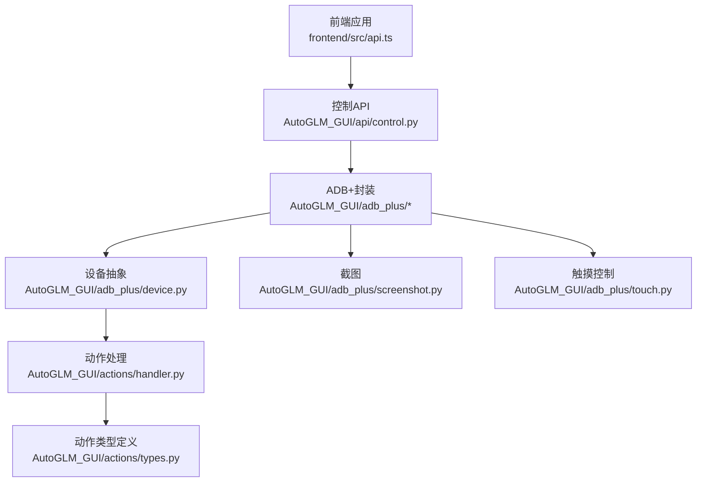
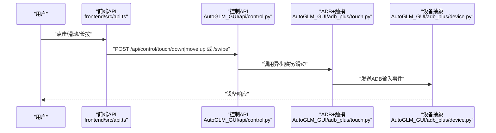
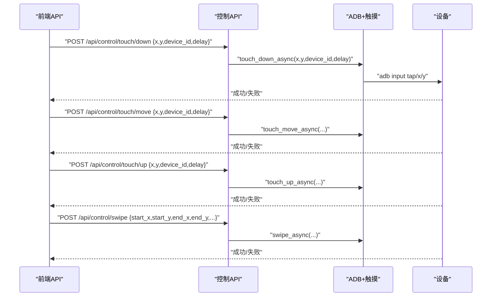
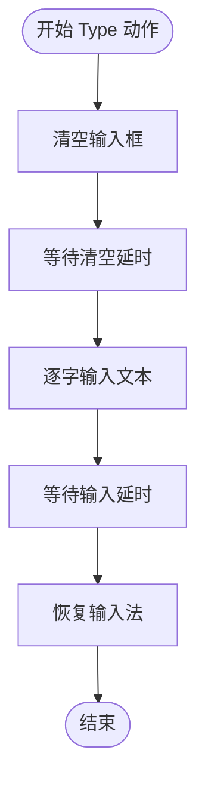
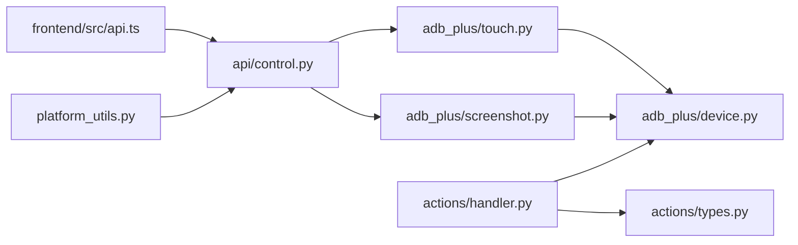

# 手动控制

<cite>
**本文引用的文件**
- [AutoGLM_GUI/adb_plus/screenshot.py](file://AutoGLM_GUI/adb_plus/screenshot.py)
- [AutoGLM_GUI/adb_plus/touch.py](file://AutoGLM_GUI/adb_plus/touch.py)
- [AutoGLM_GUI/adb_plus/device.py](file://AutoGLM_GUI/adb_plus/device.py)
- [AutoGLM_GUI/adb_plus/display.py](file://AutoGLM_GUI/adb_plus/display.py)
- [AutoGLM_GUI/adb_plus/pair.py](file://AutoGLM_GUI/adb_plus/pair.py)
- [AutoGLM_GUI/adb_plus/qr_pair.py](file://AutoGLM_GUI/adb_plus/qr_pair.py)
- [AutoGLM_GUI/adb_plus/ip.py](file://AutoGLM_GUI/adb_plus/ip.py)
- [AutoGLM_GUI/adb_plus/serial.py](file://AutoGLM_GUI/adb_plus/serial.py)
- [AutoGLM_GUI/adb_plus/version.py](file://AutoGLM_GUI/adb_plus/version.py)
- [AutoGLM_GUI/adb_plus/keyboard_installer.py](file://AutoGLM_GUI/adb_plus/keyboard_installer.py)
- [AutoGLM_GUI/adb_plus/mdns.py](file://AutoGLM_GUI/adb_plus/mdns.py)
- [AutoGLM_GUI/actions/types.py](file://AutoGLM_GUI/actions/types.py)
- [AutoGLM_GUI/actions/handler.py](file://AutoGLM_GUI/actions/handler.py)
- [AutoGLM_GUI/api/control.py](file://AutoGLM_GUI/api/control.py)
- [frontend/src/api.ts](file://frontend/src/api.ts)
- [AutoGLM_GUI/adb_terminal_repl.py](file://AutoGLM_GUI/adb_terminal_repl.py)
- [AutoGLM_GUI/platform_utils.py](file://AutoGLM_GUI/platform_utils.py)
- [docs/docs/user-guide/manual-control.md](file://docs/docs/user-guide/manual-control.md)
- [docs/docs/features/direct-operation.md](file://docs/docs/features/direct-operation.md)
- [docs/docs/troubleshooting/adb.md](file://docs/docs/troubleshooting/adb.md)
</cite>

## 目录
1. [简介](#简介)
2. [项目结构](#项目结构)
3. [核心组件](#核心组件)
4. [架构总览](#架构总览)
5. [详细组件分析](#详细组件分析)
6. [依赖关系分析](#依赖关系分析)
7. [性能考量](#性能考量)
8. [故障排查指南](#故障排查指南)
9. [结论](#结论)
10. [附录](#附录)

## 简介
本指南面向使用 AutoGLM-GUI 的用户，系统讲解“手动控制”能力：包括直接操作模式、触摸控制（点击、长按、拖拽、滑动）、按键与文本输入、ADB 终端交互、屏幕截图与录屏辅助工具、以及手势识别与坐标定位等高级控制技术。同时给出安全限制、使用注意事项与典型场景示例，帮助您在多设备环境下稳定、高效地进行人机交互。

## 项目结构
手动控制涉及后端服务层（API、ADB 封装、动作处理器）与前端交互层（HTTP API 调用、实时预览）。关键路径如下：
- 后端 API：统一入口位于控制接口，负责接收前端指令并转发到 ADB 操作层
- ADB 操作层：封装触摸、截图、设备管理、配对与连接等底层能力
- 前端交互层：通过 HTTP 接口调用手动控制能力，并展示实时画面

图表来源
- [frontend/src/api.ts:606-665](file://frontend/src/api.ts#L606-L665)
- [AutoGLM_GUI/api/control.py:91-118](file://AutoGLM_GUI/api/control.py#L91-L118)
- [AutoGLM_GUI/adb_plus/screenshot.py:127-291](file://AutoGLM_GUI/adb_plus/screenshot.py#L127-L291)
- [AutoGLM_GUI/adb_plus/touch.py](file://AutoGLM_GUI/adb_plus/touch.py)
- [AutoGLM_GUI/adb_plus/device.py](file://AutoGLM_GUI/adb_plus/device.py)
- [AutoGLM_GUI/actions/handler.py:194-237](file://AutoGLM_GUI/actions/handler.py#L194-L237)
- [AutoGLM_GUI/actions/types.py](file://AutoGLM_GUI/actions/types.py)

章节来源
- [frontend/src/api.ts:606-665](file://frontend/src/api.ts#L606-L665)
- [AutoGLM_GUI/api/control.py:91-118](file://AutoGLM_GUI/api/control.py#L91-L118)

## 核心组件
- 控制 API：提供触摸按下/移动/抬起、滑动等接口，统一返回响应模型
- ADB+ 封装：提供截图、触摸、设备管理、配对、显示参数、键盘安装、网络发现等能力
- 动作处理器：解析并执行“滑动、输入文本、启动应用”等动作，支持坐标转换
- 前端 API：封装 HTTP 请求，向控制 API 发送触摸与滑动指令
- ADB 终端：仅允许执行 adb 命令，便于快速诊断与设备调试

章节来源
- [AutoGLM_GUI/api/control.py:91-118](file://AutoGLM_GUI/api/control.py#L91-L118)
- [AutoGLM_GUI/adb_plus/screenshot.py:127-291](file://AutoGLM_GUI/adb_plus/screenshot.py#L127-L291)
- [AutoGLM_GUI/adb_plus/touch.py](file://AutoGLM_GUI/adb_plus/touch.py)
- [AutoGLM_GUI/actions/handler.py:194-237](file://AutoGLM_GUI/actions/handler.py#L194-L237)
- [frontend/src/api.ts:606-665](file://frontend/src/api.ts#L606-L665)
- [AutoGLM_GUI/adb_terminal_repl.py:1-89](file://AutoGLM_GUI/adb_terminal_repl.py#L1-L89)

## 架构总览
手动控制从浏览器发起请求，经由控制 API 路由到 ADB+ 触摸模块，最终通过 ADB 驱动设备执行。截图模块可独立调用以辅助定位与验证。

图表来源
- [frontend/src/api.ts:606-665](file://frontend/src/api.ts#L606-L665)
- [AutoGLM_GUI/api/control.py:91-118](file://AutoGLM_GUI/api/control.py#L91-L118)
- [AutoGLM_GUI/adb_plus/touch.py](file://AutoGLM_GUI/adb_plus/touch.py)
- [AutoGLM_GUI/adb_plus/device.py](file://AutoGLM_GUI/adb_plus/device.py)

## 详细组件分析

### 触摸控制（点击/长按/拖拽/滑动）
- 前端通过 HTTP 接口发送触摸事件与滑动请求，自动处理坐标四舍五入与延迟参数
- 后端路由将请求分发至 ADB+ 触摸模块，执行异步触摸事件
- 支持指定设备 ID 与延迟，确保多设备环境下的可控性

图表来源
- [frontend/src/api.ts:606-665](file://frontend/src/api.ts#L606-L665)
- [AutoGLM_GUI/api/control.py:91-118](file://AutoGLM_GUI/api/control.py#L91-L118)
- [AutoGLM_GUI/adb_plus/touch.py](file://AutoGLM_GUI/adb_plus/touch.py)

章节来源
- [frontend/src/api.ts:606-665](file://frontend/src/api.ts#L606-L665)
- [AutoGLM_GUI/api/control.py:91-118](file://AutoGLM_GUI/api/control.py#L91-L118)

### 文本输入与按键
- 动作处理器支持“Type”动作，先清空输入框，再逐字输入，最后恢复输入法
- 输入过程包含延时配置，避免过快导致字符丢失或系统拦截
- 支持在不同分辨率与缩放下进行坐标换算，保证跨设备一致性

图表来源
- [AutoGLM_GUI/actions/handler.py:194-237](file://AutoGLM_GUI/actions/handler.py#L194-L237)

章节来源
- [AutoGLM_GUI/actions/handler.py:194-237](file://AutoGLM_GUI/actions/handler.py#L194-L237)

### 屏幕截图与录屏辅助
- 截图模块通过 ADB exec-out screencap 获取 PNG 数据，支持指定设备与超时
- 可用于校验坐标、确认元素可见性、辅助手势识别与自动化脚本调试
- 录屏能力可通过 ADB 命令实现，结合终端工具进行录制与回放

章节来源
- [AutoGLM_GUI/adb_plus/screenshot.py:127-291](file://AutoGLM_GUI/adb_plus/screenshot.py#L127-L291)

### 设备管理与连接
- 设备抽象封装了 ADB 连接、显示参数、配对与网络发现等功能
- 支持 USB、IP 地址、序列号等多种连接方式；提供 mDNS 与二维码配对辅助
- 版本与键盘安装工具可用于兼容性检查与输入法部署

章节来源
- [AutoGLM_GUI/adb_plus/device.py](file://AutoGLM_GUI/adb_plus/device.py)
- [AutoGLM_GUI/adb_plus/display.py](file://AutoGLM_GUI/adb_plus/display.py)
- [AutoGLM_GUI/adb_plus/pair.py](file://AutoGLM_GUI/adb_plus/pair.py)
- [AutoGLM_GUI/adb_plus/qr_pair.py](file://AutoGLM_GUI/adb_plus/qr_pair.py)
- [AutoGLM_GUI/adb_plus/ip.py](file://AutoGLM_GUI/adb_plus/ip.py)
- [AutoGLM_GUI/adb_plus/serial.py](file://AutoGLM_GUI/adb_plus/serial.py)
- [AutoGLM_GUI/adb_plus/version.py](file://AutoGLM_GUI/adb_plus/version.py)
- [AutoGLM_GUI/adb_plus/keyboard_installer.py](file://AutoGLM_GUI/adb_plus/keyboard_installer.py)
- [AutoGLM_GUI/adb_plus/mdns.py](file://AutoGLM_GUI/adb_plus/mdns.py)

### ADB 终端与命令执行
- ADB-only 终端仅允许执行 adb 命令，内置帮助、清屏、退出等内置命令
- 适合快速诊断设备状态、安装应用、拉取日志、重定向端口等

章节来源
- [AutoGLM_GUI/adb_terminal_repl.py:1-89](file://AutoGLM_GUI/adb_terminal_repl.py#L1-L89)

### 坐标定位与动作类型
- 动作类型定义了“Swipe、Type、Launch”等标准动作
- 坐标转换逻辑将归一化或特定比例坐标映射到标准像素范围，确保跨设备一致

章节来源
- [AutoGLM_GUI/actions/types.py](file://AutoGLM_GUI/actions/types.py)
- [AutoGLM_GUI/actions/handler.py:194-237](file://AutoGLM_GUI/actions/handler.py#L194-L237)

## 依赖关系分析
- 前端 API 依赖控制 API；控制 API 依赖 ADB+ 触摸模块；ADB+ 模块依赖设备抽象
- 截图模块与动作处理器相互独立，但都依赖 ADB 命令与设备连接
- 平台工具提供统一的 ADB 命令构建器，减少重复逻辑

图表来源
- [frontend/src/api.ts:606-665](file://frontend/src/api.ts#L606-L665)
- [AutoGLM_GUI/api/control.py:91-118](file://AutoGLM_GUI/api/control.py#L91-L118)
- [AutoGLM_GUI/adb_plus/touch.py](file://AutoGLM_GUI/adb_plus/touch.py)
- [AutoGLM_GUI/adb_plus/screenshot.py:127-291](file://AutoGLM_GUI/adb_plus/screenshot.py#L127-L291)
- [AutoGLM_GUI/adb_plus/device.py](file://AutoGLM_GUI/adb_plus/device.py)
- [AutoGLM_GUI/actions/handler.py:194-237](file://AutoGLM_GUI/actions/handler.py#L194-L237)
- [AutoGLM_GUI/actions/types.py](file://AutoGLM_GUI/actions/types.py)
- [AutoGLM_GUI/platform_utils.py:84-107](file://AutoGLM_GUI/platform_utils.py#L84-L107)

章节来源
- [AutoGLM_GUI/platform_utils.py:84-107](file://AutoGLM_GUI/platform_utils.py#L84-L107)

## 性能考量
- 触摸与滑动操作建议设置合理延迟，避免系统输入队列拥堵
- 多设备并发时，优先使用设备 ID 明确目标设备，减少匹配开销
- 截图与录屏会占用带宽与 CPU，建议在需要时才启用，并设置合理超时
- 文本输入应考虑输入法切换成本，尽量批量输入并复用输入法状态

## 故障排查指南
- 设备不可达：检查 ADB 连接状态、设备是否在线、防火墙与权限
- 命令受限：ADB 终端仅允许 adb 命令，其他命令会被拒绝
- 截图失败：确认 ADB 权限、设备是否支持 screencap、超时时间是否过短
- 坐标不准确：核对分辨率与缩放，必要时使用截图辅助定位

章节来源
- [docs/docs/troubleshooting/adb.md](file://docs/docs/troubleshooting/adb.md)
- [AutoGLM_GUI/adb_plus/screenshot.py:127-291](file://AutoGLM_GUI/adb_plus/screenshot.py#L127-L291)
- [AutoGLM_GUI/adb_terminal_repl.py:1-89](file://AutoGLM_GUI/adb_terminal_repl.py#L1-L89)

## 结论
手动控制模块通过清晰的前后端分层与统一的 ADB 抽象，提供了稳定可靠的触摸、文本与设备管理能力。配合截图与终端工具，可满足从基础操作到高级定位与调试的多样化需求。遵循本文的使用规范与安全限制，可在多设备环境中高效、安全地完成手动控制任务。

## 附录

### 典型手动操作场景示例
- 点击按钮：在目标坐标发送触摸按下/抬起事件，或使用滑动接口模拟轻触
- 拖拽/滑动：指定起点与终点坐标，设置合适时长与延迟
- 文本输入：先清空输入框，再逐字输入，最后恢复输入法
- 截图辅助：在执行关键操作前截图，确认元素位置与状态
- 终端诊断：使用 ADB 终端检查设备状态、安装应用或导出日志

章节来源
- [docs/docs/user-guide/manual-control.md](file://docs/docs/user-guide/manual-control.md)
- [docs/docs/features/direct-operation.md](file://docs/docs/features/direct-operation.md)