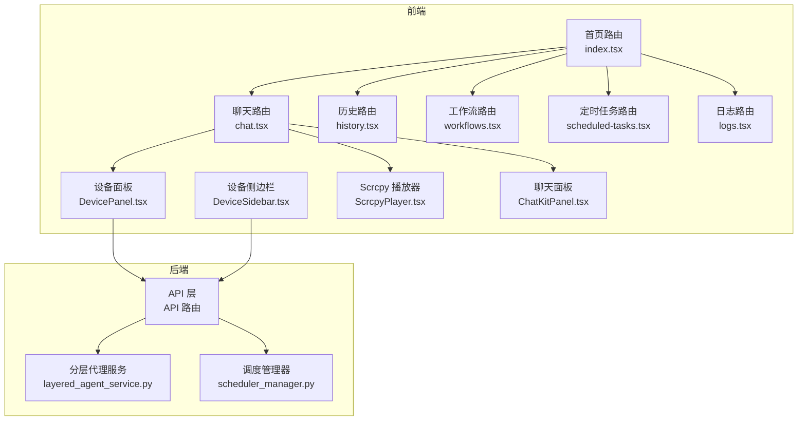
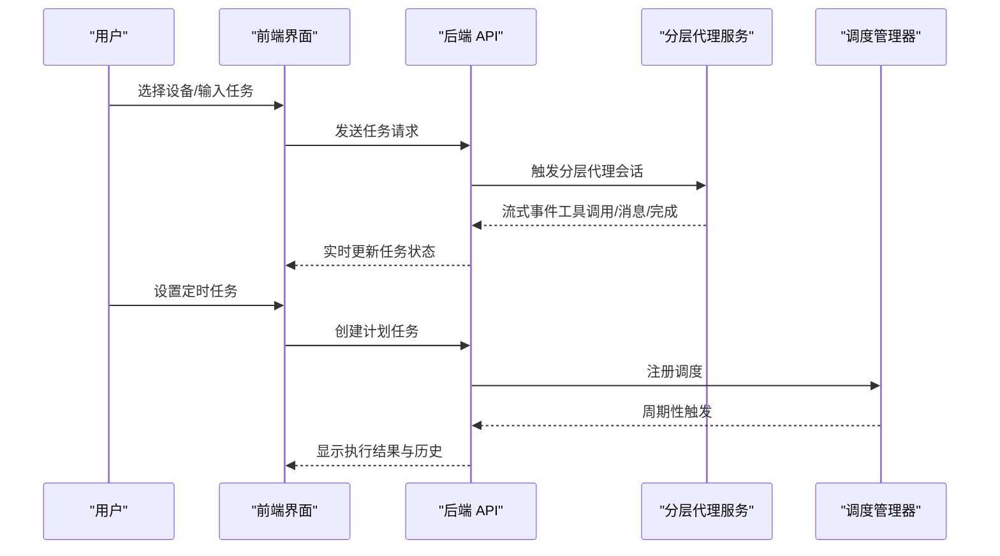
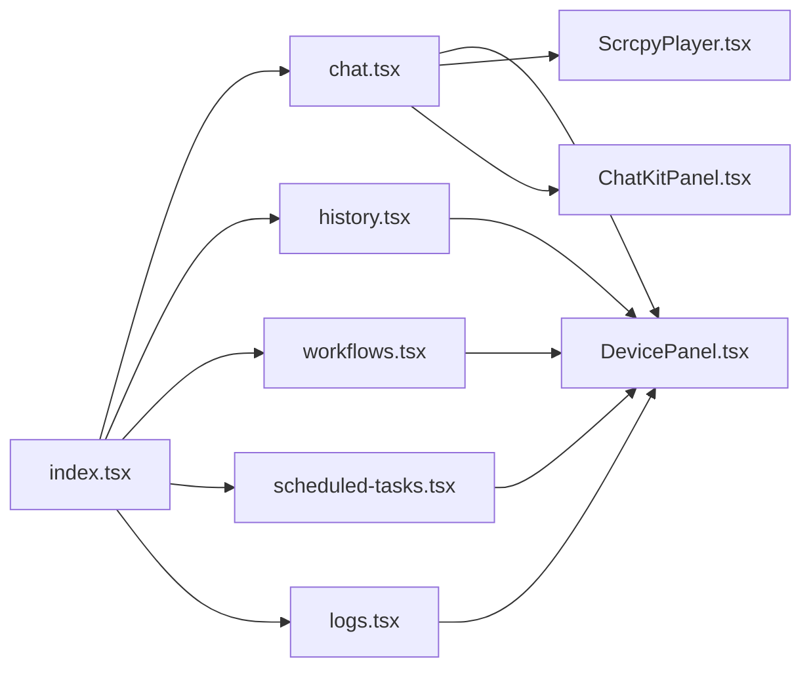

# 用户指南

<cite>
**本文引用的文件**
- [README.md](file://README.md)
- [README_EN.md](file://README_EN.md)
- [docs/docs/intro.md](file://docs/docs/intro.md)
- [docs/docs/user-guide/interface.md](file://docs/docs/user-guide/interface.md)
- [docs/docs/user-guide/manual-control.md](file://docs/docs/user-guide/manual-control.md)
- [docs/docs/features/layered-agent.md](file://docs/docs/features/layered-agent.md)
- [docs/docs/features/workflow.md](file://docs/docs/features/workflow.md)
- [docs/docs/features/scheduler.md](file://docs/docs/features/scheduler.md)
- [docs/docs/getting-started/device-connection.md](file://docs/docs/getting-started/device-connection.md)
- [docs/docs/troubleshooting/adb.md](file://docs/docs/troubleshooting/adb.md)
- [AutoGLM_GUI/layered_agent_service.py](file://AutoGLM_GUI/layered_agent_service.py)
- [AutoGLM_GUI/scheduler_manager.py](file://AutoGLM_GUI/scheduler_manager.py)
- [frontend/src/routes/index.tsx](file://frontend/src/routes/index.tsx)
- [frontend/src/routes/chat.tsx](file://frontend/src/routes/chat.tsx)
- [frontend/src/routes/history.tsx](file://frontend/src/routes/history.tsx)
- [frontend/src/routes/workflows.tsx](file://frontend/src/routes/workflows.tsx)
- [frontend/src/routes/scheduled-tasks.tsx](file://frontend/src/routes/scheduled-tasks.tsx)
- [frontend/src/routes/logs.tsx](file://frontend/src/routes/logs.tsx)
- [frontend/src/components/DevicePanel.tsx](file://frontend/src/components/DevicePanel.tsx)
- [frontend/src/components/DeviceSidebar.tsx](file://frontend/src/components/DeviceSidebar.tsx)
- [frontend/src/components/ScrcpyPlayer.tsx](file://frontend/src/components/ScrcpyPlayer.tsx)
- [frontend/src/components/ChatKitPanel.tsx](file://frontend/src/components/ChatKitPanel.tsx)
- [frontend/src/hooks/useDeviceGroups.ts](file://frontend/src/hooks/useDeviceGroups.ts)
</cite>

## 目录
1. [简介](#简介)
2. [项目结构](#项目结构)
3. [核心组件](#核心组件)
4. [架构总览](#架构总览)
5. [详细组件分析](#详细组件分析)
6. [依赖关系分析](#依赖关系分析)
7. [性能与可用性建议](#性能与可用性建议)
8. [故障排查指南](#故障排查指南)
9. [结论](#结论)
10. [附录](#附录)

## 简介
本指南面向桌面版（Electron）普通用户，聚焦“在界面里如何完成操作”。你将学会：
- 连接手机设备（USB/WiFi/二维码配对），查看在线状态
- 通过“对话”让 AI 执行任务
- 保存常用任务为 Workflow，并一键复用
- 设定定时任务，让 Workflow 自动运行
- 查看任务历史记录与详情
- 在桌面版查看日志文件
- 在 Live Screen 上进行手动控制（点击/滑动/缩放等）

## 项目结构
前端采用 React + 路由组织页面；后端提供 Web API 与服务（设备管理、任务调度、分层代理、工作流等）。界面通过路由导航访问各功能页。

图表来源
- [frontend/src/routes/index.tsx:1-200](file://frontend/src/routes/index.tsx#L1-L200)
- [frontend/src/routes/chat.tsx:1-200](file://frontend/src/routes/chat.tsx#L1-L200)
- [frontend/src/routes/history.tsx:1-200](file://frontend/src/routes/history.tsx#L1-L200)
- [frontend/src/routes/workflows.tsx:1-200](file://frontend/src/routes/workflows.tsx#L1-L200)
- [frontend/src/routes/scheduled-tasks.tsx:1-200](file://frontend/src/routes/scheduled-tasks.tsx#L1-L200)
- [frontend/src/routes/logs.tsx:1-200](file://frontend/src/routes/logs.tsx#L1-L200)
- [frontend/src/components/DevicePanel.tsx:1-200](file://frontend/src/components/DevicePanel.tsx#L1-L200)
- [frontend/src/components/DeviceSidebar.tsx:1-200](file://frontend/src/components/DeviceSidebar.tsx#L1-L200)
- [frontend/src/components/ScrcpyPlayer.tsx:1-200](file://frontend/src/components/ScrcpyPlayer.tsx#L1-L200)
- [frontend/src/components/ChatKitPanel.tsx:1-200](file://frontend/src/components/ChatKitPanel.tsx#L1-L200)
- [AutoGLM_GUI/layered_agent_service.py:380-430](file://AutoGLM_GUI/layered_agent_service.py#L380-L430)
- [AutoGLM_GUI/scheduler_manager.py:230-266](file://AutoGLM_GUI/scheduler_manager.py#L230-L266)

章节来源
- [docs/docs/intro.md:1-22](file://docs/docs/intro.md#L1-L22)
- [docs/docs/user-guide/interface.md:1-200](file://docs/docs/user-guide/interface.md#L1-L200)

## 核心组件
- 设备管理：连接/断开、在线状态、设备组、远程设备、ADB 管理
- AI 代理：经典模式（单代理）、分层代理（规划器+执行器）
- 任务系统：即时任务、历史记录、中断/重试
- 工作流管理：保存常用任务模板，一键执行
- 定时调度：周期/一次性任务，自动触发工作流
- 实时预览：Scrcpy 实时画面，支持点击/滑动/截图
- 日志与健康：本地日志查看、服务健康检查

章节来源
- [docs/docs/features/layered-agent.md:1-200](file://docs/docs/features/layered-agent.md#L1-L200)
- [docs/docs/features/workflow.md:1-200](file://docs/docs/features/workflow.md#L1-L200)
- [docs/docs/features/scheduler.md:1-200](file://docs/docs/features/scheduler.md#L1-L200)
- [docs/docs/user-guide/manual-control.md:1-200](file://docs/docs/user-guide/manual-control.md#L1-L200)

## 架构总览
从界面到后端的关键交互流程如下：

图表来源
- [AutoGLM_GUI/layered_agent_service.py:389-430](file://AutoGLM_GUI/layered_agent_service.py#L389-L430)
- [AutoGLM_GUI/scheduler_manager.py:230-266](file://AutoGLM_GUI/scheduler_manager.py#L230-L266)
- [frontend/src/routes/chat.tsx:1-200](file://frontend/src/routes/chat.tsx#L1-L200)
- [frontend/src/routes/workflows.tsx:1-200](file://frontend/src/routes/workflows.tsx#L1-L200)
- [frontend/src/routes/scheduled-tasks.tsx:1-200](file://frontend/src/routes/scheduled-tasks.tsx#L1-L200)

## 详细组件分析

### 设备管理与连接
- 支持 USB、WiFi、二维码无线配对三种方式
- 二维码配对适合 Android 11+，无需数据线，自动发现并连接
- 设备列表展示在线状态，支持设备组管理与分组操作
- 远程设备与 ADB 管理用于跨网络/无权限场景

操作要点
- 首次使用建议使用二维码配对，流程简单且稳定
- 设备组可将多个设备归类，便于批量任务下发
- 若设备离线或异常，优先检查网络/WiFi/USB连接与驱动

章节来源
- [README.md:292-322](file://README.md#L292-L322)
- [docs/docs/getting-started/device-connection.md:1-200](file://docs/docs/getting-started/device-connection.md#L1-L200)
- [docs/docs/troubleshooting/adb.md:1-200](file://docs/docs/troubleshooting/adb.md#L1-L200)
- [frontend/src/components/DeviceSidebar.tsx:1-200](file://frontend/src/components/DeviceSidebar.tsx#L1-L200)
- [frontend/src/hooks/useDeviceGroups.ts:1-200](file://frontend/src/hooks/useDeviceGroups.ts#L1-L200)

### AI 代理与任务执行
- 经典模式：单代理直接推理与执行，适合简单任务
- 分层代理模式：规划器负责分解与多轮推理，执行器负责观测与操作，适合复杂任务
- 支持中断/重置会话，便于调试与策略调整

分层代理关键点
- 规划器调用工具（如列出设备、向某设备发起对话）驱动执行器
- 执行器以原子子任务运行，受步数限制，便于根据反馈动态调整
- 执行器不“记笔记”，需要时需要求其读取屏幕信息

章节来源
- [README_EN.md:272-293](file://README_EN.md#L272-L293)
- [docs/docs/features/layered-agent.md:1-200](file://docs/docs/features/layered-agent.md#L1-L200)
- [AutoGLM_GUI/layered_agent_service.py:389-430](file://AutoGLM_GUI/layered_agent_service.py#L389-L430)

### 工作流管理
- 将常用任务保存为 Workflow，命名并编辑文本描述
- 支持增删改查与缓存失效处理
- 一键执行，或结合定时任务自动运行

使用建议
- 将复杂流程拆分为清晰的步骤，便于维护与复用
- 对易变参数尽量通过提示词表达，减少硬编码

章节来源
- [docs/docs/features/workflow.md:1-200](file://docs/docs/features/workflow.md#L1-L200)
- [tests/test_coverage_phase1.py:255-287](file://tests/test_coverage_phase1.py#L255-L287)
- [frontend/src/routes/workflows.tsx:1-200](file://frontend/src/routes/workflows.tsx#L1-L200)

### 定时调度
- 支持周期性与一次性任务
- 调度器聚合任务执行结果，统计成功/失败数量
- 与分层代理配合，可在任务模式为分层时使用分层执行器

章节来源
- [docs/docs/features/scheduler.md:1-200](file://docs/docs/features/scheduler.md#L1-L200)
- [tests/test_scheduler_manager.py:111-145](file://tests/test_scheduler_manager.py#L111-L145)
- [AutoGLM_GUI/scheduler_manager.py:230-266](file://AutoGLM_GUI/scheduler_manager.py#L230-L266)

### 实时预览与手动控制
- 右侧实时视频流（基于 scrcpy），支持点击/滑动/滚轮缩放
- 操作具备视觉反馈（波纹动画、成功/失败通知）
- 支持自动/视频/截图三种显示模式切换
- 坐标映射自动处理屏幕缩放与精准定位

最佳实践
- 先在手动模式验证交互区域与坐标映射
- 复杂任务可先手动走一遍，再转为 AI 自动模式
- 截图模式用于精确识别与信息提取

章节来源
- [README_EN.md:280-290](file://README_EN.md#L280-L290)
- [docs/docs/user-guide/manual-control.md:1-200](file://docs/docs/user-guide/manual-control.md#L1-L200)
- [frontend/src/components/ScrcpyPlayer.tsx:1-200](file://frontend/src/components/ScrcpyPlayer.tsx#L1-L200)

### 聊天与任务会话
- 在聊天面板输入任务描述，AI 逐步执行并返回中间思考与动作
- 支持流式事件（工具调用/消息/完成），便于实时观察
- 历史记录页可查看过往任务详情与结果

章节来源
- [docs/docs/user-guide/interface.md:1-200](file://docs/docs/user-guide/interface.md#L1-L200)
- [frontend/src/components/ChatKitPanel.tsx:1-200](file://frontend/src/components/ChatKitPanel.tsx#L1-L200)
- [frontend/src/routes/history.tsx:1-200](file://frontend/src/routes/history.tsx#L1-L200)

### 日志与健康检查
- 日志页面可查看服务日志，便于排障
- 健康检查接口用于确认服务可用性

章节来源
- [docs/docs/user-guide/interface.md:1-200](file://docs/docs/user-guide/interface.md#L1-L200)
- [frontend/src/routes/logs.tsx:1-200](file://frontend/src/routes/logs.tsx#L1-L200)

## 依赖关系分析
前端路由与组件之间的依赖关系如下：

图表来源
- [frontend/src/routes/index.tsx:1-200](file://frontend/src/routes/index.tsx#L1-L200)
- [frontend/src/routes/chat.tsx:1-200](file://frontend/src/routes/chat.tsx#L1-L200)
- [frontend/src/routes/history.tsx:1-200](file://frontend/src/routes/history.tsx#L1-L200)
- [frontend/src/routes/workflows.tsx:1-200](file://frontend/src/routes/workflows.tsx#L1-L200)
- [frontend/src/routes/scheduled-tasks.tsx:1-200](file://frontend/src/routes/scheduled-tasks.tsx#L1-L200)
- [frontend/src/routes/logs.tsx:1-200](file://frontend/src/routes/logs.tsx#L1-L200)
- [frontend/src/components/DevicePanel.tsx:1-200](file://frontend/src/components/DevicePanel.tsx#L1-L200)
- [frontend/src/components/ScrcpyPlayer.tsx:1-200](file://frontend/src/components/ScrcpyPlayer.tsx#L1-L200)
- [frontend/src/components/ChatKitPanel.tsx:1-200](file://frontend/src/components/ChatKitPanel.tsx#L1-L200)

## 性能与可用性建议
- 任务粒度：复杂任务建议使用分层代理，将长链路拆分为原子子任务，提升可控性与稳定性
- 缓存与重载：分层代理配置变更时会自动重新加载，避免旧配置影响
- 调度批量化：对多设备任务，优先使用设备组与批量下发，减少重复配置
- 手动先行：在自动模式前先手动验证交互区域与坐标映射，降低失败率
- 日志监控：定期查看日志，关注错误与警告，及时发现潜在问题

章节来源
- [AutoGLM_GUI/layered_agent_service.py:404-430](file://AutoGLM_GUI/layered_agent_service.py#L404-L430)
- [docs/docs/features/layered-agent.md:1-200](file://docs/docs/features/layered-agent.md#L1-L200)

## 故障排查指南
- 设备无法连接
  - 检查 USB/WiFi/二维码配对是否正确
  - 确认设备在线状态与驱动安装
- 任务执行失败
  - 查看任务历史中的错误信息
  - 切换手动模式验证交互区域
- 分层代理异常
  - 重置会话或中断当前任务后重试
  - 确认规划器工具调用与执行器反馈
- 日志与健康
  - 通过日志页面查看服务日志
  - 使用健康检查接口确认服务可用性

章节来源
- [docs/docs/troubleshooting/adb.md:1-200](file://docs/docs/troubleshooting/adb.md#L1-L200)
- [docs/docs/user-guide/interface.md:1-200](file://docs/docs/user-guide/interface.md#L1-L200)
- [frontend/src/routes/logs.tsx:1-200](file://frontend/src/routes/logs.tsx#L1-L200)

## 结论
通过本指南，你可以：
- 快速完成设备连接与在线状态确认
- 选择合适的工作模式（经典/分层）执行任务
- 保存常用流程为工作流并设定定时任务
- 在 Live Screen 上进行手动控制与验证
- 借助日志与健康检查提升稳定性与可观测性

## 附录

### 常见使用场景与操作示例
- 场景一：每日签到（工作流 + 定时）
  - 步骤：创建名为“每日签到”的工作流，设置定时任务每天上午 9:00 执行
  - 参考：工作流与定时任务功能
- 场景二：复杂应用自动化（分层代理）
  - 步骤：在聊天中描述“打开应用→登录→执行一系列操作→退出”，交由分层代理逐步分解与执行
  - 参考：分层代理与任务会话
- 场景三：手动验证与校准
  - 步骤：在手动模式下点击/滑动验证坐标映射，截图提取关键信息
  - 参考：实时预览与手动控制

章节来源
- [docs/docs/features/workflow.md:1-200](file://docs/docs/features/workflow.md#L1-L200)
- [docs/docs/features/scheduler.md:1-200](file://docs/docs/features/scheduler.md#L1-L200)
- [docs/docs/user-guide/manual-control.md:1-200](file://docs/docs/user-guide/manual-control.md#L1-L200)
- [README_EN.md:280-293](file://README_EN.md#L280-L293)