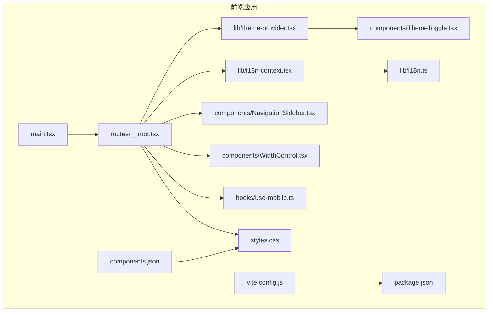
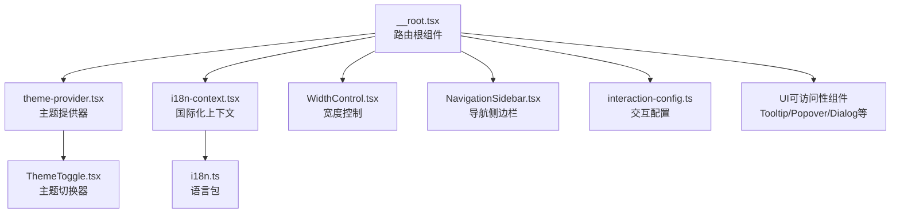
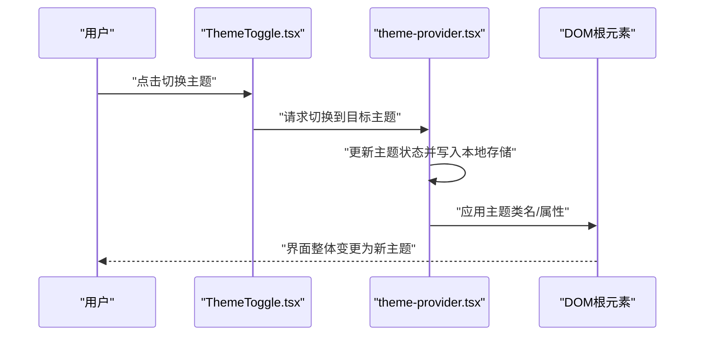
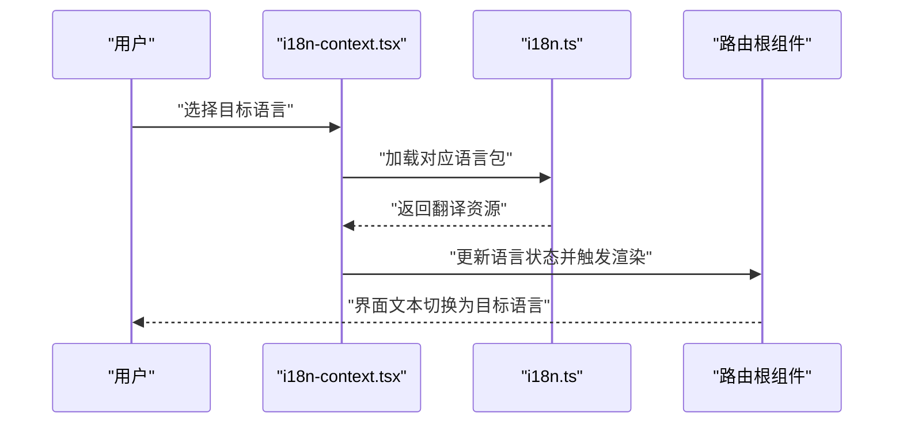
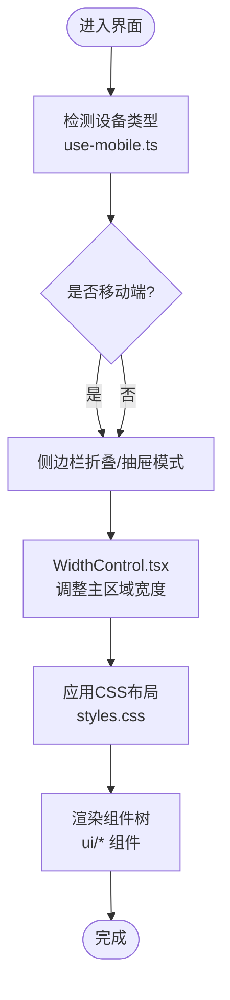
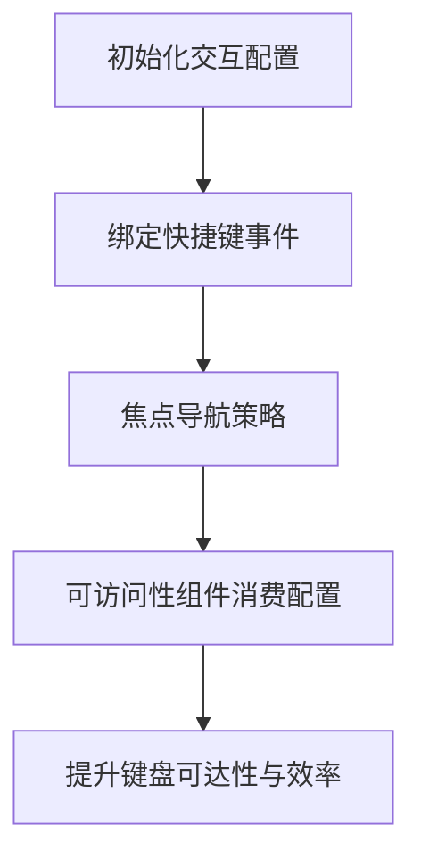
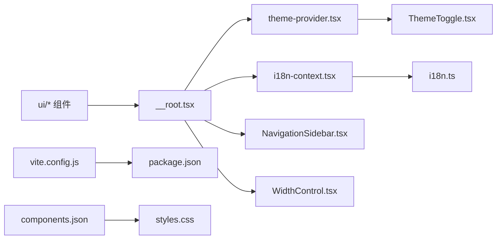

# 界面定制

<cite>
**本文引用的文件**
- [frontend/src/lib/theme-provider.tsx](file://frontend/src/lib/theme-provider.tsx)
- [frontend/src/components/ThemeToggle.tsx](file://frontend/src/components/ThemeToggle.tsx)
- [frontend/src/lib/i18n.ts](file://frontend/src/lib/i18n.ts)
- [frontend/src/lib/i18n-context.tsx](file://frontend/src/lib/i18n-context.tsx)
- [frontend/src/hooks/use-mobile.ts](file://frontend/src/hooks/use-mobile.ts)
- [frontend/src/components/WidthControl.tsx](file://frontend/src/components/WidthControl.tsx)
- [frontend/src/components/NavigationSidebar.tsx](file://frontend/src/components/NavigationSidebar.tsx)
- [frontend/src/routes/__root.tsx](file://frontend/src/routes/__root.tsx)
- [frontend/src/main.tsx](file://frontend/src/main.tsx)
- [frontend/src/styles.css](file://frontend/src/styles.css)
- [frontend/package.json](file://frontend/package.json)
- [frontend/vite.config.js](file://frontend/vite.config.js)
- [frontend/components.json](file://frontend/components.json)
- [frontend/src/lib/interaction-config.ts](file://frontend/src/lib/interaction-config.ts)
- [frontend/src/lib/utils.ts](file://frontend/src/lib/utils.ts)
- [frontend/src/components/ui/sidebar.tsx](file://frontend/src/components/ui/sidebar.tsx)
- [frontend/src/components/ui/select.tsx](file://frontend/src/components/ui/select.tsx)
- [frontend/src/components/ui/dropdown-menu.tsx](file://frontend/src/components/ui/dropdown-menu.tsx)
- [frontend/src/components/ui/button.tsx](file://frontend/src/components/ui/button.tsx)
- [frontend/src/components/ui/switch.tsx](file://frontend/src/components/ui/switch.tsx)
- [frontend/src/components/ui/input.tsx](file://frontend/src/components/ui/input.tsx)
- [frontend/src/components/ui/tabs.tsx](file://frontend/src/components/ui/tabs.tsx)
- [frontend/src/components/ui/dialog.tsx](file://frontend/src/components/ui/dialog.tsx)
- [frontend/src/components/ui/card.tsx](file://frontend/src/components/ui/card.tsx)
- [frontend/src/components/ui/scroll-area.tsx](file://frontend/src/components/ui/scroll-area.tsx)
- [frontend/src/components/ui/popover.tsx](file://frontend/src/components/ui/popover.tsx)
- [frontend/src/components/ui/tooltip.tsx](file://frontend/src/components/ui/tooltip.tsx)
- [frontend/src/components/ui/badge.tsx](file://frontend/src/components/ui/badge.tsx)
- [frontend/src/components/ui/alert-dialog.tsx](file://frontend/src/components/ui/alert-dialog.tsx)
- [frontend/src/components/ui/collapsible.tsx](file://frontend/src/components/ui/collapsible.tsx)
- [frontend/src/components/ui/progress.tsx](file://frontend/src/components/ui/progress.tsx)
- [frontend/src/components/ui/separator.tsx](file://frontend/src/components/ui/separator.tsx)
- [frontend/src/components/ui/sheet.tsx](file://frontend/src/components/ui/sheet.tsx)
- [frontend/src/components/ui/skeleton.tsx](file://frontend/src/components/ui/skeleton.tsx)
- [frontend/src/components/ui/textarea.tsx](file://frontend/src/components/ui/textarea.tsx)
- [frontend/src/components/ui/label.tsx](file://frontend/src/components/ui/label.tsx)
- [frontend/src/components/ui/image-preview.tsx](file://frontend/src/components/ui/image-preview.tsx)
- [frontend/src/components/ui/tabs.tsx](file://frontend/src/components/ui/tabs.tsx)
- [frontend/src/components/ui/scroll-area.tsx](file://frontend/src/components/ui/scroll-area.tsx)
- [frontend/src/components/ui/popover.tsx](file://frontend/src/components/ui/popover.tsx)
- [frontend/src/components/ui/tooltip.tsx](file://frontend/src/components/ui/tooltip.tsx)
- [frontend/src/components/ui/badge.tsx](file://frontend/src/components/ui/badge.tsx)
- [frontend/src/components/ui/alert-dialog.tsx](file://frontend/src/components/ui/alert-dialog.tsx)
- [frontend/src/components/ui/collapsible.tsx](file://frontend/src/components/ui/collapsible.tsx)
- [frontend/src/components/ui/progress.tsx](file://frontend/src/components/ui/progress.tsx)
- [frontend/src/components/ui/separator.tsx](file://frontend/src/components/ui/separator.tsx)
- [frontend/src/components/ui/sheet.tsx](file://frontend/src/components/ui/sheet.tsx)
- [frontend/src/components/ui/skeleton.tsx](file://frontend/src/components/ui/skeleton.tsx)
- [frontend/src/components/ui/textarea.tsx](file://frontend/src/components/ui/textarea.tsx)
- [frontend/src/components/ui/label.tsx](file://frontend/src/components/ui/label.tsx)
- [frontend/src/components/ui/image-preview.tsx](file://frontend/src/components/ui/image-preview.tsx)
</cite>

## 目录
1. [简介](#简介)
2. [项目结构](#项目结构)
3. [核心组件](#核心组件)
4. [架构总览](#架构总览)
5. [详细组件分析](#详细组件分析)
6. [依赖关系分析](#依赖关系分析)
7. [性能考虑](#性能考虑)
8. [故障排查指南](#故障排查指南)
9. [结论](#结论)
10. [附录](#附录)

## 简介
本指南聚焦于 AutoGLM-GUI 的界面定制能力，覆盖主题切换（深色/浅色）、语言设置（多语言支持）、布局与宽度控制、移动端适配、以及可访问性与交互配置。内容基于前端源码进行系统化梳理，帮助开发者与用户高效完成个性化配置与体验优化。

## 项目结构
界面定制相关代码主要集中在前端目录，围绕主题提供器、国际化上下文、UI 组件库与路由根组件展开；同时通过样式与构建配置支撑响应式与跨平台体验。

图表来源
- [frontend/src/main.tsx](file://frontend/src/main.tsx)
- [frontend/src/routes/__root.tsx](file://frontend/src/routes/__root.tsx)
- [frontend/src/lib/theme-provider.tsx](file://frontend/src/lib/theme-provider.tsx)
- [frontend/src/components/ThemeToggle.tsx](file://frontend/src/components/ThemeToggle.tsx)
- [frontend/src/lib/i18n.ts](file://frontend/src/lib/i18n.ts)
- [frontend/src/lib/i18n-context.tsx](file://frontend/src/lib/i18n-context.tsx)
- [frontend/src/hooks/use-mobile.ts](file://frontend/src/hooks/use-mobile.ts)
- [frontend/src/components/WidthControl.tsx](file://frontend/src/components/WidthControl.tsx)
- [frontend/src/components/NavigationSidebar.tsx](file://frontend/src/components/NavigationSidebar.tsx)
- [frontend/src/styles.css](file://frontend/src/styles.css)
- [frontend/vite.config.js](file://frontend/vite.config.js)
- [frontend/package.json](file://frontend/package.json)
- [frontend/components.json](file://frontend/components.json)

章节来源
- [frontend/src/main.tsx](file://frontend/src/main.tsx)
- [frontend/src/routes/__root.tsx](file://frontend/src/routes/__root.tsx)

## 核心组件
- 主题提供器与切换器：通过主题提供器管理全局主题状态，切换器提供 UI 控件以在浅色/深色之间切换。
- 国际化上下文与语言包：国际化上下文封装语言选择与资源加载，语言包负责翻译文本。
- 响应式与布局控制：移动端检测 Hook、宽度控制组件、导航侧边栏与 UI 组件库共同实现布局优化。
- 可访问性与交互配置：交互配置模块提供键盘导航与快捷键策略，辅助组件提供可访问性支持。

章节来源
- [frontend/src/lib/theme-provider.tsx](file://frontend/src/lib/theme-provider.tsx)
- [frontend/src/components/ThemeToggle.tsx](file://frontend/src/components/ThemeToggle.tsx)
- [frontend/src/lib/i18n.ts](file://frontend/src/lib/i18n.ts)
- [frontend/src/lib/i18n-context.tsx](file://frontend/src/lib/i18n-context.tsx)
- [frontend/src/hooks/use-mobile.ts](file://frontend/src/hooks/use-mobile.ts)
- [frontend/src/components/WidthControl.tsx](file://frontend/src/components/WidthControl.tsx)
- [frontend/src/components/NavigationSidebar.tsx](file://frontend/src/components/NavigationSidebar.tsx)
- [frontend/src/lib/interaction-config.ts](file://frontend/src/lib/interaction-config.ts)

## 架构总览
界面定制采用“提供器 + 上下文 + 组合式 Hook”的分层架构：
- 提供器层：主题提供器、国际化上下文负责状态与资源管理。
- 视图层：切换器、宽度控制、侧边栏等组件消费状态并渲染 UI。
- 配置层：Vite 与组件库配置、样式表支撑响应式与主题变量。
- 交互层：交互配置与可访问性组件提升键盘导航与无障碍体验。

图表来源
- [frontend/src/lib/theme-provider.tsx](file://frontend/src/lib/theme-provider.tsx)
- [frontend/src/components/ThemeToggle.tsx](file://frontend/src/components/ThemeToggle.tsx)
- [frontend/src/lib/i18n-context.tsx](file://frontend/src/lib/i18n-context.tsx)
- [frontend/src/lib/i18n.ts](file://frontend/src/lib/i18n.ts)
- [frontend/src/routes/__root.tsx](file://frontend/src/routes/__root.tsx)
- [frontend/src/components/WidthControl.tsx](file://frontend/src/components/WidthControl.tsx)
- [frontend/src/components/NavigationSidebar.tsx](file://frontend/src/components/NavigationSidebar.tsx)
- [frontend/src/lib/interaction-config.ts](file://frontend/src/lib/interaction-config.ts)

## 详细组件分析

### 主题切换与深色/浅色模式
- 主题提供器：集中管理主题状态与持久化存储，确保页面刷新后仍保持用户选择。
- 主题切换器：提供按钮或开关控件，调用提供器接口切换主题，并同步更新 DOM 根元素的类名或属性以便样式生效。
- 效果：切换时全局应用颜色变量、阴影与边框样式，保证所有组件一致的主题风格。

图表来源
- [frontend/src/components/ThemeToggle.tsx](file://frontend/src/components/ThemeToggle.tsx)
- [frontend/src/lib/theme-provider.tsx](file://frontend/src/lib/theme-provider.tsx)

章节来源
- [frontend/src/lib/theme-provider.tsx](file://frontend/src/lib/theme-provider.tsx)
- [frontend/src/components/ThemeToggle.tsx](file://frontend/src/components/ThemeToggle.tsx)

### 多语言支持与语言切换
- 国际化上下文：封装语言选择逻辑与资源加载，向子组件提供翻译函数与当前语言信息。
- 语言包：按语言拆分资源文件，切换语言时动态加载对应包并更新界面文本。
- 切换流程：用户在设置中选择语言，上下文更新状态并触发重渲染，确保所有文本组件显示为目标语言。

图表来源
- [frontend/src/lib/i18n-context.tsx](file://frontend/src/lib/i18n-context.tsx)
- [frontend/src/lib/i18n.ts](file://frontend/src/lib/i18n.ts)
- [frontend/src/routes/__root.tsx](file://frontend/src/routes/__root.tsx)

章节来源
- [frontend/src/lib/i18n.ts](file://frontend/src/lib/i18n.ts)
- [frontend/src/lib/i18n-context.tsx](file://frontend/src/lib/i18n-context.tsx)
- [frontend/src/routes/__root.tsx](file://frontend/src/routes/__root.tsx)

### 布局调整与宽度控制
- 宽度控制组件：允许用户拖拽或输入数值调整主区域宽度，结合 CSS Grid 或 Flex 布局实现响应式分割面板。
- 导航侧边栏：在桌面端固定宽度，在移动端通过抽屉或折叠菜单适配小屏。
- UI 组件库：使用统一的组件集合（如卡片、对话框、滚动区域、标签页等）保证布局一致性与可维护性。

图表来源
- [frontend/src/hooks/use-mobile.ts](file://frontend/src/hooks/use-mobile.ts)
- [frontend/src/components/WidthControl.tsx](file://frontend/src/components/WidthControl.tsx)
- [frontend/src/components/NavigationSidebar.tsx](file://frontend/src/components/NavigationSidebar.tsx)
- [frontend/src/styles.css](file://frontend/src/styles.css)
- [frontend/src/components/ui/*.tsx](file://frontend/src/components/ui/sidebar.tsx)

章节来源
- [frontend/src/hooks/use-mobile.ts](file://frontend/src/hooks/use-mobile.ts)
- [frontend/src/components/WidthControl.tsx](file://frontend/src/components/WidthControl.tsx)
- [frontend/src/components/NavigationSidebar.tsx](file://frontend/src/components/NavigationSidebar.tsx)
- [frontend/src/styles.css](file://frontend/src/styles.css)

### 快捷键配置与键盘导航
- 交互配置：集中定义键盘快捷键与导航策略，避免硬编码，便于扩展与维护。
- 可访问性组件：提供 Tooltip、Popover、Dialog 等组件，配合键盘事件实现焦点管理与无障碍操作。
- 最佳实践：为常用操作绑定明确的快捷键组合，确保在不同组件间具有一致的导航行为。

图表来源
- [frontend/src/lib/interaction-config.ts](file://frontend/src/lib/interaction-config.ts)
- [frontend/src/components/ui/tooltip.tsx](file://frontend/src/components/ui/tooltip.tsx)
- [frontend/src/components/ui/popover.tsx](file://frontend/src/components/ui/popover.tsx)
- [frontend/src/components/ui/dialog.tsx](file://frontend/src/components/ui/dialog.tsx)

章节来源
- [frontend/src/lib/interaction-config.ts](file://frontend/src/lib/interaction-config.ts)
- [frontend/src/lib/utils.ts](file://frontend/src/lib/utils.ts)

### 响应式设计与移动端适配
- 移动端检测：通过 Hook 检测屏幕尺寸与设备类型，动态切换布局与交互方式。
- 样式与组件：结合 CSS 媒体查询与组件库断点，实现从移动端到桌面端的平滑过渡。
- 构建与配置：Vite 与组件库配置确保在不同设备上获得一致的渲染与交互体验。

章节来源
- [frontend/src/hooks/use-mobile.ts](file://frontend/src/hooks/use-mobile.ts)
- [frontend/src/styles.css](file://frontend/src/styles.css)
- [frontend/vite.config.js](file://frontend/vite.config.js)
- [frontend/components.json](file://frontend/components.json)

## 依赖关系分析
- 主题与国际化：主题提供器与国际化上下文均在路由根组件中注入，形成全局状态入口。
- UI 组件：各业务组件复用 UI 组件库中的基础组件，降低耦合并提升一致性。
- 构建与样式：Vite 负责开发与打包，组件库配置与样式表共同决定视觉与交互表现。

图表来源
- [frontend/src/routes/__root.tsx](file://frontend/src/routes/__root.tsx)
- [frontend/src/lib/theme-provider.tsx](file://frontend/src/lib/theme-provider.tsx)
- [frontend/src/lib/i18n-context.tsx](file://frontend/src/lib/i18n-context.tsx)
- [frontend/src/lib/i18n.ts](file://frontend/src/lib/i18n.ts)
- [frontend/src/components/ThemeToggle.tsx](file://frontend/src/components/ThemeToggle.tsx)
- [frontend/src/components/NavigationSidebar.tsx](file://frontend/src/components/NavigationSidebar.tsx)
- [frontend/src/components/WidthControl.tsx](file://frontend/src/components/WidthControl.tsx)
- [frontend/src/components/ui/*.tsx](file://frontend/src/components/ui/sidebar.tsx)
- [frontend/vite.config.js](file://frontend/vite.config.js)
- [frontend/package.json](file://frontend/package.json)
- [frontend/components.json](file://frontend/components.json)
- [frontend/src/styles.css](file://frontend/src/styles.css)

章节来源
- [frontend/src/routes/__root.tsx](file://frontend/src/routes/__root.tsx)
- [frontend/src/lib/theme-provider.tsx](file://frontend/src/lib/theme-provider.tsx)
- [frontend/src/lib/i18n-context.tsx](file://frontend/src/lib/i18n-context.tsx)
- [frontend/src/lib/i18n.ts](file://frontend/src/lib/i18n.ts)
- [frontend/src/components/ThemeToggle.tsx](file://frontend/src/components/ThemeToggle.tsx)
- [frontend/src/components/NavigationSidebar.tsx](file://frontend/src/components/NavigationSidebar.tsx)
- [frontend/src/components/WidthControl.tsx](file://frontend/src/components/WidthControl.tsx)
- [frontend/src/components/ui/*.tsx](file://frontend/src/components/ui/sidebar.tsx)
- [frontend/vite.config.js](file://frontend/vite.config.js)
- [frontend/package.json](file://frontend/package.json)
- [frontend/components.json](file://frontend/components.json)
- [frontend/src/styles.css](file://frontend/src/styles.css)

## 性能考虑
- 主题与语言切换：采用轻量的状态更新与最小化重渲染，避免不必要的全量刷新。
- 响应式布局：合理使用媒体查询与断点，减少复杂计算与频繁重排。
- 组件复用：通过统一的 UI 组件库降低重复实现，提升构建与运行效率。
- 构建优化：Vite 的按需加载与 Tree Shaking 有助于减小包体积与提升启动速度。

## 故障排查指南
- 主题切换无效：检查主题提供器的状态写入与 DOM 类名/属性应用逻辑，确认本地存储权限与回退机制。
- 语言切换失败：验证国际化上下文的语言包加载路径与错误处理，确保资源文件完整且可访问。
- 布局异常：核对宽度控制与侧边栏的 CSS 布局规则，检查移动端检测 Hook 的断点与条件分支。
- 键盘导航问题：审查交互配置的事件绑定与焦点管理，确保可访问性组件的可见性与层级正确。
- 样式冲突：对比组件库样式与自定义样式优先级，避免覆盖关键变量导致渲染异常。

章节来源
- [frontend/src/lib/theme-provider.tsx](file://frontend/src/lib/theme-provider.tsx)
- [frontend/src/lib/i18n-context.tsx](file://frontend/src/lib/i18n-context.tsx)
- [frontend/src/components/WidthControl.tsx](file://frontend/src/components/WidthControl.tsx)
- [frontend/src/lib/interaction-config.ts](file://frontend/src/lib/interaction-config.ts)
- [frontend/src/styles.css](file://frontend/src/styles.css)

## 结论
AutoGLM-GUI 的界面定制体系以提供器与上下文为核心，结合 UI 组件库与响应式配置，实现了主题、语言、布局与交互的灵活定制。遵循本文档的最佳实践与排查建议，可在保证一致性的前提下，快速完成个性化配置并优化用户体验。

## 附录
- 快速参考清单
  - 主题：通过主题切换器在浅色/深色模式间切换，确认提供器状态与本地存储同步。
  - 语言：在国际化上下文中选择目标语言，验证语言包加载与文本渲染。
  - 布局：使用宽度控制调整主区域宽度，移动端启用侧边栏折叠或抽屉模式。
  - 键盘：为常用操作绑定快捷键，确保可访问性组件的焦点与可见性。
  - 样式：遵循组件库断点与优先级，避免覆盖关键变量导致异常。