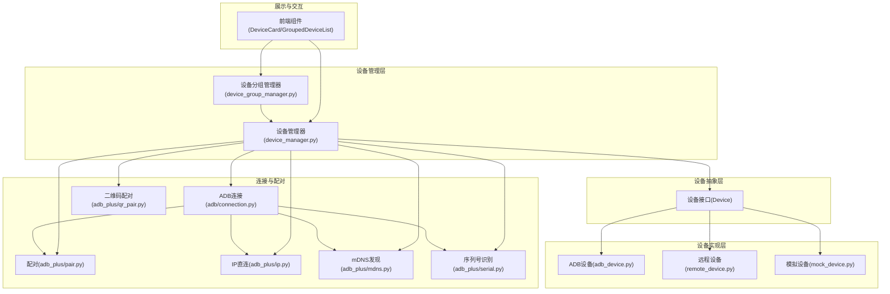
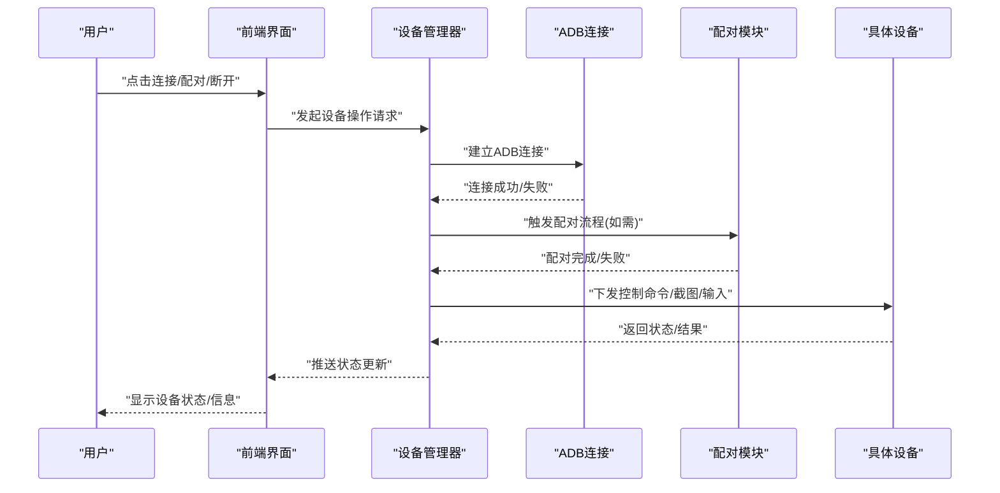
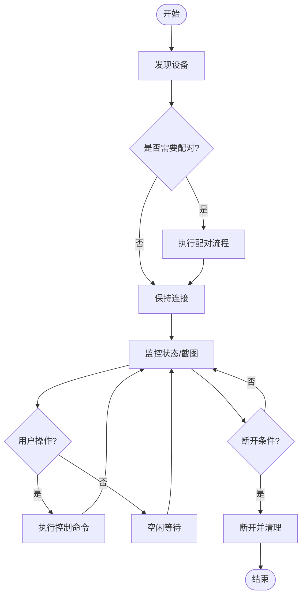
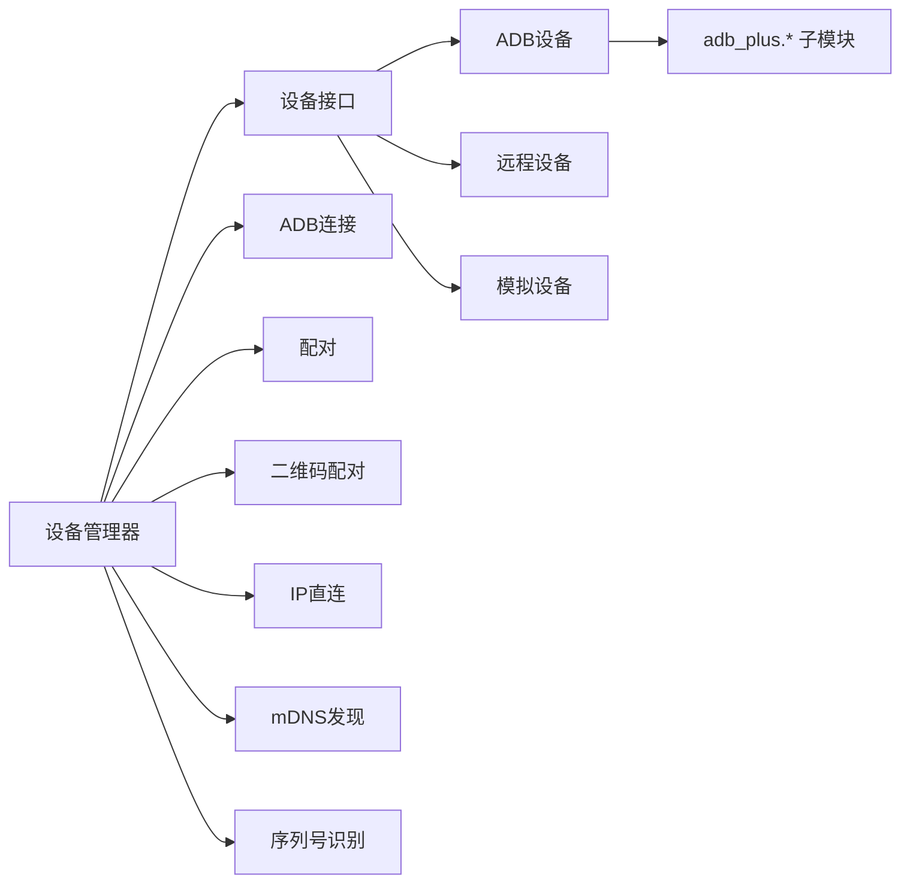

# 设备管理

<cite>
**本文引用的文件**
- [device_manager.py](file://AutoGLM_GUI/device_manager.py)
- [device_group_manager.py](file://AutoGLM_GUI/device_group_manager.py)
- [adb_device.py](file://AutoGLM_GUI/devices/adb_device.py)
- [remote_device.py](file://AutoGLM_GUI/devices/remote_device.py)
- [mock_device.py](file://AutoGLM_GUI/devices/mock_device.py)
- [adb/connection.py](file://AutoGLM_GUI/adb/connection.py)
- [adb/device.py](file://AutoGLM_GUI/adb/device.py)
- [adb_plus/pair.py](file://AutoGLM_GUI/adb_plus/pair.py)
- [adb_plus/ip.py](file://AutoGLM_GUI/adb_plus/ip.py)
- [adb_plus/mdns.py](file://AutoGLM_GUI/adb_plus/mdns.py)
- [adb_plus/serial.py](file://AutoGLM_GUI/adb_plus/serial.py)
- [adb_plus/qr_pair.py](file://AutoGLM_GUI/adb_plus/qr_pair.py)
- [adb_plus/display.py](file://AutoGLM_GUI/adb_plus/display.py)
- [adb_plus/touch.py](file://AutoGLM_GUI/adb_plus/touch.py)
- [adb_plus/keyboard_installer.py](file://AutoGLM_GUI/adb_plus/keyboard_installer.py)
- [adb_plus/version.py](file://AutoGLM_GUI/adb_plus/version.py)
- [adb_plus/screenshot.py](file://AutoGLM_GUI/adb_plus/screenshot.py)
- [adb_plus/device.py](file://AutoGLM_GUI/adb_plus/device.py)
- [adb_plus/keyboard_installer.py](file://AutoGLM_GUI/adb_plus/keyboard_installer.py)
- [adb_plus/keyboard_installer.py](file://AutoGLM_GUI/adb_plus/keyboard_installer.py)
- [adb_plus/keyboard_installer.py](file://AutoGLM_GUI/adb_plus/keyboard_installer.py)
- [adb_plus/keyboard_installer.py](file://AutoGLM_GUI/adb_plus/keyboard_installer.py)
- [adb_plus/keyboard_installer.py](file://AutoGLM_GUI/adb_plus/keyboard_installer.py)
- [adb_plus/keyboard_installer.py](file://AutoGLM_GUI/adb_plus/keyboard_installer.py)
- [adb_plus/keyboard_installer.py](file://AutoGLM_GUI/adb_plus/keyboard_installer.py)
- [adb_plus/keyboard_installer.py](file://AutoGLM_GUI/adb_plus/keyboard_installer.py)
- [adb_plus/keyboard_installer.py](file://AutoGLM_GUI/adb_plus/keyboard_installer.py)
- [adb_plus/keyboard_installer.py](file://AutoGLM_GUI/adb_plus/keyboard_installer.py)
- [adb_plus/keyboard_installer.py](file://AutoGLM_GUI/adb_plus/keyboard_installer.py)
- [adb_plus/keyboard_installer.py](file://AutoGLM_GUI/adb_plus/keyboard_installer.py)
- [adb_plus/keyboard_installer.py](file://AutoGLM_GUI/adb_plus/keyboard_installer.py)
- [adb_plus/keyboard_installer.py](file://AutoGLM_GUI/adb_plus/keyboard_installer.py)
- [adb_plus/keyboard_installer.py](file://AutoGLM_GUI/adb_plus/keyboard_installer.py)
- [adb_plus/keyboard_installer.py](file://AutoGLM_GUI/adb_plus/keyboard_installer.py)
- [adb_plus/keyboard_installer.py](file://AutoGLM_GUI/adb_plus/keyboard_installer.py)
- [adb_plus/keyboard_installer.py](file://AutoGLM_GUI/adb_plus/keyboard_installer.py)
- [adb_plus/keyboard_installer.py](file://AutoGLM_GUI/adb_plus/keyboard_installer.py)
- [adb_plus/keyboard_installer.py](file://AutoGLM_GUI/adb_plus/keyboard_installer.py)
-......
</cite>

## 目录
1. [简介](#简介)
2. [项目结构](#项目结构)
3. [核心组件](#核心组件)
4. [架构总览](#架构总览)
5. [详细组件分析](#详细组件分析)
6. [依赖关系分析](#依赖关系分析)
7. [性能考虑](#性能考虑)
8. [故障排除指南](#故障排除指南)
9. [结论](#结论)
10. [附录](#附录)

## 简介
本章节面向AutoGLM-GUI的设备管理功能，系统性阐述设备发现、连接、配置与监控的完整流程。文档覆盖USB连接、WiFi连接、远程连接等多种连接方式的设置步骤；解释设备分组管理、设备状态监控与设备信息查看；提供设备配对、断开连接、设备切换等操作指南；并给出连接故障排除与多设备同时管理的最佳实践。

## 项目结构
AutoGLM-GUI围绕“设备管理”构建了清晰的分层架构：
- 设备抽象层：统一设备接口，屏蔽ADB、远程设备、模拟设备差异
- 设备实现层：ADB设备、远程设备、模拟设备的具体实现
- 设备管理器：负责设备生命周期、连接状态、分组与元数据管理
- 连接与配对：基于ADB的连接建立、配对（含二维码）、网络发现与IP直连
- 展示与交互：前端组件负责设备卡片、分组列表、监控面板与操作入口

图表来源
- [device_manager.py](file://AutoGLM_GUI/device_manager.py)
- [device_group_manager.py](file://AutoGLM_GUI/device_group_manager.py)
- [adb_device.py](file://AutoGLM_GUI/devices/adb_device.py)
- [remote_device.py](file://AutoGLM_GUI/devices/remote_device.py)
- [mock_device.py](file://AutoGLM_GUI/devices/mock_device.py)
- [adb/connection.py](file://AutoGLM_GUI/adb/connection.py)
- [adb_plus/pair.py](file://AutoGLM_GUI/adb_plus/pair.py)
- [adb_plus/qr_pair.py](file://AutoGLM_GUI/adb_plus/qr_pair.py)
- [adb_plus/ip.py](file://AutoGLM_GUI/adb_plus/ip.py)
- [adb_plus/mdns.py](file://AutoGLM_GUI/adb_plus/mdns.py)
- [adb_plus/serial.py](file://AutoGLM_GUI/adb_plus/serial.py)

章节来源
- [device_manager.py](file://AutoGLM_GUI/device_manager.py)
- [device_group_manager.py](file://AutoGLM_GUI/device_group_manager.py)
- [adb_device.py](file://AutoGLM_GUI/devices/adb_device.py)
- [remote_device.py](file://AutoGLM_GUI/devices/remote_device.py)
- [mock_device.py](file://AutoGLM_GUI/devices/mock_device.py)

## 核心组件
- 设备管理器：负责设备注册、连接、断开、状态更新、元数据维护与事件分发
- 设备分组管理器：负责设备分组的创建、删除、成员变更与持久化
- 设备实现：ADB设备、远程设备、模拟设备，均实现统一设备接口
- 连接与配对：ADB连接、IP直连、mDNS发现、二维码配对、序列号识别
- 前端交互：设备卡片、分组列表、监控面板、操作按钮

章节来源
- [device_manager.py](file://AutoGLM_GUI/device_manager.py)
- [device_group_manager.py](file://AutoGLM_GUI/device_group_manager.py)
- [adb_device.py](file://AutoGLM_GUI/devices/adb_device.py)
- [remote_device.py](file://AutoGLM_GUI/devices/remote_device.py)
- [mock_device.py](file://AutoGLM_GUI/devices/mock_device.py)

## 架构总览
下图展示了从用户操作到设备执行命令的端到端流程，包括设备发现、连接、配对、状态监控与控制命令下发。

图表来源
- [device_manager.py](file://AutoGLM_GUI/device_manager.py)
- [adb/connection.py](file://AutoGLM_GUI/adb/connection.py)
- [adb_plus/pair.py](file://AutoGLM_GUI/adb_plus/pair.py)
- [adb_plus/qr_pair.py](file://AutoGLM_GUI/adb_plus/qr_pair.py)

## 详细组件分析

### 设备管理器（device_manager.py）
职责与能力
- 设备注册与注销：动态添加/移除设备实例
- 连接生命周期管理：建立、保持、断开连接
- 状态监控：设备在线、离线、忙碌/空闲、错误状态
- 元数据管理：设备名称、型号、序列号、连接参数等
- 事件分发：设备状态变化、错误事件、截图/输入结果
- 多设备并发：支持多设备并行任务调度与隔离

关键流程
- 设备发现：通过ADB、mDNS、IP直连等方式发现设备
- 首次连接：建立ADB连接，必要时触发配对
- 后续使用：复用连接，按需刷新状态与截图
- 断开清理：释放资源，通知UI与上层服务

图表来源
- [device_manager.py](file://AutoGLM_GUI/device_manager.py)
- [adb_plus/pair.py](file://AutoGLM_GUI/adb_plus/pair.py)
- [adb_plus/qr_pair.py](file://AutoGLM_GUI/adb_plus/qr_pair.py)

章节来源
- [device_manager.py](file://AutoGLM_GUI/device_manager.py)

### 设备分组管理器（device_group_manager.py）
职责与能力
- 分组CRUD：创建、删除、重命名、查询
- 成员管理：添加/移除设备、批量操作
- 持久化：分组配置写入存储
- 查询优化：按分组快速筛选设备集合

最佳实践
- 将相似用途或同场景设备归组，便于批量调度
- 使用稳定分组名，避免频繁变更导致任务配置失效

章节来源
- [device_group_manager.py](file://AutoGLM_GUI/device_group_manager.py)

### 设备实现层

#### ADB设备（adb_device.py）
- 统一设备接口：提供连接、截图、输入、控制等方法
- ADB能力封装：调用adb子模块进行配对、IP直连、显示/触摸/键盘安装等
- 错误处理：捕获ADB异常，转换为设备层错误码

章节来源
- [adb_device.py](file://AutoGLM_GUI/devices/adb_device.py)
- [adb_plus/pair.py](file://AutoGLM_GUI/adb_plus/pair.py)
- [adb_plus/ip.py](file://AutoGLM_GUI/adb_plus/ip.py)
- [adb_plus/display.py](file://AutoGLM_GUI/adb_plus/display.py)
- [adb_plus/touch.py](file://AutoGLM_GUI/adb_plus/touch.py)
- [adb_plus/keyboard_installer.py](file://AutoGLM_GUI/adb_plus/keyboard_installer.py)
- [adb_plus/version.py](file://AutoGLM_GUI/adb_plus/version.py)
- [adb_plus/screenshot.py](file://AutoGLM_GUI/adb_plus/screenshot.py)

#### 远程设备（remote_device.py）
- 远程协议适配：通过网络协议与远端设备通信
- 状态代理：转发远端状态到本地管理器
- 能力映射：将本地控制命令映射为远端可执行动作

章节来源
- [remote_device.py](file://AutoGLM_GUI/devices/remote_device.py)

#### 模拟设备（mock_device.py）
- 测试与演示：用于无真实设备环境下的功能验证
- 行为模拟：模拟连接、截图、输入等行为

章节来源
- [mock_device.py](file://AutoGLM_GUI/devices/mock_device.py)

### 连接与配对

#### ADB连接（adb/connection.py）
- 连接建立：通过adb工具建立USB/WiFi连接
- 端口管理：自动选择可用端口，处理端口冲突
- 心跳与保活：维持长连接，检测断线并自动重连

章节来源
- [adb/connection.py](file://AutoGLM_GUI/adb/connection.py)

#### 配对（adb_plus/pair.py）
- 首次连接保护：在未配对设备上首次连接时触发配对
- 安全校验：生成并验证配对密钥
- 自动化流程：静默配对与交互式配对双模式

章节来源
- [adb_plus/pair.py](file://AutoGLM_GUI/adb_plus/pair.py)

#### 二维码配对（adb_plus/qr_pair.py）
- 扫码配对：通过二维码简化首次配对流程
- 传输安全：使用一次性令牌与加密通道
- 用户友好：降低配对门槛

章节来源
- [adb_plus/qr_pair.py](file://AutoGLM_GUI/adb_plus/qr_pair.py)

#### IP直连（adb_plus/ip.py）
- WiFi直连：通过设备IP与端口直接建立ADB连接
- 网络要求：设备与主机在同一网段或可路由
- 自动端口探测：自动选择可用端口

章节来源
- [adb_plus/ip.py](file://AutoGLM_GUI/adb_plus/ip.py)

#### mDNS发现（adb_plus/mdns.py）
- 设备发现：通过局域网广播发现设备
- 服务解析：解析设备服务记录，获取IP与端口
- 自动连接：发现后自动尝试建立连接

章节来源
- [adb_plus/mdns.py](file://AutoGLM_GUI/adb_plus/mdns.py)

#### 序列号识别（adb_plus/serial.py）
- 设备标识：通过序列号唯一标识设备
- 冲突处理：序列号冲突时提示用户干预
- 缓存策略：缓存已知设备信息，提升后续连接速度

章节来源
- [adb_plus/serial.py](file://AutoGLM_GUI/adb_plus/serial.py)

### 设备状态监控与信息查看
- 状态字段：在线/离线、忙碌/空闲、错误类型、连接方式、分辨率、电池状态等
- 实时更新：定时轮询与事件驱动结合
- 历史记录：保存最近状态变化与错误日志
- 可视化：前端以卡片形式展示设备状态与关键信息

章节来源
- [device_manager.py](file://AutoGLM_GUI/device_manager.py)
- [adb_plus/screenshot.py](file://AutoGLM_GUI/adb_plus/screenshot.py)
- [adb_plus/display.py](file://AutoGLM_GUI/adb_plus/display.py)

### 设备切换与操作
- 切换设备：在多个设备间切换当前操作目标
- 批量操作：对分组内设备执行相同操作
- 断开连接：主动断开设备连接并释放资源
- 设备信息查看：查看设备型号、序列号、系统版本、分辨率等

章节来源
- [device_manager.py](file://AutoGLM_GUI/device_manager.py)
- [device_group_manager.py](file://AutoGLM_GUI/device_group_manager.py)

## 依赖关系分析
- 设备管理器依赖设备实现层与连接/配对模块
- 设备实现层依赖adb子模块（配对、IP直连、mDNS、序列号、显示、触摸、键盘安装、版本、截图）
- 前端组件依赖设备管理器与分组管理器提供的状态与事件

图表来源
- [device_manager.py](file://AutoGLM_GUI/device_manager.py)
- [adb_device.py](file://AutoGLM_GUI/devices/adb_device.py)
- [adb_plus/pair.py](file://AutoGLM_GUI/adb_plus/pair.py)
- [adb_plus/qr_pair.py](file://AutoGLM_GUI/adb_plus/qr_pair.py)
- [adb_plus/ip.py](file://AutoGLM_GUI/adb_plus/ip.py)
- [adb_plus/mdns.py](file://AutoGLM_GUI/adb_plus/mdns.py)
- [adb_plus/serial.py](file://AutoGLM_GUI/adb_plus/serial.py)

章节来源
- [device_manager.py](file://AutoGLM_GUI/device_manager.py)
- [adb_device.py](file://AutoGLM_GUI/devices/adb_device.py)

## 性能考虑
- 连接池与复用：尽量复用ADB连接，减少握手开销
- 轮询节流：状态轮询与截图采集应设置合理间隔，避免占用过多带宽与CPU
- 并发调度：多设备任务采用队列与优先级调度，避免资源争用
- 缓存策略：序列号、设备信息、截图结果应设置缓存与失效策略
- 网络优化：WiFi直连建议使用有线或稳定无线环境，降低丢包率

## 故障排除指南
常见问题与解决步骤
- 无法发现设备
  - 检查USB调试与授权：确保设备已启用开发者选项与USB调试，并完成首次授权
  - 检查mDNS服务：确认局域网内mDNS服务正常，防火墙未阻断
  - 检查IP直连：确认设备与主机在同一网段，端口未被占用
- 连接失败或频繁断开
  - 重启ADB服务：在设备管理器中触发ADB服务重启
  - 更换连接方式：从USB切换到WiFi直连，或反之
  - 检查网络稳定性：改善无线信号或改用有线连接
- 首次连接需配对
  - 触发配对流程：在设备管理器中执行配对操作
  - 使用二维码配对：扫描设备上的二维码完成配对
- 设备卡顿或延迟高
  - 降低截图频率与分辨率：在设备设置中调整截图参数
  - 关闭不必要的后台应用：释放设备与主机资源
- 多设备管理异常
  - 限制并发数量：根据设备性能与网络状况控制同时在线设备数
  - 使用分组隔离：将不同任务类型的设备分组，避免互相干扰

章节来源
- [device_manager.py](file://AutoGLM_GUI/device_manager.py)
- [adb_plus/pair.py](file://AutoGLM_GUI/adb_plus/pair.py)
- [adb_plus/qr_pair.py](file://AutoGLM_GUI/adb_plus/qr_pair.py)
- [adb_plus/ip.py](file://AutoGLM_GUI/adb_plus/ip.py)
- [adb_plus/mdns.py](file://AutoGLM_GUI/adb_plus/mdns.py)

## 结论
AutoGLM-GUI的设备管理功能通过清晰的分层设计与模块化实现，提供了从设备发现、连接、配对到监控与控制的完整能力。结合分组管理与多设备并发调度，能够满足复杂场景下的自动化需求。建议在实际部署中遵循性能与故障排除指南，确保稳定高效的设备管理体验。

## 附录
- 快速操作清单
  - 发现设备：点击“刷新设备列表”，等待mDNS/IP直连扫描完成
  - 首次连接：若提示未配对，执行“配对”或“二维码配对”
  - 建立连接：选择设备后点击“连接”，等待连接建立
  - 查看信息：在设备卡片中查看设备型号、序列号、分辨率等
  - 切换设备：在设备列表中选择目标设备
  - 断开连接：点击“断开连接”，释放资源
  - 分组管理：创建分组，将设备加入相应分组，便于批量操作
  - 多设备并发：根据设备性能与网络状况，控制同时在线设备数量