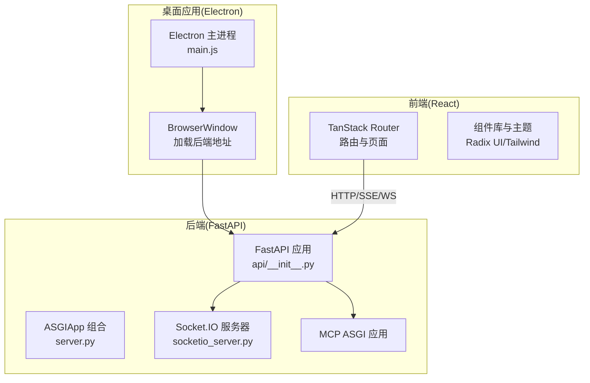
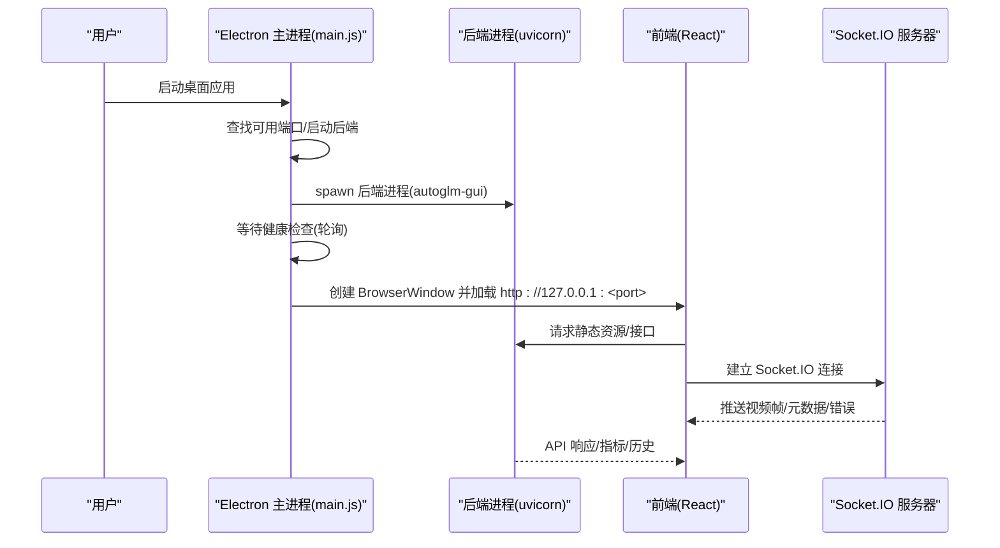
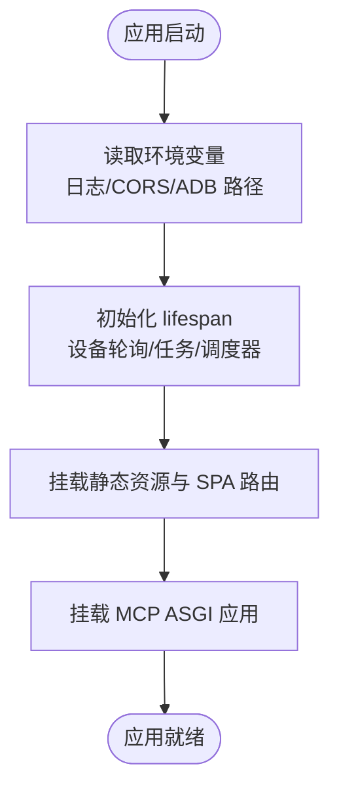
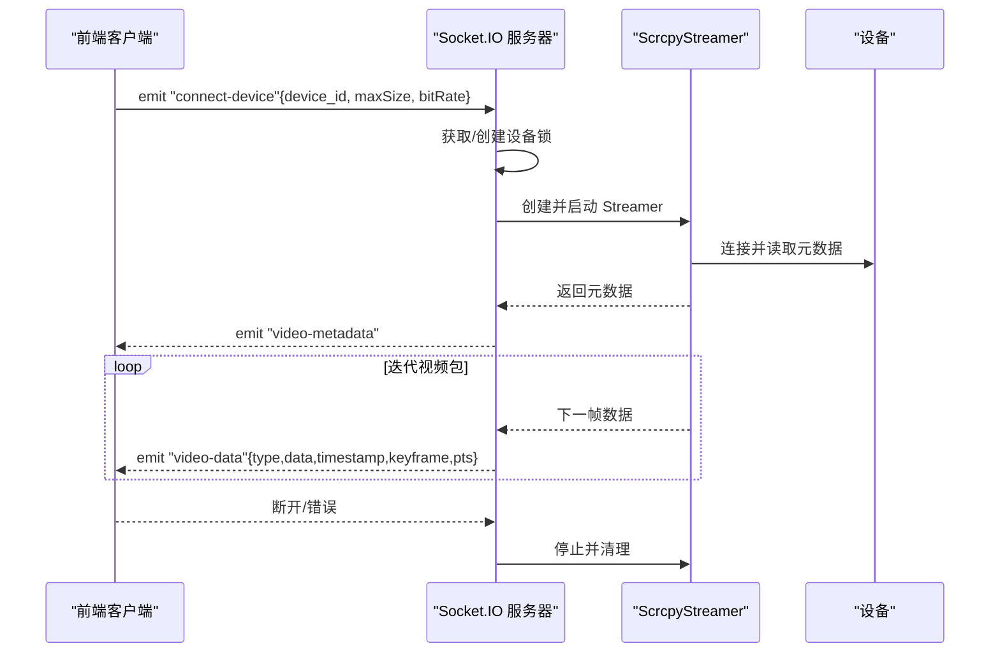
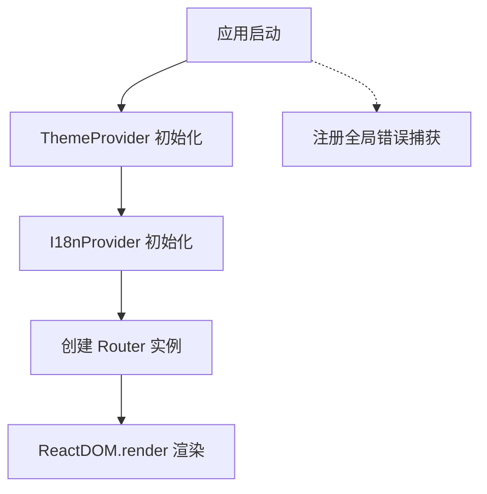
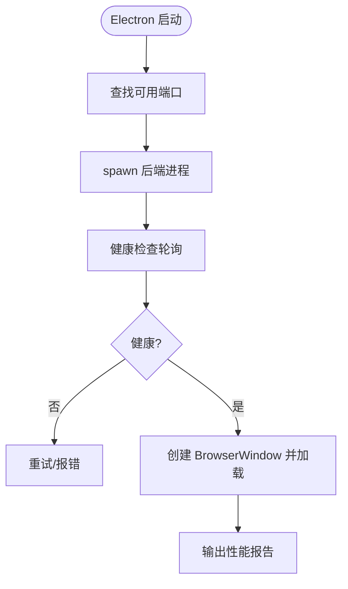
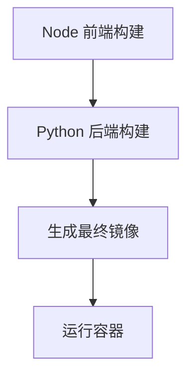
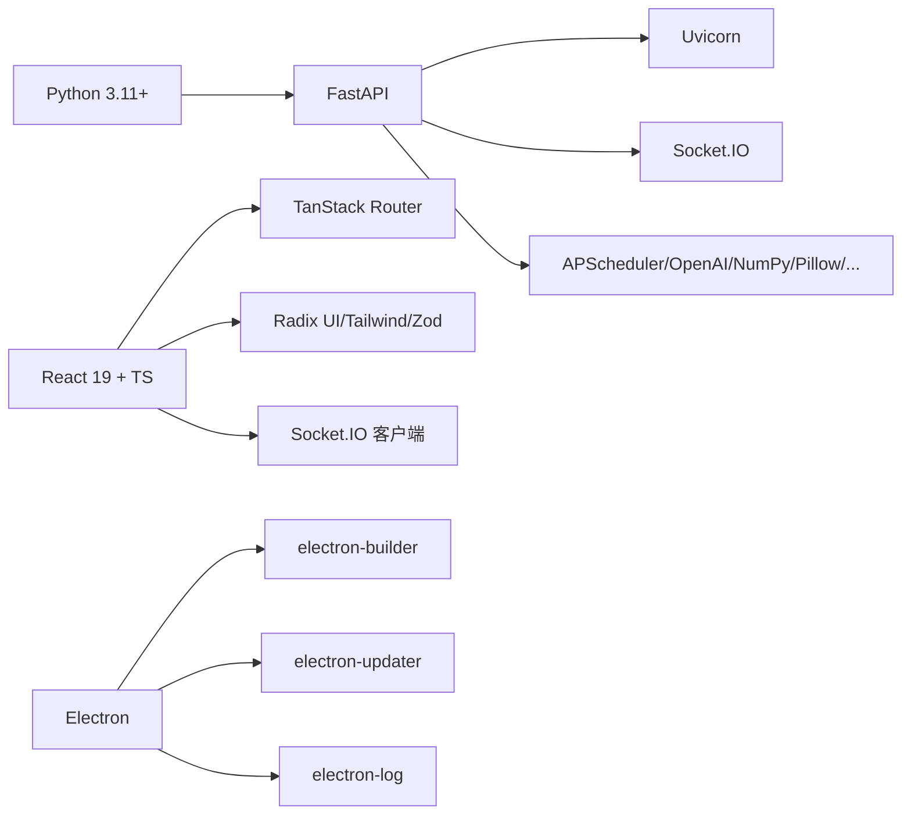

# 技术栈与选型

<cite>
**本文引用的文件**
- [main.py](file://main.py)
- [pyproject.toml](file://pyproject.toml)
- [Dockerfile](file://Dockerfile)
- [frontend/package.json](file://frontend/package.json)
- [electron/package.json](file://electron/package.json)
- [electron/main.js](file://electron/main.js)
- [AutoGLM_GUI/server.py](file://AutoGLM_GUI/server.py)
- [AutoGLM_GUI/socketio_server.py](file://AutoGLM_GUI/socketio_server.py)
- [AutoGLM_GUI/api/__init__.py](file://AutoGLM_GUI/api/__init__.py)
- [AutoGLM_GUI/config.py](file://AutoGLM_GUI/config.py)
- [frontend/src/main.tsx](file://frontend/src/main.tsx)
- [renovate.json](file://renovate.json)
</cite>

## 目录
1. [引言](#引言)
2. [项目结构](#项目结构)
3. [核心组件](#核心组件)
4. [架构总览](#架构总览)
5. [详细组件分析](#详细组件分析)
6. [依赖分析](#依赖分析)
7. [性能考虑](#性能考虑)
8. [故障排查指南](#故障排查指南)
9. [结论](#结论)
10. [附录](#附录)

## 引言
本文件系统化梳理 AutoGLM-GUI 的技术栈与选型，覆盖后端（Python FastAPI）、前端（TypeScript React + TanStack Router）、桌面封装（Electron）、实时通信（Socket.IO）以及容器化（Docker）。文档从“为什么选择该技术”“如何落地”“如何演进”三个维度展开，并结合仓库中的配置与实现细节进行说明。

## 项目结构
AutoGLM-GUI 采用“后端 + 前端 + 桌面封装”的三层结构：
- 后端：基于 FastAPI 提供 REST API 与 Socket.IO 实时视频流，内置静态资源托管与 SPA 路由。
- 前端：React + TypeScript + TanStack Router，负责交互界面、设备监控、终端与工作流管理。
- 桌面封装：Electron 主进程负责启动后端、端口探测、健康检查、自动更新与日志收集；渲染进程加载后端提供的前端静态资源。
- 容器化：Docker 多阶段构建，先构建前端产物，再安装 Python 依赖并打包静态资源，最终以 uvicorn 运行后端。

图表来源
- [electron/main.js:1-1108](file://electron/main.js#L1-L1108)
- [AutoGLM_GUI/server.py:1-13](file://AutoGLM_GUI/server.py#L1-L13)
- [AutoGLM_GUI/api/__init__.py:135-293](file://AutoGLM_GUI/api/__init__.py#L135-L293)
- [AutoGLM_GUI/socketio_server.py:1-215](file://AutoGLM_GUI/socketio_server.py#L1-L215)
- [frontend/src/main.tsx:1-73](file://frontend/src/main.tsx#L1-L73)

章节来源
- [main.py:1-14](file://main.py#L1-L14)
- [pyproject.toml:1-77](file://pyproject.toml#L1-L77)
- [Dockerfile:1-64](file://Dockerfile#L1-L64)
- [frontend/package.json:1-81](file://frontend/package.json#L1-L81)
- [electron/package.json:1-42](file://electron/package.json#L1-L42)
- [electron/main.js:1-1108](file://electron/main.js#L1-L1108)
- [AutoGLM_GUI/server.py:1-13](file://AutoGLM_GUI/server.py#L1-L13)
- [AutoGLM_GUI/api/__init__.py:135-293](file://AutoGLM_GUI/api/__init__.py#L135-L293)
- [AutoGLM_GUI/socketio_server.py:1-215](file://AutoGLM_GUI/socketio_server.py#L1-L215)
- [frontend/src/main.tsx:1-73](file://frontend/src/main.tsx#L1-L73)

## 核心组件
- 后端框架：FastAPI
  - 选型原因：异步原生支持、自动生成 OpenAPI 文档、强类型校验、高性能 ASGI 生态。
  - 在项目中体现：统一 lifespan 生命周期管理、CORS 中间件、静态资源与 SPA 路由、MCP 应用挂载。
- 实时通信：Socket.IO（AsyncServer + ASGIApp）
  - 选型原因：与 React 前端生态契合（socket.io-client），适合视频流与低延迟事件推送。
  - 在项目中体现：Scrcpy 视频数据分片传输、错误分类与统一上报、设备级并发锁避免抢占。
- 前端框架：React + TanStack Router
  - 选型原因：组件化开发、路由与状态解耦、TypeScript 类型安全、生态成熟。
  - 在项目中体现：全局错误捕获、主题与国际化上下文、路由树生成与预加载策略。
- 桌面封装：Electron
  - 选型原因：跨平台原生体验、与 Web 技术复用度高、自动更新与日志体系完善。
  - 在项目中体现：后端进程管理、端口探测与健康检查、性能计时与日志落盘、自动更新事件桥接。
- 容器化：Docker 多阶段构建
  - 选型原因：前后端分离构建、最小镜像体积、一致的运行环境。
  - 在项目中体现：Node 构建前端 → Python 安装依赖并复制静态资源 → 健康检查与默认命令。

章节来源
- [AutoGLM_GUI/api/__init__.py:135-293](file://AutoGLM_GUI/api/__init__.py#L135-L293)
- [AutoGLM_GUI/socketio_server.py:1-215](file://AutoGLM_GUI/socketio_server.py#L1-L215)
- [frontend/src/main.tsx:1-73](file://frontend/src/main.tsx#L1-L73)
- [electron/main.js:1-1108](file://electron/main.js#L1-L1108)
- [Dockerfile:1-64](file://Dockerfile#L1-L64)

## 架构总览
下图展示桌面应用启动到前端可用的关键流程：Electron 主进程启动后端、探测可用端口、等待健康检查、加载后端提供的 SPA 页面；前端通过 HTTP/SSE/WS 与后端交互；后端通过 Socket.IO 推送视频流。

图表来源
- [electron/main.js:209-281](file://electron/main.js#L209-L281)
- [electron/main.js:375-557](file://electron/main.js#L375-L557)
- [AutoGLM_GUI/server.py:8-10](file://AutoGLM_GUI/server.py#L8-L10)
- [AutoGLM_GUI/socketio_server.py:137-215](file://AutoGLM_GUI/socketio_server.py#L137-L215)
- [AutoGLM_GUI/api/__init__.py:254-284](file://AutoGLM_GUI/api/__init__.py#L254-L284)

## 详细组件分析

### 后端：FastAPI 应用工厂与静态资源
- 应用工厂与生命周期
  - 统一 lifespan：启动设备轮询、任务调度器、计划任务调度器，并在关闭时优雅停机。
  - CORS 配置：支持多源或通配，便于桌面与前端联调。
  - 静态资源与 SPA：优先挂载前端静态资源，再挂载 MCP 应用，确保非 MCP 路径走 SPA。
- 关键实现路径
  - 应用工厂与 SPA 路由：[AutoGLM_GUI/api/__init__.py:135-293](file://AutoGLM_GUI/api/__init__.py#L135-L293)
  - 静态资源 MIME 与缓存策略：[AutoGLM_GUI/api/__init__.py:52-97](file://AutoGLM_GUI/api/__init__.py#L52-L97)
  - SPA 路由与 MCP 分流：[AutoGLM_GUI/api/__init__.py:254-284](file://AutoGLM_GUI/api/__init__.py#L254-L284)

图表来源
- [AutoGLM_GUI/api/__init__.py:135-293](file://AutoGLM_GUI/api/__init__.py#L135-L293)

章节来源
- [AutoGLM_GUI/api/__init__.py:135-293](file://AutoGLM_GUI/api/__init__.py#L135-L293)

### 实时通信：Socket.IO 与 Scrcpy 视频流
- 服务器与事件
  - AsyncServer + ASGIApp 组合，统一接入 FastAPI。
  - 事件：连接/断开、设备连接(connect-device)、错误分类与上报。
- 流程控制
  - 设备级并发锁：同一设备同时只允许一个连接 SID。
  - 视频元数据：启动后读取宽高、编解码器，首次推送。
  - 数据分片：迭代 packet，组装 payload，按帧时间戳与关键帧标记推送。
- 错误分类
  - 端口冲突、设备离线、超时、连接失败等场景统一归类并返回用户友好提示。

图表来源
- [AutoGLM_GUI/socketio_server.py:137-215](file://AutoGLM_GUI/socketio_server.py#L137-L215)
- [AutoGLM_GUI/socketio_server.py:106-134](file://AutoGLM_GUI/socketio_server.py#L106-L134)

章节来源
- [AutoGLM_GUI/socketio_server.py:1-215](file://AutoGLM_GUI/socketio_server.py#L1-L215)

### 前端：React + TanStack Router
- 路由与页面
  - 基于 TanStack Router 的文件路由生成，支持预加载与滚动恢复。
- 全局错误处理
  - 捕获 window.error 与 unhandledrejection，统一打印到控制台。
- 主题与国际化
  - 主题切换 Provider、国际化上下文，提升用户体验。
- 关键实现路径
  - 路由与根组件挂载：[frontend/src/main.tsx:1-73](file://frontend/src/main.tsx#L1-73)

图表来源
- [frontend/src/main.tsx:1-73](file://frontend/src/main.tsx#L1-L73)

章节来源
- [frontend/src/main.tsx:1-73](file://frontend/src/main.tsx#L1-L73)

### 桌面封装：Electron 主进程
- 后端管理
  - 端口探测与健康检查：自动寻找可用端口，轮询后端健康状态。
  - 进程启动：开发模式使用 uv run，生产模式使用打包后的可执行文件；注入 ADB 路径与 UTF-8 编码。
  - 日志：stderr/stdout 捕获与统一写入 electron-log，支持文件日志与控制台日志。
- 自动更新
  - electron-updater 配置：自动下载、退出时安装；DevTools 控制台日志开关。
- 性能分析
  - 关键阶段打点与差异计算，输出性能报告到控制台与前端。
- 关键实现路径
  - 端口探测与健康检查：[electron/main.js:209-281](file://electron/main.js#L209-L281)
  - 后端进程启动与日志：[electron/main.js:375-557](file://electron/main.js#L375-L557)
  - 自动更新事件桥接：[electron/main.js:105-160](file://electron/main.js#L105-L160)
  - 性能计时与报告：[electron/main.js:167-200](file://electron/main.js#L167-L200)

图表来源
- [electron/main.js:209-281](file://electron/main.js#L209-L281)
- [electron/main.js:375-557](file://electron/main.js#L375-L557)

章节来源
- [electron/main.js:1-1108](file://electron/main.js#L1-L1108)

### 容器化：Docker 多阶段构建
- 前端阶段（Node）：复制 frontend 源码，安装依赖并构建静态产物。
- 后端阶段（Python）：安装系统依赖（adb/curl/ca-certificates），复制 pyproject.toml 与后端代码，复制前端构建产物至静态目录，pip 安装依赖。
- 运行时：设置环境变量、暴露端口、健康检查、默认命令启动 autoglm-gui。

图表来源
- [Dockerfile:6-17](file://Dockerfile#L6-L17)
- [Dockerfile:19-47](file://Dockerfile#L19-L47)
- [Dockerfile:58-64](file://Dockerfile#L58-L64)

章节来源
- [Dockerfile:1-64](file://Dockerfile#L1-L64)

## 依赖分析
- Python 与后端依赖
  - 运行时要求：Python >=3.11（支持 3.11~3.14）。
  - 核心依赖：FastAPI、Uvicorn、Socket.IO、APScheduler、OpenAI、NumPy、Pillow、Prometheus、PyYAML、Zeroconf、Jinja2 等。
  - 可选依赖：droidrun。
- 前端依赖
  - React 19、TanStack Router、Radix UI、Tailwind、Zod、Socket.IO 客户端、xterm、@yume-chan/scrcpy 等。
- 桌面依赖
  - Electron、electron-builder、electron-updater、electron-log。
- 版本管理与安全更新
  - Renovate 配置：按包组（前端/桌面/文档/Python/Docker/GitHub Actions）分组，minor/patch 自动合并，major 需人工审批；锁定维护月度执行。

图表来源
- [pyproject.toml:24-40](file://pyproject.toml#L24-L40)
- [frontend/package.json:19-56](file://frontend/package.json#L19-L56)
- [electron/package.json:32-39](file://electron/package.json#L32-L39)
- [renovate.json:20-80](file://renovate.json#L20-L80)

章节来源
- [pyproject.toml:1-77](file://pyproject.toml#L1-L77)
- [frontend/package.json:1-81](file://frontend/package.json#L1-L81)
- [electron/package.json:1-42](file://electron/package.json#L1-L42)
- [renovate.json:1-81](file://renovate.json#L1-L81)

## 性能考虑
- 启动性能
  - Electron 主进程包含“端口探测 → 后端进程 spawn → 健康检查 → 窗口 ready-to-show → 输出性能报告”的完整链路，便于定位瓶颈。
  - 关键阶段打点与差异计算，支持在控制台与前端同步输出。
- 视频流性能
  - 设备级并发锁避免多连接抢占；Scrcpy 元数据先行，减少首帧等待；按帧时间戳与关键帧标记推送，利于播放端缓冲与解码。
- 前端性能
  - SPA 路由与预加载策略，静态资源带内容哈希，长期缓存；主题与国际化上下文按需加载。
- 后端性能
  - FastAPI 异步原生、静态资源 MIME 显式指定减少猜测开销；健康检查与指标导出便于容器化观测。

章节来源
- [electron/main.js:167-200](file://electron/main.js#L167-L200)
- [AutoGLM_GUI/socketio_server.py:172-190](file://AutoGLM_GUI/socketio_server.py#L172-L190)
- [AutoGLM_GUI/api/__init__.py:52-97](file://AutoGLM_GUI/api/__init__.py#L52-L97)

## 故障排查指南
- 后端启动失败
  - 检查端口占用与健康检查超时；查看 stderr 输出与 electron-log 文件；必要时回退到控制台日志。
  - 参考：[electron/main.js:244-281](file://electron/main.js#L244-L281)，[electron/main.js:500-557](file://electron/main.js#L500-L557)
- 设备离线/连接失败
  - Socket.IO 侧有统一错误分类与用户友好提示；检查设备连接、ADB 路径与权限。
  - 参考：[AutoGLM_GUI/socketio_server.py:50-87](file://AutoGLM_GUI/socketio_server.py#L50-L87)
- 自动更新问题
  - 检查更新事件日志与 DevTools 输出；确认网络可达与安装时机。
  - 参考：[electron/main.js:105-160](file://electron/main.js#L105-L160)
- 容器运行异常
  - 查看健康检查与日志；确认静态资源复制与端口映射。
  - 参考：[Dockerfile:58-64](file://Dockerfile#L58-L64)

章节来源
- [electron/main.js:244-281](file://electron/main.js#L244-L281)
- [electron/main.js:500-557](file://electron/main.js#L500-L557)
- [AutoGLM_GUI/socketio_server.py:50-87](file://AutoGLM_GUI/socketio_server.py#L50-L87)
- [Dockerfile:58-64](file://Dockerfile#L58-L64)

## 结论
AutoGLM-GUI 的技术栈围绕“高性能后端 + 原生桌面 + 实时视频流 + 容器化”展开：后端以 FastAPI 为核心，借助 Socket.IO 提供低延迟视频流；前端采用 React + TanStack Router，兼顾易用与性能；桌面封装通过 Electron 提供跨平台体验与自动更新；容器化保证交付一致性。配合 Renovate 的自动化依赖管理，整体技术栈具备良好的可维护性与演进空间。

## 附录

### 技术栈选型要点与对比
- FastAPI 相比 Flask/Django
  - 异步原生、强类型、OpenAPI 自动生成、生产级性能与生态。
  - 项目体现：lifespan 生命周期、静态资源与 SPA 路由、MCP 应用挂载。
- React 相比 Vue/Angular
  - 组件化成熟、TypeScript 生态完善、路由与状态解耦、社区活跃。
  - 项目体现：TanStack Router、主题与国际化上下文、全局错误捕获。
- Electron 相比 Tauri/Tk
  - 跨平台原生体验、Web 技术复用度高、自动更新与日志体系成熟。
  - 项目体现：后端进程管理、端口探测、健康检查、性能计时、自动更新事件桥接。

章节来源
- [AutoGLM_GUI/api/__init__.py:135-293](file://AutoGLM_GUI/api/__init__.py#L135-L293)
- [frontend/src/main.tsx:1-73](file://frontend/src/main.tsx#L1-L73)
- [electron/main.js:1-1108](file://electron/main.js#L1-L1108)

### 兼容性与版本要求
- Python：>=3.11（支持 3.11~3.14）
- Node.js：前端使用 npm@11.9.0（Docker 使用 node:20.20.2-slim）
- 浏览器兼容性：由 Electron WebView 提供，主要面向桌面端体验
- Docker/Kubernetes：Dockerfile 提供镜像构建与健康检查；Kubernetes 使用场景可参考 docker-compose 与镜像标签策略（仓库未包含 Kubernetes YAML）

章节来源
- [pyproject.toml:6-23](file://pyproject.toml#L6-L23)
- [Dockerfile:7-20](file://Dockerfile#L7-L20)

### 容器化与部署
- Docker 多阶段构建：Node 阶段构建前端 → Python 阶段安装依赖并复制静态资源 → 健康检查与默认命令
- 部署建议：结合 docker-compose 进行本地联调；生产环境可对接 K8s（镜像拉取、持久化卷、服务发现与负载均衡）

章节来源
- [Dockerfile:1-64](file://Dockerfile#L1-L64)

### 依赖版本管理与安全更新
- Renovate 分组策略：前端/桌面/文档/Python/Docker/GitHub Actions 分组，minor/patch 自动合并，major 需人工审批
- 锁定维护：月度 lockfile 维护，降低漂移风险

章节来源
- [renovate.json:20-80](file://renovate.json#L20-L80)

### 技术栈演进与未来规划
- 新技术引入评估标准（建议）
  - 对齐现有技术栈生态（Python/JS 生态、容器化）
  - 明确收益（性能/可维护性/安全性）与迁移成本
  - 保持向后兼容与渐进式迁移
- 当前可见演进方向
  - 前端：TypeScript 版本与工具链升级（当前 v5.7.2）
  - 桌面：Electron 版本与 electron-builder 升级（当前 v39.8.10）
  - 后端：FastAPI/Uvicorn/Socket.IO 版本与依赖安全更新（通过 Renovate 自动化）

章节来源
- [frontend/package.json:76-77](file://frontend/package.json#L76-L77)
- [electron/package.json:32-34](file://electron/package.json#L32-L34)
- [pyproject.toml:24-40](file://pyproject.toml#L24-L40)
- [renovate.json:20-80](file://renovate.json#L20-L80)