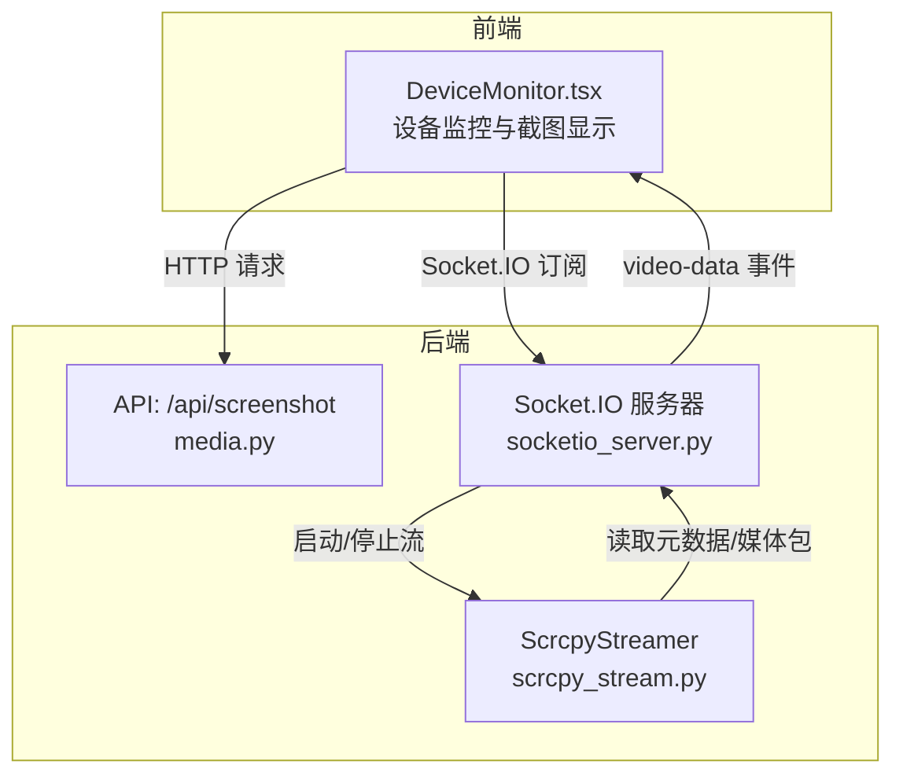
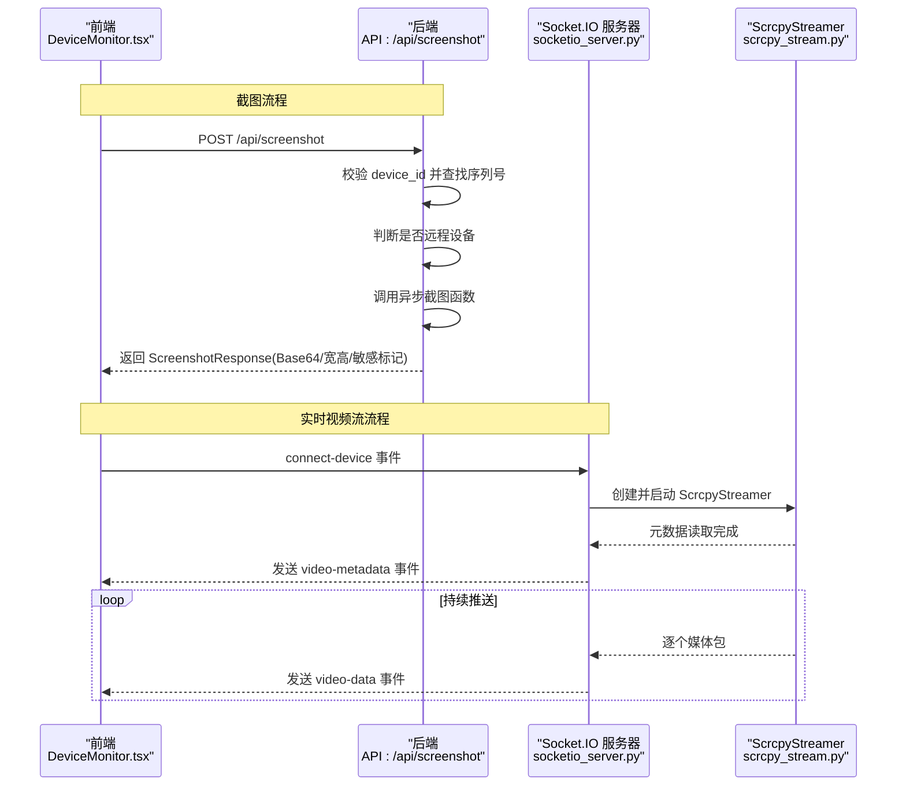
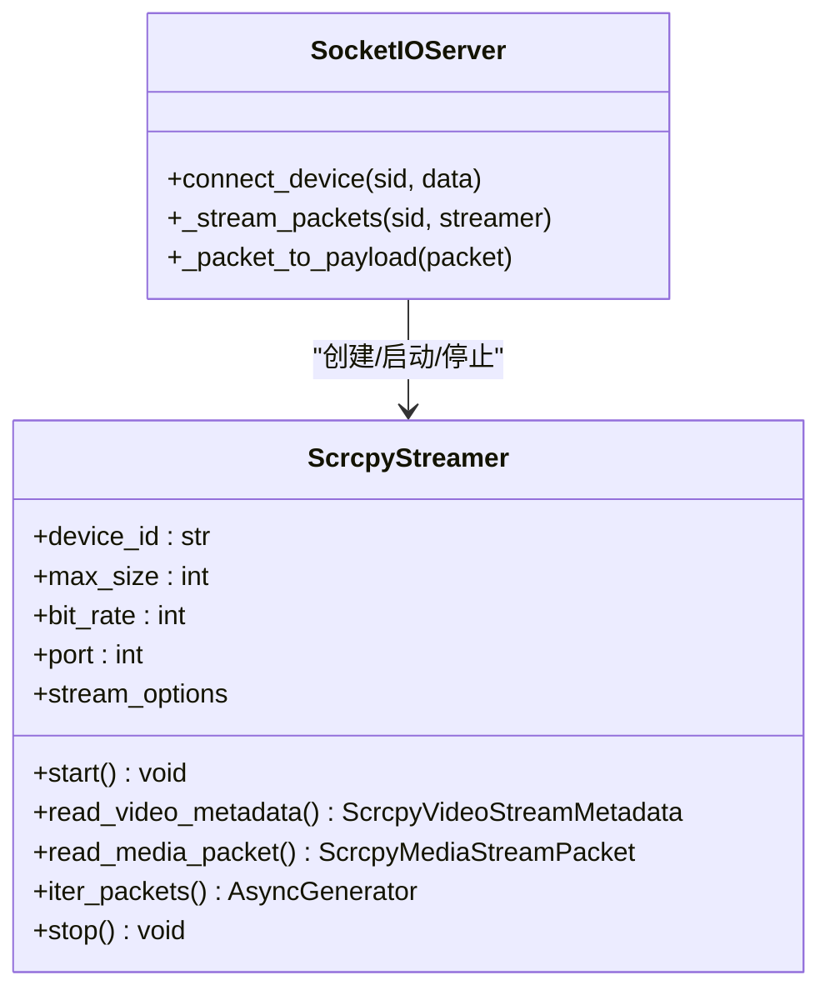
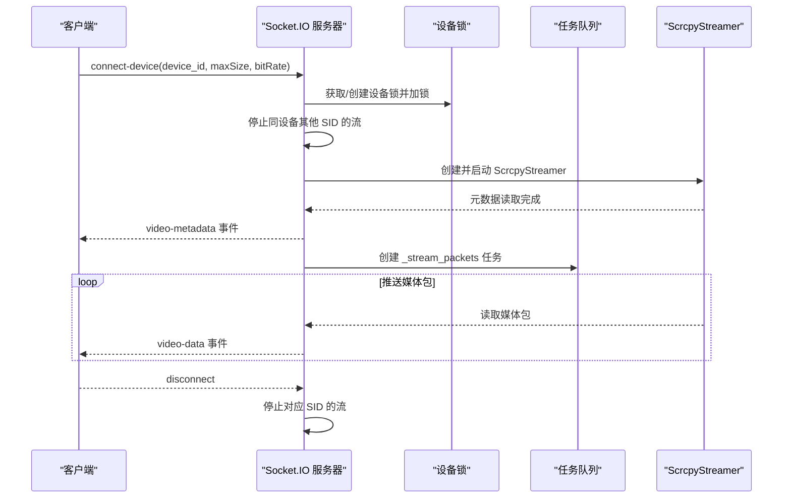
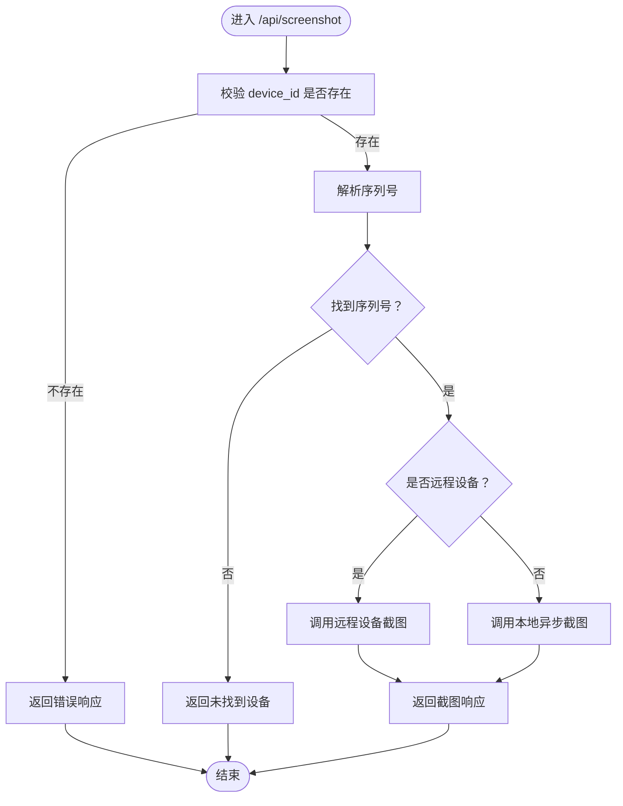
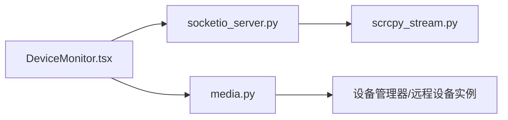

# 数据流分析

<cite>
**本文引用的文件**
- [scrcpy_stream.py](file://AutoGLM_GUI/scrcpy_stream.py)
- [socketio_server.py](file://AutoGLM_GUI/socketio_server.py)
- [media.py](file://AutoGLM_GUI/api/media.py)
- [screenshot.py](file://AutoGLM_GUI/adb/screenshot.py)
- [DeviceMonitor.tsx](file://frontend/src/components/DeviceMonitor.tsx)
- [test_socketio_server.py](file://tests/test_socketio_server.py)
- [test_media_api.py](file://tests/test_media_api.py)
- [test_hardware_boundary_coverage.py](file://tests/test_hardware_boundary_coverage.py)
</cite>

## 目录
1. [引言](#引言)
2. [项目结构](#项目结构)
3. [核心组件](#核心组件)
4. [架构总览](#架构总览)
5. [详细组件分析](#详细组件分析)
6. [依赖分析](#依赖分析)
7. [性能考虑](#性能考虑)
8. [故障排查指南](#故障排查指南)
9. [结论](#结论)
10. [附录](#附录)

## 引言
本文件围绕 AutoGLM-GUI 的数据流进行系统性分析，覆盖从 Web 界面输入、API 处理、设备操作到状态反馈的完整路径。重点聚焦实时数据流（scrcpy 视频流）、设备状态更新、AI 代理决策过程中的数据传递与转换，以及缓存策略与数据同步机制。同时提供数据流图与时序图，帮助读者快速理解关键业务场景的数据流转。

## 项目结构
AutoGLM-GUI 的数据流主要分布在以下模块：
- 后端服务层：Socket.IO 服务器负责实时视频流推送；FastAPI 路由提供截图等接口。
- 设备交互层：Scrcpy 流解析器负责与设备建立连接、读取元数据与媒体包。
- 前端展示层：React 组件负责接收实时视频数据并渲染预览。

图表来源
- [socketio_server.py:148-214](file://AutoGLM_GUI/socketio_server.py#L148-L214)
- [scrcpy_stream.py:119-156](file://AutoGLM_GUI/scrcpy_stream.py#L119-L156)
- [media.py:33-118](file://AutoGLM_GUI/api/media.py#L33-L118)
- [DeviceMonitor.tsx:411-445](file://frontend/src/components/DeviceMonitor.tsx#L411-L445)

章节来源
- [socketio_server.py:1-215](file://AutoGLM_GUI/socketio_server.py#L1-L215)
- [scrcpy_stream.py:1-629](file://AutoGLM_GUI/scrcpy_stream.py#L1-L629)
- [media.py:1-119](file://AutoGLM_GUI/api/media.py#L1-L119)
- [DeviceMonitor.tsx:411-445](file://frontend/src/components/DeviceMonitor.tsx#L411-L445)

## 核心组件
- ScrcpyStreamer：负责设备连接、端口转发、服务启动、TCP 连接、元数据与媒体包读取、资源清理。
- Socket.IO 服务器：负责客户端连接、设备锁控制、并发保护、错误分类与统一上报、视频数据打包与推送。
- 媒体 API：提供截图接口，支持本地与远程设备，返回 Base64 图像与尺寸信息。
- 前端 DeviceMonitor：接收视频元数据与媒体包，渲染截图或加载状态，并处理敏感内容标记。

章节来源
- [scrcpy_stream.py:119-156](file://AutoGLM_GUI/scrcpy_stream.py#L119-L156)
- [socketio_server.py:19-37](file://AutoGLM_GUI/socketio_server.py#L19-L37)
- [media.py:33-118](file://AutoGLM_GUI/api/media.py#L33-L118)
- [DeviceMonitor.tsx:411-445](file://frontend/src/components/DeviceMonitor.tsx#L411-L445)

## 架构总览
下图展示了从用户在前端发起请求到设备响应的完整数据路径，包括实时视频流与截图请求的两条主线。

图表来源
- [media.py:33-118](file://AutoGLM_GUI/api/media.py#L33-L118)
- [socketio_server.py:148-214](file://AutoGLM_GUI/socketio_server.py#L148-L214)
- [scrcpy_stream.py:496-577](file://AutoGLM_GUI/scrcpy_stream.py#L496-L577)

## 详细组件分析

### Scrcpy 视频流组件分析
ScrcpyStreamer 是实时视频流的核心实现，负责：
- 设备可用性检查与显示选择缓存清理
- 服务端推送、端口转发、服务启动与连接
- 元数据读取（设备名、分辨率、编解码器）
- 媒体包解析（配置帧与关键帧/普通帧）
- 资源清理与端口释放

图表来源
- [scrcpy_stream.py:119-156](file://AutoGLM_GUI/scrcpy_stream.py#L119-L156)
- [socketio_server.py:148-214](file://AutoGLM_GUI/socketio_server.py#L148-L214)

章节来源
- [scrcpy_stream.py:203-424](file://AutoGLM_GUI/scrcpy_stream.py#L203-L424)
- [scrcpy_stream.py:496-577](file://AutoGLM_GUI/scrcpy_stream.py#L496-L577)
- [scrcpy_stream.py:578-622](file://AutoGLM_GUI/scrcpy_stream.py#L578-L622)

### Socket.IO 服务器组件分析
Socket.IO 服务器负责：
- 客户端连接与断开事件处理
- 设备级互斥锁，防止同一设备被多路并发连接
- 错误分类与统一错误上报
- 将媒体包封装为事件负载并推送

图表来源
- [socketio_server.py:148-214](file://AutoGLM_GUI/socketio_server.py#L148-L214)
- [socketio_server.py:106-123](file://AutoGLM_GUI/socketio_server.py#L106-L123)

章节来源
- [socketio_server.py:137-146](file://AutoGLM_GUI/socketio_server.py#L137-L146)
- [socketio_server.py:148-214](file://AutoGLM_GUI/socketio_server.py#L148-L214)
- [socketio_server.py:106-123](file://AutoGLM_GUI/socketio_server.py#L106-L123)

### 媒体 API 组件分析
媒体 API 提供截图能力，支持本地与远程设备：
- 校验 device_id 并解析序列号
- 远程设备优先走远程实例
- 本地设备通过异步截图函数获取
- 返回统一的 ScreenshotResponse 结构

图表来源
- [media.py:33-118](file://AutoGLM_GUI/api/media.py#L33-L118)

章节来源
- [media.py:33-118](file://AutoGLM_GUI/api/media.py#L33-L118)

### 前端设备监控组件分析
前端 DeviceMonitor 负责：
- 渲染截图（含敏感内容标记）
- 显示加载状态与失败提示
- 根据宽高比自适应图片尺寸

章节来源
- [DeviceMonitor.tsx:411-445](file://frontend/src/components/DeviceMonitor.tsx#L411-L445)

## 依赖分析
- Socket.IO 服务器依赖 ScrcpyStreamer 进行视频流读取与推送。
- 媒体 API 依赖设备管理器与异步截图函数，支持本地与远程设备。
- 前端组件依赖 Socket.IO 事件与媒体 API 响应进行渲染。

图表来源
- [socketio_server.py:148-214](file://AutoGLM_GUI/socketio_server.py#L148-L214)
- [scrcpy_stream.py:119-156](file://AutoGLM_GUI/scrcpy_stream.py#L119-L156)
- [media.py:33-118](file://AutoGLM_GUI/api/media.py#L33-L118)

章节来源
- [socketio_server.py:1-215](file://AutoGLM_GUI/socketio_server.py#L1-L215)
- [scrcpy_stream.py:1-629](file://AutoGLM_GUI/scrcpy_stream.py#L1-L629)
- [media.py:1-119](file://AutoGLM_GUI/api/media.py#L1-L119)

## 性能考虑
- 媒体包读取采用异步 I/O 与缓冲区复用，减少阻塞。
- Socket 连接设置接收缓冲区大小以提升吞吐。
- 视频元数据仅读取一次并缓存，避免重复解析。
- 端口占用检测采用轮询等待，避免固定休眠导致的延迟。
- 任务取消与异常捕获确保资源及时释放，降低泄漏风险。

章节来源
- [scrcpy_stream.py:437-440](file://AutoGLM_GUI/scrcpy_stream.py#L437-L440)
- [scrcpy_stream.py:496-539](file://AutoGLM_GUI/scrcpy_stream.py#L496-L539)
- [scrcpy_stream.py:600-618](file://AutoGLM_GUI/scrcpy_stream.py#L600-L618)
- [socketio_server.py:106-123](file://AutoGLM_GUI/socketio_server.py#L106-L123)

## 故障排查指南
- 端口冲突：当端口被占用时，系统会尝试清理并重试，若持续冲突需检查是否存在残留进程。
- 设备离线：设备不可用或未找到时，统一返回设备离线错误类型，建议检查连接状态。
- 连接超时：Socket 连接失败时返回超时错误，建议检查网络与设备状态。
- 连接失败：scrcpy 服务器启动失败时返回连接失败错误，需查看日志定位具体原因。
- 单元测试验证：包含错误分类、流停止过滤、缺失设备 ID 的拒绝行为等。

章节来源
- [socketio_server.py:50-87](file://AutoGLM_GUI/socketio_server.py#L50-L87)
- [test_socketio_server.py:43-63](file://tests/test_socketio_server.py#L43-L63)
- [test_socketio_server.py:236-251](file://tests/test_socketio_server.py#L236-L251)
- [test_socketio_server.py:214-213](file://tests/test_socketio_server.py#L214-L213)

## 结论
AutoGLM-GUI 的数据流设计以异步与事件驱动为核心，结合设备级锁与错误分类机制，实现了稳定可靠的实时视频流与截图能力。ScrcpyStreamer 提供了完整的设备交互与媒体包解析能力，Socket.IO 服务器负责并发控制与事件分发，媒体 API 与前端组件共同完成用户交互闭环。通过缓存与资源管理策略，系统在性能与稳定性之间取得良好平衡。

## 附录
- 关键数据结构与协议
  - 视频元数据：包含设备名、宽度、高度、编解码器 ID。
  - 媒体包：区分配置帧与数据帧，携带 PTS 与关键帧标志。
  - 事件负载：包含类型、二进制数据、时间戳及可选的关键帧与 PTS 字段。
- 数据转换与格式化
  - 截图：返回 Base64 编码图像与尺寸信息，支持敏感内容标记。
  - 视频：按 ya-webadb 协议解析，逐包推送至前端。
- 缓存策略与同步机制
  - 视频元数据缓存：首次读取后缓存，避免重复解析。
  - 设备锁：同一设备的并发连接互斥，确保资源安全。
  - 会话状态：基于 Socket.IO SID 管理流生命周期，断开自动清理。
- 优化策略
  - 增量更新：仅在元数据变化时发送 video-metadata。
  - 批量处理：媒体包逐个推送，保持低延迟。
  - 延迟加载：截图接口按需触发，不干扰设备运行。

章节来源
- [scrcpy_stream.py:496-539](file://AutoGLM_GUI/scrcpy_stream.py#L496-L539)
- [socketio_server.py:125-134](file://AutoGLM_GUI/socketio_server.py#L125-L134)
- [media.py:33-118](file://AutoGLM_GUI/api/media.py#L33-L118)
- [DeviceMonitor.tsx:411-445](file://frontend/src/components/DeviceMonitor.tsx#L411-L445)
- [test_hardware_boundary_coverage.py:265-299](file://tests/test_hardware_boundary_coverage.py#L265-L299)