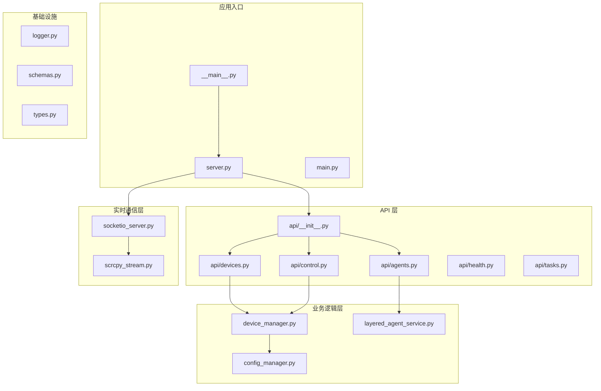
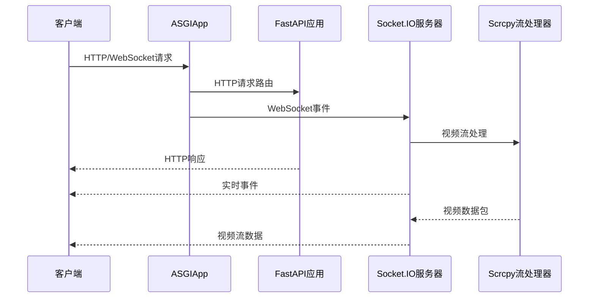
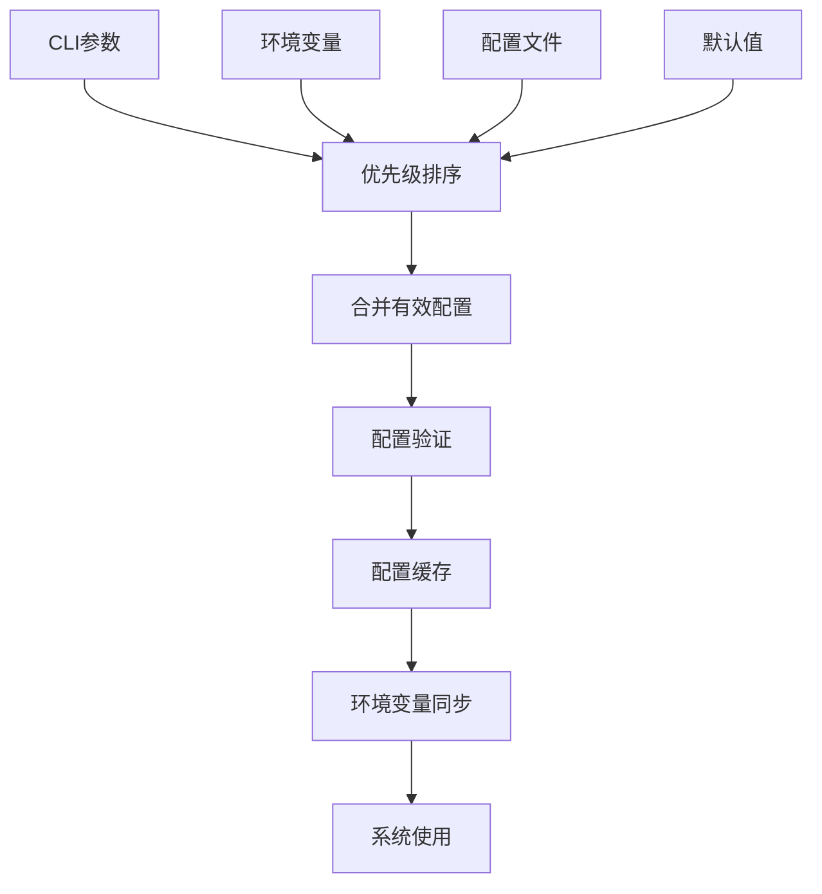
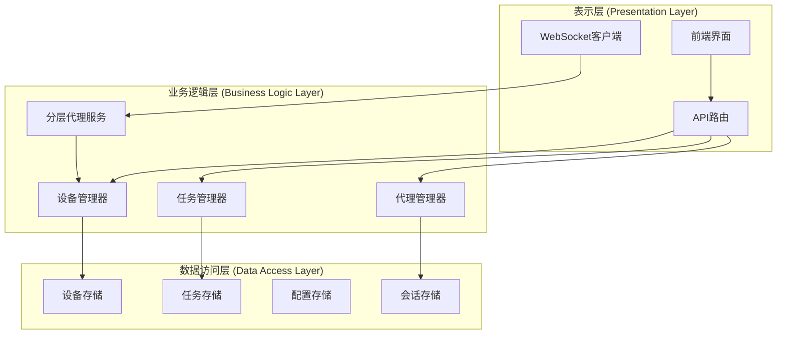
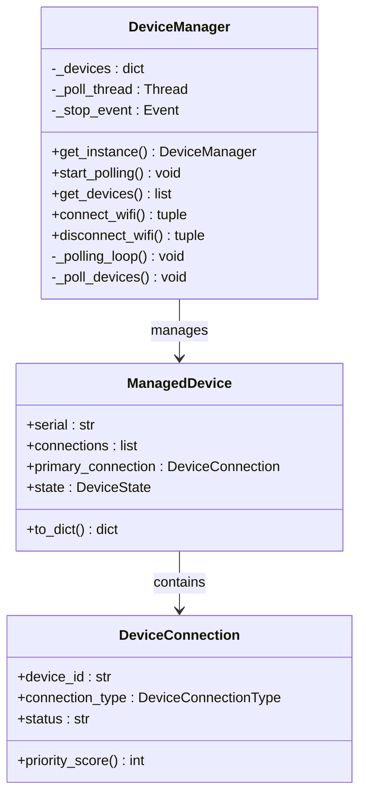
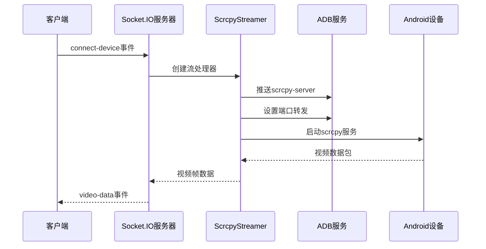
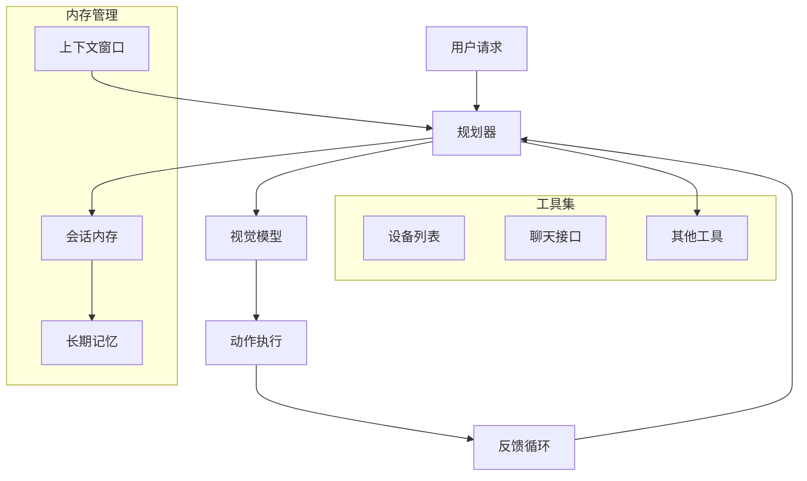
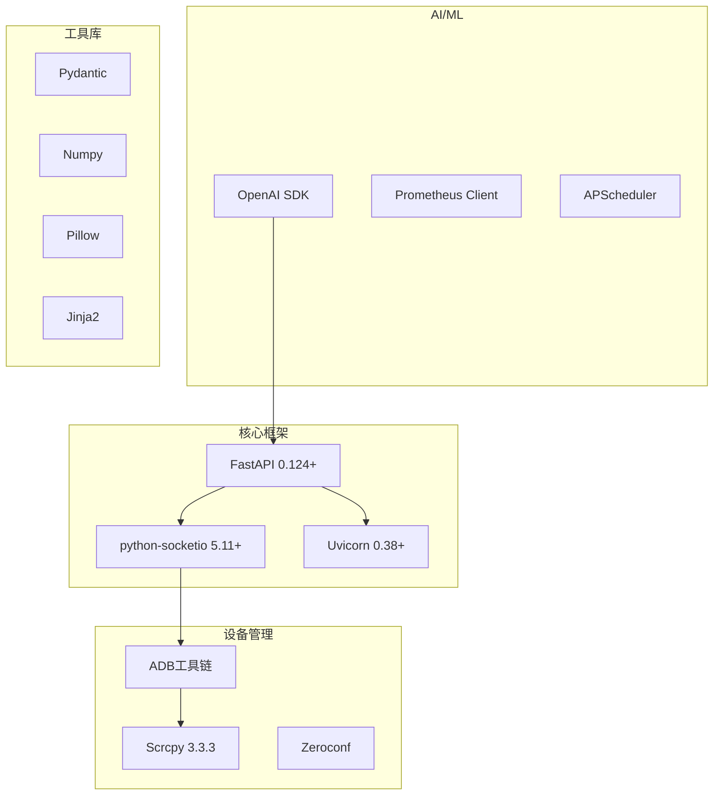
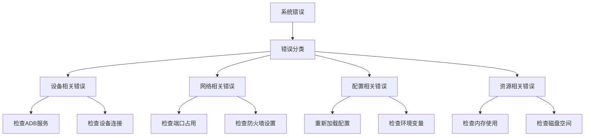

# 整体架构设计

<cite>
**本文档引用的文件**
- [AutoGLM_GUI/__main__.py](file://AutoGLM_GUI/__main__.py)
- [AutoGLM_GUI/server.py](file://AutoGLM_GUI/server.py)
- [AutoGLM_GUI/socketio_server.py](file://AutoGLM_GUI/socketio_server.py)
- [AutoGLM_GUI/api/__init__.py](file://AutoGLM_GUI/api/__init__.py)
- [AutoGLM_GUI/api/devices.py](file://AutoGLM_GUI/api/devices.py)
- [AutoGLM_GUI/api/agents.py](file://AutoGLM_GUI/api/agents.py)
- [AutoGLM_GUI/api/control.py](file://AutoGLM_GUI/api/control.py)
- [AutoGLM_GUI/config_manager.py](file://AutoGLM_GUI/config_manager.py)
- [AutoGLM_GUI/device_manager.py](file://AutoGLM_GUI/device_manager.py)
- [AutoGLM_GUI/scrcpy_stream.py](file://AutoGLM_GUI/scrcpy_stream.py)
- [AutoGLM_GUI/layered_agent_service.py](file://AutoGLM_GUI/layered_agent_service.py)
- [main.py](file://main.py)
- [pyproject.toml](file://pyproject.toml)
</cite>

## 目录
1. [引言](#引言)
2. [项目结构](#项目结构)
3. [核心组件](#核心组件)
4. [架构概览](#架构概览)
5. [详细组件分析](#详细组件分析)
6. [依赖关系分析](#依赖关系分析)
7. [性能考虑](#性能考虑)
8. [故障排除指南](#故障排除指南)
9. [结论](#结论)

## 引言

AutoGLM-GUI 是一个基于 FastAPI 和 Socket.IO 的混合架构系统，专为 AutoGLM 手机代理设计的 Web 图形用户界面。该系统采用现代异步编程模式，结合实时 WebSocket 通信和传统的 HTTP API，为用户提供完整的设备控制和自动化操作能力。

系统的核心设计理念是通过分层架构实现清晰的关注点分离，包括表示层、业务逻辑层和数据访问层。同时，系统采用了微服务化的模块化设计，每个功能模块都可以独立开发、测试和部署。

## 项目结构

AutoGLM-GUI 采用模块化的项目组织方式，按照功能域进行划分：

**图表来源**
- [AutoGLM_GUI/__main__.py:1-305](file://AutoGLM_GUI/__main__.py#L1-L305)
- [AutoGLM_GUI/server.py:1-13](file://AutoGLM_GUI/server.py#L1-L13)
- [AutoGLM_GUI/api/__init__.py:1-293](file://AutoGLM_GUI/api/__init__.py#L1-L293)

**章节来源**
- [AutoGLM_GUI/__main__.py:78-305](file://AutoGLM_GUI/__main__.py#L78-L305)
- [AutoGLM_GUI/server.py:8-12](file://AutoGLM_GUI/server.py#L8-L12)
- [AutoGLM_GUI/api/__init__.py:135-293](file://AutoGLM_GUI/api/__init__.py#L135-L293)

## 核心组件

### ASGI 应用集成

系统采用 ASGI（Asynchronous Server Gateway Interface）标准，通过 `socketio.ASGIApp` 将 FastAPI 和 Socket.IO 无缝集成：

**图表来源**
- [AutoGLM_GUI/server.py:8-10](file://AutoGLM_GUI/server.py#L8-L10)
- [AutoGLM_GUI/socketio_server.py:27-31](file://AutoGLM_GUI/socketio_server.py#L27-L31)

### 配置管理系统

系统实现了四层优先级的配置管理机制：

**图表来源**
- [AutoGLM_GUI/config_manager.py:237-747](file://AutoGLM_GUI/config_manager.py#L237-L747)

**章节来源**
- [AutoGLM_GUI/server.py:1-13](file://AutoGLM_GUI/server.py#L1-L13)
- [AutoGLM_GUI/config_manager.py:237-747](file://AutoGLM_GUI/config_manager.py#L237-L747)

## 架构概览

### 分层架构设计

AutoGLM-GUI 采用经典的三层架构模式：

**图表来源**
- [AutoGLM_GUI/api/devices.py:92-113](file://AutoGLM_GUI/api/devices.py#L92-L113)
- [AutoGLM_GUI/api/agents.py:131-157](file://AutoGLM_GUI/api/agents.py#L131-L157)
- [AutoGLM_GUI/device_manager.py:249-314](file://AutoGLM_GUI/device_manager.py#L249-L314)

### 微服务架构特点

系统采用微服务化的模块化设计，每个模块具有以下特点：

- **单一职责**: 每个模块专注于特定的功能领域
- **松耦合**: 模块间通过明确定义的接口进行通信
- **独立部署**: 模块可以独立开发、测试和部署
- **可扩展性**: 支持水平扩展和垂直扩展

**章节来源**
- [AutoGLM_GUI/api/devices.py:1-200](file://AutoGLM_GUI/api/devices.py#L1-L200)
- [AutoGLM_GUI/api/agents.py:1-200](file://AutoGLM_GUI/api/agents.py#L1-L200)
- [AutoGLM_GUI/api/control.py:1-119](file://AutoGLM_GUI/api/control.py#L1-L119)

## 详细组件分析

### 设备管理系统

设备管理系统是整个系统的核心基础设施，负责设备发现、状态管理和连接控制：

**图表来源**
- [AutoGLM_GUI/device_manager.py:249-314](file://AutoGLM_GUI/device_manager.py#L249-L314)
- [AutoGLM_GUI/device_manager.py:122-197](file://AutoGLM_GUI/device_manager.py#L122-L197)
- [AutoGLM_GUI/device_manager.py:88-120](file://AutoGLM_GUI/device_manager.py#L88-L120)

### Scrcpy 视频流处理

系统集成了 Scrcpy 用于实时视频流传输：

**图表来源**
- [AutoGLM_GUI/socketio_server.py:148-215](file://AutoGLM_GUI/socketio_server.py#L148-L215)
- [AutoGLM_GUI/scrcpy_stream.py:203-245](file://AutoGLM_GUI/scrcpy_stream.py#L203-L245)

**章节来源**
- [AutoGLM_GUI/device_manager.py:435-454](file://AutoGLM_GUI/device_manager.py#L435-L454)
- [AutoGLM_GUI/socketio_server.py:106-123](file://AutoGLM_GUI/socketio_server.py#L106-L123)
- [AutoGLM_GUI/scrcpy_stream.py:496-540](file://AutoGLM_GUI/scrcpy_stream.py#L496-L540)

### 分层代理服务

分层代理服务实现了复杂的任务执行和决策能力：

**图表来源**
- [AutoGLM_GUI/layered_agent_service.py:31-80](file://AutoGLM_GUI/layered_agent_service.py#L31-L80)
- [AutoGLM_GUI/layered_agent_service.py:134-154](file://AutoGLM_GUI/layered_agent_service.py#L134-L154)

**章节来源**
- [AutoGLM_GUI/layered_agent_service.py:172-200](file://AutoGLM_GUI/layered_agent_service.py#L172-L200)
- [AutoGLM_GUI/api/agents.py:85-129](file://AutoGLM_GUI/api/agents.py#L85-L129)

## 依赖关系分析

### 技术栈依赖

系统采用现代化的 Python 生态系统，主要依赖包括：

**图表来源**
- [pyproject.toml:24-40](file://pyproject.toml#L24-L40)

### 外部依赖关系

系统与外部系统的集成点：

| 集成点 | 描述 | 协议 | 用途 |
|--------|------|------|------|
| ADB 服务 | Android Debug Bridge | TCP/USB | 设备控制和数据传输 |
| Scrcpy 服务 | 屏幕镜像协议 | TCP | 实时视频流传输 |
| AI 模型 API | 语言模型服务 | HTTP/HTTPS | 代理决策和对话 |
| WebSocket 服务器 | 实时通信 | WebSocket | 设备状态通知 |
| 配置存储 | JSON 文件 | 文件系统 | 应用配置持久化 |

**章节来源**
- [pyproject.toml:13-23](file://pyproject.toml#L13-L23)
- [pyproject.toml:24-40](file://pyproject.toml#L24-L40)

## 性能考虑

### 异步并发模型

系统采用完全异步的并发模型，通过 asyncio 实现高并发处理：

- **事件驱动架构**: 基于事件循环的非阻塞 I/O 操作
- **协程管理**: 使用 asyncio 任务和守护任务处理后台操作
- **资源池化**: 设备连接和数据库连接的池化管理
- **背压处理**: Socket.IO 服务器的流量控制和拥塞避免

### 缓存策略

系统实现了多层次的缓存机制：

- **设备状态缓存**: 内存中的设备状态快照，减少频繁查询
- **配置缓存**: 配置文件的内存缓存，支持热重载
- **会话缓存**: 分层代理的会话状态缓存
- **静态资源缓存**: 前端静态资源的长期缓存策略

### 资源管理

- **连接池**: 数据库和外部服务的连接池管理
- **进程管理**: 子进程的生命周期管理和资源清理
- **内存优化**: 大数据结构的内存映射和垃圾回收优化

## 故障排除指南

### 常见问题诊断

### 错误处理机制

系统实现了统一的错误处理和恢复机制：

- **异常分类**: 将错误分为可恢复和不可恢复两类
- **自动重试**: 对网络和设备相关的错误实施指数退避重试
- **降级策略**: 在部分功能失效时提供降级服务
- **日志记录**: 详细的错误日志和调试信息

**章节来源**
- [AutoGLM_GUI/socketio_server.py:50-87](file://AutoGLM_GUI/socketio_server.py#L50-L87)
- [AutoGLM_GUI/scrcpy_stream.py:326-424](file://AutoGLM_GUI/scrcpy_stream.py#L326-L424)

## 结论

AutoGLM-GUI 的架构设计体现了现代 Web 应用的最佳实践，通过 FastAPI + Socket.IO 的混合架构实现了高性能的实时交互体验。系统的分层设计确保了良好的可维护性和可扩展性，而微服务化的模块化结构为未来的功能扩展奠定了坚实基础。

架构决策的核心考量包括：

- **技术选型**: FastAPI 提供了更好的性能和类型安全，Socket.IO 解决了实时通信需求
- **架构模式**: 分层架构确保了关注点分离，微服务化支持独立开发和部署
- **性能优化**: 异步并发模型和缓存策略保证了系统的高吞吐量处理能力
- **可靠性**: 完善的错误处理和恢复机制提升了系统的稳定性

该架构为 AutoGLM 手机代理提供了强大而灵活的 Web 界面，既满足了实时控制的需求，又保持了良好的用户体验和系统性能。