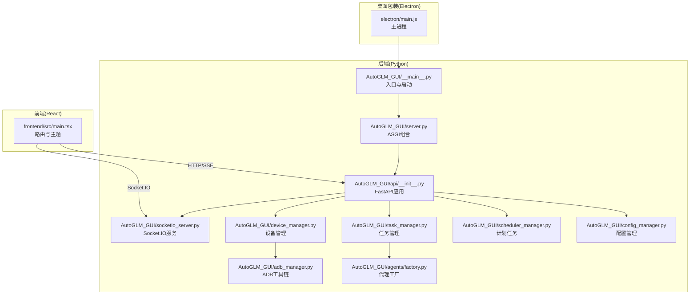
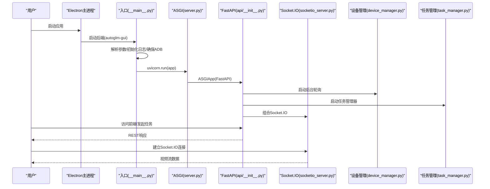
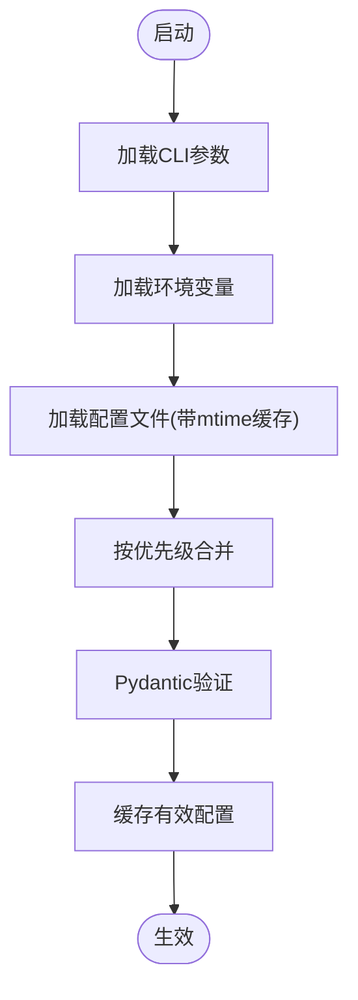
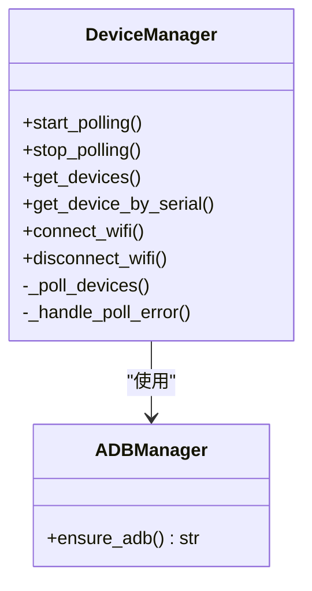
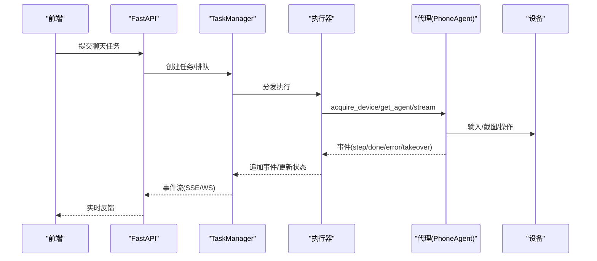
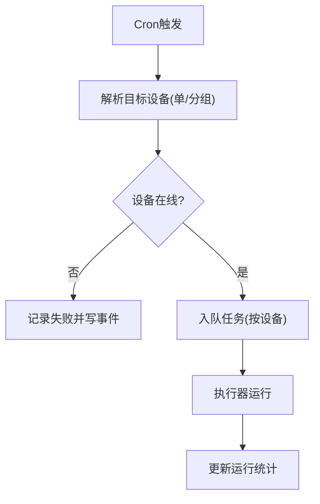
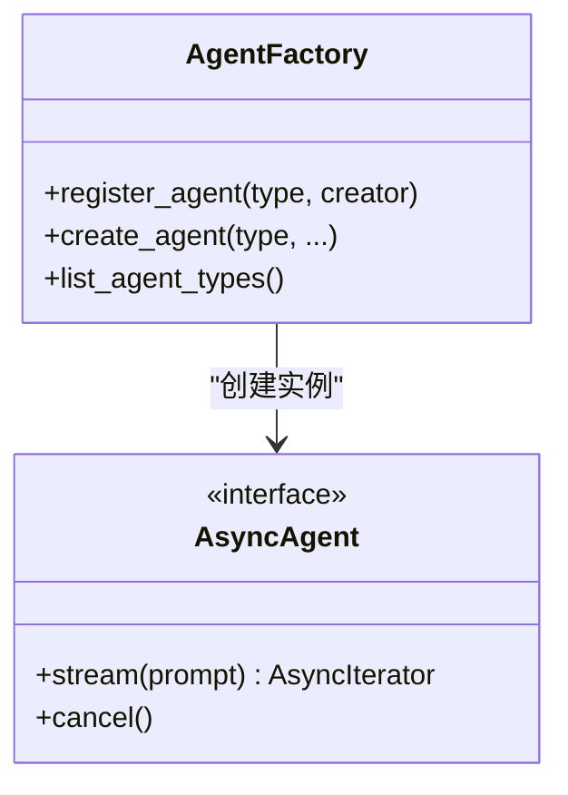
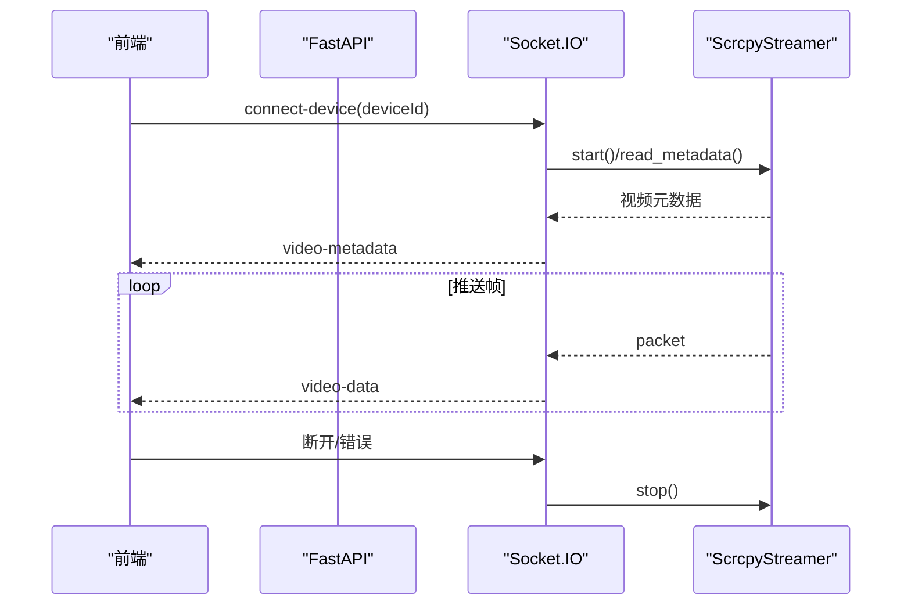
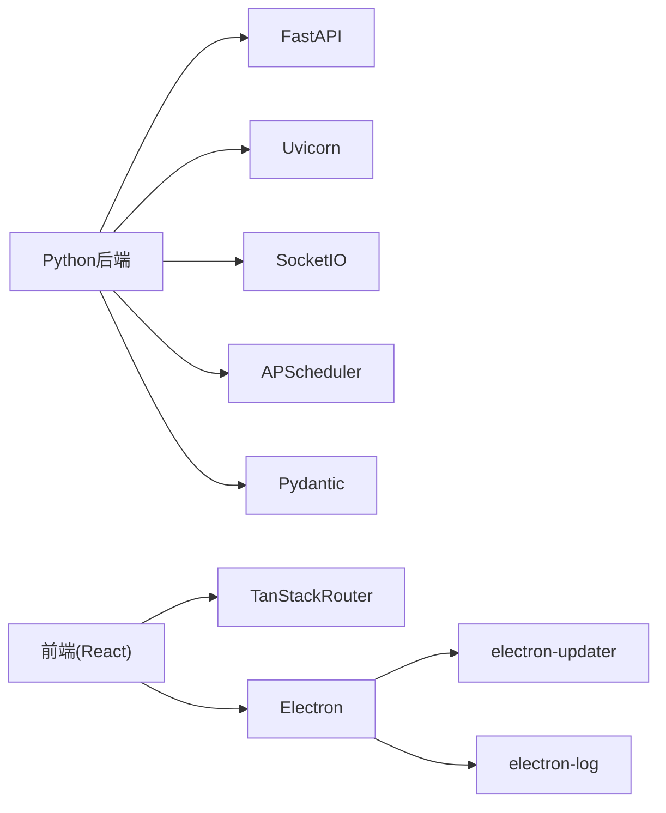
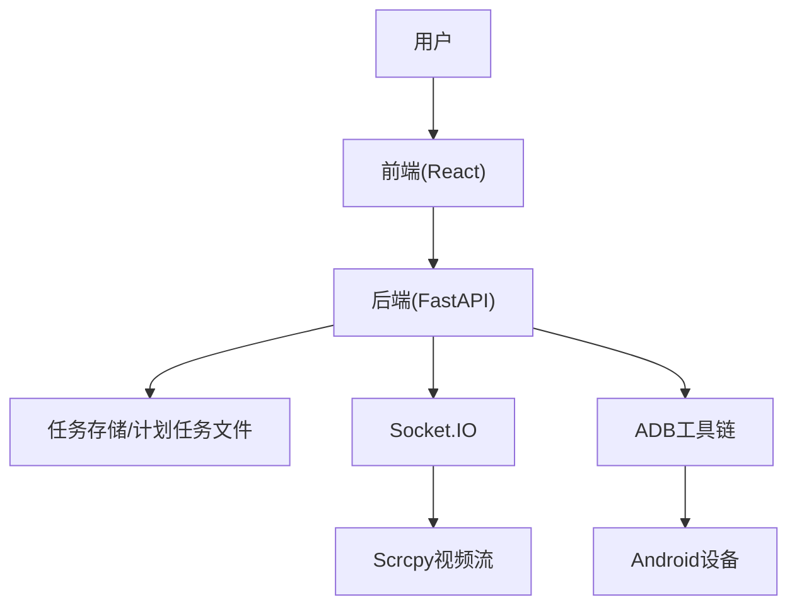

# 系统架构

<cite>
**本文引用的文件**
- [AutoGLM_GUI/__main__.py](file://AutoGLM_GUI/__main__.py)
- [AutoGLM_GUI/server.py](file://AutoGLM_GUI/server.py)
- [AutoGLM_GUI/api/__init__.py](file://AutoGLM_GUI/api/__init__.py)
- [AutoGLM_GUI/socketio_server.py](file://AutoGLM_GUI/socketio_server.py)
- [AutoGLM_GUI/config.py](file://AutoGLM_GUI/config.py)
- [AutoGLM_GUI/config_manager.py](file://AutoGLM_GUI/config_manager.py)
- [AutoGLM_GUI/device_manager.py](file://AutoGLM_GUI/device_manager.py)
- [AutoGLM_GUI/adb_manager.py](file://AutoGLM_GUI/adb_manager.py)
- [AutoGLM_GUI/agents/factory.py](file://AutoGLM_GUI/agents/factory.py)
- [AutoGLM_GUI/task_manager.py](file://AutoGLM_GUI/task_manager.py)
- [AutoGLM_GUI/scheduler_manager.py](file://AutoGLM_GUI/scheduler_manager.py)
- [main.py](file://main.py)
- [pyproject.toml](file://pyproject.toml)
- [frontend/src/main.tsx](file://frontend/src/main.tsx)
- [electron/main.js](file://electron/main.js)
</cite>

## 目录
1. [引言](#引言)
2. [项目结构](#项目结构)
3. [核心组件](#核心组件)
4. [架构总览](#架构总览)
5. [详细组件分析](#详细组件分析)
6. [依赖分析](#依赖分析)
7. [性能考量](#性能考量)
8. [故障排查指南](#故障排查指南)
9. [结论](#结论)
10. [附录](#附录)

## 引言
本系统为 AutoGLM-GUI，提供一个基于 Web 的图形界面，用于控制 Android 设备上的自动化任务。系统通过 FastAPI 提供 REST API 与 Socket.IO 实现实时视频预览，结合多代理（Agent）体系实现智能交互与自动化操作。系统支持桌面端 Electron 包装、Docker 部署以及原生命令行运行方式，具备设备发现与管理、任务编排、计划任务调度、实时视频流、指标与可观测性等能力。

## 项目结构
系统采用“后端（Python/FastAPI）+ 前端（React）+ 桌面包装（Electron）”三层架构，核心后端模块包括：
- 入口与配置：命令行入口、统一配置管理
- 设备与ADB：设备发现、状态缓存、ADB 工具链
- 任务与调度：任务队列、执行器、计划任务
- 代理工厂：多模型/多框架代理适配
- API与实时流：REST API、Socket.IO 视频流
- 前端与桌面：React 前端路由、Electron 主进程

图表来源
- [AutoGLM_GUI/__main__.py:78-305](file://AutoGLM_GUI/__main__.py#L78-L305)
- [AutoGLM_GUI/server.py:1-13](file://AutoGLM_GUI/server.py#L1-L13)
- [AutoGLM_GUI/api/__init__.py:135-293](file://AutoGLM_GUI/api/__init__.py#L135-L293)
- [AutoGLM_GUI/socketio_server.py:1-215](file://AutoGLM_GUI/socketio_server.py#L1-L215)
- [AutoGLM_GUI/device_manager.py:249-377](file://AutoGLM_GUI/device_manager.py#L249-L377)
- [AutoGLM_GUI/task_manager.py:30-70](file://AutoGLM_GUI/task_manager.py#L30-L70)
- [AutoGLM_GUI/scheduler_manager.py:31-58](file://AutoGLM_GUI/scheduler_manager.py#L31-L58)
- [AutoGLM_GUI/config_manager.py:237-296](file://AutoGLM_GUI/config_manager.py#L237-L296)
- [AutoGLM_GUI/adb_manager.py:33-106](file://AutoGLM_GUI/adb_manager.py#L33-L106)
- [AutoGLM_GUI/agents/factory.py:19-47](file://AutoGLM_GUI/agents/factory.py#L19-L47)
- [frontend/src/main.tsx:1-73](file://frontend/src/main.tsx#L1-L73)
- [electron/main.js:375-557](file://electron/main.js#L375-L557)

章节来源
- [AutoGLM_GUI/__main__.py:78-305](file://AutoGLM_GUI/__main__.py#L78-L305)
- [AutoGLM_GUI/server.py:1-13](file://AutoGLM_GUI/server.py#L1-L13)
- [AutoGLM_GUI/api/__init__.py:135-293](file://AutoGLM_GUI/api/__init__.py#L135-L293)
- [frontend/src/main.tsx:1-73](file://frontend/src/main.tsx#L1-L73)
- [electron/main.js:375-557](file://electron/main.js#L375-L557)

## 核心组件
- 统一配置管理：四层优先级（CLI > 环境变量 > 配置文件 > 默认），类型安全与热重载
- 设备管理：后台轮询、状态缓存、mDNS 发现、WiFi 连接、ADB 键盘初始化
- 任务管理：按设备工作线程、执行器注册、事件存储、跟踪与指标
- 计划任务：APScheduler 驱动、Cron 表达式、批量设备触发
- 代理工厂：注册表模式，支持 GLM、MAI、Gemini、Qwen、DroidRun、Midscene 等
- API 与实时流：FastAPI + Socket.IO，静态资源与 SPA 路由
- ADB 工具链：自动下载、缓存、权限处理

章节来源
- [AutoGLM_GUI/config_manager.py:237-747](file://AutoGLM_GUI/config_manager.py#L237-L747)
- [AutoGLM_GUI/device_manager.py:249-670](file://AutoGLM_GUI/device_manager.py#L249-L670)
- [AutoGLM_GUI/task_manager.py:30-119](file://AutoGLM_GUI/task_manager.py#L30-L119)
- [AutoGLM_GUI/scheduler_manager.py:31-149](file://AutoGLM_GUI/scheduler_manager.py#L31-L149)
- [AutoGLM_GUI/agents/factory.py:19-103](file://AutoGLM_GUI/agents/factory.py#L19-L103)
- [AutoGLM_GUI/api/__init__.py:135-293](file://AutoGLM_GUI/api/__init__.py#L135-L293)
- [AutoGLM_GUI/socketio_server.py:19-88](file://AutoGLM_GUI/socketio_server.py#L19-L88)
- [AutoGLM_GUI/adb_manager.py:33-106](file://AutoGLM_GUI/adb_manager.py#L33-L106)

## 架构总览
系统采用“入口启动 → 应用装配 → 服务启动”的顺序。入口负责解析参数、初始化日志、确保 ADB、构建配置、启动 Uvicorn；应用装配将 FastAPI 与 Socket.IO 组合为 ASGI；设备管理器后台轮询设备状态；任务管理器按设备分发执行；计划任务管理器周期性触发任务；前端通过 HTTP/SSE 与 Socket.IO 与后端交互。

图表来源
- [AutoGLM_GUI/__main__.py:78-305](file://AutoGLM_GUI/__main__.py#L78-L305)
- [AutoGLM_GUI/server.py:8-10](file://AutoGLM_GUI/server.py#L8-L10)
- [AutoGLM_GUI/api/__init__.py:154-187](file://AutoGLM_GUI/api/__init__.py#L154-L187)
- [AutoGLM_GUI/socketio_server.py:137-215](file://AutoGLM_GUI/socketio_server.py#L137-L215)
- [AutoGLM_GUI/device_manager.py:315-330](file://AutoGLM_GUI/device_manager.py#L315-L330)
- [AutoGLM_GUI/task_manager.py:60-70](file://AutoGLM_GUI/task_manager.py#L60-L70)

## 详细组件分析

### 组件A：统一配置管理（四层优先级）
- 设计要点：类型安全（Pydantic）、四层优先级、冲突检测、热重载、原子写入
- 数据结构：ConfigLayer（显式键追踪）、ConfigModel（字段校验）
- 流程：CLI → 环境变量 → 配置文件 → 默认值，合并后验证并缓存
- 优化：mtime 缓存避免频繁 IO；失败回退默认值

图表来源
- [AutoGLM_GUI/config_manager.py:299-747](file://AutoGLM_GUI/config_manager.py#L299-L747)

章节来源
- [AutoGLM_GUI/config_manager.py:237-747](file://AutoGLM_GUI/config_manager.py#L237-L747)

### 组件B：设备管理与ADB工具链
- 设计要点：后台轮询（10s 基线，指数退避）、状态聚合、mDNS 发现、WiFi 切换、ADB 键盘初始化
- 并发：线程池并行查询设备序列号，避免阻塞
- 容错：连接失败指数退避，清理过期 mDNS 设备
- ADB：自动下载平台工具、缓存、权限修正

图表来源
- [AutoGLM_GUI/device_manager.py:249-670](file://AutoGLM_GUI/device_manager.py#L249-L670)
- [AutoGLM_GUI/adb_manager.py:33-106](file://AutoGLM_GUI/adb_manager.py#L33-L106)

章节来源
- [AutoGLM_GUI/device_manager.py:249-670](file://AutoGLM_GUI/device_manager.py#L249-L670)
- [AutoGLM_GUI/adb_manager.py:33-106](file://AutoGLM_GUI/adb_manager.py#L33-L106)

### 组件C：任务管理与执行器
- 设计要点：按设备工作线程、执行器注册、事件存储、跟踪与指标、取消与中断
- 执行器：classic_chat、layered_chat、experience_report、scheduled_workflow 等
- 事件：用户消息、步骤、完成、错误、接管等
- 指标：Trace 时序摘要、延迟指标上报

图表来源
- [AutoGLM_GUI/task_manager.py:603-800](file://AutoGLM_GUI/task_manager.py#L603-L800)
- [AutoGLM_GUI/api/__init__.py:197-210](file://AutoGLM_GUI/api/__init__.py#L197-L210)

章节来源
- [AutoGLM_GUI/task_manager.py:30-119](file://AutoGLM_GUI/task_manager.py#L30-L119)
- [AutoGLM_GUI/task_manager.py:603-800](file://AutoGLM_GUI/task_manager.py#L603-L800)

### 组件D：计划任务管理
- 设计要点：APScheduler + AsyncIOScheduler、Cron 触发、设备解析（单设备/分组）、批量入队
- 安全：在线设备过滤、离线设备记录错误、设备释放
- 持久化：JSON 文件存储任务定义与运行统计

图表来源
- [AutoGLM_GUI/scheduler_manager.py:355-467](file://AutoGLM_GUI/scheduler_manager.py#L355-L467)

章节来源
- [AutoGLM_GUI/scheduler_manager.py:31-149](file://AutoGLM_GUI/scheduler_manager.py#L31-L149)
- [AutoGLM_GUI/scheduler_manager.py:355-467](file://AutoGLM_GUI/scheduler_manager.py#L355-L467)

### 组件E：代理工厂与多模型适配
- 设计要点：注册表模式 + 工厂函数，支持异步代理协议
- 支持：GLM、MAI、Gemini、Qwen、DroidRun、Midscene
- 扩展：通过 register_agent 动态注册新代理类型

图表来源
- [AutoGLM_GUI/agents/factory.py:19-103](file://AutoGLM_GUI/agents/factory.py#L19-L103)

章节来源
- [AutoGLM_GUI/agents/factory.py:19-103](file://AutoGLM_GUI/agents/factory.py#L19-L103)

### 组件F：API 与实时视频流
- 设计要点：FastAPI + Socket.IO 组合 ASGI；静态资源优先挂载；SPA 路由兜底；CORS 中间件
- 视频流：Scrcpy 服务封装，按设备锁防并发，错误分类与统一上报

图表来源
- [AutoGLM_GUI/api/__init__.py:184-289](file://AutoGLM_GUI/api/__init__.py#L184-L289)
- [AutoGLM_GUI/socketio_server.py:148-215](file://AutoGLM_GUI/socketio_server.py#L148-L215)

章节来源
- [AutoGLM_GUI/api/__init__.py:135-293](file://AutoGLM_GUI/api/__init__.py#L135-L293)
- [AutoGLM_GUI/socketio_server.py:19-88](file://AutoGLM_GUI/socketio_server.py#L19-L88)

## 依赖分析
- 技术栈与版本兼容性（节选）：
  - Python 3.11+，FastAPI、Uvicorn、Socket.IO、APScheduler、Pydantic、NumPy、Pillow、Prometheus 客户端、Zeroconf、Jinja2、OpenAI、FastMCP 等
  - 前端：React、TanStack Router、Electron、electron-builder
  - 桌面包装：自动更新（electron-updater）、日志（electron-log）

图表来源
- [pyproject.toml:24-40](file://pyproject.toml#L24-L40)
- [frontend/src/main.tsx:1-73](file://frontend/src/main.tsx#L1-L73)
- [electron/main.js:1-14](file://electron/main.js#L1-L14)

章节来源
- [pyproject.toml:1-77](file://pyproject.toml#L1-L77)
- [electron/main.js:1-80](file://electron/main.js#L1-L80)

## 性能考量
- 设备轮询：10s 基线间隔，连续失败指数退避至 60s，降低 ADB 压力
- 并发与限流：每设备独立工作线程，设备级锁防止并发连接同一设备
- 静态资源：Vite 构建产物带内容哈希，长期缓存；MIME 类型显式覆盖
- 视频流：按需启动/停止，错误分类快速反馈，避免阻塞
- 指标与可观测性：Trace 时序摘要、延迟指标上报、日志分级

## 故障排查指南
- ADB 相关
  - 现象：ADB 未找到或下载失败
  - 处理：检查系统 PATH；首次运行自动下载平台工具；Windows 需 VC++ 运行库
- 设备连接
  - 现象：设备离线/端口冲突/超时
  - 处理：检查 USB/WiFi 连接；确认端口未被占用；重试或重启应用
- 任务执行
  - 现象：任务卡住/取消无效
  - 处理：查看任务事件与 Trace；确认代理支持取消；检查设备占用
- 计划任务
  - 现象：Cron 不生效/设备离线
  - 处理：检查 Cron 表达式；确认目标设备在线；查看运行统计

章节来源
- [AutoGLM_GUI/adb_manager.py:33-106](file://AutoGLM_GUI/adb_manager.py#L33-L106)
- [AutoGLM_GUI/socketio_server.py:50-87](file://AutoGLM_GUI/socketio_server.py#L50-L87)
- [AutoGLM_GUI/task_manager.py:408-433](file://AutoGLM_GUI/task_manager.py#L408-L433)
- [AutoGLM_GUI/scheduler_manager.py:156-181](file://AutoGLM_GUI/scheduler_manager.py#L156-L181)

## 结论
AutoGLM-GUI 通过清晰的模块划分与可插拔的代理体系，实现了从设备发现、任务编排到实时视频预览的完整闭环。统一配置管理与热重载提升了运维效率；设备管理与任务管理的并发设计保障了稳定性；计划任务与指标体系增强了可扩展性与可观测性。建议在生产环境中结合容器化与反向代理部署，强化安全与灾备策略。

## 附录
- 系统上下文图（概念性）
