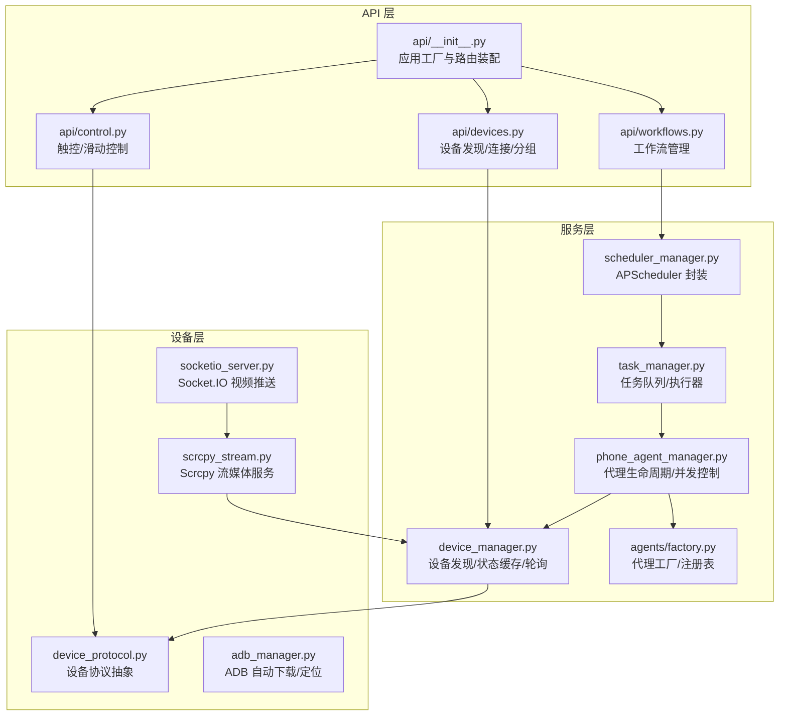
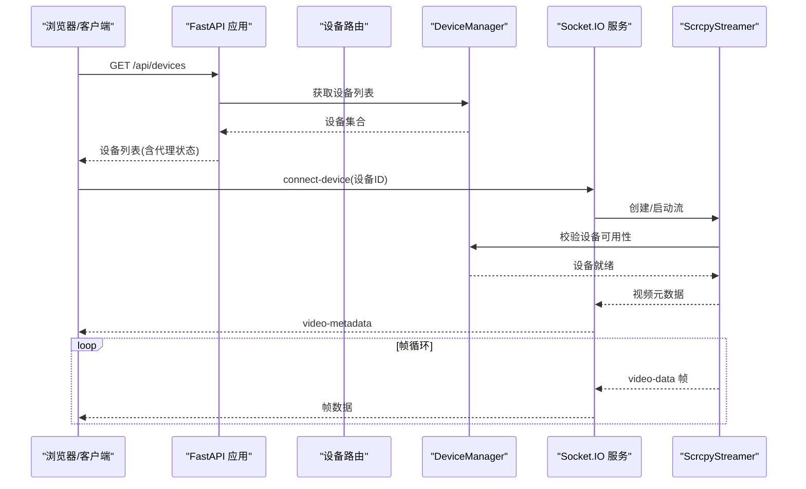
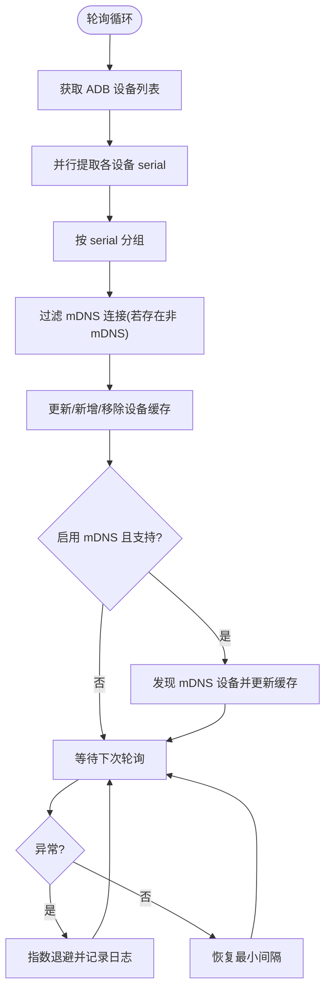
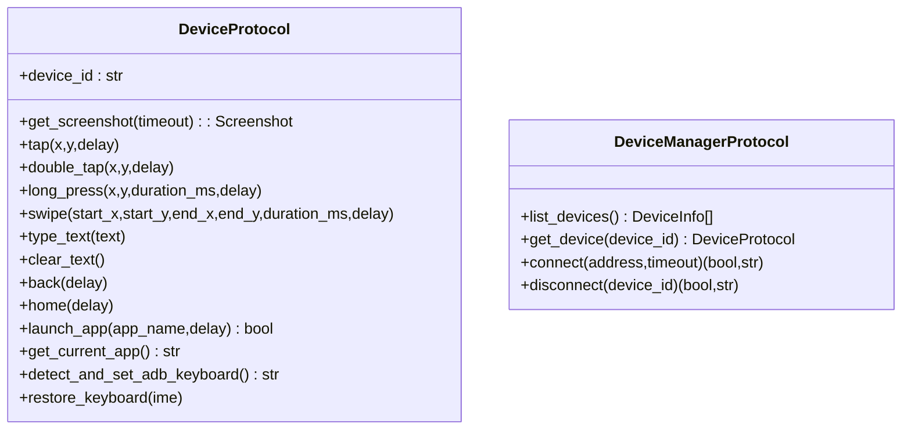
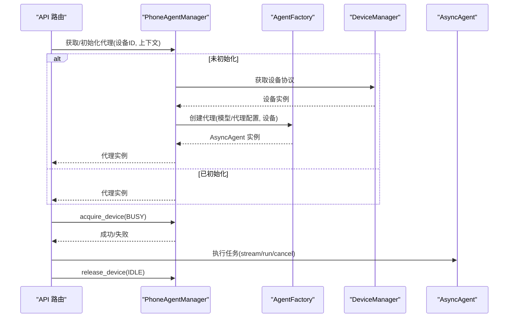
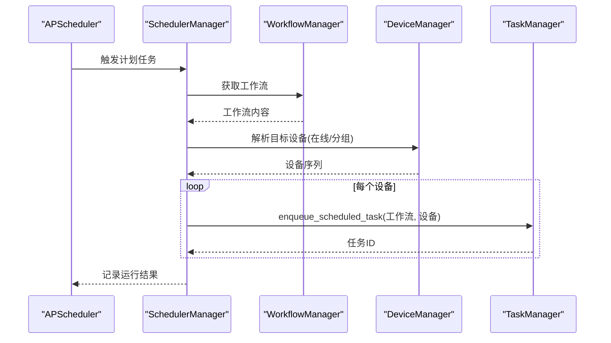
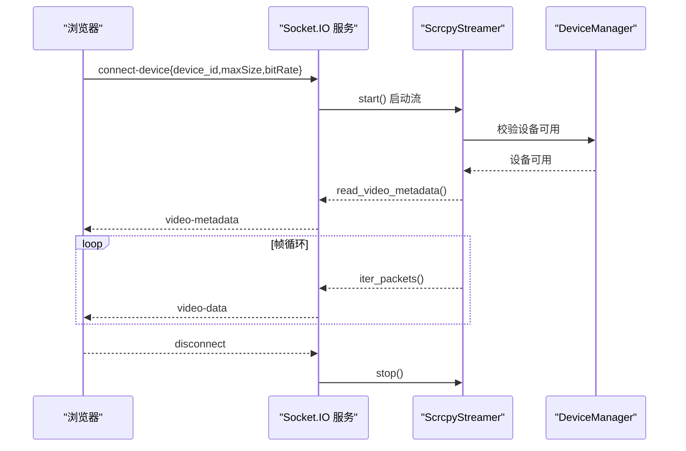
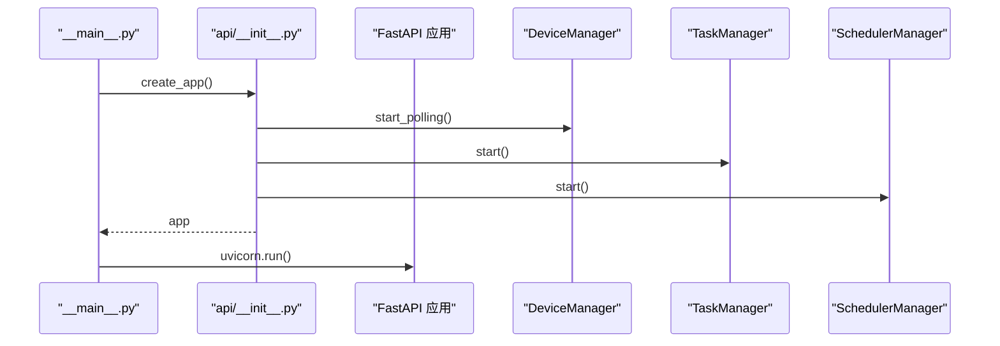
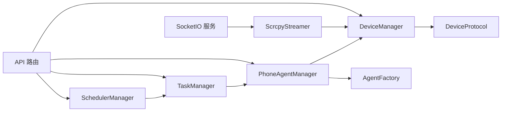

# 组件交互关系

<cite>
**本文引用的文件**
- [device_manager.py](file://AutoGLM_GUI/device_manager.py)
- [adb_manager.py](file://AutoGLM_GUI/adb_manager.py)
- [socketio_server.py](file://AutoGLM_GUI/socketio_server.py)
- [scrcpy_stream.py](file://AutoGLM_GUI/scrcpy_stream.py)
- [device_protocol.py](file://AutoGLM_GUI/device_protocol.py)
- [phone_agent_manager.py](file://AutoGLM_GUI/phone_agent_manager.py)
- [agents/factory.py](file://AutoGLM_GUI/agents/factory.py)
- [api/__init__.py](file://AutoGLM_GUI/api/__init__.py)
- [api/devices.py](file://AutoGLM_GUI/api/devices.py)
- [api/control.py](file://AutoGLM_GUI/api/control.py)
- [api/workflows.py](file://AutoGLM_GUI/api/workflows.py)
- [scheduler_manager.py](file://AutoGLM_GUI/scheduler_manager.py)
- [task_manager.py](file://AutoGLM_GUI/task_manager.py)
- [__main__.py](file://AutoGLM_GUI/__main__.py)
</cite>

## 目录
1. [简介](#简介)
2. [项目结构](#项目结构)
3. [核心组件](#核心组件)
4. [架构总览](#架构总览)
5. [详细组件分析](#详细组件分析)
6. [依赖分析](#依赖分析)
7. [性能考虑](#性能考虑)
8. [故障排查指南](#故障排查指南)
9. [结论](#结论)
10. [附录](#附录)

## 简介
本文件聚焦 AutoGLM-GUI 的组件交互关系，系统性梳理设备管理器、代理工厂、API 路由与 Socket.IO 服务器之间的协作模式，解释事件驱动与观察者模式的应用、生命周期管理与依赖注入、异步并发与资源管理、以及组件解耦与扩展机制。文档同时提供关键流程的时序图与架构图，帮助读者快速理解系统运行机制。

## 项目结构
AutoGLM-GUI 采用“API 层 + 服务层 + 设备层”的分层设计：
- API 层：FastAPI 路由定义与静态资源托管，负责请求接入与响应封装。
- 服务层：设备管理、任务编排、调度、代理管理等核心业务服务。
- 设备层：ADB/远程设备协议抽象与实现，Scrcpy 视频流服务。

图表来源
- [api/__init__.py:135-289](file://AutoGLM_GUI/api/__init__.py#L135-L289)
- [device_manager.py:249-670](file://AutoGLM_GUI/device_manager.py#L249-L670)
- [phone_agent_manager.py:52-799](file://AutoGLM_GUI/phone_agent_manager.py#L52-L799)
- [agents/factory.py:20-283](file://AutoGLM_GUI/agents/factory.py#L20-L283)
- [task_manager.py:30-800](file://AutoGLM_GUI/task_manager.py#L30-L800)
- [scheduler_manager.py:31-523](file://AutoGLM_GUI/scheduler_manager.py#L31-L523)
- [device_protocol.py:48-267](file://AutoGLM_GUI/device_protocol.py#L48-L267)
- [scrcpy_stream.py:119-629](file://AutoGLM_GUI/scrcpy_stream.py#L119-L629)
- [socketio_server.py:27-215](file://AutoGLM_GUI/socketio_server.py#L27-L215)
- [adb_manager.py:33-143](file://AutoGLM_GUI/adb_manager.py#L33-L143)

章节来源
- [api/__init__.py:135-289](file://AutoGLM_GUI/api/__init__.py#L135-L289)
- [device_manager.py:249-670](file://AutoGLM_GUI/device_manager.py#L249-L670)
- [phone_agent_manager.py:52-799](file://AutoGLM_GUI/phone_agent_manager.py#L52-L799)
- [agents/factory.py:20-283](file://AutoGLM_GUI/agents/factory.py#L20-L283)
- [task_manager.py:30-800](file://AutoGLM_GUI/task_manager.py#L30-L800)
- [scheduler_manager.py:31-523](file://AutoGLM_GUI/scheduler_manager.py#L31-L523)
- [device_protocol.py:48-267](file://AutoGLM_GUI/device_protocol.py#L48-L267)
- [scrcpy_stream.py:119-629](file://AutoGLM_GUI/scrcpy_stream.py#L119-L629)
- [socketio_server.py:27-215](file://AutoGLM_GUI/socketio_server.py#L27-L215)
- [adb_manager.py:33-143](file://AutoGLM_GUI/adb_manager.py#L33-L143)

## 核心组件
- 设备管理器（DeviceManager）：后台轮询设备列表，聚合多连接设备，维护设备状态与主连接；提供 WiFi 连接、断开、配对等能力。
- 设备协议（DeviceProtocol）：抽象设备操作接口，屏蔽 ADB/远程/无障碍等实现差异。
- 代理工厂（AgentFactory）：注册与创建不同类型的 AsyncAgent，支持扩展新代理类型。
- 代理管理器（PhoneAgentManager）：管理代理生命周期、并发控制、状态机、取消处理与上下文隔离。
- 任务管理器（TaskManager）：基于 per-device worker 的队列化执行模型，支持经典/分层/经验报告等执行器。
- 调度管理器（SchedulerManager）：基于 APScheduler 的定时任务管理，支持 cron 表达式与任务持久化。
- Socket.IO 服务器（SocketIOServer）：基于 AsyncServer 的视频流推送，与 ScrcpyStreamer 协作。
- Scrcpy 流媒体（ScrcpyStreamer）：设备侧 scrcpy-server 推送、端口转发、TCP 连接与帧解析。
- ADB 管理器（ADBManager）：自动下载/定位 ADB，提供平台工具链可用性保障。

章节来源
- [device_manager.py:249-670](file://AutoGLM_GUI/device_manager.py#L249-L670)
- [device_protocol.py:48-267](file://AutoGLM_GUI/device_protocol.py#L48-L267)
- [agents/factory.py:20-283](file://AutoGLM_GUI/agents/factory.py#L20-L283)
- [phone_agent_manager.py:52-799](file://AutoGLM_GUI/phone_agent_manager.py#L52-L799)
- [task_manager.py:30-800](file://AutoGLM_GUI/task_manager.py#L30-L800)
- [scheduler_manager.py:31-523](file://AutoGLM_GUI/scheduler_manager.py#L31-L523)
- [socketio_server.py:27-215](file://AutoGLM_GUI/socketio_server.py#L27-L215)
- [scrcpy_stream.py:119-629](file://AutoGLM_GUI/scrcpy_stream.py#L119-L629)
- [adb_manager.py:33-143](file://AutoGLM_GUI/adb_manager.py#L33-L143)

## 架构总览
系统通过 FastAPI 应用工厂集中装配路由与静态资源，启动阶段初始化 DeviceManager 轮询、TaskManager 与 SchedulerManager 生命周期。API 路由作为入口协调设备管理、代理管理与任务调度，Socket.IO 与 Scrcpy 共同完成实时视频预览。

图表来源
- [api/devices.py:92-113](file://AutoGLM_GUI/api/devices.py#L92-L113)
- [device_manager.py:435-670](file://AutoGLM_GUI/device_manager.py#L435-L670)
- [socketio_server.py:148-215](file://AutoGLM_GUI/socketio_server.py#L148-L215)
- [scrcpy_stream.py:203-245](file://AutoGLM_GUI/scrcpy_stream.py#L203-L245)

## 详细组件分析

### 设备管理器（DeviceManager）
- 职责：后台线程轮询 ADB 设备，聚合多连接设备，维护主连接与设备状态；支持 WiFi 连接/断开/配对；集成 mDNS 发现。
- 关键机制：
  - 后台轮询：线程 + Event 控制，指数退避失败重试。
  - 多连接聚合：按 serial 聚合，过滤重复/冗余连接，优先选择最佳主连接。
  - 线程安全：RWMutex 保护缓存与映射更新。
  - mDNS 支持：延迟检测 ADB 是否支持 mDNS，避免不兼容环境报错。
- 与 API 的交互：设备路由在轮询未启动时触发强制刷新，确保 API 返回最新设备状态。

图表来源
- [device_manager.py:435-670](file://AutoGLM_GUI/device_manager.py#L435-L670)

章节来源
- [device_manager.py:249-670](file://AutoGLM_GUI/device_manager.py#L249-L670)

### 设备协议（DeviceProtocol）
- 职责：定义统一的设备操作接口（截图、触摸、滑动、文本输入、导航、键盘管理等），屏蔽底层实现差异。
- 设计要点：通过 Protocol/runtime_checkable 支持运行时类型检查；DeviceManagerProtocol 抽象设备管理器，便于替换实现。

图表来源
- [device_protocol.py:48-267](file://AutoGLM_GUI/device_protocol.py#L48-L267)

章节来源
- [device_protocol.py:48-267](file://AutoGLM_GUI/device_protocol.py#L48-L267)

### 代理工厂与代理管理器
- 代理工厂（AgentFactory）：注册多种 AsyncAgent 创建器，提供统一创建接口；内置 GLM/Qwen/Gemini/Midscene/DroidRun 等实现。
- 代理管理器（PhoneAgentManager）：单例管理代理生命周期与并发，提供原子状态机（IDLE/BUSY/ERROR/INITIALIZING）、上下文隔离（device_id:context）、取消处理与自动初始化。

图表来源
- [phone_agent_manager.py:109-215](file://AutoGLM_GUI/phone_agent_manager.py#L109-L215)
- [agents/factory.py:49-98](file://AutoGLM_GUI/agents/factory.py#L49-L98)
- [device_manager.py:152-180](file://AutoGLM_GUI/device_manager.py#L152-L180)

章节来源
- [phone_agent_manager.py:52-799](file://AutoGLM_GUI/phone_agent_manager.py#L52-L799)
- [agents/factory.py:20-283](file://AutoGLM_GUI/agents/factory.py#L20-L283)

### 任务管理器与调度管理器
- 任务管理器（TaskManager）：per-device worker 队列化执行，注册多种执行器（经典聊天、分层聊天、经验报告、计划任务等），支持取消与进度事件写入。
- 调度管理器（SchedulerManager）：基于 APScheduler 的 cron 任务，解析目标设备（单个/分组），将任务入队至 TaskManager。

图表来源
- [scheduler_manager.py:355-467](file://AutoGLM_GUI/scheduler_manager.py#L355-L467)
- [task_manager.py:366-390](file://AutoGLM_GUI/task_manager.py#L366-L390)

章节来源
- [scheduler_manager.py:31-523](file://AutoGLM_GUI/scheduler_manager.py#L31-L523)
- [task_manager.py:30-800](file://AutoGLM_GUI/task_manager.py#L30-L800)

### Socket.IO 服务器与 Scrcpy 流媒体
- Socket.IO 服务器：接收 connect-device 请求，按设备加锁防止并发连接，启动 ScrcpyStreamer，推送视频元数据与帧数据。
- Scrcpy 流媒体：清理旧进程、推送服务器、端口转发、连接 TCP socket、解析媒体包、提供迭代器。

图表来源
- [socketio_server.py:148-215](file://AutoGLM_GUI/socketio_server.py#L148-L215)
- [scrcpy_stream.py:203-245](file://AutoGLM_GUI/scrcpy_stream.py#L203-L245)
- [device_manager.py:212-246](file://AutoGLM_GUI/device_manager.py#L212-L246)

章节来源
- [socketio_server.py:27-215](file://AutoGLM_GUI/socketio_server.py#L27-L215)
- [scrcpy_stream.py:119-629](file://AutoGLM_GUI/scrcpy_stream.py#L119-L629)

### API 路由与生命周期
- 应用工厂（api/__init__.py）：组合 FastAPI 应用、CORS、静态资源、SPA 路由与 MCP；在 lifespan 中启动 DeviceManager 轮询、TaskManager 与 SchedulerManager。
- 设备路由（api/devices.py）：聚合设备信息与代理状态，提供 WiFi 连接/断开/配对、mDNS 发现、QR 配对、远程设备管理、设备分组等。
- 控制路由（api/control.py）：触控/滑动/触摸事件的异步执行，通过 asyncio.to_thread 调用设备实现。
- 工作流路由（api/workflows.py）：工作流的增删改查。

图表来源
- [__main__.py:284-300](file://AutoGLM_GUI/__main__.py#L284-L300)
- [api/__init__.py:158-184](file://AutoGLM_GUI/api/__init__.py#L158-L184)

章节来源
- [api/__init__.py:135-289](file://AutoGLM_GUI/api/__init__.py#L135-L289)
- [api/devices.py:92-113](file://AutoGLM_GUI/api/devices.py#L92-L113)
- [api/control.py:24-119](file://AutoGLM_GUI/api/control.py#L24-L119)
- [api/workflows.py:17-74](file://AutoGLM_GUI/api/workflows.py#L17-L74)
- [__main__.py:78-300](file://AutoGLM_GUI/__main__.py#L78-L300)

## 依赖分析
- 组件耦合与内聚：
  - DeviceManager 与 DeviceProtocol：通过协议抽象实现设备层解耦，DeviceManager 仅依赖协议接口。
  - PhoneAgentManager 与 AgentFactory：通过工厂注册表实现代理类型解耦，新增代理只需注册创建器。
  - TaskManager 与 PhoneAgentManager：通过 acquire/release 与 abort_handler 实现并发与取消解耦。
  - SocketIO 与 Scrcpy：通过事件驱动与异步任务协作，避免阻塞主线程。
- 外部依赖：
  - ADB 工具链：通过 adb_manager 自动下载/定位，保障跨平台可用性。
  - APScheduler：提供定时任务调度能力，支持持久化与动态启停。
  - FastAPI/Socket.IO：提供高性能异步 Web 服务与实时推送。

图表来源
- [device_manager.py:249-670](file://AutoGLM_GUI/device_manager.py#L249-L670)
- [phone_agent_manager.py:52-799](file://AutoGLM_GUI/phone_agent_manager.py#L52-L799)
- [agents/factory.py:20-283](file://AutoGLM_GUI/agents/factory.py#L20-L283)
- [task_manager.py:30-800](file://AutoGLM_GUI/task_manager.py#L30-L800)
- [scheduler_manager.py:31-523](file://AutoGLM_GUI/scheduler_manager.py#L31-L523)
- [socketio_server.py:27-215](file://AutoGLM_GUI/socketio_server.py#L27-L215)
- [scrcpy_stream.py:119-629](file://AutoGLM_GUI/scrcpy_stream.py#L119-L629)
- [api/devices.py:92-113](file://AutoGLM_GUI/api/devices.py#L92-L113)

章节来源
- [device_manager.py:249-670](file://AutoGLM_GUI/device_manager.py#L249-L670)
- [phone_agent_manager.py:52-799](file://AutoGLM_GUI/phone_agent_manager.py#L52-L799)
- [agents/factory.py:20-283](file://AutoGLM_GUI/agents/factory.py#L20-L283)
- [task_manager.py:30-800](file://AutoGLM_GUI/task_manager.py#L30-L800)
- [scheduler_manager.py:31-523](file://AutoGLM_GUI/scheduler_manager.py#L31-L523)
- [socketio_server.py:27-215](file://AutoGLM_GUI/socketio_server.py#L27-L215)
- [scrcpy_stream.py:119-629](file://AutoGLM_GUI/scrcpy_stream.py#L119-L629)
- [api/devices.py:92-113](file://AutoGLM_GUI/api/devices.py#L92-L113)

## 性能考虑
- 并发与资源管理：
  - DeviceManager 使用线程池并行提取设备 serial，减少轮询总耗时。
  - Socket.IO 与 Scrcpy 使用 asyncio 与异步任务，避免阻塞。
  - TaskManager per-device worker 队列化执行，避免设备级竞争。
- 资源清理：
  - ScrcpyStreamer 在 stop() 中终止进程、关闭 socket、移除端口转发。
  - SocketIO 服务在 disconnect 或异常时清理任务与流。
- 退避与容错：
  - 设备轮询指数退避，降低 ADB 不可用时的负载。
  - 代理管理器在 acquire_device_async 中对取消进行清理，避免悬挂锁。

## 故障排查指南
- 设备离线/不可用：
  - 检查 DeviceManager 轮询是否启动与状态更新；必要时触发 force_refresh。
  - Socket.IO 启动失败时，查看端口占用与设备可用性。
- 代理初始化失败：
  - 查看 PhoneAgentManager 的错误状态与异常消息；确认设备协议可用与配置正确。
- 任务执行中断：
  - 检查 TaskManager 的取消请求与 abort_handler 注册；确认代理支持取消。
- 定时任务未执行：
  - 检查 SchedulerManager 的 cron 表达式与任务持久化文件；确认设备在线状态。

章节来源
- [device_manager.py:435-670](file://AutoGLM_GUI/device_manager.py#L435-L670)
- [socketio_server.py:50-87](file://AutoGLM_GUI/socketio_server.py#L50-L87)
- [phone_agent_manager.py:692-758](file://AutoGLM_GUI/phone_agent_manager.py#L692-L758)
- [task_manager.py:408-433](file://AutoGLM_GUI/task_manager.py#L408-L433)
- [scheduler_manager.py:491-520](file://AutoGLM_GUI/scheduler_manager.py#L491-L520)

## 结论
AutoGLM-GUI 通过协议抽象与工厂模式实现了设备与代理的解耦，借助异步与并发模型保证了高吞吐与低延迟。API 层统一入口、服务层清晰职责、设备层屏蔽差异，整体架构具备良好的扩展性与可维护性。建议在扩展新代理或设备实现时遵循现有接口与生命周期约定，确保一致的并发与错误处理行为。

## 附录
- 初始化与启动顺序（概览）：
  - CLI 启动 → 配置加载 → ADB 确认 → 创建 DeviceManager 单例 → FastAPI 应用工厂 → 启动 DeviceManager 轮询/TaskManager/SchedulerManager → Uvicorn 运行。
- 关键扩展点：
  - 新增代理类型：在 AgentFactory 注册创建器。
  - 新增设备实现：实现 DeviceProtocol 并在 DeviceManager 中接入。
  - 新增执行器：在 TaskManager 注册执行器键与实现。

章节来源
- [__main__.py:213-300](file://AutoGLM_GUI/__main__.py#L213-L300)
- [api/__init__.py:158-184](file://AutoGLM_GUI/api/__init__.py#L158-L184)
- [agents/factory.py:20-283](file://AutoGLM_GUI/agents/factory.py#L20-L283)
- [device_protocol.py:48-267](file://AutoGLM_GUI/device_protocol.py#L48-L267)
- [task_manager.py:57-58](file://AutoGLM_GUI/task_manager.py#L57-L58)