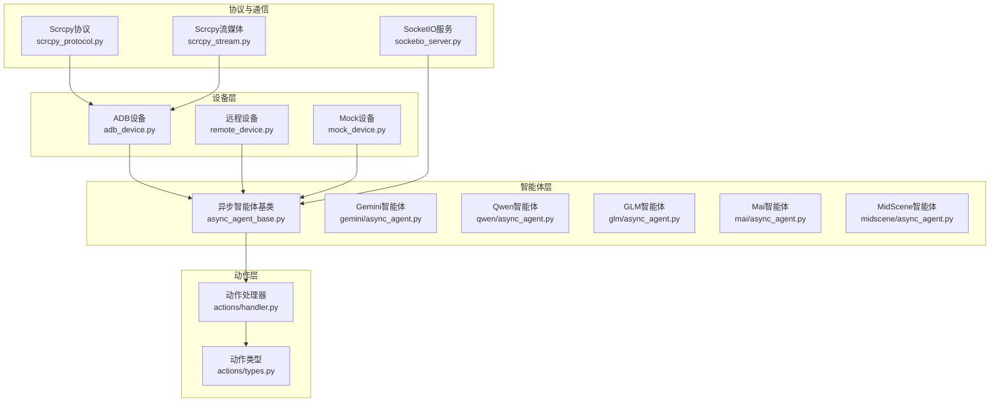
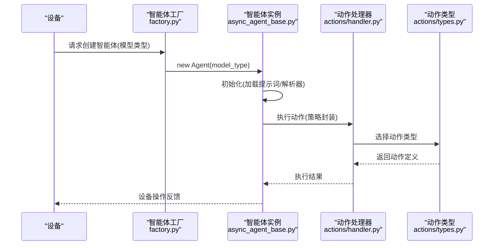
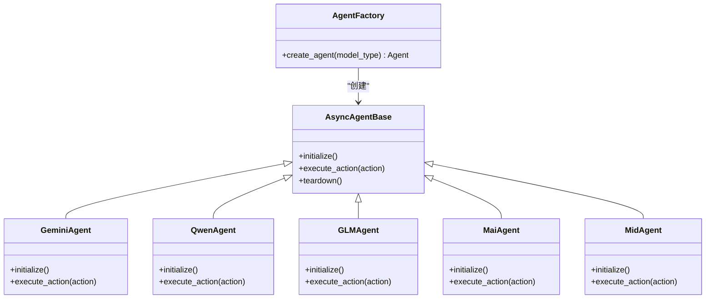
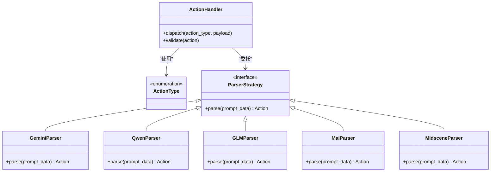
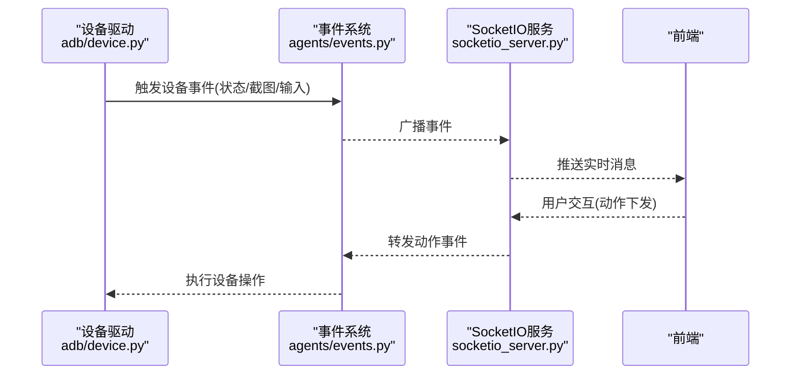
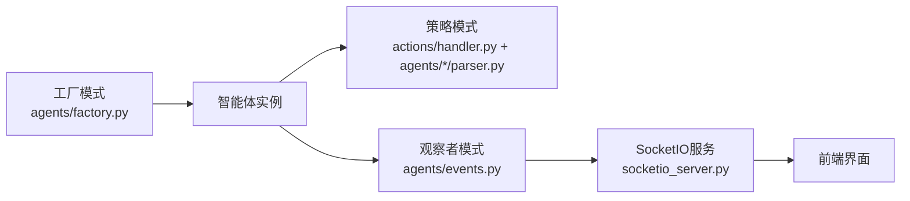
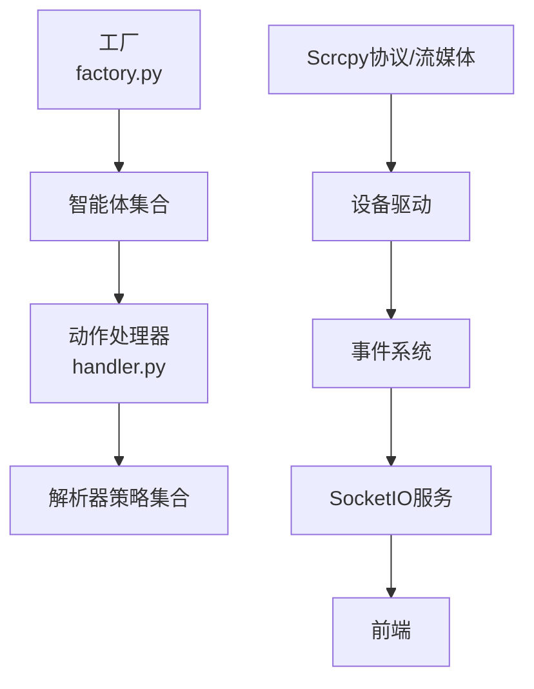

# 设计模式应用

<cite>
**本文引用的文件**
- [factory.py](file://AutoGLM_GUI/agents/factory.py)
- [protocols.py](file://AutoGLM_GUI/agents/protocols.py)
- [events.py](file://AutoGLM_GUI/agents/events.py)
- [handler.py](file://AutoGLM_GUI/actions/handler.py)
- [types.py](file://AutoGLM_GUI/actions/types.py)
- [device.py](file://AutoGLM_GUI/adb/device.py)
- [device.py](file://AutoGLM_GUI/adb_plus/device.py)
- [adb_device.py](file://AutoGLM_GUI/devices/adb_device.py)
- [mock_device.py](file://AutoGLM_GUI/devices/mock_device.py)
- [remote_device.py](file://AutoGLM_GUI/devices/remote_device.py)
- [async_agent_base.py](file://AutoGLM_GUI/agents/base/async_agent_base.py)
- [async_agent.py](file://AutoGLM_GUI/agents/gemini/async_agent.py)
- [parser.py](file://AutoGLM_GUI/agents/gemini/action_mapper.py)
- [prompts.py](file://AutoGLM_GUI/agents/gemini/prompts.py)
- [async_agent.py](file://AutoGLM_GUI/agents/glm/async_agent.py)
- [parser.py](file://AutoGLM_GUI/agents/glm/parser.py)
- [prompts_en.py](file://AutoGLM_GUI/agents/glm/prompts_en.py)
- [async_agent.py](file://AutoGLM_GUI/agents/qwen/async_agent.py)
- [parser.py](file://AutoGLM_GUI/agents/qwen/parser.py)
- [prompts_en.py](file://AutoGLM_GUI/agents/qwen/prompts_en.py)
- [prompts_zh.py](file://AutoGLM_GUI/agents/qwen/prompts_zh.py)
- [async_agent.py](file://AutoGLM_GUI/agents/mai/async_agent.py)
- [parser.py](file://AutoGLM_GUI/agents/mai/parser.py)
- [traj_memory.py](file://AutoGLM_GUI/agents/mai/traj_memory.py)
- [async_agent.py](file://AutoGLM_GUI/agents/midscene/async_agent.py)
- [log_parser.py](file://AutoGLM_GUI/agents/midscene/log_parser.py)
- [__main__.py](file://AutoGLM_GUI/__main__.py)
- [server.py](file://AutoGLM_GUI/server.py)
- [socketio_server.py](file://AutoGLM_GUI/socketio_server.py)
- [device_manager.py](file://AutoGLM_GUI/device_manager.py)
- [device_group_manager.py](file://AutoGLM_GUI/device_group_manager.py)
- [phone_agent_manager.py](file://AutoGLM_GUI/phone_agent_manager.py)
- [task_manager.py](file://AutoGLM_GUI/task_manager.py)
- [history_manager.py](file://AutoGLM_GUI/history_manager.py)
- [experience_planner.py](file://AutoGLM_GUI/experience_planner.py)
- [workflow_manager.py](file://AutoGLM_GUI/workflow_manager.py)
- [scheduler_manager.py](file://AutoGLM_GUI/scheduler_manager.py)
- [metrics.py](file://AutoGLM_GUI/metrics.py)
- [trace.py](file://AutoGLM_GUI/trace.py)
- [trace_export.py](file://AutoGLM_GUI/trace_export.py)
- [adb_manager.py](file://AutoGLM_GUI/adb_manager.py)
- [adb_terminal_service.py](file://AutoGLM_GUI/adb_terminal_service.py)
- [adb_terminal_repl.py](file://AutoGLM_GUI/adb_terminal_repl.py)
- [layered_agent_service.py](file://AutoGLM_GUI/layered_agent_service.py)
- [scrcpy_protocol.py](file://AutoGLM_GUI/scrcpy_protocol.py)
- [scrcpy_stream.py](file://AutoGLM_GUI/scrcpy_stream.py)
- [screenshot.py](file://AutoGLM_GUI/adb/screenshot.py)
- [screenshot.py](file://AutoGLM_GUI/adb_plus/screenshot.py)
- [input.py](file://AutoGLM_GUI/adb/input.py)
- [timing.py](file://AutoGLM_GUI/adb/timing.py)
- [connection.py](file://AutoGLM_GUI/adb/connection.py)
- [apps.py](file://AutoGLM_GUI/adb/apps.py)
- [version.py](file://AutoGLM_GUI/adb_plus/version.py)
- [serial.py](file://AutoGLM_GUI/adb_plus/serial.py)
- [ip.py](file://AutoGLM_GUI/adb_plus/ip.py)
- [mdns.py](file://AutoGLM_GUI/adb_plus/mdns.py)
- [pair.py](file://AutoGLM_GUI/adb_plus/pair.py)
- [qr_pair.py](file://AutoGLM_GUI/adb_plus/qr_pair.py)
- [touch.py](file://AutoGLM_GUI/adb_plus/touch.py)
- [display.py](file://AutoGLM_GUI/adb_plus/display.py)
- [keyboard_installer.py](file://AutoGLM_GUI/adb_plus/keyboard_installer.py)
- [error_details.py](file://AutoGLM_GUI/model/error_details.py)
- [message_builder.py](file://AutoGLM_GUI/model/message_builder.py)
- [device_group.py](file://AutoGLM_GUI/models/device_group.py)
- [history.py](file://AutoGLM_GUI/models/history.py)
- [scheduled_task.py](file://AutoGLM_GUI/models/scheduled_task.py)
- [__init__.py](file://AutoGLM_GUI/devices/__init__.py)
- [__init__.py](file://AutoGLM_GUI/agents/__init__.py)
- [__init__.py](file://AutoGLM_GUI/actions/__init__.py)
- [__init__.py](file://AutoGLM_GUI/adb/__init__.py)
- [__init__.py](file://AutoGLM_GUI/adb_plus/__init__.py)
- [__init__.py](file://AutoGLM_GUI/models/__init__.py)
- [__init__.py](file://AutoGLM_GUI/api/__init__.py)
- [__init__.py](file://AutoGLM_GUI/agents/base/__init__.py)
- [__init__.py](file://AutoGLM_GUI/agents/droidrun/__init__.py)
- [__init__.py](file://AutoGLM_GUI/agents/gemini/__init__.py)
- [__init__.py](file://AutoGLM_GUI/agents/glm/__init__.py)
- [__init__.py](file://AutoGLM_GUI/agents/mai/__init__.py)
- [__init__.py](file://AutoGLM_GUI/agents/midscene/__init__.py)
- [__init__.py](file://AutoGLM_GUI/agents/qwen/__init__.py)
</cite>

## 目录
1. [引言](#引言)
2. [项目结构](#项目结构)
3. [核心组件](#核心组件)
4. [架构总览](#架构总览)
5. [详细组件分析](#详细组件分析)
6. [依赖分析](#依赖分析)
7. [性能考虑](#性能考虑)
8. [故障排查指南](#故障排查指南)
9. [结论](#结论)
10. [附录](#附录)

## 引言
本文件聚焦AutoGLM-GUI在设备与智能体交互场景下的设计模式应用，系统梳理工厂模式（代理创建）、策略模式（多模型适配）、观察者模式（设备状态监听）等核心模式，并结合实际代码路径给出类图与时序图，帮助读者理解如何通过模式提升代码复用性、可扩展性与可维护性。

## 项目结构
AutoGLM-GUI围绕“设备管理”“智能体编排”“动作执行”三大主线展开，采用分层与模块化组织：
- 设备层：ADB设备、远程设备、Mock设备，统一抽象于设备接口
- 智能体层：多模型适配器（Gemini/Qwen/GLM/Mai/MidScene），统一异步基类
- 动作层：动作类型与处理器，策略化封装
- 协议与通信：SocketIO服务、Scrcpy协议与流媒体
- 管理与调度：设备组、任务、历史、工作流、指标与追踪

图表来源
- [adb_device.py](file://AutoGLM_GUI/devices/adb_device.py)
- [remote_device.py](file://AutoGLM_GUI/devices/remote_device.py)
- [mock_device.py](file://AutoGLM_GUI/devices/mock_device.py)
- [async_agent_base.py](file://AutoGLM_GUI/agents/base/async_agent_base.py)
- [async_agent.py](file://AutoGLM_GUI/agents/gemini/async_agent.py)
- [async_agent.py](file://AutoGLM_GUI/agents/qwen/async_agent.py)
- [async_agent.py](file://AutoGLM_GUI/agents/glm/async_agent.py)
- [async_agent.py](file://AutoGLM_GUI/agents/mai/async_agent.py)
- [async_agent.py](file://AutoGLM_GUI/agents/midscene/async_agent.py)
- [types.py](file://AutoGLM_GUI/actions/types.py)
- [handler.py](file://AutoGLM_GUI/actions/handler.py)
- [socketio_server.py](file://AutoGLM_GUI/socketio_server.py)
- [scrcpy_protocol.py](file://AutoGLM_GUI/scrcpy_protocol.py)
- [scrcpy_stream.py](file://AutoGLM_GUI/scrcpy_stream.py)

章节来源
- [__main__.py](file://AutoGLM_GUI/__main__.py)
- [server.py](file://AutoGLM_GUI/server.py)

## 核心组件
- 工厂模式：代理工厂负责按模型类型创建对应智能体实例，解耦上层调用与具体实现
- 策略模式：动作类型与解析器策略封装不同模型的动作映射与提示词，便于替换与扩展
- 观察者模式：设备状态事件广播与订阅，配合SocketIO推送前端实时更新

章节来源
- [factory.py](file://AutoGLM_GUI/agents/factory.py)
- [protocols.py](file://AutoGLM_GUI/agents/protocols.py)
- [events.py](file://AutoGLM_GUI/agents/events.py)
- [handler.py](file://AutoGLM_GUI/actions/handler.py)
- [types.py](file://AutoGLM_GUI/actions/types.py)

## 架构总览
下图展示从设备到智能体再到动作执行的关键交互，体现工厂+策略+观察者协同：

图表来源
- [factory.py](file://AutoGLM_GUI/agents/factory.py)
- [async_agent_base.py](file://AutoGLM_GUI/agents/base/async_agent_base.py)
- [handler.py](file://AutoGLM_GUI/actions/handler.py)
- [types.py](file://AutoGLM_GUI/actions/types.py)

## 详细组件分析

### 工厂模式：代理工厂与智能体创建
- 目标：根据配置或请求动态创建不同模型的智能体实例，屏蔽具体类名与初始化细节
- 关键点：
  - 工厂方法集中管理模型映射与实例化参数
  - 智能体基类统一生命周期与接口契约
  - 支持热插拔新增模型类型，无需修改上层调用逻辑

图表来源
- [factory.py](file://AutoGLM_GUI/agents/factory.py)
- [async_agent_base.py](file://AutoGLM_GUI/agents/base/async_agent_base.py)
- [async_agent.py](file://AutoGLM_GUI/agents/gemini/async_agent.py)
- [async_agent.py](file://AutoGLM_GUI/agents/qwen/async_agent.py)
- [async_agent.py](file://AutoGLM_GUI/agents/glm/async_agent.py)
- [async_agent.py](file://AutoGLM_GUI/agents/mai/async_agent.py)
- [async_agent.py](file://AutoGLM_GUI/agents/midscene/async_agent.py)

章节来源
- [factory.py](file://AutoGLM_GUI/agents/factory.py)
- [async_agent_base.py](file://AutoGLM_GUI/agents/base/async_agent_base.py)

### 策略模式：动作类型与解析器策略
- 目标：将动作定义与执行策略解耦，使不同模型的动作映射与提示词可独立演进
- 关键点：
  - 动作类型枚举与数据结构定义集中于types.py
  - 解析器策略封装模型特定的提示词与动作映射
  - 处理器根据当前策略选择合适的动作执行路径

图表来源
- [handler.py](file://AutoGLM_GUI/actions/handler.py)
- [types.py](file://AutoGLM_GUI/actions/types.py)
- [parser.py](file://AutoGLM_GUI/agents/gemini/action_mapper.py)
- [parser.py](file://AutoGLM_GUI/agents/glm/parser.py)
- [parser.py](file://AutoGLM_GUI/agents/qwen/parser.py)
- [parser.py](file://AutoGLM_GUI/agents/mai/parser.py)
- [log_parser.py](file://AutoGLM_GUI/agents/midscene/log_parser.py)

章节来源
- [handler.py](file://AutoGLM_GUI/actions/handler.py)
- [types.py](file://AutoGLM_GUI/actions/types.py)

### 观察者模式：设备状态监听与事件广播
- 目标：设备状态变化（连接、截图、输入事件等）通过事件机制通知订阅者，前端实时刷新
- 关键点：
  - 事件定义集中于events.py，统一事件命名与载荷结构
  - 设备驱动抽象于device.py，向上抛出标准化事件
  - SocketIO服务订阅事件并推送到前端

图表来源
- [device.py](file://AutoGLM_GUI/adb/device.py)
- [events.py](file://AutoGLM_GUI/agents/events.py)
- [socketio_server.py](file://AutoGLM_GUI/socketio_server.py)

章节来源
- [device.py](file://AutoGLM_GUI/adb/device.py)
- [events.py](file://AutoGLM_GUI/agents/events.py)

### 模式组合：工厂+策略+观察者协同
- 场景：当用户选择某模型并绑定设备后，系统通过工厂创建智能体，智能体基于策略解析动作，设备状态通过观察者广播至前端
- 优势：
  - 可扩展：新增模型只需注册工厂映射与解析器策略
  - 可维护：事件边界清晰，前后端解耦
  - 可复用：动作类型与处理器可在多模型间共享

图表来源
- [factory.py](file://AutoGLM_GUI/agents/factory.py)
- [handler.py](file://AutoGLM_GUI/actions/handler.py)
- [parser.py](file://AutoGLM_GUI/agents/gemini/action_mapper.py)
- [events.py](file://AutoGLM_GUI/agents/events.py)
- [socketio_server.py](file://AutoGLM_GUI/socketio_server.py)

章节来源
- [factory.py](file://AutoGLM_GUI/agents/factory.py)
- [handler.py](file://AutoGLM_GUI/actions/handler.py)
- [parser.py](file://AutoGLM_GUI/agents/gemini/action_mapper.py)
- [events.py](file://AutoGLM_GUI/agents/events.py)
- [socketio_server.py](file://AutoGLM_GUI/socketio_server.py)

## 依赖分析
- 组件内聚与耦合
  - 工厂与智能体：低耦合，通过协议接口约束
  - 动作处理器与解析器：策略接口统一，便于替换
  - 设备驱动与事件：事件作为粘合层，避免直接耦合
- 外部依赖
  - SocketIO用于实时通信
  - Scrcpy协议与流媒体用于屏幕与输入控制
  - ADB与ADB+工具链支撑设备连接与操作

图表来源
- [factory.py](file://AutoGLM_GUI/agents/factory.py)
- [handler.py](file://AutoGLM_GUI/actions/handler.py)
- [device.py](file://AutoGLM_GUI/adb/device.py)
- [socketio_server.py](file://AutoGLM_GUI/socketio_server.py)
- [scrcpy_protocol.py](file://AutoGLM_GUI/scrcpy_protocol.py)
- [scrcpy_stream.py](file://AutoGLM_GUI/scrcpy_stream.py)

章节来源
- [factory.py](file://AutoGLM_GUI/agents/factory.py)
- [handler.py](file://AutoGLM_GUI/actions/handler.py)
- [device.py](file://AutoGLM_GUI/adb/device.py)
- [socketio_server.py](file://AutoGLM_GUI/socketio_server.py)
- [scrcpy_protocol.py](file://AutoGLM_GUI/scrcpy_protocol.py)
- [scrcpy_stream.py](file://AutoGLM_GUI/scrcpy_stream.py)

## 性能考虑
- 工厂缓存：对已创建的智能体实例进行缓存，减少重复初始化开销
- 策略预热：解析器与提示词在智能体初始化阶段完成预加载，降低执行时延
- 事件节流：设备高频事件（如截图）应做节流与去重，避免前端渲染压力
- 流媒体优化：Scrcpy流媒体参数按设备分辨率与网络状况动态调整

## 故障排查指南
- 设备连接失败
  - 检查ADB/ADB+工具链可用性与权限
  - 查看设备事件日志与错误详情
- 智能体执行异常
  - 核验工厂映射是否正确
  - 检查解析器策略是否匹配当前模型
- 实时通信中断
  - 确认SocketIO服务运行状态与事件广播
  - 验证前端订阅与重连机制

章节来源
- [error_details.py](file://AutoGLM_GUI/model/error_details.py)
- [message_builder.py](file://AutoGLM_GUI/model/message_builder.py)
- [events.py](file://AutoGLM_GUI/agents/events.py)
- [socketio_server.py](file://AutoGLM_GUI/socketio_server.py)

## 结论
AutoGLM-GUI通过工厂、策略与观察者三类核心设计模式，实现了设备与智能体的松耦合、动作策略的可插拔以及状态变更的实时响应。模式组合提升了系统的可扩展性与可维护性，建议在新增模型或动作类型时遵循现有接口契约，确保平滑演进。

## 附录
- 最佳实践
  - 明确接口契约，避免在工厂与策略中引入硬编码分支
  - 将配置与策略分离，便于A/B测试与灰度发布
  - 对高频事件进行限流与批处理，保障前端流畅度
- 常见陷阱
  - 在工厂中直接实例化具体类，破坏可替换性
  - 将设备状态判断分散在各处，导致事件边界不清
  - 动作解析与设备操作耦合，增加调试难度
- 重构建议
  - 将解析器策略抽取为独立模块，支持热加载
  - 引入事件中间件，统一处理事件过滤与转换
  - 对设备驱动抽象统一接口，减少平台差异带来的复杂度