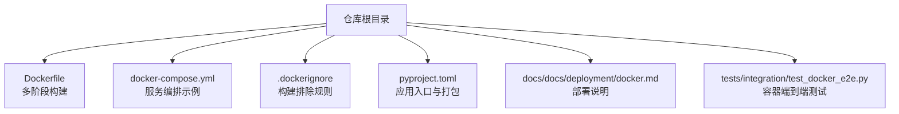
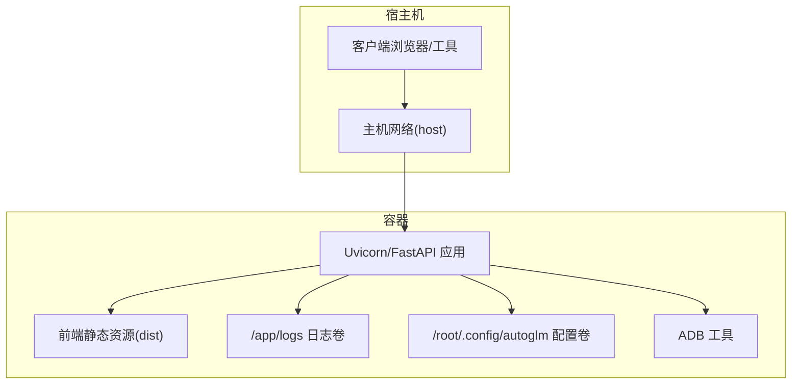
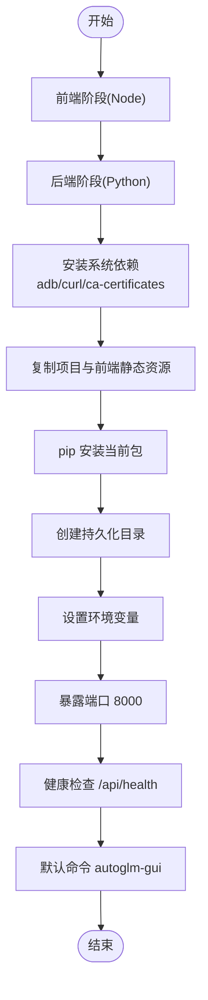
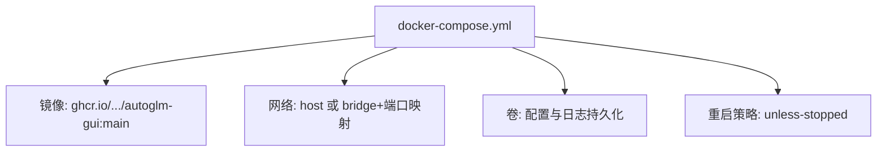
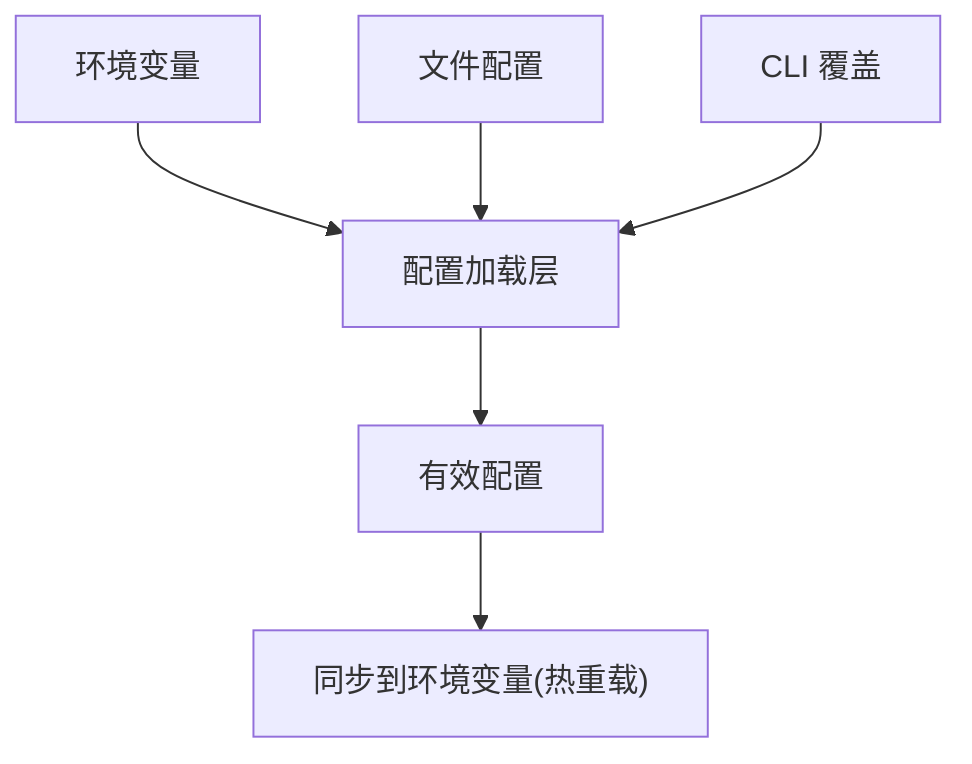
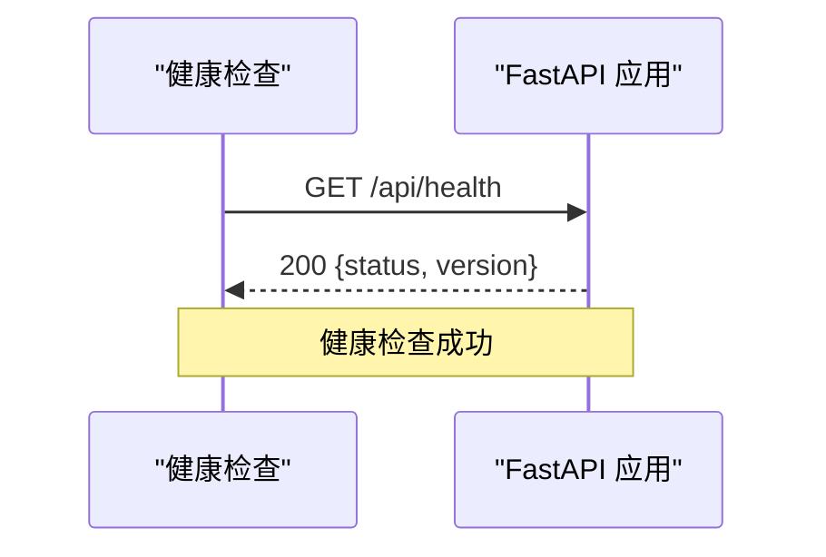
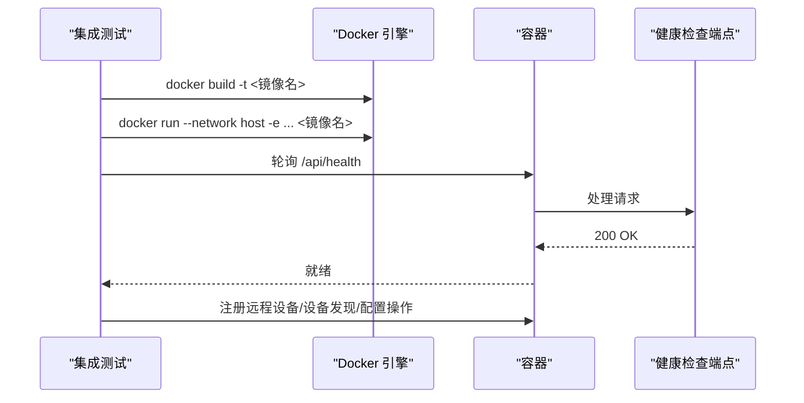
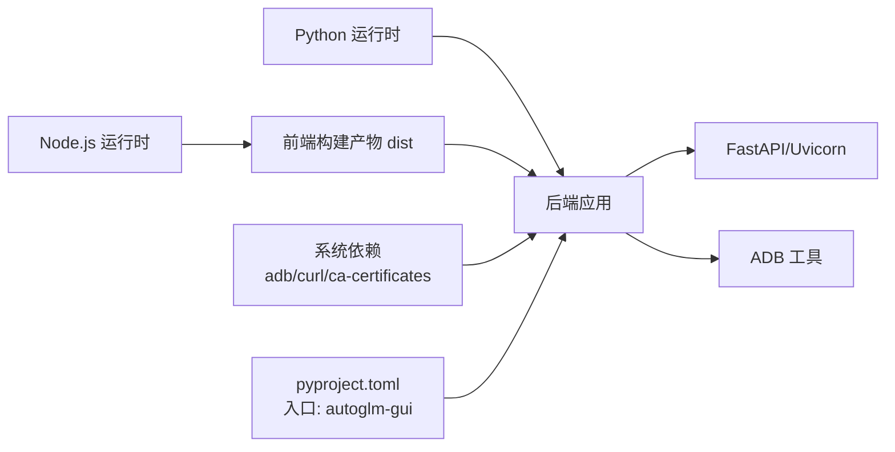
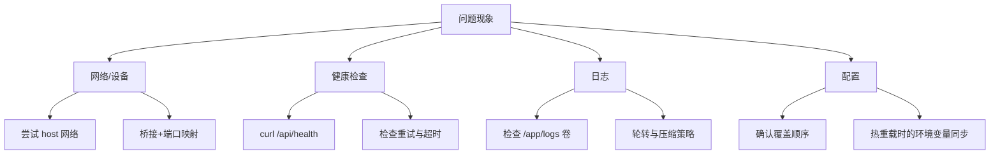

# Docker部署

<cite>
**本文引用的文件**
- [Dockerfile](file://Dockerfile)
- [docker-compose.yml](file://docker-compose.yml)
- [.dockerignore](file://.dockerignore)
- [pyproject.toml](file://pyproject.toml)
- [docs/docs/deployment/docker.md](file://docs/docs/deployment/docker.md)
- [tests/integration/test_docker_e2e.py](file://tests/integration/test_docker_e2e.py)
- [AutoGLM_GUI/api/health.py](file://AutoGLM_GUI/api/health.py)
- [AutoGLM_GUI/api/terminal.py](file://AutoGLM_GUI/api/terminal.py)
- [AutoGLM_GUI/logger.py](file://AutoGLM_GUI/logger.py)
- [AutoGLM_GUI/config_manager.py](file://AutoGLM_GUI/config_manager.py)
</cite>

## 目录
1. [简介](#简介)
2. [项目结构](#项目结构)
3. [核心组件](#核心组件)
4. [架构总览](#架构总览)
5. [详细组件分析](#详细组件分析)
6. [依赖关系分析](#依赖关系分析)
7. [性能考虑](#性能考虑)
8. [故障排查指南](#故障排查指南)
9. [结论](#结论)
10. [附录](#附录)

## 简介
本文件面向需要在服务器或本地环境中以容器方式长期运行 AutoGLM-GUI 的高级用户，系统性说明 Docker 镜像构建、容器配置与部署流程，覆盖 Dockerfile 最佳实践、docker-compose 编排、多环境部署策略、容器网络与存储、环境变量、健康检查、资源限制与安全配置，并提供日志收集与调试方法。读者无需深入理解后端实现细节，即可高效完成容器化部署与运维。

## 项目结构
仓库根目录提供完整的容器化支持：
- Dockerfile：多阶段构建前端与后端，产出最终运行镜像
- docker-compose.yml：示例编排文件，演示主机网络、卷挂载与重启策略
- .dockerignore：排除构建无关文件，减少镜像体积
- pyproject.toml：定义应用入口脚本与打包规则，确保静态资源被正确包含
- 文档：docs/docs/deployment/docker.md 提供部署说明与关键配置要点
- 测试：tests/integration/test_docker_e2e.py 展示端到端容器测试流程与网络模式选择

**图表来源**
- [Dockerfile:1-64](file://Dockerfile#L1-L64)
- [docker-compose.yml:1-32](file://docker-compose.yml#L1-L32)
- [.dockerignore:1-67](file://.dockerignore#L1-L67)
- [pyproject.toml:1-77](file://pyproject.toml#L1-L77)
- [docs/docs/deployment/docker.md:1-20](file://docs/docs/deployment/docker.md#L1-L20)
- [tests/integration/test_docker_e2e.py:77-109](file://tests/integration/test_docker_e2e.py#L77-L109)

**章节来源**
- [Dockerfile:1-64](file://Dockerfile#L1-L64)
- [docker-compose.yml:1-32](file://docker-compose.yml#L1-L32)
- [.dockerignore:1-67](file://.dockerignore#L1-L67)
- [pyproject.toml:1-77](file://pyproject.toml#L1-L77)
- [docs/docs/deployment/docker.md:1-20](file://docs/docs/deployment/docker.md#L1-L20)
- [tests/integration/test_docker_e2e.py:77-109](file://tests/integration/test_docker_e2e.py#L77-L109)

## 核心组件
- 多阶段构建镜像
  - 前端阶段：基于 Node.js 运行时，构建前端产物
  - 后端阶段：基于 Python 运行时，安装系统依赖与 Python 依赖，复制前端静态资源，暴露端口并配置健康检查
- docker-compose 编排
  - 默认使用预构建镜像 ghcr.io/suyiiyii/autoglm-gui:main
  - 推荐 Linux 主机网络模式以获得更好的 USB/mDNS 支持；macOS/Windows 可切换为桥接网络与端口映射
  - 卷挂载：持久化配置目录与日志目录
- 健康检查与默认命令
  - 健康检查通过 /api/health 端点验证服务可用性
  - 默认启动命令监听 0.0.0.0:8000，自动关闭浏览器打开

**章节来源**
- [Dockerfile:6-64](file://Dockerfile#L6-L64)
- [docker-compose.yml:1-32](file://docker-compose.yml#L1-L32)
- [AutoGLM_GUI/api/health.py:10-15](file://AutoGLM_GUI/api/health.py#L10-L15)

## 架构总览
下图展示容器运行时的整体交互：客户端通过主机网络访问服务，服务内部由 Uvicorn 承载 FastAPI 应用，静态资源来自前端构建产物，日志写入挂载卷，ADB 工具用于设备控制。

**图表来源**
- [Dockerfile:42-56](file://Dockerfile#L42-L56)
- [docker-compose.yml:21-26](file://docker-compose.yml#L21-L26)
- [AutoGLM_GUI/api/health.py:10-15](file://AutoGLM_GUI/api/health.py#L10-L15)

## 详细组件分析

### Dockerfile 多阶段构建
- 前端阶段
  - 基于 node:xx-slim，工作目录 /app，复制 frontend 并执行 npm ci 与构建
- 后端阶段
  - 基于 python:3.x-slim，设置 PYTHONDONTWRITEBYTECODE 与 PYTHONUNBUFFERED
  - 安装系统依赖：adb、curl、ca-certificates
  - 复制项目文件与前端构建产物至 /AutoGLM_GUI/static
  - pip 安装当前包（包含静态资源）
  - 创建持久化目录 /root/.config/autoglm 与 /app/logs
  - 设置默认环境变量 AUTOGLM_CORS_ORIGINS
  - 暴露 8000 端口
  - 健康检查：curl 访问 /api/health
  - 默认命令：autoglm-gui --host 0.0.0.0 --port 8000 --no-browser

**图表来源**
- [Dockerfile:6-64](file://Dockerfile#L6-L64)

**章节来源**
- [Dockerfile:6-64](file://Dockerfile#L6-L64)

### docker-compose 编排配置
- 服务名称与镜像
  - 使用 ghcr.io/suyiiyii/autoglm-gui:main 预构建镜像
  - 容器名为 autoglm-gui
- 网络模式
  - Linux 推荐 network_mode: host（便于 USB 与 mDNS）
  - macOS/Windows 可改为桥接网络并映射端口 8000:8000
- 存储卷
  - autoglm_config：持久化配置目录
  - autoglm_logs：持久化日志目录
  - 可选：/dev/bus/usb 挂载（Linux 仅限）
- 重启策略
  - unless-stopped

**图表来源**
- [docker-compose.yml:1-32](file://docker-compose.yml#L1-L32)

**章节来源**
- [docker-compose.yml:1-32](file://docker-compose.yml#L1-L32)
- [docs/docs/deployment/docker.md:12-19](file://docs/docs/deployment/docker.md#L12-L19)

### 环境变量与配置
- CORS 来源
  - AUTOGLM_CORS_ORIGINS 默认为 "*"，可通过环境变量覆盖
- 终端功能开关
  - 仅当服务绑定回环地址或显式开启时允许 Web 终端
- 配置加载优先级
  - 文件配置 → CLI 覆盖 → 环境变量覆盖
  - 通过环境变量同步机制保障热重载场景下的配置一致性

**图表来源**
- [AutoGLM_GUI/api/terminal.py:56-87](file://AutoGLM_GUI/api/terminal.py#L56-L87)
- [AutoGLM_GUI/config_manager.py:809-850](file://AutoGLM_GUI/config_manager.py#L809-L850)

**章节来源**
- [Dockerfile:52-56](file://Dockerfile#L52-L56)
- [AutoGLM_GUI/api/terminal.py:56-87](file://AutoGLM_GUI/api/terminal.py#L56-L87)
- [AutoGLM_GUI/config_manager.py:809-850](file://AutoGLM_GUI/config_manager.py#L809-L850)

### 健康检查与默认命令
- 健康检查
  - 每 30 秒探测一次，超时 10 秒，启动期 10 秒，重试 3 次
  - 通过 curl 访问 http://localhost:8000/api/health
- 默认命令
  - autoglm-gui --host 0.0.0.0 --port 8000 --no-browser

**图表来源**
- [Dockerfile:58-61](file://Dockerfile#L58-L61)
- [AutoGLM_GUI/api/health.py:10-15](file://AutoGLM_GUI/api/health.py#L10-L15)

**章节来源**
- [Dockerfile:58-61](file://Dockerfile#L58-L61)
- [AutoGLM_GUI/api/health.py:10-15](file://AutoGLM_GUI/api/health.py#L10-L15)

### 端到端容器测试流程
- 构建镜像：支持重试构建（处理 Docker Hub 临时超时）
- 网络模式：默认 host 网络，简化 Linux/macOS 场景
- 环境变量注入：通过 -e 注入 AUTOGLM_* 系列变量
- 就绪探测：轮询 /api/health 直至返回 200
- 功能验证：注册远程设备、发现设备列表、删除现有配置以启用环境变量

**图表来源**
- [tests/integration/test_docker_e2e.py:77-151](file://tests/integration/test_docker_e2e.py#L77-L151)

**章节来源**
- [tests/integration/test_docker_e2e.py:77-151](file://tests/integration/test_docker_e2e.py#L77-L151)

## 依赖关系分析
- 构建时依赖
  - 前端：Node.js 运行时与 npm
  - 后端：Python 运行时、系统依赖（adb、curl、ca-certificates）、pip 安装当前包
- 运行时依赖
  - FastAPI/Uvicorn 提供 Web 服务
  - ADB 工具用于设备控制
  - Prometheus 客户端用于指标导出（如存在）
- 包管理与入口
  - pyproject.toml 定义应用入口 autoglm-gui，指向 AutoGLM_GUI.__main__:main

**图表来源**
- [Dockerfile:7-47](file://Dockerfile#L7-L47)
- [pyproject.toml:49-50](file://pyproject.toml#L49-L50)

**章节来源**
- [Dockerfile:7-47](file://Dockerfile#L7-L47)
- [pyproject.toml:49-50](file://pyproject.toml#L49-L50)

## 性能考虑
- 构建优化
  - 多阶段构建分离前端与后端，减少最终镜像体积
  - .dockerignore 排除不必要的构建产物与缓存目录
- 运行优化
  - PYTHONUNBUFFERED=1 保证日志实时输出
  - 健康检查间隔与超时参数平衡稳定性与开销
  - 前端静态资源随 Python 包一起安装，避免额外拷贝步骤

**章节来源**
- [.dockerignore:1-67](file://.dockerignore#L1-L67)
- [Dockerfile:22-24](file://Dockerfile#L22-L24)
- [Dockerfile:58-61](file://Dockerfile#L58-L61)

## 故障排查指南
- 容器无法就绪
  - 检查健康检查端点是否可达：curl http://localhost:8000/api/health
  - 查看容器日志：docker compose logs autoglm-gui
- 网络与设备问题
  - Linux 建议使用 host 网络模式以支持 USB 与 mDNS
  - macOS/Windows 使用桥接网络并映射端口
  - 如需直通 USB，添加 - /dev/bus/usb:/dev/bus/usb（Linux）
- 日志收集
  - 日志目录 /app/logs 已挂载为卷，可在宿主机查看
  - 日志配置支持按大小轮转与错误单独文件输出
- 配置冲突
  - 当同时存在文件配置、CLI 与环境变量时，遵循“文件 → CLI → 环境”的覆盖顺序
  - 热重载场景下，配置会同步到环境变量以保持新进程继承

**图表来源**
- [docker-compose.yml:7-13](file://docker-compose.yml#L7-L13)
- [Dockerfile:58-61](file://Dockerfile#L58-L61)
- [AutoGLM_GUI/logger.py:16-86](file://AutoGLM_GUI/logger.py#L16-L86)
- [AutoGLM_GUI/config_manager.py:809-850](file://AutoGLM_GUI/config_manager.py#L809-L850)

**章节来源**
- [docker-compose.yml:7-13](file://docker-compose.yml#L7-L13)
- [Dockerfile:58-61](file://Dockerfile#L58-L61)
- [AutoGLM_GUI/logger.py:16-86](file://AutoGLM_GUI/logger.py#L16-L86)
- [AutoGLM_GUI/config_manager.py:809-850](file://AutoGLM_GUI/config_manager.py#L809-L850)

## 结论
通过多阶段 Dockerfile、合理的 docker-compose 编排与完善的健康检查，AutoGLM-GUI 能够在多种环境中稳定运行。结合持久化卷、网络模式选择与环境变量配置，用户可快速完成生产级部署与维护。建议在 Linux 主机网络模式下部署以获得最佳设备支持，在其他平台采用桥接网络与端口映射。配合日志与配置管理策略，可实现高效的可观测性与可维护性。

## 附录
- 多环境部署策略
  - 开发环境：使用桥接网络与端口映射，便于本地调试
  - 生产环境：使用 host 网络（Linux），结合 systemd 或容器编排平台管理
- 资源限制与安全
  - 可通过 docker run 或 docker-compose 的 deploy 字段设置 CPU/内存限制
  - 仅暴露必要端口，避免开放 8000 至公网
  - 使用只读根文件系统与最小权限卷挂载
- Docker Hub 与私有仓库
  - 可将镜像推送到 Docker Hub 或企业私有仓库
  - 在 docker-compose 中替换镜像地址为私有仓库域名
- 日志与监控
  - 使用 /app/logs 卷集中管理日志
  - 结合 Prometheus/Grafana 对系统指标进行采集与可视化