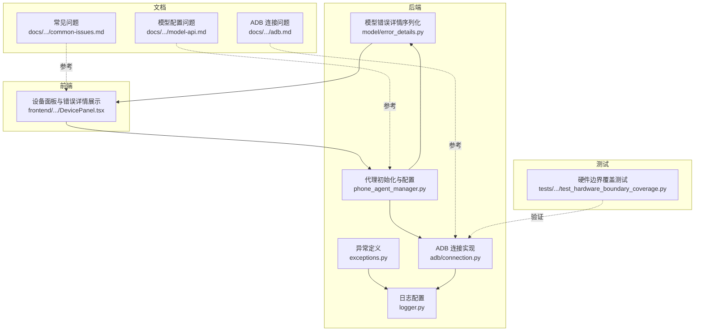
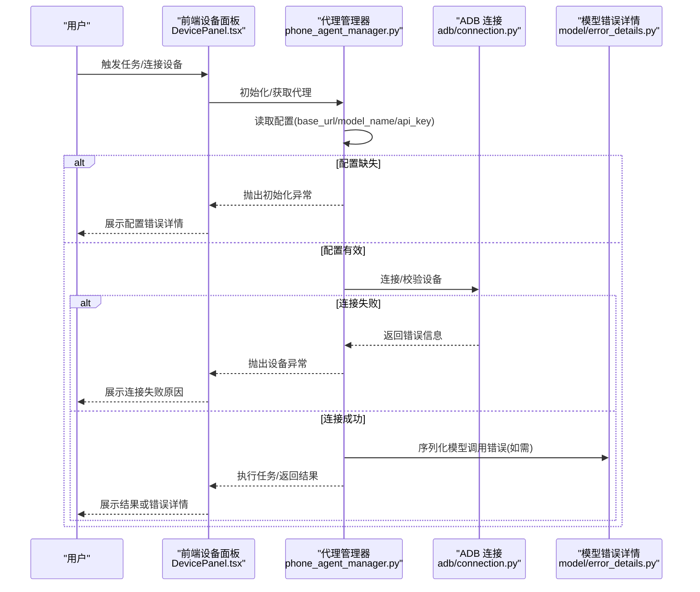
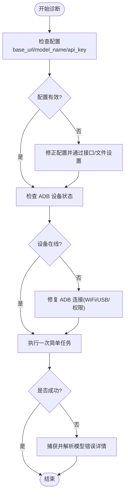
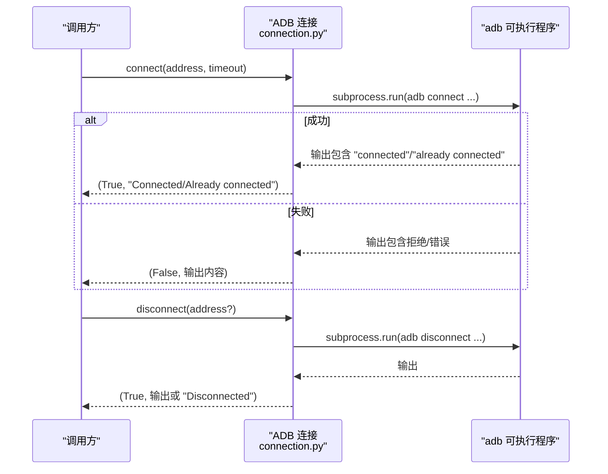
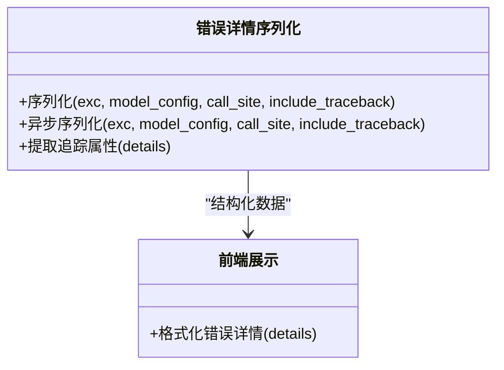
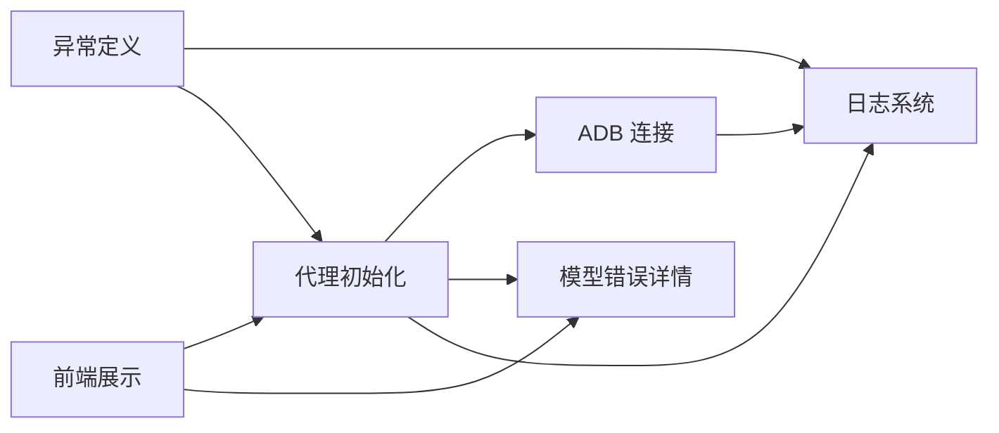

# 故障排除

<cite>
**本文引用的文件**
- [exceptions.py](file://AutoGLM_GUI/exceptions.py)
- [logger.py](file://AutoGLM_GUI/logger.py)
- [common-issues.md](file://docs/docs/troubleshooting/common-issues.md)
- [adb.md](file://docs/docs/troubleshooting/adb.md)
- [model-api.md](file://docs/docs/troubleshooting/model-api.md)
- [error_details.py](file://AutoGLM_GUI/model/error_details.py)
- [connection.py](file://AutoGLM_GUI/adb/connection.py)
- [phone_agent_manager.py](file://AutoGLM_GUI/phone_agent_manager.py)
- [DevicePanel.tsx](file://frontend/src/components/DevicePanel.tsx)
- [test_hardware_boundary_coverage.py](file://tests/test_hardware_boundary_coverage.py)
</cite>

## 目录
1. [简介](#简介)
2. [项目结构](#项目结构)
3. [核心组件](#核心组件)
4. [架构总览](#架构总览)
5. [详细组件分析](#详细组件分析)
6. [依赖分析](#依赖分析)
7. [性能考虑](#性能考虑)
8. [故障排除指南](#故障排除指南)
9. [结论](#结论)
10. [附录](#附录)

## 简介
本故障排除文档面向运维与技术支持人员，聚焦于 AutoGLM-GUI 在设备连接、ADB 通信、AI 代理调用等关键路径上的常见问题与根因分析方法。内容覆盖：
- 设备连接失败、ADB 通信异常、AI 代理错误的诊断流程
- 日志分析技巧、错误码与错误详情解读、根因分析方法
- 网络连接问题、权限配置错误、依赖服务异常的处理
- 性能问题诊断、内存泄漏检测、并发冲突解决
- 调试工具使用指南、断点调试与远程调试配置

## 项目结构
AutoGLM-GUI 的故障排查涉及后端 Python 逻辑、前端 UI 展示、测试用例与文档四类资源：
- 后端：异常定义、日志配置、ADB 连接、代理初始化、模型错误序列化
- 前端：错误详情展示、用户交互与状态反馈
- 文档：常见问题、ADB 连接问题、模型配置问题
- 测试：ADB 连接边界条件与行为验证

图表来源
- [exceptions.py:1-98](file://AutoGLM_GUI/exceptions.py#L1-L98)
- [logger.py:1-87](file://AutoGLM_GUI/logger.py#L1-L87)
- [connection.py:101-142](file://AutoGLM_GUI/adb/connection.py#L101-L142)
- [error_details.py:137-249](file://AutoGLM_GUI/model/error_details.py#L137-L249)
- [phone_agent_manager.py:246-277](file://AutoGLM_GUI/phone_agent_manager.py#L246-L277)
- [DevicePanel.tsx:203-1227](file://frontend/src/components/DevicePanel.tsx#L203-L1227)
- [common-issues.md:1-27](file://docs/docs/troubleshooting/common-issues.md#L1-L27)
- [adb.md:1-15](file://docs/docs/troubleshooting/adb.md#L1-L15)
- [model-api.md:1-15](file://docs/docs/troubleshooting/model-api.md#L1-L15)
- [test_hardware_boundary_coverage.py:332-733](file://tests/test_hardware_boundary_coverage.py#L332-L733)

章节来源
- [exceptions.py:1-98](file://AutoGLM_GUI/exceptions.py#L1-L98)
- [logger.py:1-87](file://AutoGLM_GUI/logger.py#L1-L87)
- [connection.py:101-142](file://AutoGLM_GUI/adb/connection.py#L101-L142)
- [error_details.py:137-249](file://AutoGLM_GUI/model/error_details.py#L137-L249)
- [phone_agent_manager.py:246-277](file://AutoGLM_GUI/phone_agent_manager.py#L246-L277)
- [DevicePanel.tsx:203-1227](file://frontend/src/components/DevicePanel.tsx#L203-L1227)
- [common-issues.md:1-27](file://docs/docs/troubleshooting/common-issues.md#L1-L27)
- [adb.md:1-15](file://docs/docs/troubleshooting/adb.md#L1-L15)
- [model-api.md:1-15](file://docs/docs/troubleshooting/model-api.md#L1-L15)
- [test_hardware_boundary_coverage.py:332-733](file://tests/test_hardware_boundary_coverage.py#L332-L733)

## 核心组件
- 异常体系：定义设备不可用、设备繁忙、代理初始化失败等业务异常，指导定位与修复方向
- 日志系统：集中化日志配置，支持控制台与文件输出、轮转与压缩、错误日志分离
- ADB 连接：封装 adb connect/disconnect/devices/list_devices，提供连接结果与错误信息
- 模型错误详情：将 HTTP/超时/连接错误等抽象为统一结构化错误详情，便于 UI 展示与追踪
- 代理初始化：从配置中心读取 base_url/model_name/api_key，构建 AgentConfig 并进行运行限制配置
- 前端错误展示：将结构化错误详情格式化为可读文本，辅助用户与运维快速理解

章节来源
- [exceptions.py:4-97](file://AutoGLM_GUI/exceptions.py#L4-L97)
- [logger.py:16-86](file://AutoGLM_GUI/logger.py#L16-L86)
- [connection.py:101-142](file://AutoGLM_GUI/adb/connection.py#L101-L142)
- [error_details.py:137-249](file://AutoGLM_GUI/model/error_details.py#L137-L249)
- [phone_agent_manager.py:246-277](file://AutoGLM_GUI/phone_agent_manager.py#L246-L277)
- [DevicePanel.tsx:203-1227](file://frontend/src/components/DevicePanel.tsx#L203-L1227)

## 架构总览
下图展示了从用户操作到设备与模型交互的关键链路，以及故障易发点与可观测性落点。

图表来源
- [phone_agent_manager.py:246-277](file://AutoGLM_GUI/phone_agent_manager.py#L246-L277)
- [connection.py:101-142](file://AutoGLM_GUI/adb/connection.py#L101-L142)
- [error_details.py:137-249](file://AutoGLM_GUI/model/error_details.py#L137-L249)
- [DevicePanel.tsx:203-1227](file://frontend/src/components/DevicePanel.tsx#L203-L1227)

## 详细组件分析

### 异常体系与诊断要点
- 设备不可用(DeviceNotAvailableError)：设备离线/断开，优先检查 ADB devices 输出与网络连通性
- 设备繁忙(DeviceBusyError)：并发访问冲突，建议采用非阻塞或超时模式，避免长时间占用
- 代理初始化失败(AgentInitializationError)：常见于 base_url/api_key/model_name 缺失或无效，需通过配置接口或文件修正

图表来源
- [exceptions.py:4-97](file://AutoGLM_GUI/exceptions.py#L4-L97)
- [phone_agent_manager.py:246-277](file://AutoGLM_GUI/phone_agent_manager.py#L246-L277)
- [connection.py:101-142](file://AutoGLM_GUI/adb/connection.py#L101-L142)
- [error_details.py:137-249](file://AutoGLM_GUI/model/error_details.py#L137-L249)

章节来源
- [exceptions.py:4-97](file://AutoGLM_GUI/exceptions.py#L4-L97)

### 日志系统与分析技巧
- 控制台与文件双通道输出，文件按大小轮转与压缩，错误日志单独文件并开启回溯与诊断
- 建议在复现问题时临时提升日志级别至 DEBUG，并关注错误日志文件中的堆栈与请求 ID
- 关键模块均通过 loguru 记录，便于跨模块关联定位

章节来源
- [logger.py:16-86](file://AutoGLM_GUI/logger.py#L16-L86)

### ADB 连接与通信异常
- connect/disconnect/devices/list_devices 封装了 adb 子进程调用，返回布尔与消息字符串
- 常见失败原因：IP/端口错误、网络不通、ADB 权限不足、设备离线、超时
- 测试用例覆盖了连接失败、超时、断开异常等边界情况，可作为回归参考

图表来源
- [connection.py:101-142](file://AutoGLM_GUI/adb/connection.py#L101-L142)
- [test_hardware_boundary_coverage.py:332-377](file://tests/test_hardware_boundary_coverage.py#L332-L377)

章节来源
- [connection.py:101-142](file://AutoGLM_GUI/adb/connection.py#L101-L142)
- [test_hardware_boundary_coverage.py:332-377](file://tests/test_hardware_boundary_coverage.py#L332-L377)

### 模型错误详情与 UI 展示
- 统一序列化模型调用失败信息，区分 HTTP 状态错误、超时、连接错误等
- 前端将结构化错误详情格式化为可读文本，包含状态码、请求 ID、响应头与体等
- 支持可选的完整堆栈，便于深入分析

图表来源
- [error_details.py:137-249](file://AutoGLM_GUI/model/error_details.py#L137-L249)
- [DevicePanel.tsx:203-1227](file://frontend/src/components/DevicePanel.tsx#L203-L1227)

章节来源
- [error_details.py:137-249](file://AutoGLM_GUI/model/error_details.py#L137-L249)
- [DevicePanel.tsx:203-1227](file://frontend/src/components/DevicePanel.tsx#L203-L1227)

### 代理初始化与配置校验
- 从配置中心读取 base_url/model_name/api_key，构建 ModelConfig 与 AgentConfig
- 运行限制由配置决定：按步数或时长限制
- 未配置 base_url 时直接抛出初始化异常，指导用户通过接口或文件设置

章节来源
- [phone_agent_manager.py:246-277](file://AutoGLM_GUI/phone_agent_manager.py#L246-L277)

## 依赖分析
- 组件耦合度：异常与日志为基础设施；ADB 与代理初始化为业务入口；模型错误详情为横切关注点；前端负责用户可见的错误展示
- 外部依赖：adb 可执行程序、网络连通性、模型服务可用性
- 潜在风险：配置缺失导致初始化失败；ADB 子进程异常导致连接失败；模型调用超时/连接失败导致任务中断

图表来源
- [exceptions.py:1-98](file://AutoGLM_GUI/exceptions.py#L1-L98)
- [logger.py:1-87](file://AutoGLM_GUI/logger.py#L1-L87)
- [connection.py:101-142](file://AutoGLM_GUI/adb/connection.py#L101-L142)
- [error_details.py:137-249](file://AutoGLM_GUI/model/error_details.py#L137-L249)
- [phone_agent_manager.py:246-277](file://AutoGLM_GUI/phone_agent_manager.py#L246-L277)
- [DevicePanel.tsx:203-1227](file://frontend/src/components/DevicePanel.tsx#L203-L1227)

## 性能考虑
- 日志轮转与压缩：避免磁盘膨胀；错误日志独立文件便于检索
- ADB 子进程调用：注意超时与重试策略，避免阻塞主线程
- 代理运行限制：合理设置最大步数与时长，防止长时间占用设备
- 并发冲突：使用非阻塞/超时模式，减少设备争用

## 故障排除指南

### 设备连接失败
- 症状：设备未显示、连接失败、设备离线
- 排查步骤
  - 确认设备已开启开发者选项与 USB 调试/WiFi 调试
  - 同网段连接：检查 IP 与端口、防火墙放行
  - 重新生成二维码配对（Android 11+），确保系统支持
  - 使用 adb devices 检查设备状态，必要时执行 adb disconnect 再 connect
- 参考文档
  - [常见问题:12-16](file://docs/docs/troubleshooting/common-issues.md#L12-L16)
  - [ADB 连接问题:5-14](file://docs/docs/troubleshooting/adb.md#L5-L14)

章节来源
- [common-issues.md:12-16](file://docs/docs/troubleshooting/common-issues.md#L12-L16)
- [adb.md:5-14](file://docs/docs/troubleshooting/adb.md#L5-L14)

### ADB 通信异常
- 症状：connect/disconnect 调用返回失败、超时、断开异常
- 排查步骤
  - 检查 adb 可执行程序路径与版本
  - 查看日志中子进程返回输出与异常类型
  - 对照测试用例中的边界条件，确认是否为超时或异常输入导致
- 参考实现
  - [ADB 连接实现:101-142](file://AutoGLM_GUI/adb/connection.py#L101-L142)
  - [硬件边界覆盖测试:332-377](file://tests/test_hardware_boundary_coverage.py#L332-L377)

章节来源
- [connection.py:101-142](file://AutoGLM_GUI/adb/connection.py#L101-L142)
- [test_hardware_boundary_coverage.py:332-377](file://tests/test_hardware_boundary_coverage.py#L332-L377)

### AI 代理错误
- 症状：任务无法启动、代理初始化失败、模型调用报错
- 排查步骤
  - 检查模型配置：base_url、model_name、API Key 是否正确
  - 代理初始化失败时，根据异常提示通过接口或配置文件设置 base_url
  - 使用模型错误详情序列化能力，收集状态码、请求 ID、响应头与体
  - 在前端设备面板中查看格式化的错误详情，辅助定位
- 参考实现
  - [异常定义:67-97](file://AutoGLM_GUI/exceptions.py#L67-L97)
  - [代理初始化:246-277](file://AutoGLM_GUI/phone_agent_manager.py#L246-L277)
  - [模型错误详情:137-249](file://AutoGLM_GUI/model/error_details.py#L137-L249)
  - [前端错误展示:203-1227](file://frontend/src/components/DevicePanel.tsx#L203-L1227)
  - [模型配置问题文档:5-14](file://docs/docs/troubleshooting/model-api.md#L5-L14)

章节来源
- [exceptions.py:67-97](file://AutoGLM_GUI/exceptions.py#L67-L97)
- [phone_agent_manager.py:246-277](file://AutoGLM_GUI/phone_agent_manager.py#L246-L277)
- [error_details.py:137-249](file://AutoGLM_GUI/model/error_details.py#L137-L249)
- [DevicePanel.tsx:203-1227](file://frontend/src/components/DevicePanel.tsx#L203-L1227)
- [model-api.md:5-14](file://docs/docs/troubleshooting/model-api.md#L5-L14)

### 网络连接问题
- 症状：WiFi 连接失败、二维码配对失败、模型请求超时
- 排查步骤
  - 确认手机与电脑处于同一网络
  - 检查端口连通性与防火墙策略
  - 重新生成二维码并重试（Android 11+）
  - 提升日志级别，抓取请求 ID 与响应体，结合模型错误详情定位
- 参考文档
  - [ADB 连接问题:5-14](file://docs/docs/troubleshooting/adb.md#L5-L14)
  - [模型配置问题:5-14](file://docs/docs/troubleshooting/model-api.md#L5-L14)

章节来源
- [adb.md:5-14](file://docs/docs/troubleshooting/adb.md#L5-L14)
- [model-api.md:5-14](file://docs/docs/troubleshooting/model-api.md#L5-L14)

### 权限配置错误
- 症状：设备未显示、代理初始化失败、模型调用被拒
- 排查步骤
  - 检查 adb devices 输出，确认设备状态为 online
  - 校验配置文件与接口设置的 base_url/model_name/api_key
  - 确保模型服务允许当前 API Key 的访问范围
- 参考实现
  - [代理初始化配置读取:246-277](file://AutoGLM_GUI/phone_agent_manager.py#L246-L277)
  - [常见问题:9-11](file://docs/docs/troubleshooting/common-issues.md#L9-L11)

章节来源
- [phone_agent_manager.py:246-277](file://AutoGLM_GUI/phone_agent_manager.py#L246-L277)
- [common-issues.md:9-11](file://docs/docs/troubleshooting/common-issues.md#L9-L11)

### 依赖服务异常
- 症状：模型服务不可达、HTTP 状态错误、连接超时
- 排查步骤
  - 使用模型错误详情序列化，记录状态码、请求 ID、响应头与体
  - 结合日志中的 backtrace 与诊断信息，定位具体环节
  - 必要时切换备用模型服务或调整超时阈值
- 参考实现
  - [模型错误详情序列化:137-249](file://AutoGLM_GUI/model/error_details.py#L137-L249)
  - [日志配置:16-86](file://AutoGLM_GUI/logger.py#L16-L86)

章节来源
- [error_details.py:137-249](file://AutoGLM_GUI/model/error_details.py#L137-L249)
- [logger.py:16-86](file://AutoGLM_GUI/logger.py#L16-L86)

### 性能问题诊断
- 症状：任务执行缓慢、设备卡顿、日志量过大
- 排查步骤
  - 降低日志级别或调整轮转策略，减少 IO 压力
  - 优化代理运行限制，缩短单次任务时长或步数
  - 检查是否存在大量并发任务争用设备，引入队列或限流
- 参考实现
  - [日志配置:16-86](file://AutoGLM_GUI/logger.py#L16-L86)
  - [代理初始化运行限制:262-269](file://AutoGLM_GUI/phone_agent_manager.py#L262-L269)

章节来源
- [logger.py:16-86](file://AutoGLM_GUI/logger.py#L16-L86)
- [phone_agent_manager.py:262-269](file://AutoGLM_GUI/phone_agent_manager.py#L262-L269)

### 内存泄漏检测与并发冲突解决
- 症状：长时间运行后内存增长、任务堆积、设备忙
- 排查步骤
  - 使用非阻塞/超时模式，避免长时间占用设备
  - 定期重启服务或触发 GC（如适用），观察内存曲线
  - 通过日志与错误详情定位异常任务，隔离并修复
- 参考实现
  - [异常定义与处理建议:38-64](file://AutoGLM_GUI/exceptions.py#L38-L64)

章节来源
- [exceptions.py:38-64](file://AutoGLM_GUI/exceptions.py#L38-L64)

### 调试工具使用指南
- 断点调试
  - 在代理初始化处设置断点，检查配置读取与 ModelConfig 构建
  - 在 ADB 连接处设置断点，观察子进程返回与异常分支
- 远程调试
  - 通过日志与错误详情定位远端问题，结合请求 ID 追踪
  - 在前端设备面板中复制错误详情，提交给后端团队协助分析

章节来源
- [phone_agent_manager.py:246-277](file://AutoGLM_GUI/phone_agent_manager.py#L246-L277)
- [connection.py:101-142](file://AutoGLM_GUI/adb/connection.py#L101-L142)
- [DevicePanel.tsx:203-1227](file://frontend/src/components/DevicePanel.tsx#L203-L1227)

## 结论
通过异常体系、日志系统、ADB 连接封装、模型错误详情与前端展示的协同，AutoGLM-GUI 形成了从“问题感知—定位—修复—验证”的闭环。建议在日常运维中：
- 固化配置校验流程，避免初始化失败
- 规范日志采集与轮转策略，提升可观测性
- 建立 ADB 与网络连通性的基线检查
- 利用模型错误详情与前端展示快速向用户反馈

## 附录
- 相关文档
  - [常见问题:1-27](file://docs/docs/troubleshooting/common-issues.md#L1-L27)
  - [ADB 连接问题:1-15](file://docs/docs/troubleshooting/adb.md#L1-L15)
  - [模型配置问题:1-15](file://docs/docs/troubleshooting/model-api.md#L1-L15)
- 关键实现
  - [异常定义:1-98](file://AutoGLM_GUI/exceptions.py#L1-L98)
  - [日志配置:1-87](file://AutoGLM_GUI/logger.py#L1-L87)
  - [ADB 连接:101-142](file://AutoGLM_GUI/adb/connection.py#L101-L142)
  - [模型错误详情:137-249](file://AutoGLM_GUI/model/error_details.py#L137-L249)
  - [代理初始化:246-277](file://AutoGLM_GUI/phone_agent_manager.py#L246-L277)
  - [前端错误展示:203-1227](file://frontend/src/components/DevicePanel.tsx#L203-L1227)
  - [硬件边界覆盖测试:332-733](file://tests/test_hardware_boundary_coverage.py#L332-L733)