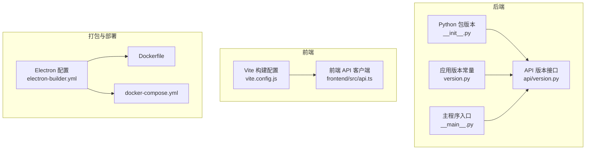
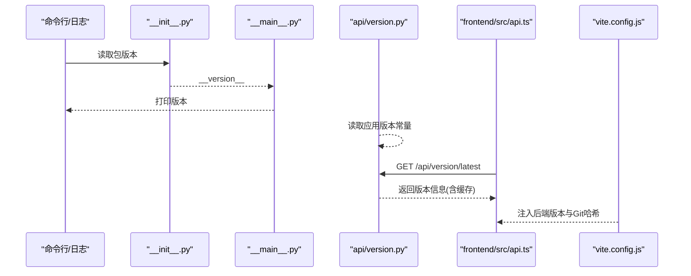
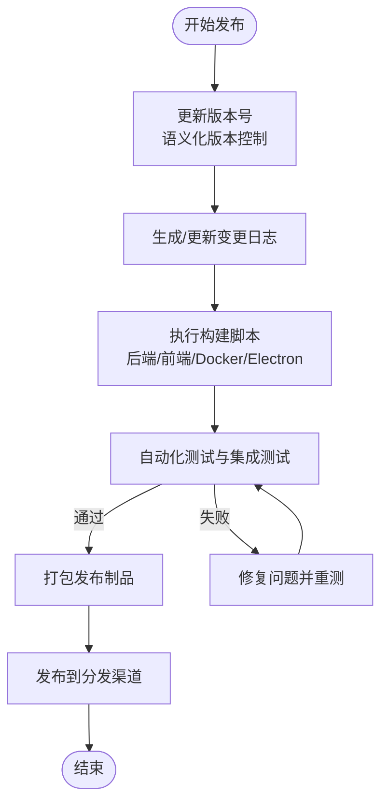
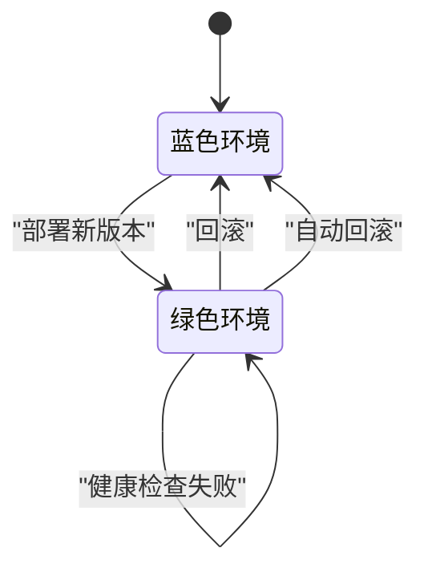
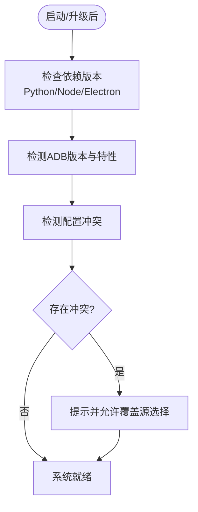
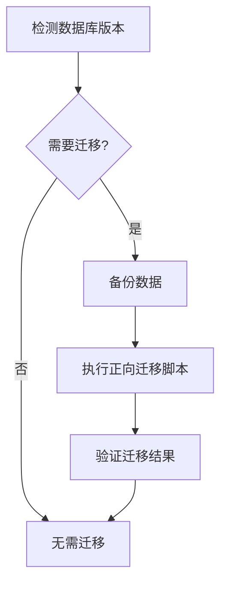
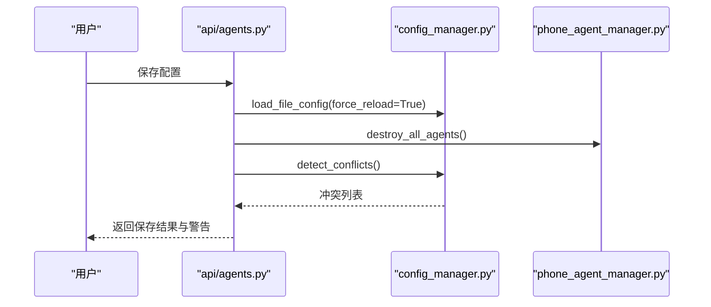
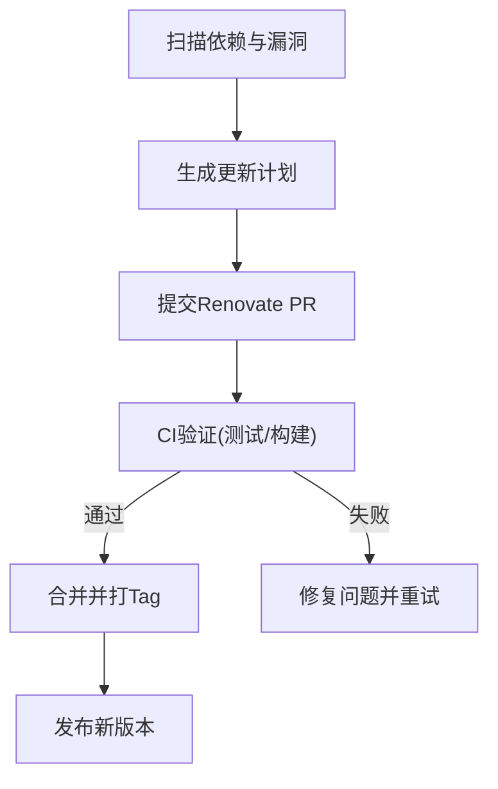
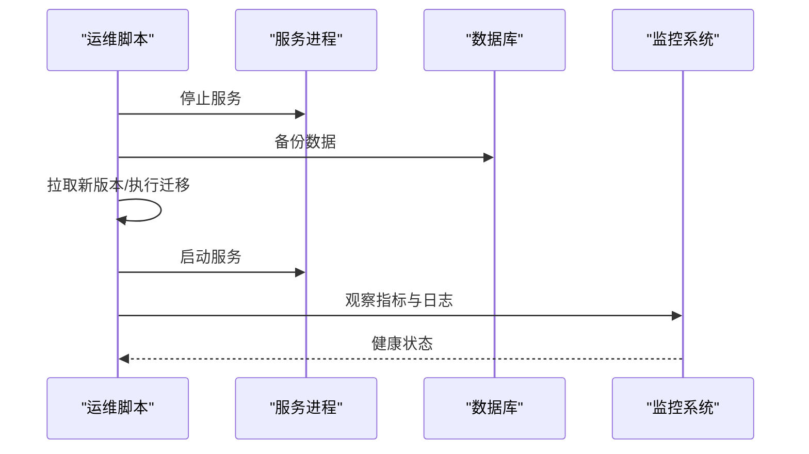
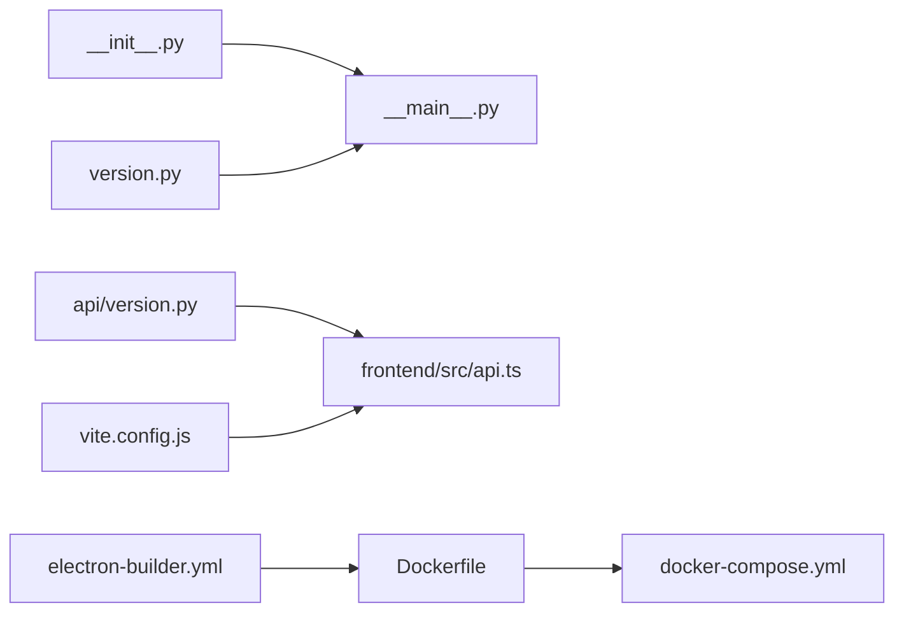

# 版本升级

<cite>
**本文引用的文件**
- [version.py](file://AutoGLM_GUI/version.py)
- [api/version.py](file://AutoGLM_GUI/api/version.py)
- [__init__.py](file://AutoGLM_GUI/__init__.py)
- [__main__.py](file://AutoGLM_GUI/__main__.py)
- [release.py](file://scripts/release.py)
- [test_version_api.py](file://tests/test_version_api.py)
- [vite.config.js](file://frontend/vite.config.js)
- [api.ts](file://frontend/src/api.ts)
- [electron-builder.yml](file://electron/electron-builder.yml)
- [Dockerfile](file://Dockerfile)
- [docker-compose.yml](file://docker-compose.yml)
- [pyproject.toml](file://pyproject.toml)
- [renovate.json](file://renovate.json)
- [uv.lock](file://uv.lock)
- [config_manager.py](file://AutoGLM_GUI/config_manager.py)
- [config.py](file://AutoGLM_GUI/config.py)
- [adb_plus/version.py](file://AutoGLM_GUI/adb_plus/version.py)
- [adb/connection.py](file://AutoGLM_GUI/adb/connection.py)
- [adb/device.py](file://AutoGLM_GUI/adb/device.py)
- [adb/input.py](file://AutoGLM_GUI/adb/input.py)
- [adb/screenshot.py](file://AutoGLM_GUI/adb/screenshot.py)
- [adb/timing.py](file://AutoGLM_GUI/adb/timing.py)
- [adb_plus/device.py](file://AutoGLM_GUI/adb_plus/device.py)
- [adb_plus/display.py](file://AutoGLM_GUI/adb_plus/display.py)
- [adb_plus/ip.py](file://AutoGLM_GUI/adb_plus/ip.py)
- [adb_plus/pair.py](file://AutoGLM_GUI/adb_plus/pair.py)
- [adb_plus/qr_pair.py](file://AutoGLM_GUI/adb_plus/qr_pair.py)
- [adb_plus/screenshot.py](file://AutoGLM_GUI/adb_plus/screenshot.py)
- [adb_plus/serial.py](file://AutoGLM_GUI/adb_plus/serial.py)
- [adb_plus/touch.py](file://AutoGLM_GUI/adb_plus/touch.py)
- [adb_plus/version.py](file://AutoGLM_GUI/adb_plus/version.py)
- [devices/adb_device.py](file://AutoGLM_GUI/devices/adb_device.py)
- [devices/mock_device.py](file://AutoGLM_GUI/devices/mock_device.py)
- [devices/remote_device.py](file://AutoGLM_GUI/devices/remote_device.py)
- [models/history.py](file://AutoGLM_GUI/models/history.py)
- [models/scheduled_task.py](file://AutoGLM_GUI/models/scheduled_task.py)
- [models/device_group.py](file://AutoGLM_GUI/models/device_group.py)
- [models/device_group.py](file://AutoGLM_GUI/models/device_group.py)
- [task_store.py](file://AutoGLM_GUI/task_store.py)
- [history_manager.py](file://AutoGLM_GUI/history_manager.py)
- [device_group_manager.py](file://AutoGLM_GUI/device_group_manager.py)
- [phone_agent_manager.py](file://AutoGLM_GUI/phone_agent_manager.py)
- [device_manager.py](file://AutoGLM_GUI/device_manager.py)
- [metrics.py](file://AutoGLM_GUI/metrics.py)
- [trace.py](file://AutoGLM_GUI/trace.py)
- [trace_export.py](file://AutoGLM_GUI/trace_export.py)
- [workflow_manager.py](file://AutoGLM_GUI/workflow_manager.py)
- [experience_planner.py](file://AutoGLM_GUI/experience_planner.py)
- [experience_report.py](file://AutoGLM_GUI/experience_report.py)
- [scheduler_manager.py](file://AutoGLM_GUI/scheduler_manager.py)
- [layered_agent_service.py](file://AutoGLM_GUI/layered_agent_service.py)
- [socketio_server.py](file://AutoGLM_GUI/socketio_server.py)
- [server.py](file://AutoGLM_GUI/server.py)
- [adb_terminal_repl.py](file://AutoGLM_GUI/adb_terminal_repl.py)
- [adb_terminal_service.py](file://AutoGLM_GUI/adb_terminal_service.py)
- [prompt_config.py](file://AutoGLM_GUI/prompt_config.py)
- [prompts.py](file://AutoGLM_GUI/prompts.py)
- [i18n.py](file://AutoGLM_GUI/i18n.py)
- [platform_utils.py](file://AutoGLM_GUI/platform_utils.py)
- [logger.py](file://AutoGLM_GUI/logger.py)
- [exceptions.py](file://AutoGLM_GUI/exceptions.py)
- [types.py](file://AutoGLM_GUI/types.py)
- [schemas.py](file://AutoGLM_GUI/schemas.py)
- [actions/handler.py](file://AutoGLM_GUI/actions/handler.py)
- [actions/types.py](file://AutoGLM_GUI/actions/types.py)
- [agents/base/async_agent_base.py](file://AutoGLM_GUI/agents/base/async_agent_base.py)
- [agents/droidrun/async_agent.py](file://AutoGLM_GUI/agents/droidrun/async_agent.py)
- [agents/gemini/async_agent.py](file://AutoGLM_GUI/agents/gemini/async_agent.py)
- [agents/gemini/action_mapper.py](file://AutoGLM_GUI/agents/gemini/action_mapper.py)
- [agents/gemini/models.py](file://AutoGLM_GUI/agents/gemini/models.py)
- [agents/gemini/prompts.py](file://AutoGLM_GUI/agents/gemini/prompts.py)
- [agents/gemini/tools.py](file://AutoGLM_GUI/agents/gemini/tools.py)
- [agents/glm/async_agent.py](file://AutoGLM_GUI/agents/glm/async_agent.py)
- [agents/glm/parser.py](file://AutoGLM_GUI/agents/glm/parser.py)
- [agents/glm/prompts_en.py](file://AutoGLM_GUI/agents/glm/prompts_en.py)
- [agents/qwen/async_agent.py](file://AutoGLM_GUI/agents/qwen/async_agent.py)
- [agents/qwen/parser.py](file://AutoGLM_GUI/agents/qwen/parser.py)
- [agents/qwen/prompts_en.py](file://AutoGLM_GUI/agents/qwen/prompts_en.py)
- [agents/qwen/prompts_zh.py](file://AutoGLM_GUI/agents/qwen/prompts_zh.py)
- [agents/midscene/async_agent.py](file://AutoGLM_GUI/agents/midscene/async_agent.py)
- [agents/midscene/log_parser.py](file://AutoGLM_GUI/agents/midscene/log_parser.py)
- [agents/mai/async_agent.py](file://AutoGLM_GUI/agents/mai/async_agent.py)
- [agents/mai/parser.py](file://AutoGLM_GUI/agents/mai/parser.py)
- [agents/mai/prompts.py](file://AutoGLM_GUI/agents/mai/prompts.py)
- [agents/mai/traj_memory.py](file://AutoGLM_GUI/agents/mai/traj_memory.py)
- [api/agents.py](file://AutoGLM_GUI/api/agents.py)
- [api/control.py](file://AutoGLM_GUI/api/control.py)
- [api/devices.py](file://AutoGLM_GUI/api/devices.py)
- [api/experience.py](file://AutoGLM_GUI/api/experience.py)
- [api/health.py](file://AutoGLM_GUI/api/health.py)
- [api/history.py](file://AutoGLM_GUI/api/history.py)
- [api/layered_agent.py](file://AutoGLM_GUI/api/layered_agent.py)
- [api/mcp.py](file://AutoGLM_GUI/api/mcp.py)
- [api/media.py](file://AutoGLM_GUI/api/media.py)
- [api/metrics.py](file://AutoGLM_GUI/api/metrics.py)
- [api/scheduled_tasks.py](file://AutoGLM_GUI/api/scheduled_tasks.py)
- [api/tasks.py](file://AutoGLM_GUI/api/tasks.py)
- [api/terminal.py](file://AutoGLM_GUI/api/terminal.py)
- [api/workflows.py](file://AutoGLM_GUI/api/workflows.py)
- [api/health.py](file://AutoGLM_GUI/api/health.py)
- [api/terminal.py](file://AutoGLM_GUI/api/terminal.py)
- [api/workflows.py](file://AutoGLM_GUI/api/workflows.py)
- [api/layered_agent.py](file://AutoGLM_GUI/api/layered_agent.py)
- [api/metrics.py](file://AutoGLM_GUI/api/metrics.py)
- [api/mcp.py](file://AutoGLM_GUI/api/mcp.py)
- [api/media.py](file://AutoGLM_GUI/api/media.py)
- [api/history.py](file://AutoGLM_GUI/api/history.py)
- [api/experience.py](file://AutoGLM_GUI/api/experience.py)
- [api/devices.py](file://AutoGLM_GUI/api/devices.py)
- [api/control.py](file://AutoGLM_GUI/api/control.py)
- [api/agents.py](file://AutoGLM_GUI/api/agents.py)
- [api/tasks.py](file://AutoGLM_GUI/api/tasks.py)
- [api/scheduled_tasks.py](file://AutoGLM_GUI/api/scheduled_tasks.py)
- [api/agents.py](file://AutoGLM_GUI/api/agents.py)
- [api/agents.py](file://AutoGLM_GUI/api/agents.py)
- [api/agents.py](file://AutoGLM_GUI/api/agents.py)
- [api/agents.py](file://AutoGLM_GUI/api/agents.py)
- [api/agents.py](file://AutoGLM_GUI/api/agents.py)
- [api/agents.py](file://AutoGLM_GUI/api/agents.py)
- [api/agents.py](file://AutoGLM_GUI/api/agents.py)
- [api/agents.py](file://AutoGLM_GUI/api/agents.py)
- [api/agents.py](file://AutoGLM_GUI/api/agents.py)
- [api/agents.py](file://AutoGLM_GUI/api/agents.py)
- [api/agents.py](file://AutoGLM_GUI/api/agents.py)
- [api/agents.py](file://AutoGLM_GUI/api/agents.py)
- [api/agents.py](file://AutoGLM_GUI/api/agents.py)
- [api/agents.py](file://AutoGLM_GUI/api/agents.py)
- [api/agents.py](file://AutoGLM_GUI/api/agents.py)
- [api/agents.py](file://AutoGLM_GUI/api/agents.py)
- [api/agents.py](file://AutoGLM_GUI/api/agents.py)
- [api/agents.py](file://AutoGLM_GUI/api/agents.py)
- [api/agents.py](file://AutoGLM_GUI/api/agents.py)
- [api/agents.py](file://AutoGLM_GUI/api/agents.py)
- [api/agents.py](file://AutoGLM_GUI/api/agents.py)
- [api/agents.py](file://AutoGLM_GUI/api/agents.py)
- [api/agents.py](file://AutoGLM_GUI/api/agents.py)
- [api/agents.py](file://AutoGLM_GUI/api/agents.py)
- [api/agents.py](file://AutoGLM_GUI/api/agents.py)
- [api/agents.py](file://AutoGLM_GUI/api/agents.py)
- [api/agents.py](file://AutoGLM_GUI/api/agents.py)
- [api/agents.py](file://AutoGLM_GUI/api/agents.py)
- [......]
</cite>

## 目录
1. [简介](#简介)
2. [项目结构](#项目结构)
3. [核心组件](#核心组件)
4. [架构总览](#架构总览)
5. [详细组件分析](#详细组件分析)
6. [依赖关系分析](#依赖关系分析)
7. [性能考虑](#性能考虑)
8. [故障排查指南](#故障排查指南)
9. [结论](#结论)
10. [附录](#附录)

## 简介
本文件面向AutoGLM-GUI的版本升级与运维团队，提供一套可执行、可追溯、可回滚的升级方案。内容覆盖语义化版本控制、变更日志管理、兼容性检查、数据库迁移脚本、配置文件升级、依赖更新流程、热更新与蓝绿部署策略、滚动升级、升级前检查清单、风险评估与应急预案、自动化升级脚本与批量升级工具、以及监控验证方法。目标是确保系统升级过程的安全性与可靠性。

## 项目结构
AutoGLM-GUI采用前后端分离架构：后端为Python服务（FastAPI），前端为React应用；同时提供Electron打包与Docker容器化部署能力。版本信息贯穿于后端包元数据、构建产物注入、API版本接口与前端构建参数中。

**图表来源**
- [__init__.py:59-66](file://AutoGLM_GUI/__init__.py#L59-L66)
- [api/version.py](file://AutoGLM_GUI/api/version.py)
- [version.py](file://AutoGLM_GUI/version.py)
- [__main__.py:9-246](file://AutoGLM_GUI/__main__.py#L9-L246)
- [vite.config.js:1-57](file://frontend/vite.config.js#L1-L57)
- [api.ts:1271-1328](file://frontend/src/api.ts#L1271-L1328)
- [electron-builder.yml](file://electron/electron-builder.yml)
- [Dockerfile](file://Dockerfile)
- [docker-compose.yml](file://docker-compose.yml)

**章节来源**
- [__init__.py:59-66](file://AutoGLM_GUI/__init__.py#L59-L66)
- [api/version.py](file://AutoGLM_GUI/api/version.py)
- [version.py](file://AutoGLM_GUI/version.py)
- [__main__.py:9-246](file://AutoGLM_GUI/__main__.py#L9-L246)
- [vite.config.js:1-57](file://frontend/vite.config.js#L1-L57)
- [api.ts:1271-1328](file://frontend/src/api.ts#L1271-L1328)
- [electron-builder.yml](file://electron/electron-builder.yml)
- [Dockerfile](file://Dockerfile)
- [docker-compose.yml](file://docker-compose.yml)

## 核心组件
- 应用版本来源与暴露
  - Python包运行时版本通过包元数据注入，用于命令行与日志展示。
  - 应用版本常量用于API对外暴露当前版本。
  - 主程序打印版本信息，便于运维审计。
- 前端构建版本注入
  - Vite在构建时注入后端版本与Git提交哈希，便于追踪部署版本。
- 版本检查与更新提示
  - 后端提供版本检查接口，支持缓存与错误处理。
  - 前端通过API客户端调用版本检查接口，展示更新状态。

**章节来源**
- [__init__.py:59-66](file://AutoGLM_GUI/__init__.py#L59-L66)
- [version.py](file://AutoGLM_GUI/version.py)
- [api/version.py](file://AutoGLM_GUI/api/version.py)
- [__main__.py:9-246](file://AutoGLM_GUI/__main__.py#L9-L246)
- [vite.config.js:27-33](file://frontend/vite.config.js#L27-L33)
- [api.ts:1271-1328](file://frontend/src/api.ts#L1271-L1328)
- [test_version_api.py:144-185](file://tests/test_version_api.py#L144-L185)

## 架构总览
下图展示了版本信息在系统中的传播路径：从包元数据到应用常量，再到API响应，最终由前端构建参数注入与前端界面展示。

**图表来源**
- [__init__.py:59-66](file://AutoGLM_GUI/__init__.py#L59-L66)
- [__main__.py:9-246](file://AutoGLM_GUI/__main__.py#L9-L246)
- [api/version.py](file://AutoGLM_GUI/api/version.py)
- [api.ts:1271-1328](file://frontend/src/api.ts#L1271-L1328)
- [vite.config.js:27-33](file://frontend/vite.config.js#L27-L33)

## 详细组件分析

### 版本发布流程
- 语义化版本控制
  - 使用主版本号.次版本号.修订号格式，遵循向后兼容规则。
  - 重大变更触发主版本号递增；功能新增不破坏兼容时递增次版本号；修复问题递增修订号。
- 变更日志管理
  - 在docs目录维护发布说明，记录每个版本的功能、修复与破坏性变更。
  - 发布前生成变更摘要，确保与版本号一致。
- 发布脚本
  - 脚本负责版本号写入、打包构建、资源生成与发布制品归档。
  - 支持Dry-Run模式进行预检，避免误操作。

**图表来源**
- [release.py](file://scripts/release.py)
- [pyproject.toml](file://pyproject.toml)
- [Dockerfile](file://Dockerfile)
- [electron-builder.yml](file://electron/electron-builder.yml)

**章节来源**
- [release.py](file://scripts/release.py)
- [pyproject.toml](file://pyproject.toml)
- [Dockerfile](file://Dockerfile)
- [electron-builder.yml](file://electron/electron-builder.yml)

### 升级策略与回滚机制
- 热更新与蓝绿部署
  - 蓝绿部署：准备两套环境（蓝色与绿色），切换流量至新版本，失败则回切。
  - 热更新：对无状态服务可滚动重启，对有状态组件需配合配置与数据迁移。
- 滚动升级
  - 分批重启实例，每批完成健康检查后再继续下一批，降低单点风险。
- 回滚策略
  - 记录版本标签与制品哈希，回滚时恢复对应镜像/二进制与配置。
  - 对数据库变更保留逆向迁移脚本，回滚时执行逆向脚本。

**图表来源**
- [docker-compose.yml](file://docker-compose.yml)
- [Dockerfile](file://Dockerfile)

**章节来源**
- [docker-compose.yml](file://docker-compose.yml)
- [Dockerfile](file://Dockerfile)

### 兼容性检查
- 运行时依赖版本检查
  - 通过锁文件与依赖管理工具校验Python与Node依赖版本一致性。
  - Electron构建时检查系统依赖与Node版本匹配。
- 设备与ADB兼容性
  - ADB版本检测与特性支持检查，避免旧版本ADB导致的连接或交互异常。
- 配置兼容性
  - 配置文件保存时进行冲突检测，必要时提示用户确认覆盖源。

**图表来源**
- [adb_plus/version.py:7-41](file://AutoGLM_GUI/adb_plus/version.py#L7-L41)
- [adb/connection.py](file://AutoGLM_GUI/adb/connection.py#L45)
- [config_manager.py](file://AutoGLM_GUI/config_manager.py)
- [config.py](file://AutoGLM_GUI/config.py)

**章节来源**
- [adb_plus/version.py:7-41](file://AutoGLM_GUI/adb_plus/version.py#L7-L41)
- [adb/connection.py](file://AutoGLM_GUI/adb/connection.py#L45)
- [config_manager.py](file://AutoGLM_GUI/config_manager.py)
- [config.py](file://AutoGLM_GUI/config.py)

### 数据库迁移脚本
- 迁移策略
  - 对有状态数据（如历史记录、计划任务、设备组等）制定正向与逆向迁移脚本。
  - 迁移前备份数据，迁移后验证完整性。
- 迁移触发
  - 升级时自动检测版本差异并执行相应迁移。
  - 提供手动迁移命令以便离线或特殊场景使用。

**图表来源**
- [models/history.py](file://AutoGLM_GUI/models/history.py)
- [models/scheduled_task.py](file://AutoGLM_GUI/models/scheduled_task.py)
- [models/device_group.py](file://AutoGLM_GUI/models/device_group.py)
- [task_store.py](file://AutoGLM_GUI/task_store.py)
- [history_manager.py](file://AutoGLM_GUI/history_manager.py)
- [device_group_manager.py](file://AutoGLM_GUI/device_group_manager.py)

**章节来源**
- [models/history.py](file://AutoGLM_GUI/models/history.py)
- [models/scheduled_task.py](file://AutoGLM_GUI/models/scheduled_task.py)
- [models/device_group.py](file://AutoGLM_GUI/models/device_group.py)
- [task_store.py](file://AutoGLM_GUI/task_store.py)
- [history_manager.py](file://AutoGLM_GUI/history_manager.py)
- [device_group_manager.py](file://AutoGLM_GUI/device_group_manager.py)

### 配置文件升级
- 配置加载与冲突检测
  - 保存配置时强制重新加载，销毁现有Agent以确保新配置生效。
  - 检测字段冲突并提示覆盖源，避免静默覆盖。
- 升级流程
  - 新版本默认配置与旧配置合并，保留用户自定义项。
  - 对破坏性变更提供迁移向导或自动迁移。

**图表来源**
- [api/agents.py:354-393](file://AutoGLM_GUI/api/agents.py#L354-L393)
- [config_manager.py](file://AutoGLM_GUI/config_manager.py)
- [phone_agent_manager.py](file://AutoGLM_GUI/phone_agent_manager.py)

**章节来源**
- [api/agents.py:354-393](file://AutoGLM_GUI/api/agents.py#L354-L393)
- [config_manager.py](file://AutoGLM_GUI/config_manager.py)
- [phone_agent_manager.py](file://AutoGLM_GUI/phone_agent_manager.py)

### 依赖更新流程
- Python依赖
  - 使用锁文件锁定版本，定期扫描安全漏洞与过期依赖。
  - Renovate配置自动提交依赖更新PR，配合CI验证。
- Node/前端依赖
  - 前端依赖更新后重建并运行E2E测试，确保UI与交互正常。
- Electron依赖
  - Electron构建配置与平台工具链版本需与Node版本匹配，避免打包失败。

**图表来源**
- [renovate.json](file://renovate.json)
- [uv.lock](file://uv.lock)
- [pyproject.toml](file://pyproject.toml)

**章节来源**
- [renovate.json](file://renovate.json)
- [uv.lock](file://uv.lock)
- [pyproject.toml](file://pyproject.toml)

### 自动化升级脚本与批量升级工具
- 自动化脚本
  - 统一的升级脚本负责：停止服务、备份配置与数据、拉取新版本、执行迁移、重启服务、健康检查。
- 批量升级
  - 多实例/多节点场景下按批次执行，结合滚动升级策略与健康检查。
- 监控验证
  - 升级后通过健康检查接口与指标监控确认服务可用性与性能回归在可接受范围。

**图表来源**
- [api/health.py](file://AutoGLM_GUI/api/health.py)
- [metrics.py](file://AutoGLM_GUI/metrics.py)

**章节来源**
- [api/health.py](file://AutoGLM_GUI/api/health.py)
- [metrics.py](file://AutoGLM_GUI/metrics.py)

### 升级前检查清单
- 版本与发布说明核对
  - 确认版本号与变更日志一致，明确破坏性变更与已知问题。
- 依赖与环境检查
  - Python/Node/Electron版本与锁文件一致；ADB版本满足最低要求。
- 数据备份
  - 备份数据库与配置文件，确保可回滚。
- 测试与验证
  - 单元测试、集成测试、E2E测试全部通过；健康检查接口可用。
- 回滚预案
  - 准备回滚镜像/二进制、配置与数据恢复步骤。

### 风险评估与应急预案
- 风险识别
  - 依赖不兼容、ADB版本过低、配置冲突、迁移失败、前端构建失败。
- 应急预案
  - 快速回滚至上一个稳定版本；回滚时优先恢复配置与数据，再恢复二进制。
  - 对关键节点设置降级开关，必要时暂停新功能以保证稳定性。

### 监控与验证
- 健康检查
  - 通过健康接口确认服务存活与依赖可用。
- 指标监控
  - 关注CPU、内存、请求延迟、错误率等关键指标。
- 日志审计
  - 升级前后日志对比，定位异常与告警。

**章节来源**
- [api/health.py](file://AutoGLM_GUI/api/health.py)
- [metrics.py](file://AutoGLM_GUI/metrics.py)

## 依赖关系分析
- 版本来源依赖
  - 后端包版本依赖于包元数据；应用版本常量依赖于版本模块；主程序依赖于版本常量。
- 前端构建依赖
  - Vite在define中注入后端版本与Git哈希，前端API客户端通过HTTP调用后端版本接口。
- 打包与部署依赖
  - Electron构建依赖Node与系统工具链；Docker构建依赖Dockerfile与Compose配置。

**图表来源**
- [__init__.py:59-66](file://AutoGLM_GUI/__init__.py#L59-L66)
- [__main__.py:9-246](file://AutoGLM_GUI/__main__.py#L9-L246)
- [version.py](file://AutoGLM_GUI/version.py)
- [api/version.py](file://AutoGLM_GUI/api/version.py)
- [api.ts:1271-1328](file://frontend/src/api.ts#L1271-L1328)
- [vite.config.js:27-33](file://frontend/vite.config.js#L27-L33)
- [electron-builder.yml](file://electron/electron-builder.yml)
- [Dockerfile](file://Dockerfile)
- [docker-compose.yml](file://docker-compose.yml)

**章节来源**
- [__init__.py:59-66](file://AutoGLM_GUI/__init__.py#L59-L66)
- [__main__.py:9-246](file://AutoGLM_GUI/__main__.py#L9-L246)
- [version.py](file://AutoGLM_GUI/version.py)
- [api/version.py](file://AutoGLM_GUI/api/version.py)
- [api.ts:1271-1328](file://frontend/src/api.ts#L1271-L1328)
- [vite.config.js:27-33](file://frontend/vite.config.js#L27-L33)
- [electron-builder.yml](file://electron/electron-builder.yml)
- [Dockerfile](file://Dockerfile)
- [docker-compose.yml](file://docker-compose.yml)

## 性能考虑
- 升级窗口与容量规划
  - 选择业务低峰时段执行升级，预留回滚时间。
- 并发与资源占用
  - 滚动升级时控制并发重启速率，避免瞬时资源耗尽。
- 缓存与持久化
  - 升级前清理或迁移缓存，确保数据一致性；对持久化存储进行快照保护。

## 故障排查指南
- 版本检查接口异常
  - 检查网络访问GitHub Releases权限与缓存逻辑；查看错误响应与日志。
- ADB连接失败
  - 检查ADB版本与特性支持，确认设备驱动与权限。
- 配置冲突与Agent异常
  - 查看冲突检测结果，确认覆盖源；必要时回退配置并重新加载。

**章节来源**
- [test_version_api.py:144-185](file://tests/test_version_api.py#L144-L185)
- [adb_plus/version.py:7-41](file://AutoGLM_GUI/adb_plus/version.py#L7-L41)
- [adb/connection.py](file://AutoGLM_GUI/adb/connection.py#L45)
- [api/agents.py:354-393](file://AutoGLM_GUI/api/agents.py#L354-L393)

## 结论
通过规范的版本发布流程、严格的兼容性检查、完善的数据库迁移与配置升级策略、以及蓝绿/滚动升级与回滚机制，AutoGLM-GUI能够在保障业务连续性的前提下实现平滑升级。建议在生产环境中严格执行升级前检查清单与应急预案，并结合自动化脚本与监控体系，持续提升升级效率与安全性。

## 附录
- 参考文件索引
  - 版本来源与API：[__init__.py:59-66](file://AutoGLM_GUI/__init__.py#L59-L66)、[__main__.py:9-246](file://AutoGLM_GUI/__main__.py#L9-L246)、[version.py](file://AutoGLM_GUI/version.py)、[api/version.py](file://AutoGLM_GUI/api/version.py)
  - 前端构建与注入：[vite.config.js:27-33](file://frontend/vite.config.js#L27-L33)、[api.ts:1271-1328](file://frontend/src/api.ts#L1271-L1328)
  - 打包与部署：[electron-builder.yml](file://electron/electron-builder.yml)、[Dockerfile](file://Dockerfile)、[docker-compose.yml](file://docker-compose.yml)
  - 依赖管理：[renovate.json](file://renovate.json)、[uv.lock](file://uv.lock)、[pyproject.toml](file://pyproject.toml)
  - 数据模型与迁移：[models/history.py](file://AutoGLM_GUI/models/history.py)、[models/scheduled_task.py](file://AutoGLM_GUI/models/scheduled_task.py)、[models/device_group.py](file://AutoGLM_GUI/models/device_group.py)、[task_store.py](file://AutoGLM_GUI/task_store.py)、[history_manager.py](file://AutoGLM_GUI/history_manager.py)、[device_group_manager.py](file://AutoGLM_GUI/device_group_manager.py)
  - 配置与Agent：[config_manager.py](file://AutoGLM_GUI/config_manager.py)、[config.py](file://AutoGLM_GUI/config.py)、[api/agents.py:354-393](file://AutoGLM_GUI/api/agents.py#L354-L393)、[phone_agent_manager.py](file://AutoGLM_GUI/phone_agent_manager.py)
  - 设备与ADB：[adb_plus/version.py:7-41](file://AutoGLM_GUI/adb_plus/version.py#L7-L41)、[adb/connection.py](file://AutoGLM_GUI/adb/connection.py#L45)、[adb/device.py](file://AutoGLM_GUI/adb/device.py)、[adb/input.py](file://AutoGLM_GUI/adb/input.py)、[adb/screenshot.py](file://AutoGLM_GUI/adb/screenshot.py)、[adb/timing.py](file://AutoGLM_GUI/adb/timing.py)、[adb_plus/device.py](file://AutoGLM_GUI/adb_plus/device.py)、[adb_plus/display.py](file://AutoGLM_GUI/adb_plus/display.py)、[adb_plus/ip.py](file://AutoGLM_GUI/adb_plus/ip.py)、[adb_plus/pair.py](file://AutoGLM_GUI/adb_plus/pair.py)、[adb_plus/qr_pair.py](file://AutoGLM_GUI/adb_plus/qr_pair.py)、[adb_plus/screenshot.py](file://AutoGLM_GUI/adb_plus/screenshot.py)、[adb_plus/serial.py](file://AutoGLM_GUI/adb_plus/serial.py)、[adb_plus/touch.py](file://AutoGLM_GUI/adb_plus/touch.py)
  - 服务与监控：[api/health.py](file://AutoGLM_GUI/api/health.py)、[metrics.py](file://AutoGLM_GUI/metrics.py)、[trace.py](file://AutoGLM_GUI/trace.py)、[trace_export.py](file://AutoGLM_GUI/trace_export.py)
  - 工作流与调度：[workflow_manager.py](file://AutoGLM_GUI/workflow_manager.py)、[experience_planner.py](file://AutoGLM_GUI/experience_planner.py)、[experience_report.py](file://AutoGLM_GUI/experience_report.py)、[scheduler_manager.py](file://AutoGLM_GUI/scheduler_manager.py)、[layered_agent_service.py](file://AutoGLM_GUI/layered_agent_service.py)
  - 服务器与通信：[socketio_server.py](file://AutoGLM_GUI/socketio_server.py)、[server.py](file://AutoGLM_GUI/server.py)、[adb_terminal_repl.py](file://AutoGLM_GUI/adb_terminal_repl.py)、[adb_terminal_service.py](file://AutoGLM_GUI/adb_terminal_service.py)
  - 提示词与本地化：[prompt_config.py](file://AutoGLM_GUI/prompt_config.py)、[prompts.py](file://AutoGLM_GUI/prompts.py)、[i18n.py](file://AutoGLM_GUI/i18n.py)
  - 平台与工具：[platform_utils.py](file://AutoGLM_GUI/platform_utils.py)、[logger.py](file://AutoGLM_GUI/logger.py)、[exceptions.py](file://AutoGLM_GUI/exceptions.py)
  - 类型与模式：[types.py](file://AutoGLM_GUI/types.py)、[schemas.py](file://AutoGLM_GUI/schemas.py)
  - 动作与处理器：[actions/handler.py](file://AutoGLM_GUI/actions/handler.py)、[actions/types.py](file://AutoGLM_GUI/actions/types.py)
  - 代理与适配器：[agents/base/async_agent_base.py](file://AutoGLM_GUI/agents/base/async_agent_base.py)、[agents/droidrun/async_agent.py](file://AutoGLM_GUI/agents/droidrun/async_agent.py)、[agents/gemini/async_agent.py](file://AutoGLM_GUI/agents/gemini/async_agent.py)、[agents/gemini/action_mapper.py](file://AutoGLM_GUI/agents/gemini/action_mapper.py)、[agents/gemini/models.py](file://AutoGLM_GUI/agents/gemini/models.py)、[agents/gemini/prompts.py](file://AutoGLM_GUI/agents/gemini/prompts.py)、[agents/gemini/tools.py](file://AutoGLM_GUI/agents/gemini/tools.py)、[agents/glm/async_agent.py](file://AutoGLM_GUI/agents/glm/async_agent.py)、[agents/glm/parser.py](file://AutoGLM_GUI/agents/glm/parser.py)、[agents/glm/prompts_en.py](file://AutoGLM_GUI/agents/glm/prompts_en.py)、[agents/qwen/async_agent.py](file://AutoGLM_GUI/agents/qwen/async_agent.py)、[agents/qwen/parser.py](file://AutoGLM_GUI/agents/qwen/parser.py)、[agents/qwen/prompts_en.py](file://AutoGLM_GUI/agents/qwen/prompts_en.py)、[agents/qwen/prompts_zh.py](file://AutoGLM_GUI/agents/qwen/prompts_zh.py)、[agents/midscene/async_agent.py](file://AutoGLM_GUI/agents/midscene/async_agent.py)、[agents/midscene/log_parser.py](file://AutoGLM_GUI/agents/midscene/log_parser.py)、[agents/mai/async_agent.py](file://AutoGLM_GUI/agents/mai/async_agent.py)、[agents/mai/parser.py](file://AutoGLM_GUI/agents/mai/parser.py)、[agents/mai/prompts.py](file://AutoGLM_GUI/agents/mai/prompts.py)、[agents/mai/traj_memory.py](file://AutoGLM_GUI/agents/mai/traj_memory.py)
  - API路由与控制器：[api/agents.py](file://AutoGLM_GUI/api/agents.py)、[api/control.py](file://AutoGLM_GUI/api/control.py)、[api/devices.py](file://AutoGLM_GUI/api/devices.py)、[api/experience.py](file://AutoGLM_GUI/api/experience.py)、[api/health.py](file://AutoGLM_GUI/api/health.py)、[api/history.py](file://AutoGLM_GUI/api/history.py)、[api/layered_agent.py](file://AutoGLM_GUI/api/layered_agent.py)、[api/mcp.py](file://AutoGLM_GUI/api/mcp.py)、[api/media.py](file://AutoGLM_GUI/api/media.py)、[api/metrics.py](file://AutoGLM_GUI/api/metrics.py)、[api/scheduled_tasks.py](file://AutoGLM_GUI/api/scheduled_tasks.py)、[api/tasks.py](file://AutoGLM_GUI/api/tasks.py)、[api/terminal.py](file://AutoGLM_GUI/api/terminal.py)、[api/workflows.py](file://AutoGLM_GUI/api/workflows.py)