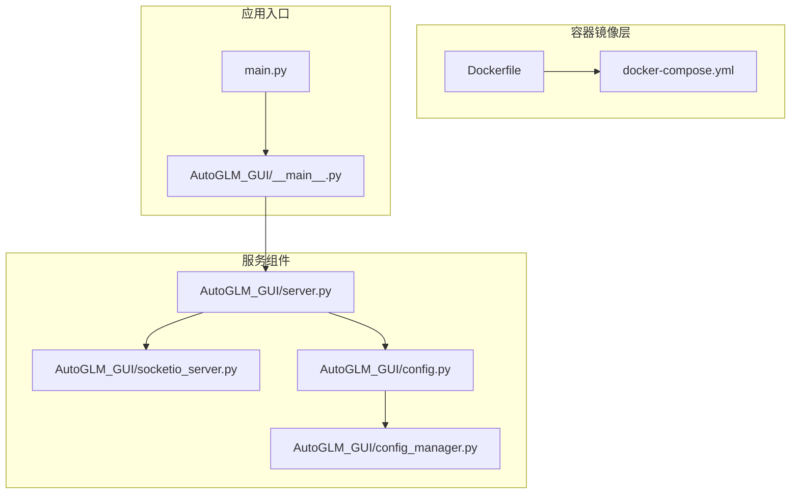
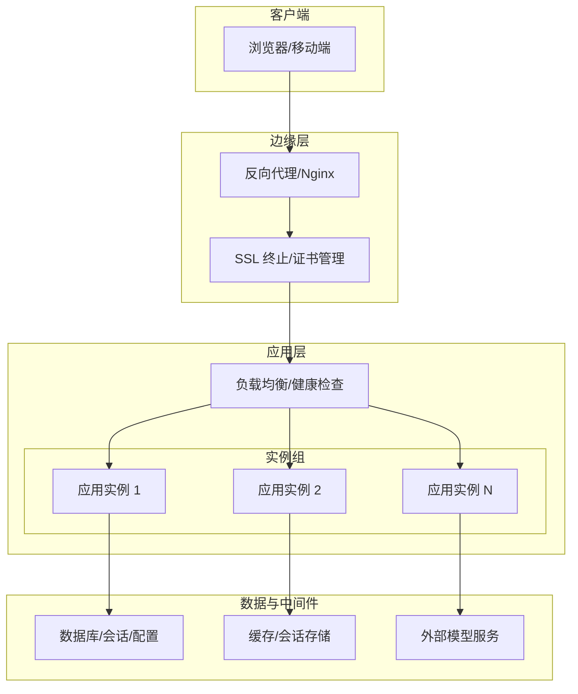
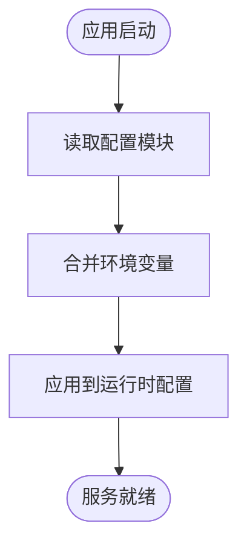
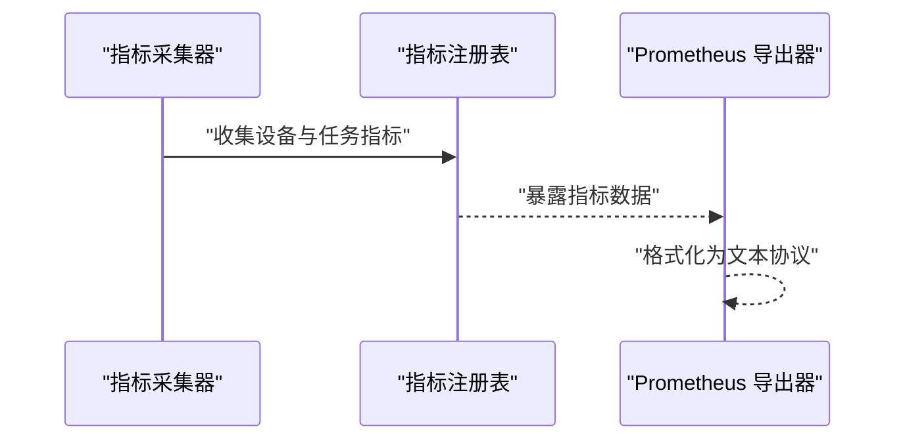
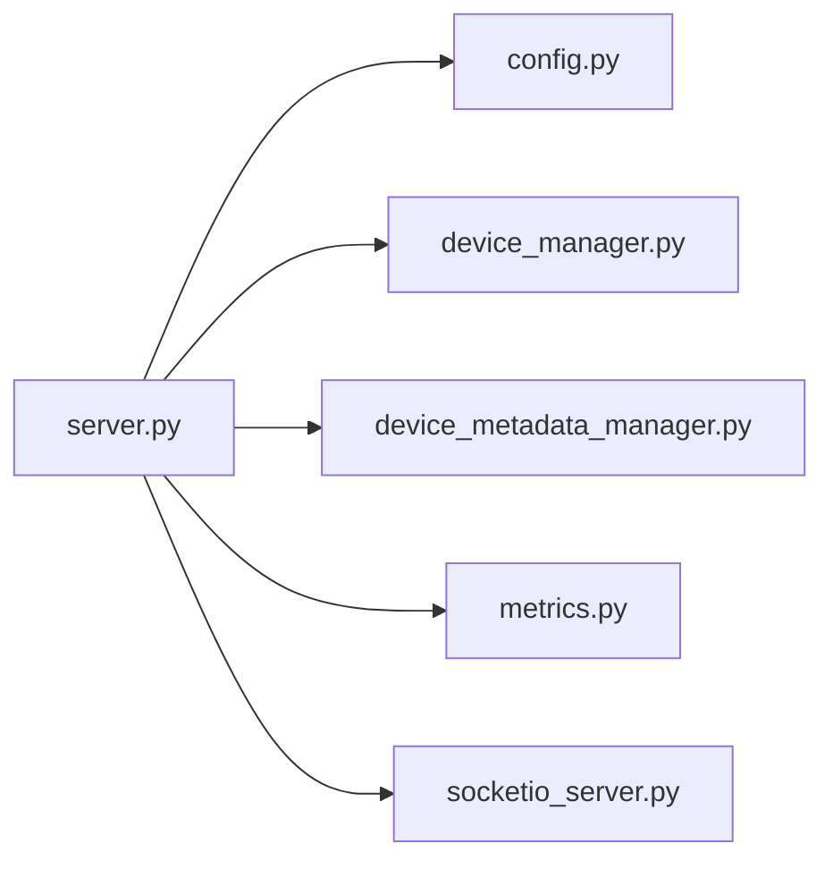

# 生产环境配置

<cite>
**本文引用的文件**
- [Dockerfile](file://Dockerfile)
- [docker-compose.yml](file://docker-compose.yml)
- [pyproject.toml](file://pyproject.toml)
- [main.py](file://main.py)
- [AutoGLM_GUI/__main__.py](file://AutoGLM_GUI/__main__.py)
- [AutoGLM_GUI/server.py](file://AutoGLM_GUI/server.py)
- [AutoGLM_GUI/socketio_server.py](file://AutoGLM_GUI/socketio_server.py)
- [AutoGLM_GUI/config.py](file://AutoGLM_GUI/config.py)
- [AutoGLM_GUI/config_manager.py](file://AutoGLM_GUI/config_manager.py)
- [AutoGLM_GUI/device_manager.py](file://AutoGLM_GUI/device_manager.py)
- [AutoGLM_GUI/device_metadata_manager.py](file://AutoGLM_GUI/device_metadata_manager.py)
- [AutoGLM_GUI/adb/timing.py](file://AutoGLM_GUI/adb/timing.py)
- [AutoGLM_GUI/metrics.py](file://AutoGLM_GUI/metrics.py)
- [docs/docs/deployment/docker.md](file://docs/docs/deployment/docker.md)
- [docs/docs/deployment/server.md](file://docs/docs/deployment/server.md)
- [scripts/start_mock_llm.py](file://scripts/start_mock_llm.py)
- [tests/test_metrics.py](file://tests/test_metrics.py)
</cite>

## 目录
1. [简介](#简介)
2. [项目结构](#项目结构)
3. [核心组件](#核心组件)
4. [架构总览](#架构总览)
5. [详细组件分析](#详细组件分析)
6. [依赖分析](#依赖分析)
7. [性能考虑](#性能考虑)
8. [故障排查指南](#故障排查指南)
9. [结论](#结论)
10. [附录](#附录)

## 简介
本文件面向生产环境部署与运维，围绕 AutoGLM-GUI 的服务端能力，提供系统要求、依赖安装、环境变量配置、数据库与缓存、第三方服务集成、反向代理与 SSL、负载均衡、进程管理与自动重启、资源监控、性能调优、安全加固与访问控制等完整配置说明。内容基于仓库中的部署文档、配置模块与指标导出能力整理而成，确保稳定性、安全性与可扩展性。

## 项目结构
AutoGLM-GUI 提供桌面端与服务端两种运行形态，并通过 Docker 与 docker-compose 提供容器化部署参考。生产环境推荐以容器方式部署，以便统一依赖、网络与存储挂载。

**图示来源**
- [Dockerfile](file://Dockerfile)
- [docker-compose.yml](file://docker-compose.yml)
- [main.py](file://main.py)
- [AutoGLM_GUI/__main__.py](file://AutoGLM_GUI/__main__.py)
- [AutoGLM_GUI/server.py](file://AutoGLM_GUI/server.py)
- [AutoGLM_GUI/socketio_server.py](file://AutoGLM_GUI/socketio_server.py)
- [AutoGLM_GUI/config.py](file://AutoGLM_GUI/config.py)
- [AutoGLM_GUI/config_manager.py](file://AutoGLM_GUI/config_manager.py)

**章节来源**
- [docs/docs/deployment/docker.md](file://docs/docs/deployment/docker.md)
- [docs/docs/deployment/server.md](file://docs/docs/deployment/server.md)

## 核心组件
- 应用入口与启动
  - 入口脚本负责加载包内主程序，启动服务端与 SocketIO 服务。
- 服务端与实时通信
  - HTTP 服务与 SocketIO 服务分离，分别处理 REST API 与实时事件推送。
- 配置体系
  - 配置模块与配置管理器协同，支持运行时读取与更新配置。
- 设备与元数据管理
  - 设备管理器与设备元数据管理器负责设备生命周期与状态跟踪。
- 性能与可观测性
  - 指标导出模块提供 Prometheus 可抓取指标，辅助监控与告警。

**章节来源**
- [AutoGLM_GUI/__main__.py](file://AutoGLM_GUI/__main__.py)
- [AutoGLM_GUI/server.py](file://AutoGLM_GUI/server.py)
- [AutoGLM_GUI/socketio_server.py](file://AutoGLM_GUI/socketio_server.py)
- [AutoGLM_GUI/config.py](file://AutoGLM_GUI/config.py)
- [AutoGLM_GUI/config_manager.py](file://AutoGLM_GUI/config_manager.py)
- [AutoGLM_GUI/device_manager.py](file://AutoGLM_GUI/device_manager.py)
- [AutoGLM_GUI/device_metadata_manager.py](file://AutoGLM_GUI/device_metadata_manager.py)
- [AutoGLM_GUI/metrics.py](file://AutoGLM_GUI/metrics.py)

## 架构总览
下图展示生产环境典型拓扑：反向代理前置、多实例后端、共享存储与缓存、外部模型服务对接。

[此图为概念性架构示意，不直接映射具体源码文件，故无“图示来源”]

## 详细组件分析

### 1) 系统要求与依赖安装
- 运行时依赖
  - Python 版本与依赖由项目构建配置文件声明，建议使用容器镜像以保证一致性。
- 容器化部署
  - 使用仓库提供的镜像与 compose 文件，采用 host 网络模式以支持 USB 与 mDNS。
  - 建议挂载配置目录与日志目录，便于持久化与审计。
- 外设与系统权限
  - 服务端需具备访问 ADB、USB 设备与屏幕投影视频流的权限；容器中可通过特权或设备挂载满足需求。

**章节来源**
- [docs/docs/deployment/docker.md](file://docs/docs/deployment/docker.md)
- [Dockerfile](file://Dockerfile)
- [docker-compose.yml](file://docker-compose.yml)

### 2) 环境变量与配置
- 关键环境变量（示例）
  - 用于控制 ADB 与服务重启延迟的时序参数，便于在不同硬件条件下调优。
  - 其他通用配置项（如端口、日志级别、模型服务地址等）建议通过环境变量注入。
- 配置加载流程
  - 应用启动时读取配置模块，配置管理器负责合并默认值与环境变量，形成最终运行配置。

**图示来源**
- [AutoGLM_GUI/config.py](file://AutoGLM_GUI/config.py)
- [AutoGLM_GUI/config_manager.py](file://AutoGLM_GUI/config_manager.py)

**章节来源**
- [AutoGLM_GUI/adb/timing.py](file://AutoGLM_GUI/adb/timing.py)
- [AutoGLM_GUI/config.py](file://AutoGLM_GUI/config.py)
- [AutoGLM_GUI/config_manager.py](file://AutoGLM_GUI/config_manager.py)

### 3) 数据库与缓存
- 数据库存储
  - 建议使用关系型数据库存储设备元数据、任务历史与配置；采用连接池与只读副本提升可用性。
- 缓存策略
  - 使用分布式缓存（如 Redis）存放会话、热点配置与短期状态；开启持久化与备份。
- 会话与状态
  - 通过设备管理器与元数据管理器维护设备状态，结合缓存实现快速查询与一致性保障。

**章节来源**
- [AutoGLM_GUI/device_manager.py](file://AutoGLM_GUI/device_manager.py)
- [AutoGLM_GUI/device_metadata_manager.py](file://AutoGLM_GUI/device_metadata_manager.py)

### 4) 第三方服务集成
- 模型服务
  - 通过环境变量配置外部模型服务地址与鉴权信息；可使用本地 Mock 服务进行联调。
- 实时通信
  - SocketIO 服务用于推送设备状态与任务进度，建议与反向代理配合实现长连接透传。

**章节来源**
- [scripts/start_mock_llm.py](file://scripts/start_mock_llm.py)
- [AutoGLM_GUI/socketio_server.py](file://AutoGLM_GUI/socketio_server.py)

### 5) 反向代理与 SSL
- 反向代理
  - 在生产环境使用 Nginx/Apache 作为统一入口，转发至后端多个实例；开启压缩与缓存静态资源。
- SSL 终止
  - 使用自动化证书管理（如 ACME），定期续期；仅允许 TLSv1.2+。
- WebSocket 透传
  - 配置长连接升级与超时参数，确保 SocketIO 会话稳定。

**章节来源**
- [AutoGLM_GUI/socketio_server.py](file://AutoGLM_GUI/socketio_server.py)

### 6) 负载均衡与高可用
- 健康检查
  - 后端提供健康检查接口，LB 基于探针结果调度流量。
- 无状态设计
  - 会话与状态尽量存于共享缓存/数据库；前端 Cookie 仅存轻量令牌。
- 故障转移
  - 多实例部署，结合自动扩缩容策略应对突发流量。

**章节来源**
- [AutoGLM_GUI/server.py](file://AutoGLM_GUI/server.py)

### 7) 进程管理、自动重启与日志
- 进程管理
  - 推荐使用 systemd 或容器编排平台管理进程；设置资源限制与 OOM 保护。
- 自动重启
  - 配置失败重启策略与退避机制；记录重启原因便于排查。
- 日志
  - 分离访问日志与应用日志；按天轮转并保留审计日志。

**章节来源**
- [AutoGLM_GUI/server.py](file://AutoGLM_GUI/server.py)

### 8) 性能调优与资源管理
- CPU 优化
  - 合理设置并发线程/协程上限；对耗时操作异步化与批量化。
- 内存管理
  - 对设备截图与视频流进行内存池化与及时释放；监控堆外内存占用。
- I/O 优化
  - 批量写入数据库与缓存；启用压缩与连接复用。
- 时序参数
  - 通过环境变量调整 ADB 与服务重启延迟，适配不同硬件性能。

**章节来源**
- [AutoGLM_GUI/adb/timing.py](file://AutoGLM_GUI/adb/timing.py)

### 9) 安全加固与访问控制
- 网络安全
  - 仅暴露必要端口；使用防火墙规则限制来源 IP；启用 WAF。
- 访问控制
  - 强制身份认证与授权；对敏感接口增加速率限制与二次校验。
- 传输安全
  - 仅使用 HTTPS；禁用弱密码套件；启用 HSTS。
- 配置安全
  - 将密钥与令牌放入只读配置卷；避免明文存储。

**章节来源**
- [AutoGLM_GUI/server.py](file://AutoGLM_GUI/server.py)

### 10) 监控与可观测性
- 指标导出
  - 指标模块提供 Prometheus 格式指标，包括设备状态、忙碌数量等。
- 告警策略
  - 基于指标阈值与异常检测建立告警；结合日志与链路追踪定位问题。
- 健康检查
  - 对数据库、缓存与外部服务进行探活；失败即隔离与熔断。

**图示来源**
- [AutoGLM_GUI/metrics.py](file://AutoGLM_GUI/metrics.py)
- [tests/test_metrics.py](file://tests/test_metrics.py)

**章节来源**
- [AutoGLM_GUI/metrics.py](file://AutoGLM_GUI/metrics.py)
- [tests/test_metrics.py](file://tests/test_metrics.py)

## 依赖分析
- 构建与运行依赖
  - 依赖声明与版本由构建配置文件统一管理；容器镜像封装了运行时环境。
- 组件耦合
  - 服务端与 SocketIO 服务解耦，配置模块独立于业务逻辑，便于替换与扩展。
- 外部依赖
  - 外部模型服务、数据库与缓存为可插拔组件，通过配置注入。

**图示来源**
- [AutoGLM_GUI/server.py](file://AutoGLM_GUI/server.py)
- [AutoGLM_GUI/config.py](file://AutoGLM_GUI/config.py)
- [AutoGLM_GUI/device_manager.py](file://AutoGLM_GUI/device_manager.py)
- [AutoGLM_GUI/device_metadata_manager.py](file://AutoGLM_GUI/device_metadata_manager.py)
- [AutoGLM_GUI/metrics.py](file://AutoGLM_GUI/metrics.py)
- [AutoGLM_GUI/socketio_server.py](file://AutoGLM_GUI/socketio_server.py)

**章节来源**
- [pyproject.toml](file://pyproject.toml)

## 性能考虑
- 端到端时延
  - 通过时序配置参数调节 ADB 与服务重启延迟，平衡稳定性与吞吐。
- 并发与限流
  - 对外部模型服务与数据库设置连接池与请求限流，避免过载。
- 存储与网络
  - 使用 SSD 与高速网络；对大对象进行分片与压缩传输。

**章节来源**
- [AutoGLM_GUI/adb/timing.py](file://AutoGLM_GUI/adb/timing.py)

## 故障排查指南
- 健康检查失败
  - 检查数据库与缓存连通性；查看应用日志与错误码。
- 设备连接异常
  - 校验 ADB 权限与 USB/mDNS 配置；确认容器网络模式。
- 指标缺失
  - 确认指标导出端点可达；核对注册表是否正确生成指标文本。
- 代理与 SSL
  - 检查证书链完整性与过期时间；验证 WebSocket 升级头。

**章节来源**
- [AutoGLM_GUI/server.py](file://AutoGLM_GUI/server.py)
- [AutoGLM_GUI/metrics.py](file://AutoGLM_GUI/metrics.py)
- [tests/test_metrics.py](file://tests/test_metrics.py)

## 结论
通过容器化部署、完善的配置体系、可观测性与安全加固，AutoGLM-GUI 可在生产环境中实现高可用、可扩展与易运维。建议结合实际硬件与业务规模，持续迭代时序参数、资源配额与监控策略，确保系统稳定运行。

## 附录
- 快速对照清单
  - 使用官方镜像与 compose 文件；挂载配置与日志目录；启用 host 网络模式。
  - 配置数据库、缓存与外部模型服务；设置 SSL 与反向代理。
  - 开启健康检查与负载均衡；配置进程管理与自动重启。
  - 部署监控与告警；实施安全加固与访问控制。