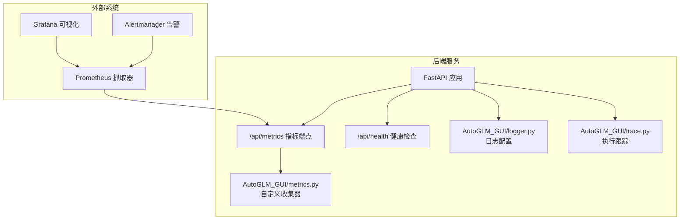
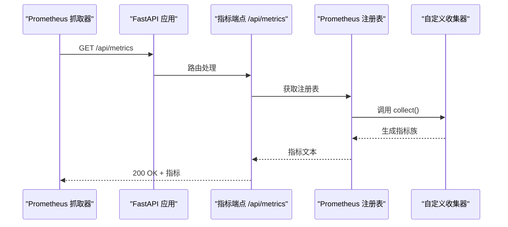
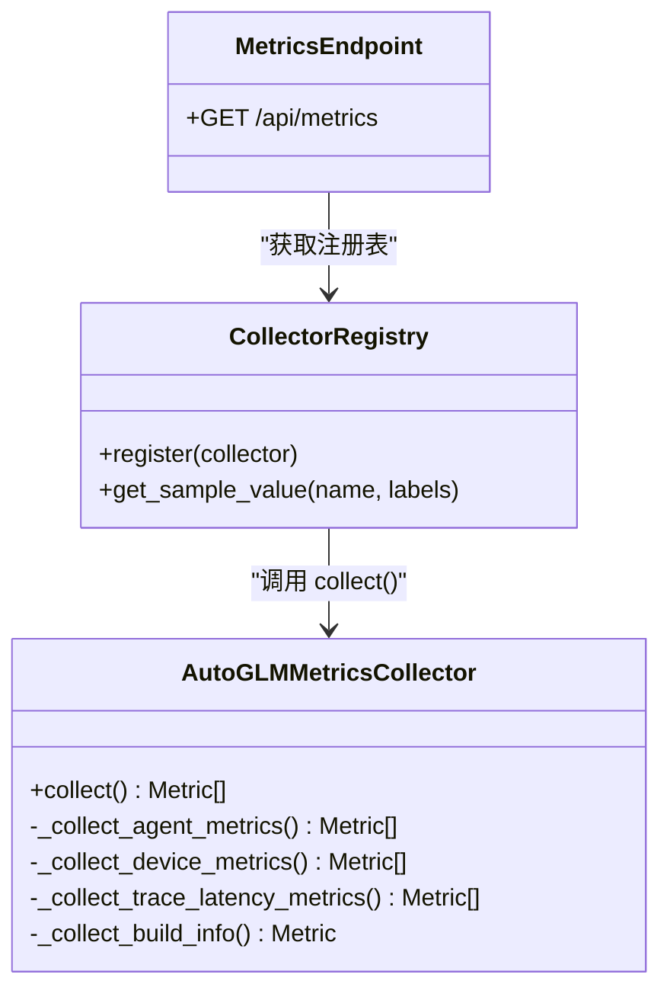
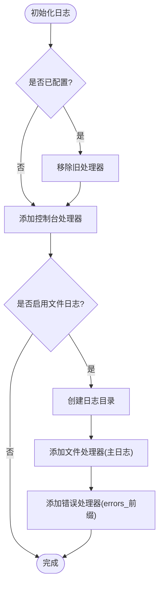
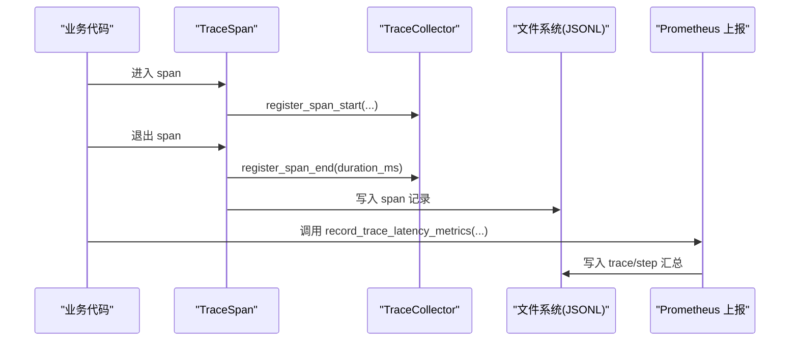
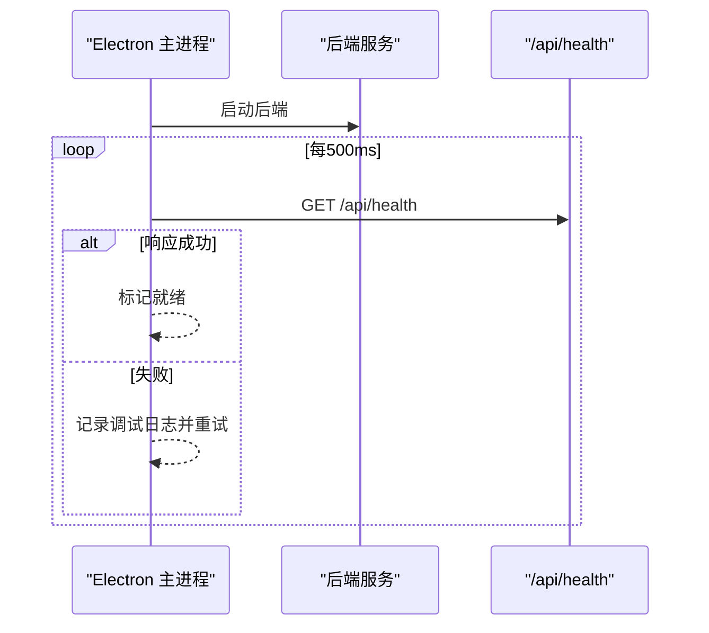
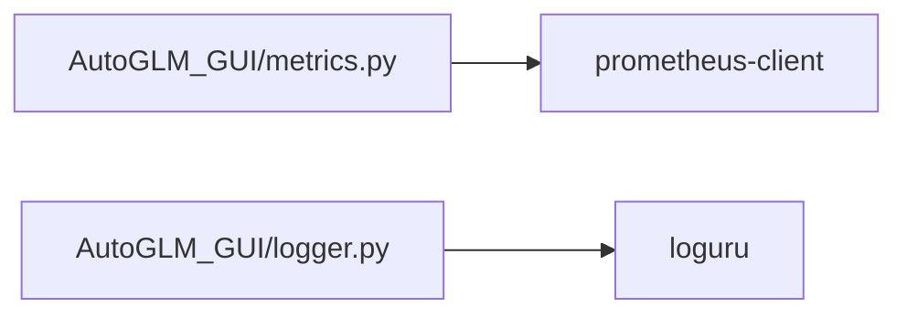

# 监控与日志

<cite>
**本文引用的文件**   
- [metrics.py](file://AutoGLM_GUI/metrics.py)
- [logger.py](file://AutoGLM_GUI/logger.py)
- [metrics.py](file://AutoGLM_GUI/api/metrics.py)
- [trace.py](file://AutoGLM_GUI/trace.py)
- [health.py](file://AutoGLM_GUI/api/health.py)
- [main.js](file://electron/main.js)
- [uv.lock](file://uv.lock)
</cite>

## 目录
1. [简介](#简介)
2. [项目结构](#项目结构)
3. [核心组件](#核心组件)
4. [架构总览](#架构总览)
5. [组件详解](#组件详解)
6. [依赖关系分析](#依赖关系分析)
7. [性能考量](#性能考量)
8. [故障排查指南](#故障排查指南)
9. [结论](#结论)
10. [附录](#附录)

## 简介
本文件面向运维与开发团队，系统化梳理 AutoGLM-GUI 的监控与日志体系，覆盖以下目标：
- 明确系统监控指标定义与采集范围：应用性能、设备连接状态、AI 代理执行时序
- 规范日志格式、轮转与存储策略
- 提供 Prometheus 指标配置、Grafana 仪表板建议与告警规则思路
- 支持错误追踪、异常告警与性能瓶颈分析
- 提供监控数据可视化、趋势分析与容量预测方法

## 项目结构
围绕监控与日志的关键代码位于以下模块：
- Prometheus 指标采集与导出：AutoGLM_GUI/metrics.py、AutoGLM_GUI/api/metrics.py
- 日志中心化与轮转：AutoGLM_GUI/logger.py
- 执行跟踪与回放：AutoGLM_GUI/trace.py
- 健康检查接口：AutoGLM_GUI/api/health.py
- Electron 启动流程中的健康检查与日志：electron/main.js
- 外部依赖（Prometheus 客户端）：uv.lock

图表来源
- [metrics.py:11-36](file://AutoGLM_GUI/api/metrics.py#L11-L36)
- [metrics.py:194-219](file://AutoGLM_GUI/metrics.py#L194-L219)
- [logger.py:16-79](file://AutoGLM_GUI/logger.py#L16-L79)
- [trace.py:137-156](file://AutoGLM_GUI/trace.py#L137-L156)
- [health.py:10-15](file://AutoGLM_GUI/api/health.py#L10-L15)

章节来源
- [metrics.py:1-37](file://AutoGLM_GUI/api/metrics.py#L1-L37)
- [metrics.py:1-508](file://AutoGLM_GUI/metrics.py#L1-L508)
- [logger.py:1-87](file://AutoGLM_GUI/logger.py#L1-L87)
- [trace.py:1-913](file://AutoGLM_GUI/trace.py#L1-L913)
- [health.py:1-15](file://AutoGLM_GUI/api/health.py#L1-L15)
- [uv.lock:3082-3089](file://uv.lock#L3082-L3089)

## 核心组件
- 自定义 Prometheus 收集器：按需采集代理状态、设备连接、执行时序直方图等指标，并注册到全局注册表
- 指标 HTTP 端点：提供 /api/metrics 文本格式输出，供 Prometheus 抓取
- 日志系统：基于 loguru，支持控制台与文件双通道、自动轮转、压缩与错误分离
- 执行跟踪：轻量级 span 记录，支持步骤级时序拆解、错误归档与回放事件写入
- 健康检查：/api/health 返回服务健康状态与版本信息，用于启动流程与外部探活

章节来源
- [metrics.py:179-219](file://AutoGLM_GUI/metrics.py#L179-L219)
- [metrics.py:11-36](file://AutoGLM_GUI/api/metrics.py#L11-L36)
- [logger.py:16-79](file://AutoGLM_GUI/logger.py#L16-L79)
- [trace.py:137-156](file://AutoGLM_GUI/trace.py#L137-L156)
- [health.py:10-15](file://AutoGLM_GUI/api/health.py#L10-L15)

## 架构总览
下图展示监控与日志在系统中的交互路径：Prometheus 抓取指标、Grafana 展示、Alertmanager 基于规则触发告警；同时应用通过健康检查接口对外暴露运行状态。

图表来源
- [metrics.py:11-36](file://AutoGLM_GUI/api/metrics.py#L11-L36)
- [metrics.py:473-488](file://AutoGLM_GUI/metrics.py#L473-L488)

章节来源
- [metrics.py:11-36](file://AutoGLM_GUI/api/metrics.py#L11-L36)
- [metrics.py:473-488](file://AutoGLM_GUI/metrics.py#L473-L488)

## 组件详解

### Prometheus 指标采集与导出
- 指标类型与用途
  - Gauge：代理状态分布、活跃会话数、设备在线数、未授权连接数、设备最后可见时间戳、构建信息
  - Histogram：任务/步骤/组件执行时延（秒），按源维度聚合
- 关键标签
  - 设备类：serial、model、state、connection_type、status
  - 代理类：device_id、serial、state
  - 执行类：source、component
- 采集时机
  - on-demand：每次抓取时调用 collect()，避免后台更新带来的复杂性与内存泄漏风险
  - 线程安全：仅在 collect() 中持有锁，其余为只读快照
- 导出端点
  - /api/metrics：返回 Prometheus 文本格式，供 Prometheus 配置定时抓取

图表来源
- [metrics.py:179-219](file://AutoGLM_GUI/metrics.py#L179-L219)
- [metrics.py:473-488](file://AutoGLM_GUI/metrics.py#L473-L488)
- [metrics.py:11-36](file://AutoGLM_GUI/api/metrics.py#L11-L36)

章节来源
- [metrics.py:179-465](file://AutoGLM_GUI/metrics.py#L179-L465)
- [metrics.py:11-36](file://AutoGLM_GUI/api/metrics.py#L11-L36)

### 日志系统与轮转策略
- 控制台输出：彩色、结构化时间与定位信息
- 文件输出：统一格式、UTF-8 编码、自动目录创建
- 错误分离：独立 errors_YYYY-MM-DD.log，保留堆栈与诊断信息
- 轮转与保留：可配置大小阈值与时间保留周期，支持压缩归档
- 初始化策略：首次调用 configure_logger() 后生效，避免默认行为污染

图表来源
- [logger.py:16-79](file://AutoGLM_GUI/logger.py#L16-L79)

章节来源
- [logger.py:16-79](file://AutoGLM_GUI/logger.py#L16-L79)

### 执行跟踪与回放
- 跟踪开关：AUTOGLM_TRACE_ENABLED/AUTOGLM_TRACE_REPLAY_ENABLED 环境变量控制
- 记录格式：JSONL，包含 span 元数据、时长、属性与错误摘要
- 步骤级时序：自动拆解 screenshot、current_app、llm、parse_action、execute_action、update_context、adb、sleep、other 等组件耗时
- 回放事件：镜像任务事件到 replay.jsonl，支持截图等制品写入 artifacts 目录
- 时序汇总：提供 trace/step 汇总，便于上报直方图指标

图表来源
- [trace.py:757-864](file://AutoGLM_GUI/trace.py#L757-L864)
- [trace.py:556-670](file://AutoGLM_GUI/trace.py#L556-L670)
- [trace.py:137-156](file://AutoGLM_GUI/trace.py#L137-L156)
- [metrics.py:491-502](file://AutoGLM_GUI/metrics.py#L491-L502)

章节来源
- [trace.py:1-913](file://AutoGLM_GUI/trace.py#L1-L913)
- [metrics.py:491-502](file://AutoGLM_GUI/metrics.py#L491-L502)

### 健康检查与启动流程
- /api/health：返回健康状态与版本号，便于外部探活与容器编排
- Electron 主进程：启动后端服务并定期进行健康检查，超时记录日志并给出用户提示

图表来源
- [health.py:10-15](file://AutoGLM_GUI/api/health.py#L10-L15)
- [main.js:244-281](file://electron/main.js#L244-L281)

章节来源
- [health.py:10-15](file://AutoGLM_GUI/api/health.py#L10-L15)
- [main.js:244-281](file://electron/main.js#L244-L281)

## 依赖关系分析
- Prometheus 客户端：通过 prometheus-client 提供指标注册与文本导出能力
- 日志框架：使用 loguru 实现高性能、灵活的日志配置与轮转

图表来源
- [uv.lock:3082-3089](file://uv.lock#L3082-L3089)

章节来源
- [uv.lock:3082-3089](file://uv.lock#L3082-L3089)

## 性能考量
- 指标采集
  - on-demand 模式降低后台维护成本，避免标签无限增长导致的内存泄漏
  - 使用直方图分桶统计时延，兼顾精度与资源占用
- 日志
  - 文件轮转与压缩减少磁盘压力；错误日志单独文件便于快速定位
  - 结构化字段与 UTF-8 编码提升解析效率
- 执行跟踪
  - 步骤级时序拆解与汇总，便于定位瓶颈环节
  - 可选的截图制品写入，平衡可观测性与存储成本

## 故障排查指南
- 指标不可见或为空
  - 检查 /api/metrics 是否可达，确认 Prometheus 抓取配置与目标地址
  - 查看后端日志中“Prometheus metrics collector registered”等关键信息
- 日志缺失或乱码
  - 确认 configure_logger() 已被调用且文件路径存在
  - 检查编码与轮转参数，确保目录权限正确
- 执行跟踪未记录
  - 检查 AUTOGLM_TRACE_ENABLED/AUTOGLM_TRACE_REPLAY_ENABLED 环境变量
  - 确认 JSONL 文件写入路径与权限
- 启动失败或超时
  - 使用 /api/health 探活，结合 Electron 主进程日志定位后端异常
  - 若为系统组件缺失，参考 Electron 错误提示指引安装依赖

章节来源
- [metrics.py:11-36](file://AutoGLM_GUI/api/metrics.py#L11-L36)
- [logger.py:16-79](file://AutoGLM_GUI/logger.py#L16-L79)
- [trace.py:137-156](file://AutoGLM_GUI/trace.py#L137-L156)
- [main.js:244-281](file://electron/main.js#L244-L281)

## 结论
AutoGLM-GUI 的监控与日志体系以 Prometheus 指标为核心，辅以结构化日志与执行跟踪，形成从应用性能、设备状态到 AI 代理执行的全链路可观测性闭环。通过规范化的指标定义、日志轮转与存储策略，以及健康检查与启动流程的配合，运维团队可以高效地发现并解决问题，保障系统稳定运行。

## 附录

### Prometheus 指标清单与含义
- autoglm_agents_total：按设备与状态的代理计数（Gauge）
- autoglm_agents_busy_count：忙碌代理数量（Gauge）
- autoglm_streaming_sessions_active：活跃流式会话数（Gauge）
- autoglm_devices_total：按状态/连接类型的设备计数（Gauge）
- autoglm_devices_online_count：在线设备总数（Gauge）
- autoglm_device_connections_total：按连接类型/状态的连接计数（Gauge）
- autoglm_device_unauthorized_connections_total：未授权连接总数（Gauge）
- autoglm_device_last_seen_timestamp_seconds：设备最后可见时间戳（Gauge）
- autoglm_build_info：构建信息（Gauge，带版本标签）
- autoglm_trace_task_duration_seconds：任务执行时延直方图（Histogram，source 标签）
- autoglm_trace_step_duration_seconds：步骤执行时延直方图（Histogram，source 标签）
- autoglm_trace_component_duration_seconds：组件执行时延直方图（Histogram，source、component 标签）

章节来源
- [metrics.py:221-465](file://AutoGLM_GUI/metrics.py#L221-L465)

### Grafana 仪表板建议
- 代理与设备
  - 代理状态分布（按 device_id/state）
  - 在线设备趋势与未授权连接占比
- 性能与时延
  - 任务/步骤/组件时延分位数（P50/P90/P99）
  - 活跃会话数与忙碌代理数
- 日志与告警
  - 错误日志速率（errors_YYYY-MM-DD.log）
  - 启动阶段健康检查成功率

[本节为概念性内容，无需代码来源]

### 告警规则示例（PromQL）
- 代理长时间忙碌
  - expr: avg_over_time(autoglm_agents_busy_count[5m]) > 0.8 * scalar(count(up))
  - 说明：若忙碌代理比例持续偏高，触发告警
- 设备离线率升高
  - expr: increase(autoglm_devices_online_count[1h]) < -N
  - 说明：在线设备数显著下降时告警
- 执行时延异常
  - expr: histogram_quantile(0.95, sum by(le, source) (rate(autoglm_trace_step_duration_seconds_bucket[5m]))) > T
  - 说明：步骤 P95 时延超过阈值
- 健康检查失败
  - expr: up == 0
  - 说明：服务不可达

[本节为概念性内容，无需代码来源]

### 日志格式标准化
- 统一字段：时间、级别、位置（模块:函数:行号）、消息
- 错误日志：额外包含堆栈与诊断信息，便于根因分析
- 文件命名：logs/autoglm_{time:YYYY-MM-DD}.log 与 errors_{time:YYYY-MM-DD}.log

章节来源
- [logger.py:42-77](file://AutoGLM_GUI/logger.py#L42-L77)

### 日志轮转与存储策略
- 轮转条件：按大小（如 100MB）或时间（如每日）
- 保留期：主日志若干天，错误日志更长（如 30 天）
- 压缩：支持 zip/gz 等压缩归档
- 存储位置：统一目录，确保权限与磁盘空间充足

章节来源
- [logger.py:16-79](file://AutoGLM_GUI/logger.py#L16-L79)

### 执行跟踪与回放
- 开关：AUTOGLM_TRACE_ENABLED/AUTOGLM_TRACE_REPLAY_ENABLED
- 输出：trace_{date}.jsonl 与 replay.jsonl，制品保存在 artifacts 目录
- 时序：按组件拆解，支持错误摘要与截图制品

章节来源
- [trace.py:55-71](file://AutoGLM_GUI/trace.py#L55-L71)
- [trace.py:101-156](file://AutoGLM_GUI/trace.py#L101-L156)
- [trace.py:280-313](file://AutoGLM_GUI/trace.py#L280-L313)