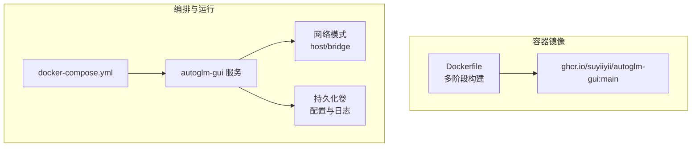
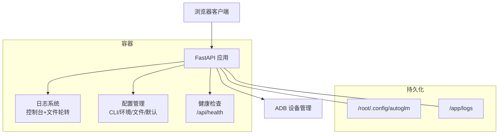
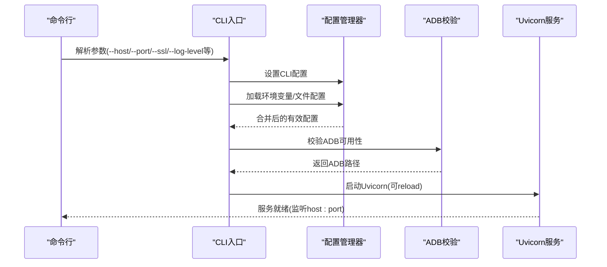
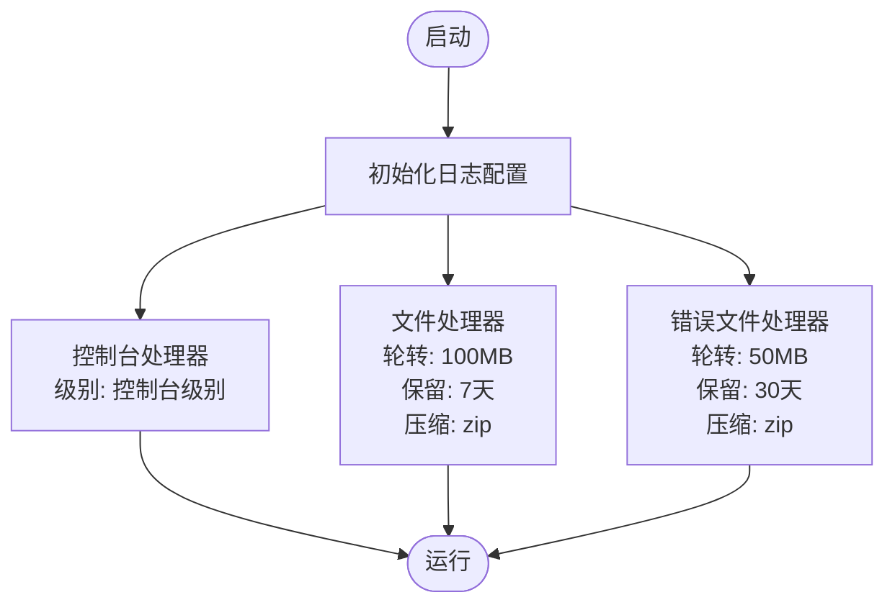
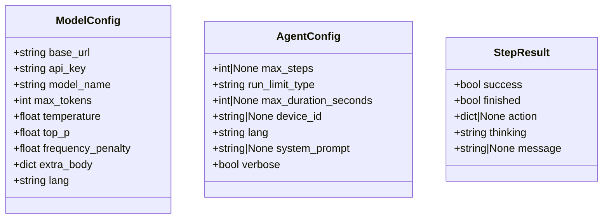
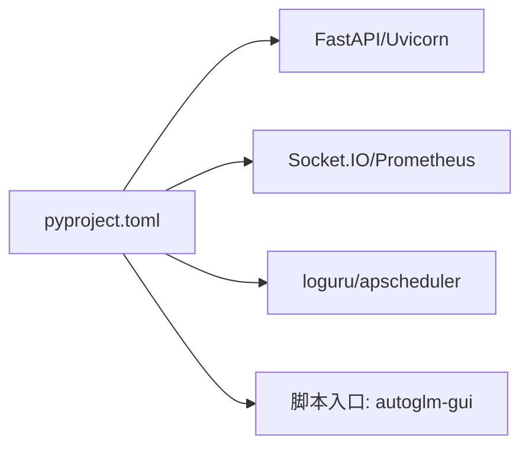

# 部署运维

<cite>
**本文引用的文件**
- [Dockerfile](file://Dockerfile)
- [docker-compose.yml](file://docker-compose.yml)
- [docs 文档总览](file://docs/docs/deployment.md)
- [Docker 高级部署指南](file://docs/docs/deployment/docker.md)
- [服务端运行说明](file://docs/docs/deployment/server.md)
- [pyproject.toml](file://pyproject.toml)
- [main.py](file://main.py)
- [AutoGLM_GUI/__main__.py](file://AutoGLM_GUI/__main__.py)
- [AutoGLM_GUI/config.py](file://AutoGLM_GUI/config.py)
- [AutoGLM_GUI/logger.py](file://AutoGLM_GUI/logger.py)
</cite>

## 目录
1. [简介](#简介)
2. [项目结构](#项目结构)
3. [核心组件](#核心组件)
4. [架构总览](#架构总览)
5. [详细组件分析](#详细组件分析)
6. [依赖关系分析](#依赖关系分析)
7. [性能考虑](#性能考虑)
8. [故障排除指南](#故障排除指南)
9. [结论](#结论)
10. [附录](#附录)

## 简介
本文件面向运维工程师与平台工程团队，提供 AutoGLM-GUI 在生产环境中的部署与运维实践指南。内容覆盖：
- Docker 与 docker-compose 部署
- 环境变量与持久化卷配置
- 健康检查与端口绑定策略
- 日志管理与可观测性
- 性能监控与告警建议
- 备份恢复与安全加固
- 版本升级与回滚流程
- 常见问题诊断与排障

## 项目结构
AutoGLM-GUI 采用“前端 Node 构建 + Python 后端”的多阶段 Docker 镜像方案，并通过 docker-compose 提供一键编排。后端以 FastAPI 提供 API 服务，支持健康检查、日志轮转与文件存储。

图表来源
- [Dockerfile:1-64](file://Dockerfile#L1-L64)
- [docker-compose.yml:1-32](file://docker-compose.yml#L1-L32)

章节来源
- [Dockerfile:1-64](file://Dockerfile#L1-L64)
- [docker-compose.yml:1-32](file://docker-compose.yml#L1-L32)
- [docs 文档总览:6-70](file://docs/docs/deployment.md#L6-L70)

## 核心组件
- 容器镜像与构建
  - 多阶段构建：Node 前端构建产物复制至 Python 基础镜像，安装系统依赖（ADB、curl、证书），打包静态资源，启用健康检查。
  - 默认暴露端口与健康检查命令，便于容器编排与平台集成。
- 编排与运行
  - docker-compose 提供 host 网络模式与桥接网络两种选择；挂载配置与日志目录；支持重启策略。
- 后端服务入口
  - CLI 入口提供丰富的启动参数（主机、端口、SSL、日志级别、重载等），统一配置管理器按优先级合并配置。
- 日志系统
  - 使用 loguru 统一日志配置，支持控制台与文件双通道、自动轮转、保留期与压缩、错误日志分离。

章节来源
- [Dockerfile:6-64](file://Dockerfile#L6-L64)
- [docker-compose.yml:1-32](file://docker-compose.yml#L1-L32)
- [AutoGLM_GUI/__main__.py:78-301](file://AutoGLM_GUI/__main__.py#L78-L301)
- [AutoGLM_GUI/logger.py:16-87](file://AutoGLM_GUI/logger.py#L16-L87)

## 架构总览
下图展示生产部署的关键交互：客户端浏览器访问 Web 界面，后端通过 FastAPI 提供 API 与 Socket.IO 实时能力；容器内挂载持久化卷用于配置与日志；健康检查保障服务可用性。

图表来源
- [AutoGLM_GUI/__main__.py:213-238](file://AutoGLM_GUI/__main__.py#L213-L238)
- [Dockerfile:49-60](file://Dockerfile#L49-L60)
- [docs 文档总览:64-70](file://docs/docs/deployment.md#L64-L70)

## 详细组件分析

### Docker 镜像与健康检查
- 多阶段构建：前端构建产物复制到 Python 镜像，确保静态资源随包分发。
- 系统依赖：安装 ADB、curl、CA 证书，满足设备控制与健康检查需求。
- 健康检查：基于 HTTP GET /api/health，失败重试次数与间隔可调。
- 默认命令：autoglm-gui 以 0.0.0.0:8000 启动，禁用自动打开浏览器。

章节来源
- [Dockerfile:6-64](file://Dockerfile#L6-L64)
- [docs 文档总览:64-70](file://docs/docs/deployment.md#L64-L70)

### docker-compose 编排与网络
- 镜像来源：ghcr.io/suyiiyii/autoglm-gui:main
- 网络模式：Linux 推荐 host 模式以支持 mDNS/USB；macOS/Windows 可用 bridge + 端口映射。
- 持久化：挂载 /root/.config/autoglm 与 /app/logs，便于配置与日志持久化。
- 重启策略：unless-stopped，提升稳定性。
- 可选：USB 设备直通（Linux）。

章节来源
- [docker-compose.yml:1-32](file://docker-compose.yml#L1-L32)
- [docs 文档总览:54-63](file://docs/docs/deployment.md#L54-L63)

### 后端启动流程与配置合并
- CLI 参数解析：主机、端口、SSL、日志级别、重载、模型配置等。
- 配置优先级：CLI > 环境变量 > 文件配置 > 默认值；启动前完成合并与同步。
- ADB 初始化：确保 ADB 可用，不可用时降级处理但不影响后续错误暴露。
- Uvicorn 启动：根据参数选择 reload 或直接加载模块。

图表来源
- [AutoGLM_GUI/__main__.py:117-301](file://AutoGLM_GUI/__main__.py#L117-L301)

章节来源
- [AutoGLM_GUI/__main__.py:78-301](file://AutoGLM_GUI/__main__.py#L78-L301)

### 日志系统与轮转策略
- 控制台：彩色输出，时间戳与堆栈信息。
- 文件：按大小轮转、保留期与压缩；错误日志独立文件，增强可读性。
- 目录：首次使用自动创建 logs 目录；错误日志命名规则与主日志一致。

图表来源
- [AutoGLM_GUI/logger.py:16-87](file://AutoGLM_GUI/logger.py#L16-L87)

章节来源
- [AutoGLM_GUI/logger.py:16-87](file://AutoGLM_GUI/logger.py#L16-L87)

### 配置数据模型
- ModelConfig：模型 API 基础地址、密钥、模型名、采样参数、语言等。
- AgentConfig：单次任务步数限制、运行时长限制、设备标识、语言、系统提示等。
- StepResult：单步执行结果（成功/完成/动作/思考/消息）。

图表来源
- [AutoGLM_GUI/config.py:18-89](file://AutoGLM_GUI/config.py#L18-L89)

章节来源
- [AutoGLM_GUI/config.py:18-89](file://AutoGLM_GUI/config.py#L18-L89)

## 依赖关系分析
- 依赖声明与脚本入口
  - 项目脚本定义了 autoglm-gui 命令入口，便于直接运行或通过包管理工具分发。
  - FastAPI、Uvicorn、Socket.IO、Prometheus 客户端等作为运行时依赖。
- 版本与兼容性
  - Python 版本要求 >=3.11；支持 3.11~3.14。
  - 依赖组 dev 用于开发与测试工具链。

图表来源
- [pyproject.toml:24-40](file://pyproject.toml#L24-L40)
- [pyproject.toml:49-50](file://pyproject.toml#L49-L50)

章节来源
- [pyproject.toml:1-77](file://pyproject.toml#L1-L77)

## 性能考虑
- 端口与网络
  - 生产建议固定端口与 host 网络（Linux），减少网络开销与 mDNS 依赖。
- 日志与 I/O
  - 合理设置日志轮转与保留期，避免磁盘膨胀；错误日志独立文件便于定位。
- 进程与并发
  - 使用 Uvicorn 的多进程/异步特性（结合平台部署配置）；避免阻塞操作。
- 资源限制
  - 在容器编排中设置 CPU/内存限制，防止设备控制与图像处理导致资源耗尽。
- 健康检查
  - 健康检查间隔与超时需结合实例负载调整，避免误判。

## 故障排除指南
- 无法访问 Web 界面
  - 检查端口占用与防火墙；确认 host vs bridge 网络模式。
  - 查看容器日志与健康检查返回。
- ADB 设备连接异常
  - Linux 使用 host 网络；macOS/Windows 使用桥接网络并确保端口映射。
  - 确认 ADB 已正确安装与可用，必要时手动指定 ADB 路径。
- 日志未生成或丢失
  - 确认持久化卷已挂载；检查 logs 目录权限；查看错误日志文件。
- 健康检查失败
  - 使用 curl 访问 /api/health；核对基础模型 API 配置与连通性。
- 配置不生效
  - 检查 CLI、环境变量、配置文件优先级；确认配置同步到环境变量。

章节来源
- [docs 文档总览:54-70](file://docs/docs/deployment.md#L54-L70)
- [AutoGLM_GUI/__main__.py:213-238](file://AutoGLM_GUI/__main__.py#L213-L238)
- [AutoGLM_GUI/logger.py:16-87](file://AutoGLM_GUI/logger.py#L16-L87)

## 结论
通过 Docker 多阶段构建与 docker-compose 编排，AutoGLM-GUI 能够在生产环境中快速、稳定地部署。配合统一的日志与健康检查机制，可实现可观测性与高可用。建议在正式上线前完成网络模式验证、持久化卷与安全加固，并制定版本升级与回滚流程。

## 附录

### A. 环境变量与端口
- 环境变量
  - AUTOGLM_BASE_URL：模型 API 基础地址（必填）
  - AUTOGLM_MODEL_NAME：模型名称（默认值参考配置）
  - AUTOGLM_API_KEY：API 密钥（必填）
- 端口
  - 默认 8000/TCP；如需外网访问，建议使用反向代理与 SSL 终止。

章节来源
- [docs 文档总览:46-53](file://docs/docs/deployment.md#L46-L53)
- [Dockerfile:55-60](file://Dockerfile#L55-L60)

### B. 持久化与备份
- 挂载目录
  - /root/.config/autoglm：应用配置
  - /app/logs：运行日志
- 备份建议
  - 定期归档日志与配置目录；对关键配置文件做版本化管理。
  - 使用容器编排的卷快照或外部存储策略。

章节来源
- [docker-compose.yml:21-26](file://docker-compose.yml#L21-L26)

### C. 安全加固
- 网络
  - 仅暴露必要端口；使用反向代理限制来源与速率。
- 认证
  - 在反向代理层启用认证与 TLS；避免在容器内暴露明文 API 密钥。
- 权限
  - 限制容器能力与权限；仅挂载必需的设备与目录。
- 更新
  - 固定镜像标签；定期扫描镜像漏洞并更新。

### D. 监控与告警
- 健康检查
  - 使用 /api/health 作为存活探针；结合重启策略与编排平台告警。
- 日志
  - 将容器日志采集至集中式日志系统；对错误日志设置告警。
- 指标
  - Prometheus 客户端可用于导出自定义指标（如任务成功率、设备连接数）。

章节来源
- [Dockerfile:58-60](file://Dockerfile#L58-L60)
- [pyproject.toml:35](file://pyproject.toml#L35)

### E. 版本升级与回滚
- 升级流程
  - 拉取新镜像标签；更新 docker-compose；滚动更新或重建容器。
- 回滚流程
  - 回退到上一个稳定镜像标签；恢复配置与日志卷。
- 验证
  - 健康检查通过；访问 Web 界面；验证设备连接与任务执行。

章节来源
- [docker-compose.yml:3-5](file://docker-compose.yml#L3-L5)
- [docs 文档总览:6-28](file://docs/docs/deployment.md#L6-L28)

### F. 运维自动化脚本与最佳实践
- 自动化脚本
  - 使用 docker-compose 的 up/down/restart 命令；结合 CI/CD 实现镜像构建与发布。
- 最佳实践
  - 使用固定镜像标签；启用健康检查与重启策略；配置日志轮转与保留期；限制容器资源；通过反向代理统一接入。

章节来源
- [docker-compose.yml:27-28](file://docker-compose.yml#L27-L28)
- [docs 文档总览:12-28](file://docs/docs/deployment.md#L12-L28)