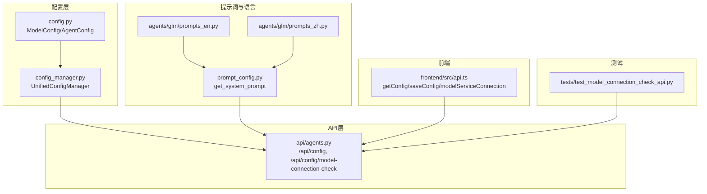
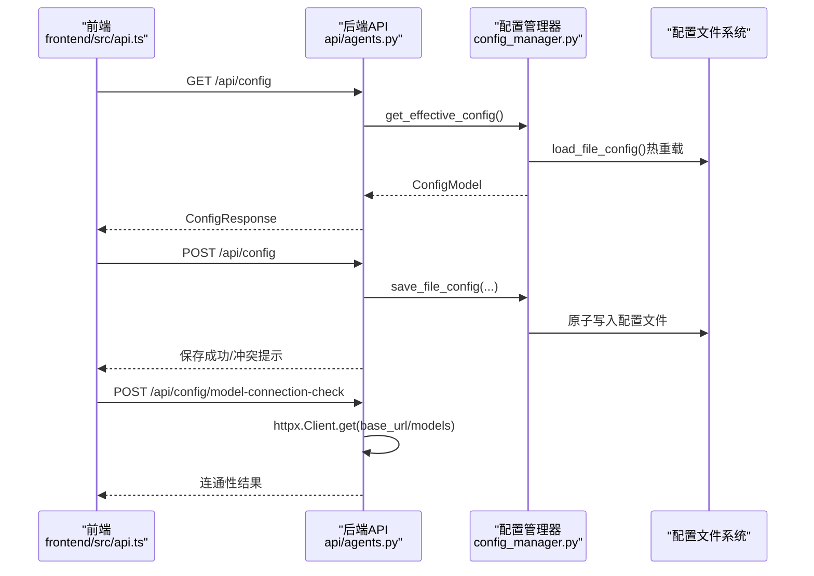
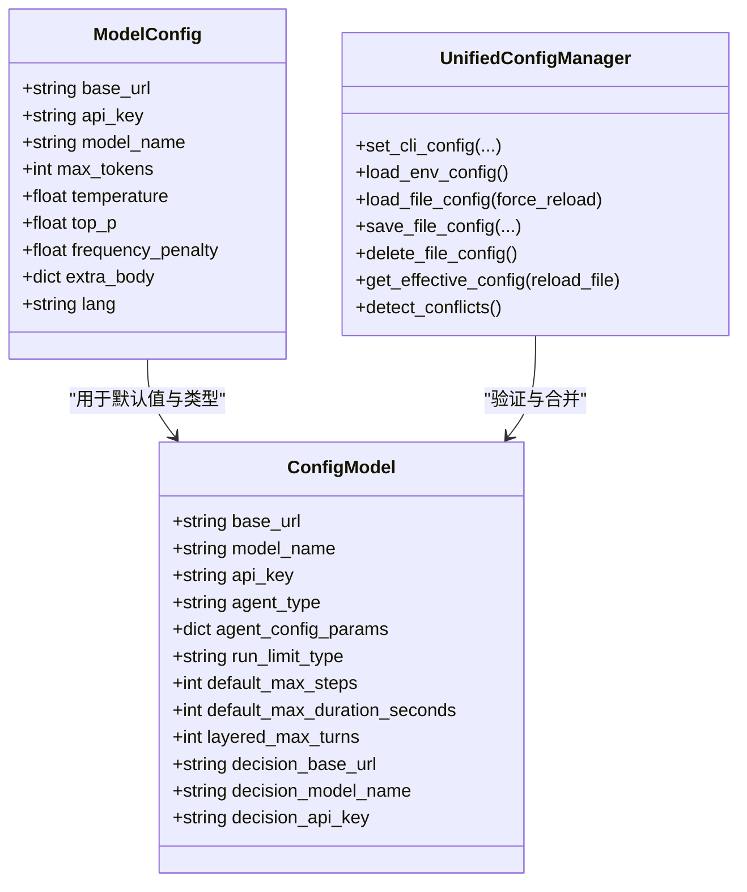
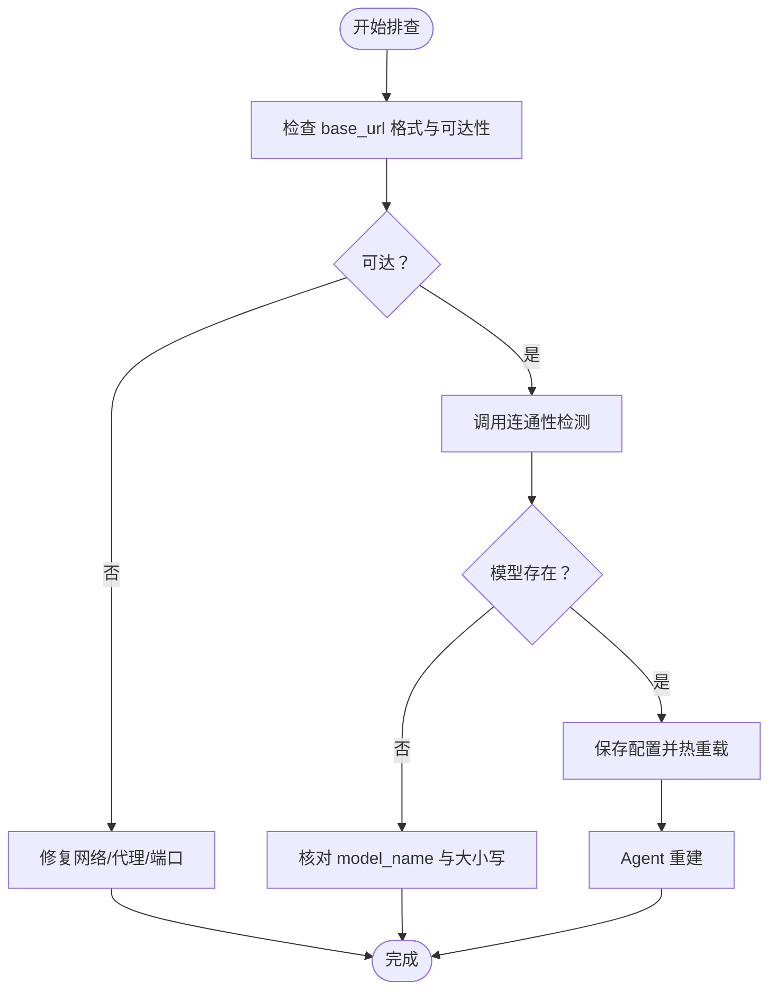

# 模型配置

<cite>
**本文引用的文件**
- [config.py](file://AutoGLM_GUI/config.py)
- [config_manager.py](file://AutoGLM_GUI/config_manager.py)
- [agents.py](file://AutoGLM_GUI/api/agents.py)
- [prompt_config.py](file://AutoGLM_GUI/prompt_config.py)
- [prompts_en.py](file://AutoGLM_GUI/agents/glm/prompts_en.py)
- [prompts_zh.py](file://AutoGLM_GUI/agents/glm/prompts_zh.py)
- [models.py](file://AutoGLM_GUI/agents/gemini/models.py)
- [api.ts](file://frontend/src/api.ts)
- [test_model_connection_check_api.py](file://tests/test_model_connection_check_api.py)
</cite>

## 目录
1. [简介](#简介)
2. [项目结构](#项目结构)
3. [核心组件](#核心组件)
4. [架构总览](#架构总览)
5. [组件详解](#组件详解)
6. [依赖关系分析](#依赖关系分析)
7. [性能考量](#性能考量)
8. [故障排除指南](#故障排除指南)
9. [结论](#结论)
10. [附录](#附录)

## 简介
本文件面向AutoGLM-GUI的模型配置，围绕OpenAI兼容API的关键参数（base_url、api_key、model_name）与生成参数（max_tokens、temperature、top_p、frequency_penalty）进行系统化说明；同时提供多模型切换、性能优化建议、API连接故障排除流程，以及自定义系统提示词与语言设置的配置方法。文档兼顾技术深度与易用性，帮助用户在不同部署场景（本地/在线）下高效、稳定地使用模型。

## 项目结构
与模型配置直接相关的模块分布如下：
- 配置定义与验证：config.py、config_manager.py
- API接口：api/agents.py（含配置读取、保存、连通性检测）
- 提示词与语言：prompt_config.py、agents/glm/prompts_en.py、agents/glm/prompts_zh.py
- 模型基准与兼容性参考：agents/gemini/models.py
- 前端调用：frontend/src/api.ts
- 测试用例：tests/test_model_connection_check_api.py

图表来源
- [config.py:18-44](file://AutoGLM_GUI/config.py#L18-L44)
- [config_manager.py:71-166](file://AutoGLM_GUI/config_manager.py#L71-L166)
- [agents.py:203-243](file://AutoGLM_GUI/api/agents.py#L203-L243)
- [prompt_config.py:5-8](file://AutoGLM_GUI/prompt_config.py#L5-L8)
- [prompts_en.py:6-77](file://AutoGLM_GUI/agents/glm/prompts_en.py#L6-L77)
- [prompts_zh.py:8-75](file://AutoGLM_GUI/agents/glm/prompts_zh.py#L8-L75)
- [api.ts:728-767](file://frontend/src/api.ts#L728-L767)
- [test_model_connection_check_api.py:127-280](file://tests/test_model_connection_check_api.py#L127-L280)

章节来源
- [config.py:18-44](file://AutoGLM_GUI/config.py#L18-L44)
- [config_manager.py:71-166](file://AutoGLM_GUI/config_manager.py#L71-L166)
- [agents.py:203-243](file://AutoGLM_GUI/api/agents.py#L203-L243)
- [prompt_config.py:5-8](file://AutoGLM_GUI/prompt_config.py#L5-L8)
- [prompts_en.py:6-77](file://AutoGLM_GUI/agents/glm/prompts_en.py#L6-L77)
- [prompts_zh.py:8-75](file://AutoGLM_GUI/agents/glm/prompts_zh.py#L8-L75)
- [api.ts:728-767](file://frontend/src/api.ts#L728-L767)
- [test_model_connection_check_api.py:127-280](file://tests/test_model_connection_check_api.py#L127-L280)

## 核心组件
- 模型配置类（ModelConfig）：定义OpenAI兼容API的核心参数与生成参数，包含默认值与用途说明。
- 统一配置管理器（UnifiedConfigManager）：实现四层优先级（CLI > 环境变量 > 配置文件 > 默认值），提供配置加载、合并、校验、冲突检测与热重载能力。
- 配置API：提供获取、保存、删除配置及模型连通性检测的HTTP接口。
- 提示词与语言：根据语言设置动态选择系统提示词，支持中文与英文。
- 模型基准参考：提供兼容性与性能参考，辅助选择适合的模型。

章节来源
- [config.py:18-44](file://AutoGLM_GUI/config.py#L18-L44)
- [config_manager.py:237-746](file://AutoGLM_GUI/config_manager.py#L237-L746)
- [agents.py:203-243](file://AutoGLM_GUI/api/agents.py#L203-L243)
- [prompt_config.py:5-8](file://AutoGLM_GUI/prompt_config.py#L5-L8)
- [prompts_en.py:6-77](file://AutoGLM_GUI/agents/glm/prompts_en.py#L6-L77)
- [prompts_zh.py:8-75](file://AutoGLM_GUI/agents/glm/prompts_zh.py#L8-L75)
- [models.py:23-112](file://AutoGLM_GUI/agents/gemini/models.py#L23-L112)

## 架构总览
AutoGLM-GUI采用“配置定义—配置管理—API暴露—前端调用”的分层架构。配置参数通过统一管理器进行来源解析与合并，API层提供标准化接口供前端调用，前端通过Axios封装的函数与后端交互，形成闭环。

图表来源
- [api.ts:728-767](file://frontend/src/api.ts#L728-L767)
- [agents.py:203-243](file://AutoGLM_GUI/api/agents.py#L203-L243)
- [agents.py:426-475](file://AutoGLM_GUI/api/agents.py#L426-L475)
- [config_manager.py:421-520](file://AutoGLM_GUI/config_manager.py#L421-L520)

## 组件详解

### OpenAI兼容API配置参数
- base_url：模型服务的OpenAI兼容API端点URL。需以http://或https://开头，末尾斜杠会被自动去除。用于连通性检测与实际请求。
- api_key：API认证密钥。若为空字符串，后端会以"EMPTY"作为占位符进行验证；前端展示时会隐藏该值。
- model_name：模型标识符，用于在连通性检测时校验模型是否存在。
- extra_body：特定后端的额外参数（如function calling、vision等），由上层传入并透传至客户端。

章节来源
- [config.py:36-38](file://AutoGLM_GUI/config.py#L36-L38)
- [config_manager.py:122-128](file://AutoGLM_GUI/config_manager.py#L122-L128)
- [agents.py:426-475](file://AutoGLM_GUI/api/agents.py#L426-L475)

### 生成参数与行为影响
- max_tokens：控制单次响应的最大token数，默认较大值以保证完整输出。数值越大，耗时与成本越高。
- temperature：采样温度，范围0-1。越低越确定、越稳定；越高越随机、越多样化。
- top_p：核采样阈值，默认较高值以平衡多样性与稳定性。
- frequency_penalty：频率惩罚系数，默认正数以抑制重复内容。
- extra_body：可携带后端特定参数，如工具调用开关、视觉能力等，直接影响模型能力与行为。

章节来源
- [config.py:39-43](file://AutoGLM_GUI/config.py#L39-L43)

### 多模型切换与最佳实践
- 切换策略：通过修改配置文件中的base_url、model_name与api_key实现模型切换；保存后会触发Agent重建，确保新配置生效。
- 兼容性参考：可参考模型基准表，优先选择支持“视觉+函数调用”的模型，以提升任务成功率。
- 性能建议：优先选择延迟较低且稳定的模型；在本地部署时注意网络与并发限制。

章节来源
- [config_manager.py:521-649](file://AutoGLM_GUI/config_manager.py#L521-L649)
- [models.py:76-112](file://AutoGLM_GUI/agents/gemini/models.py#L76-L112)

### 自定义系统提示词与语言设置
- 语言设置：lang字段控制UI消息语言；系统提示词通过get_system_prompt根据语言返回对应版本。
- 系统提示词：中文与英文版本分别位于agents/glm/prompts_zh.py与agents/glm/prompts_en.py，包含明确的操作指令与格式要求。
- 自定义方式：可通过Agent配置中的system_prompt字段传入自定义提示词（为None时使用默认）。

章节来源
- [config.py:44](file://AutoGLM_GUI/config.py#L44)
- [prompt_config.py:5-8](file://AutoGLM_GUI/prompt_config.py#L5-L8)
- [prompts_en.py:6-77](file://AutoGLM_GUI/agents/glm/prompts_en.py#L6-L77)
- [prompts_zh.py:8-75](file://AutoGLM_GUI/agents/glm/prompts_zh.py#L8-L75)

### 配置来源与优先级
- 来源顺序：CLI参数 > 环境变量 > 配置文件 > 默认值。
- 环境变量：AUTOGLM_BASE_URL、AUTOGLM_MODEL_NAME、AUTOGLM_API_KEY、AUTOGLM_RUN_LIMIT_TYPE、AUTOGLM_DEFAULT_MAX_STEPS、AUTOGLM_DEFAULT_MAX_DURATION_SECONDS、AUTOGLM_LAYERED_MAX_TURNS、AUTOGLM_DECISION_BASE_URL、AUTOGLM_DECISION_MODEL_NAME、AUTOGLM_DECISION_API_KEY。
- 配置文件：位于~/.config/autoglm/config.json，支持热重载与原子写入。

章节来源
- [config_manager.py:37-44](file://AutoGLM_GUI/config_manager.py#L37-L44)
- [config_manager.py:351-419](file://AutoGLM_GUI/config_manager.py#L351-L419)
- [config_manager.py:421-520](file://AutoGLM_GUI/config_manager.py#L421-L520)

### 配置API与前端交互
- 获取配置：GET /api/config，返回当前有效配置与来源、冲突检测结果。
- 保存配置：POST /api/config，支持合并模式，保存后自动热重载并销毁旧Agent。
- 删除配置：DELETE /api/config，删除配置文件。
- 连通性检测：POST /api/config/model-connection-check，校验base_url可达性与模型存在性。

章节来源
- [agents.py:203-243](file://AutoGLM_GUI/api/agents.py#L203-L243)
- [agents.py:246-393](file://AutoGLM_GUI/api/agents.py#L246-L393)
- [agents.py:396-411](file://AutoGLM_GUI/api/agents.py#L396-L411)
- [agents.py:426-475](file://AutoGLM_GUI/api/agents.py#L426-L475)
- [api.ts:728-767](file://frontend/src/api.ts#L728-L767)

## 依赖关系分析
- 配置定义依赖于Python数据类与类型注解，确保静态可读性与运行期校验。
- 配置管理器依赖Pydantic进行字段校验与类型约束，确保输入合法性。
- API层依赖FastAPI路由与httpx进行外部服务连通性检测。
- 前端通过Axios封装的函数与后端交互，简化调用流程。

图表来源
- [config.py:18-44](file://AutoGLM_GUI/config.py#L18-L44)
- [config_manager.py:71-166](file://AutoGLM_GUI/config_manager.py#L71-L166)
- [config_manager.py:237-746](file://AutoGLM_GUI/config_manager.py#L237-L746)

章节来源
- [config.py:18-44](file://AutoGLM_GUI/config.py#L18-L44)
- [config_manager.py:71-166](file://AutoGLM_GUI/config_manager.py#L71-L166)
- [config_manager.py:237-746](file://AutoGLM_GUI/config_manager.py#L237-L746)

## 性能考量
- 采样参数调优
  - temperature与top_p共同决定输出多样性与稳定性。较低温度适合需要稳定、可复现的任务；较高温度适合探索性任务。
  - frequency_penalty有助于减少重复输出，适合长文本生成。
- 上下文长度与响应长度
  - max_tokens过大将增加延迟与成本；可根据任务复杂度适当下调。
- 模型选择
  - 参考模型基准表，优先选择延迟低且支持function calling的模型，以减少回溯与失败重试。
- 并发与资源
  - 本地部署时注意CPU/GPU与内存占用；在线服务需关注网络抖动与限流。

章节来源
- [models.py:76-112](file://AutoGLM_GUI/agents/gemini/models.py#L76-L112)
- [config.py:39-43](file://AutoGLM_GUI/config.py#L39-L43)

## 故障排除指南
- 连接失败
  - 检查base_url格式（必须以http://或https://开头，末尾斜杠会被自动去除）。
  - 若为本地服务，确认端口与防火墙；若为在线服务，检查网络连通性与代理设置。
- 模型不存在
  - 连通性检测会返回可用模型列表；确认model_name拼写与大小写一致。
- 配置冲突
  - 当配置文件与CLI/环境变量同时设置同一字段且值不一致时，会产生冲突提示；以更高优先级来源为准。
- 配置保存后未生效
  - 保存后会自动热重载并销毁旧Agent；如仍无效，检查配置文件写入权限与JSON格式。
- 前端调用异常
  - 使用frontend/src/api.ts封装的函数进行调用；若失败，查看浏览器控制台与后端日志。

图表来源
- [agents.py:426-475](file://AutoGLM_GUI/api/agents.py#L426-L475)
- [config_manager.py:421-520](file://AutoGLM_GUI/config_manager.py#L421-L520)
- [api.ts:728-767](file://frontend/src/api.ts#L728-L767)

章节来源
- [agents.py:426-475](file://AutoGLM_GUI/api/agents.py#L426-L475)
- [config_manager.py:421-520](file://AutoGLM_GUI/config_manager.py#L421-L520)
- [api.ts:728-767](file://frontend/src/api.ts#L728-L767)
- [test_model_connection_check_api.py:127-280](file://tests/test_model_connection_check_api.py#L127-L280)

## 结论
AutoGLM-GUI通过清晰的配置定义、严格的验证与多层优先级管理，实现了OpenAI兼容API的灵活接入与稳定运行。结合系统提示词的语言切换、模型基准参考与连通性检测，用户可在不同部署环境下高效完成模型配置与优化，并通过API与前端无缝集成，获得一致的使用体验。

## 附录
- 配置文件路径：~/.config/autoglm/config.json
- 环境变量前缀：AUTOGLM_
- 关键字段：base_url、model_name、api_key、agent_type、agent_config_params、run_limit_type、default_max_steps、default_max_duration_seconds、layered_max_turns、decision_base_url、decision_model_name、decision_api_key