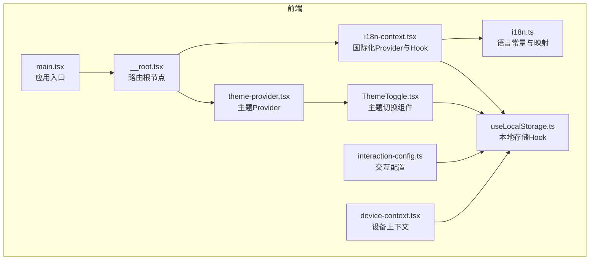
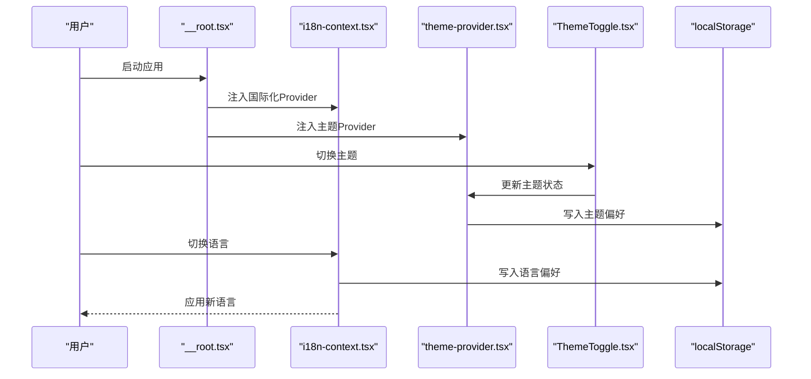
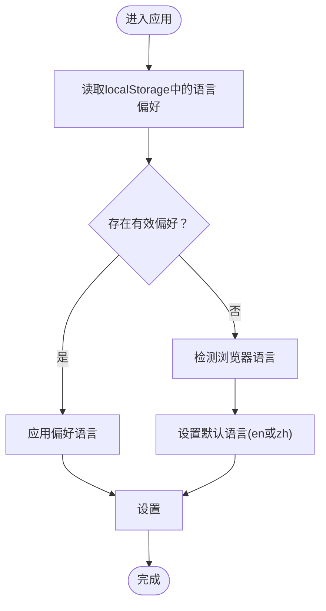
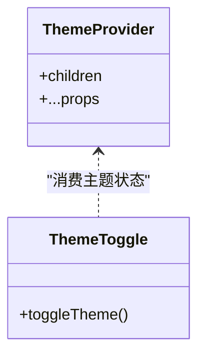
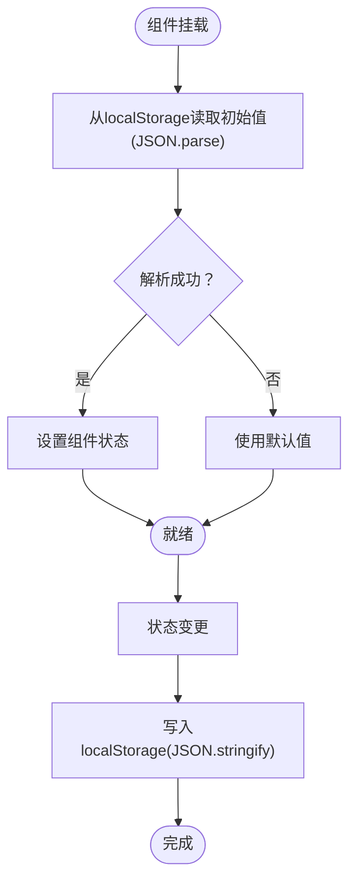
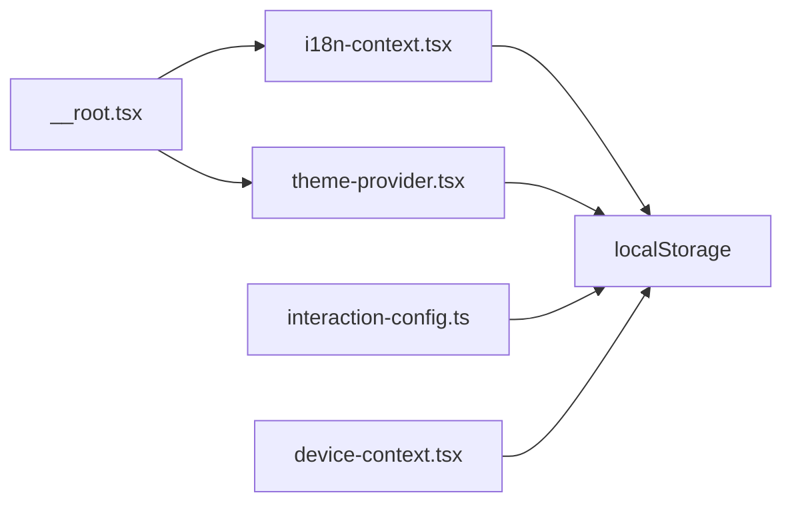
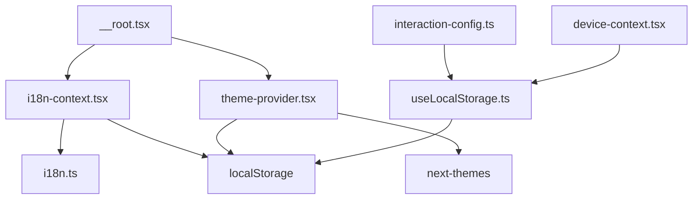

# 用户偏好设置

<cite>
**本文引用的文件**
- [frontend/src/lib/i18n.ts](file://frontend/src/lib/i18n.ts)
- [frontend/src/lib/i18n-context.tsx](file://frontend/src/lib/i18n-context.tsx)
- [frontend/src/lib/theme-provider.tsx](file://frontend/src/lib/theme-provider.tsx)
- [frontend/src/hooks/useLocalStorage.ts](file://frontend/src/hooks/useLocalStorage.ts)
- [frontend/src/main.tsx](file://frontend/src/main.tsx)
- [frontend/src/routes/__root.tsx](file://frontend/src/routes/__root.tsx)
- [frontend/src/components/ThemeToggle.tsx](file://frontend/src/components/ThemeToggle.tsx)
- [frontend/src/lib/interaction-config.ts](file://frontend/src/lib/interaction-config.ts)
- [frontend/src/lib/device-context.tsx](file://frontend/src/lib/device-context.tsx)
- [frontend/src/lib/i18n.ts](file://frontend/src/lib/i18n.ts)
- [frontend/src/lib/i18n-context.tsx](file://frontend/src/lib/i18n-context.tsx)
</cite>

## 目录
1. [简介](#简介)
2. [项目结构](#项目结构)
3. [核心组件](#核心组件)
4. [架构总览](#架构总览)
5. [详细组件分析](#详细组件分析)
6. [依赖关系分析](#依赖关系分析)
7. [性能考量](#性能考量)
8. [故障排查指南](#故障排查指南)
9. [结论](#结论)
10. [附录](#附录)

## 简介
本文件面向AutoGLM-GUI的用户偏好设置，系统性阐述以下内容：
- 界面语言设置：支持英文与中文的动态切换与持久化
- 主题配置：基于next-themes的主题提供者与切换器
- 布局选项：通过路由与上下文管理界面布局与交互偏好
- 本地存储机制：统一的localStorage钩子用于配置持久化
- 隐私保护：本地化存储策略与数据最小化原则
- 备份与恢复：基于localStorage的导出导入流程建议
- 多用户环境：当前实现为单用户本地存储，扩展建议
- 路由与体验优化：根路由与主题提供者的集成方式

## 项目结构
用户偏好设置主要分布在前端目录中，涉及国际化、主题、本地存储与路由根节点的集成。

**图表来源**
- [frontend/src/main.tsx](file://frontend/src/main.tsx)
- [frontend/src/routes/__root.tsx](file://frontend/src/routes/__root.tsx)
- [frontend/src/lib/i18n.ts](file://frontend/src/lib/i18n.ts)
- [frontend/src/lib/i18n-context.tsx](file://frontend/src/lib/i18n-context.tsx)
- [frontend/src/lib/theme-provider.tsx](file://frontend/src/lib/theme-provider.tsx)
- [frontend/src/components/ThemeToggle.tsx](file://frontend/src/components/ThemeToggle.tsx)
- [frontend/src/hooks/useLocalStorage.ts](file://frontend/src/hooks/useLocalStorage.ts)
- [frontend/src/lib/interaction-config.ts](file://frontend/src/lib/interaction-config.ts)
- [frontend/src/lib/device-context.tsx](file://frontend/src/lib/device-context.tsx)

**章节来源**
- [frontend/src/main.tsx](file://frontend/src/main.tsx)
- [frontend/src/routes/__root.tsx](file://frontend/src/routes/__root.tsx)

## 核心组件
- 国际化模块：定义语言枚举、翻译映射与语言名称展示；提供Provider与Hooks以在组件树中注入语言状态与翻译函数。
- 主题模块：封装next-themes的ThemeProvider，并提供ThemeToggle组件进行明暗主题切换。
- 本地存储模块：通用useLocalStorage Hook，负责从localStorage读取初始值并在变更时写回，具备错误处理。
- 路由根节点：作为Provider容器，确保国际化与主题在整棵组件树内生效。
- 交互配置与设备上下文：为界面交互偏好与设备相关设置提供上下文支撑（可结合localStorage持久化）。

**章节来源**
- [frontend/src/lib/i18n.ts:1-17](file://frontend/src/lib/i18n.ts#L1-L17)
- [frontend/src/lib/i18n-context.tsx:1-80](file://frontend/src/lib/i18n-context.tsx#L1-L80)
- [frontend/src/lib/theme-provider.tsx:1-12](file://frontend/src/lib/theme-provider.tsx#L1-L12)
- [frontend/src/components/ThemeToggle.tsx](file://frontend/src/components/ThemeToggle.tsx)
- [frontend/src/hooks/useLocalStorage.ts:1-45](file://frontend/src/hooks/useLocalStorage.ts#L1-L45)
- [frontend/src/routes/__root.tsx](file://frontend/src/routes/__root.tsx)

## 架构总览
用户偏好设置的运行时架构围绕“根节点容器 + Provider + 组件”展开，数据流自上而下传递，组件通过Hooks读取与更新状态，最终通过localStorage持久化。

**图表来源**
- [frontend/src/routes/__root.tsx](file://frontend/src/routes/__root.tsx)
- [frontend/src/lib/i18n-context.tsx:25-58](file://frontend/src/lib/i18n-context.tsx#L25-L58)
- [frontend/src/lib/theme-provider.tsx:6-11](file://frontend/src/lib/theme-provider.tsx#L6-L11)
- [frontend/src/components/ThemeToggle.tsx](file://frontend/src/components/ThemeToggle.tsx)
- [frontend/src/hooks/useLocalStorage.ts:29-41](file://frontend/src/hooks/useLocalStorage.ts#L29-L41)

## 详细组件分析

### 国际化与语言设置
- 语言枚举与映射：定义可用语言集合与对应显示名称，便于UI选择与国际化文案加载。
- Provider初始化：首次渲染时从localStorage读取语言偏好，若无则根据浏览器语言自动选择默认语言。
- 语言切换：调用setLocale后立即更新状态并持久化到localStorage，同时设置<html lang>属性以提升可访问性。
- Hooks封装：useI18n、useLocale、useTranslation提供便捷的国际化能力，避免在各组件中重复逻辑。

**图表来源**
- [frontend/src/lib/i18n-context.tsx:28-45](file://frontend/src/lib/i18n-context.tsx#L28-L45)

**章节来源**
- [frontend/src/lib/i18n.ts:4-16](file://frontend/src/lib/i18n.ts#L4-L16)
- [frontend/src/lib/i18n-context.tsx:25-58](file://frontend/src/lib/i18n-context.tsx#L25-L58)

### 主题配置与切换
- Provider封装：通过ThemeProvider暴露主题能力，支持系统默认、浅色、深色等模式。
- 切换组件：ThemeToggle与Provider配合，允许用户在不同主题间切换。
- 持久化：主题切换会写入localStorage，重启后保持一致的主题偏好。

**图表来源**
- [frontend/src/lib/theme-provider.tsx:6-11](file://frontend/src/lib/theme-provider.tsx#L6-L11)
- [frontend/src/components/ThemeToggle.tsx](file://frontend/src/components/ThemeToggle.tsx)

**章节来源**
- [frontend/src/lib/theme-provider.tsx:1-12](file://frontend/src/lib/theme-provider.tsx#L1-L12)
- [frontend/src/components/ThemeToggle.tsx](file://frontend/src/components/ThemeToggle.tsx)

### 本地存储机制与持久化
- 通用Hook：useLocalStorage提供统一的读写接口，内部处理JSON序列化与异常捕获。
- 初始化策略：首次渲染从localStorage解析初始值，失败时回退到默认值。
- 变更策略：状态更新时同步写回localStorage，异常时记录日志但不中断流程。
- 使用场景：语言与主题偏好均通过该Hook实现持久化，保证跨页面与重启后的一致性。

**图表来源**
- [frontend/src/hooks/useLocalStorage.ts:14-41](file://frontend/src/hooks/useLocalStorage.ts#L14-L41)

**章节来源**
- [frontend/src/hooks/useLocalStorage.ts:1-45](file://frontend/src/hooks/useLocalStorage.ts#L1-L45)

### 布局选项与交互偏好
- 路由根节点：__root.tsx作为Provider容器，确保国际化与主题在全站生效。
- 交互配置：interaction-config.ts提供交互层面的配置入口，可结合localStorage保存用户偏好的交互行为。
- 设备上下文：device-context.tsx承载设备相关状态，可用于布局与交互的差异化配置。

**图表来源**
- [frontend/src/routes/__root.tsx](file://frontend/src/routes/__root.tsx)
- [frontend/src/lib/i18n-context.tsx:25-58](file://frontend/src/lib/i18n-context.tsx#L25-L58)
- [frontend/src/lib/theme-provider.tsx:6-11](file://frontend/src/lib/theme-provider.tsx#L6-L11)
- [frontend/src/lib/interaction-config.ts](file://frontend/src/lib/interaction-config.ts)
- [frontend/src/lib/device-context.tsx](file://frontend/src/lib/device-context.tsx)

**章节来源**
- [frontend/src/routes/__root.tsx](file://frontend/src/routes/__root.tsx)
- [frontend/src/lib/interaction-config.ts](file://frontend/src/lib/interaction-config.ts)
- [frontend/src/lib/device-context.tsx](file://frontend/src/lib/device-context.tsx)

### 快捷键配置与界面个性化
- 当前实现：未发现专门的快捷键配置模块或持久化逻辑。
- 建议方案：可在interaction-config.ts中引入快捷键配置对象，结合useLocalStorage进行持久化；在全局事件监听中注册与注销快捷键，确保跨页面一致性。

[本节为概念性建议，不直接分析具体文件，故不附加章节来源]

## 依赖关系分析
- 组件耦合：国际化与主题均依赖路由根节点作为Provider容器，降低跨组件传播成本。
- 外部依赖：next-themes提供主题能力；localStorage作为唯一外部持久化介质。
- 潜在风险：localStorage容量限制与异常处理；浏览器隐私模式可能禁用localStorage。

**图表来源**
- [frontend/src/routes/__root.tsx](file://frontend/src/routes/__root.tsx)
- [frontend/src/lib/i18n-context.tsx:25-58](file://frontend/src/lib/i18n-context.tsx#L25-L58)
- [frontend/src/lib/i18n.ts:1-17](file://frontend/src/lib/i18n.ts#L1-L17)
- [frontend/src/lib/theme-provider.tsx](file://frontend/src/lib/theme-provider.tsx#L4)
- [frontend/src/hooks/useLocalStorage.ts:1-45](file://frontend/src/hooks/useLocalStorage.ts#L1-L45)
- [frontend/src/lib/interaction-config.ts](file://frontend/src/lib/interaction-config.ts)
- [frontend/src/lib/device-context.tsx](file://frontend/src/lib/device-context.tsx)

**章节来源**
- [frontend/src/routes/__root.tsx](file://frontend/src/routes/__root.tsx)
- [frontend/src/lib/i18n-context.tsx:25-58](file://frontend/src/lib/i18n-context.tsx#L25-L58)
- [frontend/src/lib/theme-provider.tsx:1-12](file://frontend/src/lib/theme-provider.tsx#L1-L12)
- [frontend/src/hooks/useLocalStorage.ts:1-45](file://frontend/src/hooks/useLocalStorage.ts#L1-L45)

## 性能考量
- 渲染开销：Provider仅在根节点注入，对子组件渲染影响极小。
- 存储开销：localStorage读写为同步操作，建议合并频繁更新的状态或使用防抖策略。
- 初始化延迟：首次读取localStorage可能带来微小阻塞，可通过SSR或预设默认值优化。

[本节提供一般性指导，不直接分析具体文件，故不附加章节来源]

## 故障排查指南
- 语言设置不生效
  - 检查localStorage中是否存在语言键值，确认其格式是否正确。
  - 确认<html lang>是否被正确设置。
  - 参考路径：[frontend/src/lib/i18n-context.tsx:28-45](file://frontend/src/lib/i18n-context.tsx#L28-L45)
- 主题切换未持久化
  - 检查localStorage中主题键值是否存在且可读。
  - 确认ThemeToggle是否正确调用Provider提供的主题切换方法。
  - 参考路径：[frontend/src/components/ThemeToggle.tsx](file://frontend/src/components/ThemeToggle.tsx)
- 本地存储异常
  - 查看控制台是否有JSON解析或写入错误日志。
  - 确认浏览器未处于隐私模式或禁用localStorage。
  - 参考路径：[frontend/src/hooks/useLocalStorage.ts:19-41](file://frontend/src/hooks/useLocalStorage.ts#L19-L41)

**章节来源**
- [frontend/src/lib/i18n-context.tsx:28-45](file://frontend/src/lib/i18n-context.tsx#L28-L45)
- [frontend/src/components/ThemeToggle.tsx](file://frontend/src/components/ThemeToggle.tsx)
- [frontend/src/hooks/useLocalStorage.ts:19-41](file://frontend/src/hooks/useLocalStorage.ts#L19-L41)

## 结论
AutoGLM-GUI的用户偏好设置采用简洁高效的实现方式：以路由根节点为容器，通过Provider注入国际化与主题能力，借助通用localStorage Hook实现持久化。当前已覆盖语言与主题两大核心偏好，建议后续扩展交互偏好与快捷键配置，并完善多用户环境下的隔离与迁移策略。

[本节为总结性内容，不直接分析具体文件，故不附加章节来源]

## 附录

### 配置备份与恢复建议
- 备份：将localStorage中与用户偏好相关的键（如语言、主题）导出为JSON文件。
- 恢复：在新环境中将备份文件中的键值写回localStorage，重启应用后生效。
- 注意：此流程依赖浏览器端localStorage，需确保目标环境允许localStorage。

[本节为概念性建议，不直接分析具体文件，故不附加章节来源]

### 多用户环境下的配置管理
- 当前实现：单用户本地存储，未区分用户身份。
- 扩展建议：引入用户标识作为localStorage键的前缀或命名空间，或迁移到服务端用户配置中心，结合会话令牌进行隔离。

[本节为概念性建议，不直接分析具体文件，故不附加章节来源]