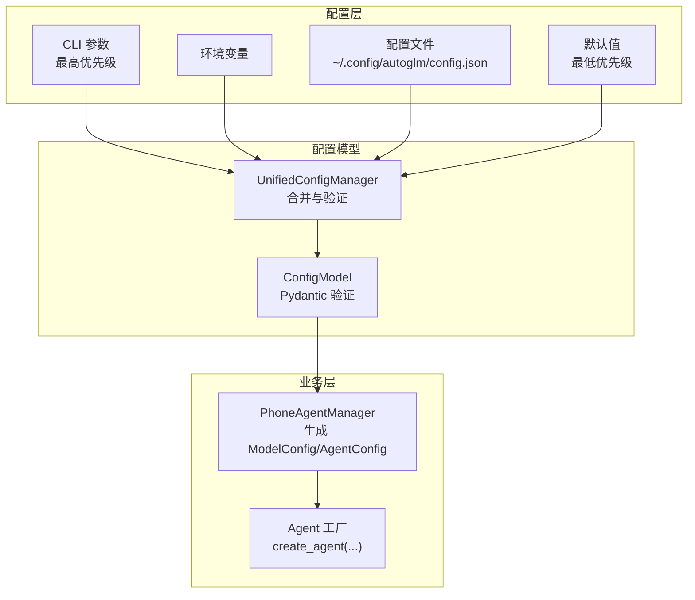
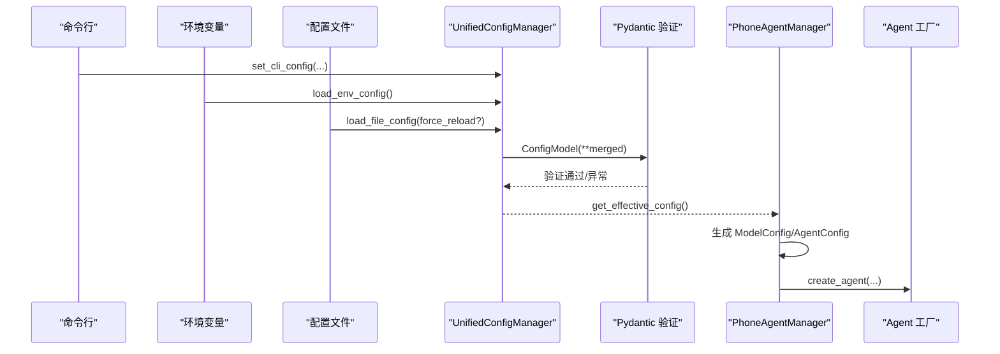
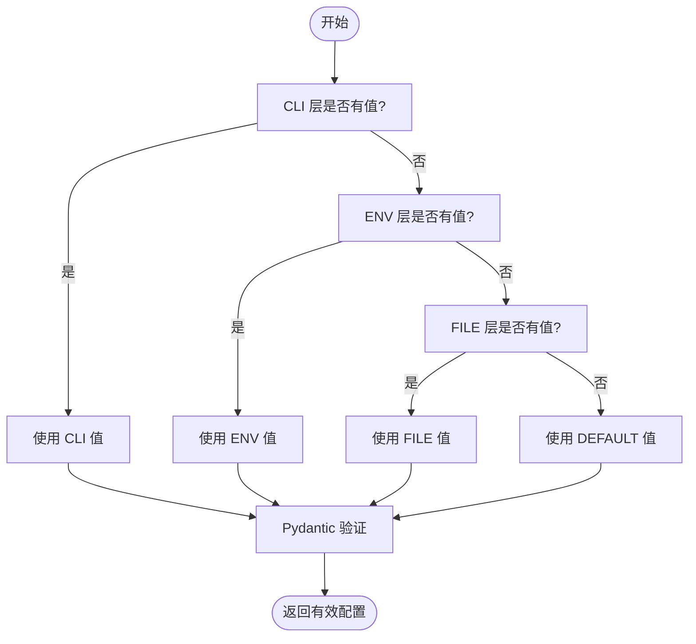
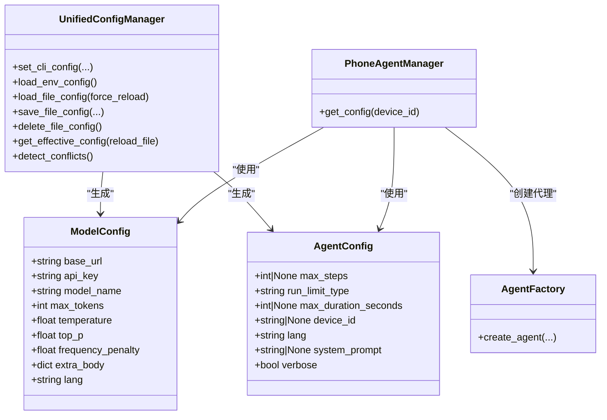
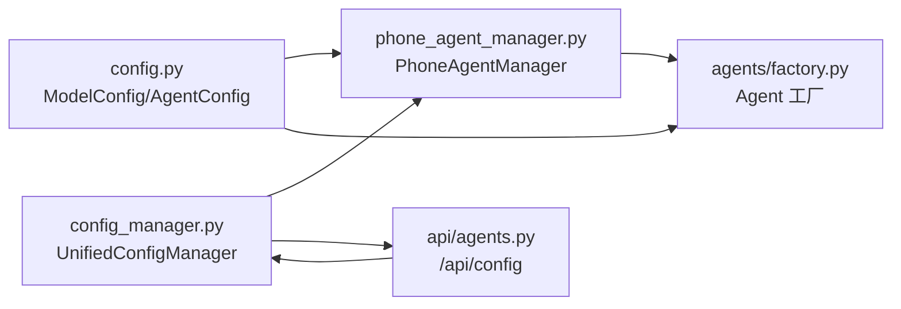

# 系统配置

<cite>
**本文引用的文件**
- [AutoGLM_GUI/config.py](file://AutoGLM_GUI/config.py)
- [AutoGLM_GUI/config_manager.py](file://AutoGLM_GUI/config_manager.py)
- [AutoGLM_GUI/phone_agent_manager.py](file://AutoGLM_GUI/phone_agent_manager.py)
- [AutoGLM_GUI/agents/factory.py](file://AutoGLM_GUI/agents/factory.py)
- [AutoGLM_GUI/api/agents.py](file://AutoGLM_GUI/api/agents.py)
- [AutoGLM_GUI/prompt_config.py](file://AutoGLM_GUI/prompt_config.py)
- [tests/test_agents_chat_config_api.py](file://tests/test_agents_chat_config_api.py)
- [tests/test_layered_max_turns_config.py](file://tests/test_layered_max_turns_config.py)
</cite>

## 目录
1. [简介](#简介)
2. [项目结构](#项目结构)
3. [核心组件](#核心组件)
4. [架构总览](#架构总览)
5. [详细组件分析](#详细组件分析)
6. [依赖关系分析](#依赖关系分析)
7. [性能考虑](#性能考虑)
8. [故障排查指南](#故障排查指南)
9. [结论](#结论)
10. [附录](#附录)

## 简介
本文件面向AutoGLM-GUI的系统配置，聚焦两大核心配置类ModelConfig与AgentConfig的设计原理与使用方法，系统阐述配置参数语义、默认值与取值范围；详述四层配置加载顺序与优先级、环境变量覆盖机制；并给出配置验证、错误处理与动态配置更新的实现细节与最佳实践。

## 项目结构
AutoGLM-GUI的配置体系由“核心配置类”与“统一配置管理器”两部分组成：
- 核心配置类：ModelConfig与AgentConfig，面向业务层的轻量配置载体，避免在API与业务层直接使用外部库类型。
- 统一配置管理器：UnifiedConfigManager，实现四层优先级（CLI > 环境变量 > 配置文件 > 默认值），提供类型安全验证、冲突检测、热重载与原子写入等能力。

图表来源
- [AutoGLM_GUI/config_manager.py:237-746](file://AutoGLM_GUI/config_manager.py#L237-L746)
- [AutoGLM_GUI/config.py:18-89](file://AutoGLM_GUI/config.py#L18-L89)
- [AutoGLM_GUI/phone_agent_manager.py:246-277](file://AutoGLM_GUI/phone_agent_manager.py#L246-L277)
- [AutoGLM_GUI/agents/factory.py:49-97](file://AutoGLM_GUI/agents/factory.py#L49-L97)

章节来源
- [AutoGLM_GUI/config.py:18-89](file://AutoGLM_GUI/config.py#L18-L89)
- [AutoGLM_GUI/config_manager.py:237-746](file://AutoGLM_GUI/config_manager.py#L237-L746)

## 核心组件
本节对ModelConfig与AgentConfig进行逐项说明，包括参数语义、默认值与取值范围。

- ModelConfig（模型侧配置）
  - base_url：模型服务端点URL，默认"http://localhost:8000/v1"，必须以"http://"或"https://"开头，末尾斜杠会被去除。
  - api_key：认证密钥，默认"EMPTY"，当值为"EMPTY"时前端显示为空字符串。
  - model_name：模型标识符，默认"autoglm-phone-9b"，不能为空。
  - max_tokens：最大生成token数，默认3000。
  - temperature：采样温度，默认0.0（较确定性）。
  - top_p：Nucleus采样阈值，默认0.85。
  - frequency_penalty：频率惩罚，默认0.2，取值范围[-2, 2]。
  - extra_body：后端特定参数字典，默认空字典。
  - lang：界面语言，默认"cn"，支持"cn"/"en"。

- AgentConfig（代理侧配置）
  - max_steps：单次任务最大执行步数，None表示不限制。
  - run_limit_type：运行上限类型，"steps"/"duration"/"unlimited"三选一，默认"steps"。
  - max_duration_seconds：单次任务最大运行时长（秒），None表示不限制。
  - device_id：设备标识符（USB序列号或IP:port），用于区分不同设备的会话。
  - lang：语言设置，默认"cn"。
  - system_prompt：自定义系统提示词，None则使用默认语言版本提示词。
  - verbose：是否输出详细日志，默认True。

章节来源
- [AutoGLM_GUI/config.py:18-89](file://AutoGLM_GUI/config.py#L18-L89)
- [AutoGLM_GUI/prompt_config.py:5-8](file://AutoGLM_GUI/prompt_config.py#L5-L8)

## 架构总览
统一配置管理器采用四层优先级与类型安全验证相结合的架构：
- 四层来源：CLI参数（最高）→ 环境变量 → 配置文件 → 默认值（最低）。
- 类型安全：通过Pydantic模型ConfigModel进行字段校验与格式化。
- 动态能力：支持热重载（基于mtime缓存）、冲突检测、原子写入（临时文件+替换）。
- 业务集成：PhoneAgentManager根据有效配置生成ModelConfig与AgentConfig，并交由Agent工厂创建具体代理实例。

图表来源
- [AutoGLM_GUI/config_manager.py:299-420](file://AutoGLM_GUI/config_manager.py#L299-L420)
- [AutoGLM_GUI/config_manager.py:421-520](file://AutoGLM_GUI/config_manager.py#L421-L520)
- [AutoGLM_GUI/config_manager.py:676-746](file://AutoGLM_GUI/config_manager.py#L676-L746)
- [AutoGLM_GUI/phone_agent_manager.py:246-277](file://AutoGLM_GUI/phone_agent_manager.py#L246-L277)
- [AutoGLM_GUI/agents/factory.py:49-97](file://AutoGLM_GUI/agents/factory.py#L49-L97)

## 详细组件分析

### 统一配置管理器（UnifiedConfigManager）
- 四层配置层：ConfigLayer封装每层的字段与来源，记录explicit_keys用于区分显式提供与None。
- 合并与优先级：get_effective_config按CLI→ENV→FILE→DEFAULT顺序合并，最终用ConfigModel进行类型安全验证。
- 环境变量覆盖：load_env_config读取AUTOGLM_*系列变量，含run_limit_type、default_max_steps、default_max_duration_seconds、layered_max_turns及决策模型相关变量。
- 配置文件：load_file_config支持mtime缓存与热重载；save_file_config采用原子写入；delete_file_config删除配置文件。
- 冲突检测：detect_conflicts识别文件层与CLI/ENV层的字段冲突，便于用户感知。
- 错误处理：JSON解析失败、文件读取异常、验证失败时记录日志并降级为默认配置。

图表来源
- [AutoGLM_GUI/config_manager.py:676-746](file://AutoGLM_GUI/config_manager.py#L676-L746)

章节来源
- [AutoGLM_GUI/config_manager.py:237-746](file://AutoGLM_GUI/config_manager.py#L237-L746)

### 配置参数与取值范围
- base_url：必须以"http://"或"https://"开头，末尾斜杠会被标准化去除。
- model_name：非空字符串。
- run_limit_type：仅允许"steps"、"duration"、"unlimited"。
- default_max_steps/default_max_duration_seconds：必须为正整数或None。
- layered_max_turns：最小值为1（全局默认50），若传入小于1将触发校验异常。
- 决策模型相关字段（decision_base_url/model_name/api_key）：遵循与主模型相同的格式与非空约束。

章节来源
- [AutoGLM_GUI/config_manager.py:94-166](file://AutoGLM_GUI/config_manager.py#L94-L166)

### 配置加载顺序与优先级
- 加载顺序：CLI参数（最高）→ 环境变量 → 配置文件 → 默认值（最低）。
- 优先级规则：同一字段按上述顺序覆盖，若某层未提供值，则回退到下一层。
- 首次访问自动加载：若文件层为空且配置文件存在，首次访问时自动加载。
- 热重载：支持通过reload_file参数强制重新加载配置文件。

章节来源
- [AutoGLM_GUI/config_manager.py:241-249](file://AutoGLM_GUI/config_manager.py#L241-L249)
- [AutoGLM_GUI/config_manager.py:688-696](file://AutoGLM_GUI/config_manager.py#L688-L696)

### 环境变量覆盖机制
- 支持的环境变量：
  - AUTOGLM_BASE_URL、AUTOGLM_MODEL_NAME、AUTOGLM_API_KEY
  - AUTOGLM_DECISION_BASE_URL、AUTOGLM_DECISION_MODEL_NAME、AUTOGLM_DECISION_API_KEY
  - AUTOGLM_RUN_LIMIT_TYPE（steps/duration/unlimited）
  - AUTOGLM_DEFAULT_MAX_STEPS、AUTOGLM_DEFAULT_MAX_DURATION_SECONDS、AUTOGLM_LAYERED_MAX_TURNS
- 解析策略：字符串转整数，非法值记录警告并忽略；run_limit_type不合法时记录警告但不影响其他字段。

章节来源
- [AutoGLM_GUI/config_manager.py:335-420](file://AutoGLM_GUI/config_manager.py#L335-L420)

### 配置验证与错误处理
- 验证失败降级：当ConfigModel验证失败时，记录错误并返回默认配置，保证系统可用性。
- 文件解析失败：JSON解析错误或读取异常时，清空文件层缓存并记录日志。
- 决策模型迁移：配置文件中的agent_type为"glm"时自动迁移到"glm-async"并发出警告。

章节来源
- [AutoGLM_GUI/config_manager.py:506-520](file://AutoGLM_GUI/config_manager.py#L506-L520)
- [AutoGLM_GUI/config_manager.py:738-746](file://AutoGLM_GUI/config_manager.py#L738-L746)
- [AutoGLM_GUI/config_manager.py:464-478](file://AutoGLM_GUI/config_manager.py#L464-L478)

### 动态配置更新
- 热重载：通过load_file_config(force_reload=True)实现。
- 原子写入：save_file_config采用临时文件写入后替换，避免部分写入导致的损坏。
- 冲突检测：detect_conflicts返回CLI/ENV覆盖文件层的字段清单，便于运维感知。

章节来源
- [AutoGLM_GUI/config_manager.py:421-520](file://AutoGLM_GUI/config_manager.py#L421-L520)
- [AutoGLM_GUI/config_manager.py:521-650](file://AutoGLM_GUI/config_manager.py#L521-L650)
- [AutoGLM_GUI/config_manager.py:790-800](file://AutoGLM_GUI/config_manager.py#L790-L800)

### 业务层集成与使用
- PhoneAgentManager：根据有效配置生成ModelConfig与AgentConfig，依据run_limit_type选择max_steps或max_duration_seconds。
- Agent工厂：create_agent接收ModelConfig与AgentConfig，结合设备协议创建异步代理实例。

图表来源
- [AutoGLM_GUI/config.py:18-89](file://AutoGLM_GUI/config.py#L18-L89)
- [AutoGLM_GUI/config_manager.py:237-746](file://AutoGLM_GUI/config_manager.py#L237-L746)
- [AutoGLM_GUI/phone_agent_manager.py:246-277](file://AutoGLM_GUI/phone_agent_manager.py#L246-L277)
- [AutoGLM_GUI/agents/factory.py:49-97](file://AutoGLM_GUI/agents/factory.py#L49-L97)

章节来源
- [AutoGLM_GUI/phone_agent_manager.py:246-277](file://AutoGLM_GUI/phone_agent_manager.py#L246-L277)
- [AutoGLM_GUI/agents/factory.py:49-97](file://AutoGLM_GUI/agents/factory.py#L49-L97)

## 依赖关系分析
- 配置类依赖：ModelConfig/AgentConfig被PhoneAgentManager与Agent工厂广泛使用。
- 配置管理依赖：UnifiedConfigManager依赖Pydantic进行类型安全验证，并通过ConfigLayer与ConfigModel实现分层与合并。
- API依赖：/api/config接口依赖UnifiedConfigManager进行查询、保存与删除操作，并返回冲突检测结果与当前配置来源。

图表来源
- [AutoGLM_GUI/config.py:18-89](file://AutoGLM_GUI/config.py#L18-L89)
- [AutoGLM_GUI/config_manager.py:237-746](file://AutoGLM_GUI/config_manager.py#L237-L746)
- [AutoGLM_GUI/phone_agent_manager.py:246-277](file://AutoGLM_GUI/phone_agent_manager.py#L246-L277)
- [AutoGLM_GUI/agents/factory.py:49-97](file://AutoGLM_GUI/agents/factory.py#L49-L97)
- [AutoGLM_GUI/api/agents.py:208-243](file://AutoGLM_GUI/api/agents.py#L208-L243)

章节来源
- [AutoGLM_GUI/api/agents.py:208-243](file://AutoGLM_GUI/api/agents.py#L208-L243)

## 性能考虑
- 配置热重载：基于mtime缓存减少频繁磁盘IO；仅在force_reload=true时强制刷新。
- 验证成本：Pydantic验证在每次合并后执行，建议在批量变更配置时合并后再一次性验证。
- 日志级别：在生产环境中适当降低调试日志，避免影响性能。
- 代理限制：合理设置run_limit_type与max_steps/max_duration_seconds，避免长时间阻塞。

## 故障排查指南
- 配置文件无法解析：检查JSON格式与字段类型，查看日志中的警告或错误信息。
- 环境变量无效：确认变量名拼写正确且取值合法（如run_limit_type必须为"steps"/"duration"/"unlimited"）。
- 验证失败降级：若出现配置异常，系统将回退到默认配置；检查日志定位问题并修正配置。
- 决策模型迁移：若配置文件agent_type为"glm"，将自动迁移到"glm-async"，注意确认预期行为。
- API操作失败：/api/config的保存/删除失败时，检查权限与磁盘空间；参考测试用例中的断言定位问题。

章节来源
- [tests/test_agents_chat_config_api.py:653-665](file://tests/test_agents_chat_config_api.py#L653-L665)
- [tests/test_layered_max_turns_config.py:50-89](file://tests/test_layered_max_turns_config.py#L50-L89)

## 结论
AutoGLM-GUI的配置体系通过清晰的分层优先级、严格的类型验证与完善的动态更新机制，实现了灵活、可靠且易维护的配置管理。ModelConfig与AgentConfig作为业务层的轻量配置载体，配合UnifiedConfigManager，既满足多场景部署需求，又保障了系统的稳定性与可观测性。

## 附录
- 配置文件路径：~/.config/autoglm/config.json
- 环境变量前缀：AUTOGLM_
- 关键字段与默认值摘要：
  - base_url："http://localhost:8000/v1"
  - api_key："EMPTY"
  - model_name："autoglm-phone-9b"
  - max_tokens：3000
  - temperature：0.0
  - top_p：0.85
  - frequency_penalty：0.2
  - run_limit_type："steps"
  - default_max_steps：100
  - default_max_duration_seconds：None
  - layered_max_turns：50（全局默认）