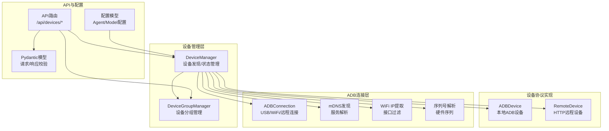
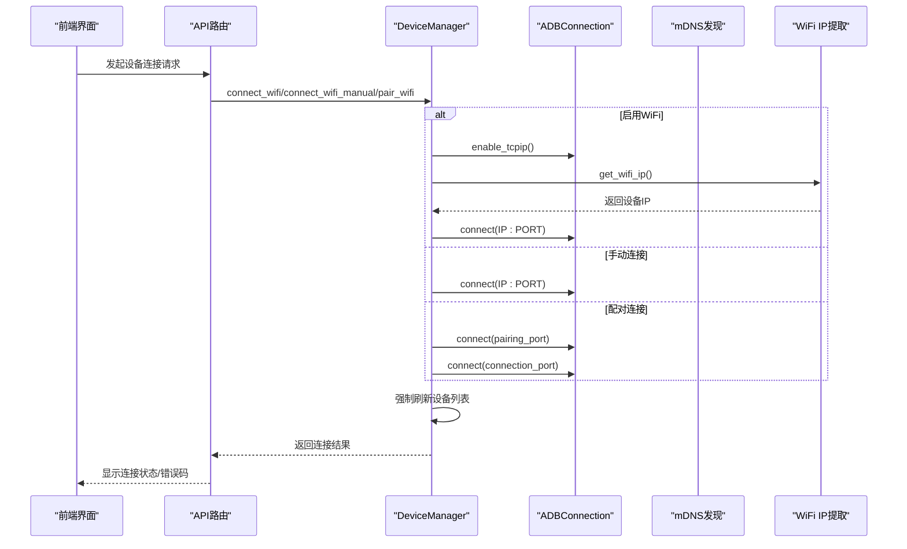
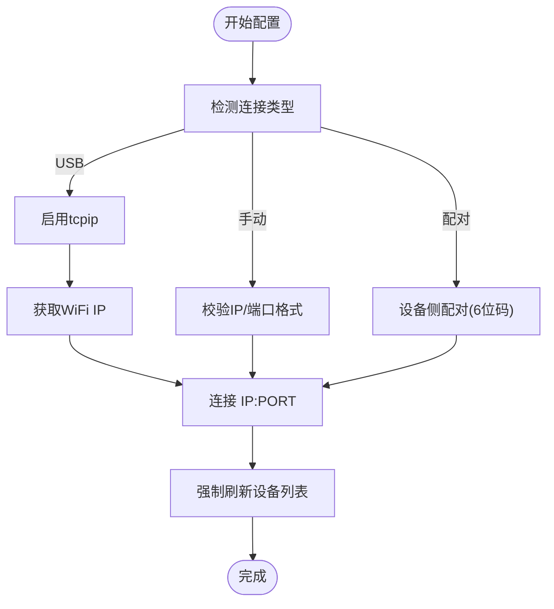
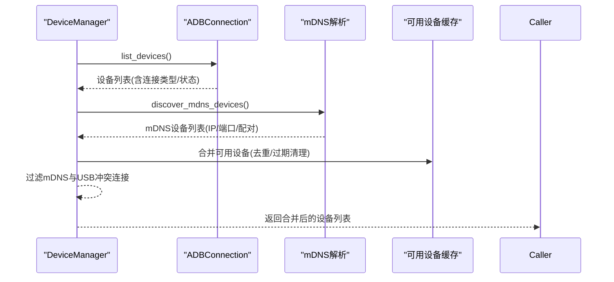
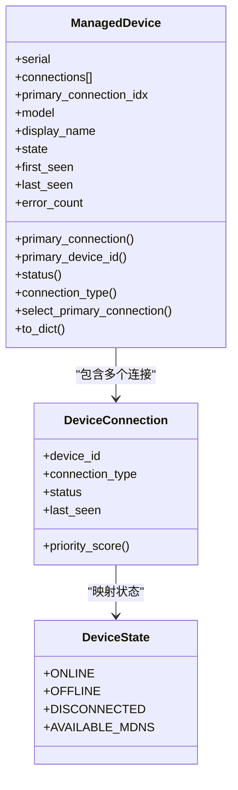
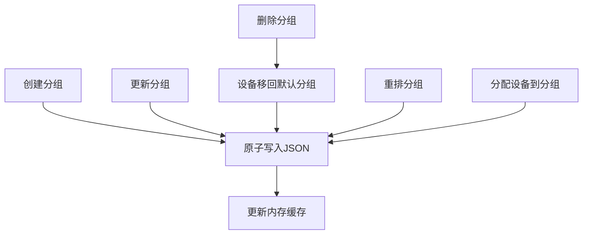
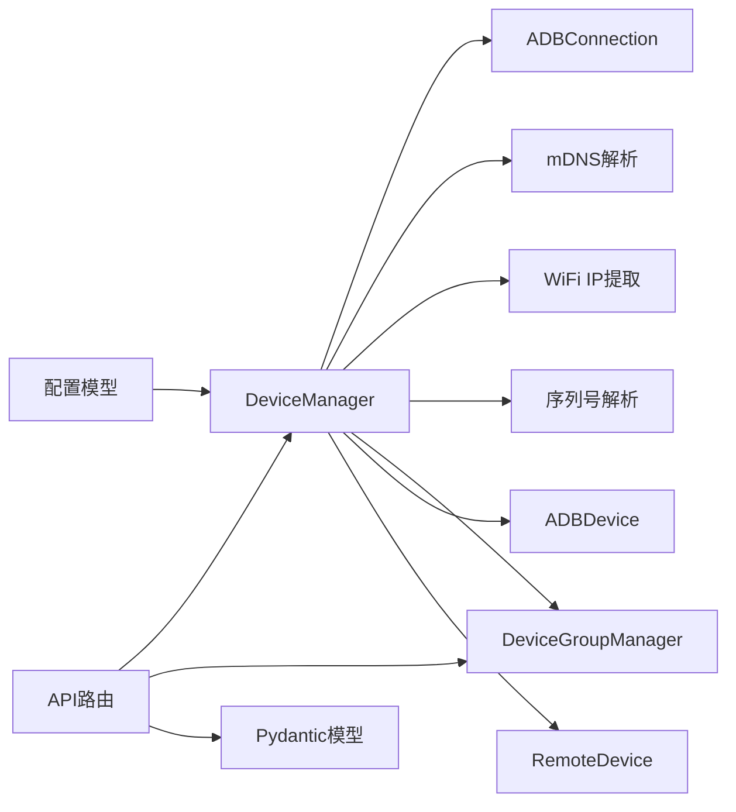

# 设备配置

<cite>
**本文档引用的文件**
- [device_manager.py](file://AutoGLM_GUI/device_manager.py)
- [device_group_manager.py](file://AutoGLM_GUI/device_group_manager.py)
- [adb_device.py](file://AutoGLM_GUI/devices/adb_device.py)
- [remote_device.py](file://AutoGLM_GUI/devices/remote_device.py)
- [connection.py](file://AutoGLM_GUI/adb/connection.py)
- [mdns.py](file://AutoGLM_GUI/adb_plus/mdns.py)
- [ip.py](file://AutoGLM_GUI/adb_plus/ip.py)
- [serial.py](file://AutoGLM_GUI/adb_plus/serial.py)
- [types.py](file://AutoGLM_GUI/types.py)
- [devices.py](file://AutoGLM_GUI/api/devices.py)
- [schemas.py](file://AutoGLM_GUI/schemas.py)
- [config.py](file://AutoGLM_GUI/config.py)
</cite>

## 目录
1. [简介](#简介)
2. [项目结构](#项目结构)
3. [核心组件](#核心组件)
4. [架构总览](#架构总览)
5. [详细组件分析](#详细组件分析)
6. [依赖关系分析](#依赖关系分析)
7. [性能考虑](#性能考虑)
8. [故障排除指南](#故障排除指南)
9. [结论](#结论)
10. [附录](#附录)

## 简介
本文件面向AutoGLM-GUI的设备配置与管理，覆盖以下主题：
- 设备连接参数配置：USB序列号、IP地址、端口号的设置与识别
- 设备发现机制：本地USB、WiFi直连、远程设备、mDNS发现
- 连接状态管理：设备状态枚举、主连接选择策略、轮询与缓存
- 设备分组功能：分组创建、重排、分配与持久化
- 不同连接方式的配置示例：本地USB连接、WiFi直连、远程设备连接
- 配置验证、连接故障排除与性能优化建议
- 权限与安全最佳实践

## 项目结构
AutoGLM-GUI围绕设备管理的核心模块包括：
- 设备管理器：统一管理设备发现、状态缓存、轮询与连接切换
- 设备协议实现：本地ADB设备与远程HTTP代理设备
- ADB连接层：支持USB/WiFi/远程TCP/IP连接
- mDNS与网络辅助：WiFi IP提取、序列号解析、服务发现
- API路由：对外暴露设备配置与分组操作接口
- 配置模型：设备连接参数与运行配置

**图表来源**
- [device_manager.py:249-791](file://AutoGLM_GUI/device_manager.py#L249-L791)
- [device_group_manager.py:26-357](file://AutoGLM_GUI/device_group_manager.py#L26-L357)
- [adb_device.py:14-287](file://AutoGLM_GUI/devices/adb_device.py#L14-L287)
- [remote_device.py:21-207](file://AutoGLM_GUI/devices/remote_device.py#L21-L207)
- [connection.py:49-343](file://AutoGLM_GUI/adb/connection.py#L49-L343)
- [mdns.py:15-195](file://AutoGLM_GUI/adb_plus/mdns.py#L15-L195)
- [ip.py:45-138](file://AutoGLM_GUI/adb_plus/ip.py#L45-L138)
- [serial.py:59-142](file://AutoGLM_GUI/adb_plus/serial.py#L59-L142)
- [devices.py:92-706](file://AutoGLM_GUI/api/devices.py#L92-L706)
- [schemas.py:1-200](file://AutoGLM_GUI/schemas.py#L1-L200)
- [config.py:18-89](file://AutoGLM_GUI/config.py#L18-L89)

**章节来源**
- [device_manager.py:249-791](file://AutoGLM_GUI/device_manager.py#L249-L791)
- [devices.py:92-706](file://AutoGLM_GUI/api/devices.py#L92-L706)

## 核心组件
- 设备管理器（DeviceManager）
  - 支持后台轮询（默认10秒），指数退避（最大60秒）
  - 设备状态：在线、离线、断开、仅可用（mDNS）
  - 主连接选择：优先级（USB > WiFi > 远程），状态优先级（device > offline > unauthorized）
  - WiFi连接：启用tcpip、获取IP、连接、断开、手动连接、配对连接
  - mDNS发现：可用设备缓存与清理（60秒过期）
- 设备协议实现
  - ADBDevice：本地ADB子进程调用，截图、输入、导航、应用控制
  - RemoteDevice：HTTP客户端，转发设备操作到远端Device Agent
- ADB连接层
  - ADBConnection：connect/disconnect/list_devices/enable_tcpip/get_device_ip
  - mDNS解析：服务名到设备信息的解析与合并
  - WiFi IP提取：优先WiFi接口，过滤蜂窝接口
  - 序列号解析：从mDNS服务名提取硬件序列号
- 设备分组管理（DeviceGroupManager）
  - 单例、JSON持久化、mtime缓存、原子写入
  - 默认分组不可删除；支持分组创建、更新、删除、重排、分配
- API与配置
  - API路由：设备列表、WiFi连接/断开/手动连接/配对、mDNS发现、远程设备管理、设备命名、分组管理
  - Pydantic模型：请求/响应参数校验与错误码映射
  - 配置模型：Agent运行参数、设备ID等

**章节来源**
- [device_manager.py:79-196](file://AutoGLM_GUI/device_manager.py#L79-L196)
- [adb_device.py:14-287](file://AutoGLM_GUI/devices/adb_device.py#L14-L287)
- [remote_device.py:21-207](file://AutoGLM_GUI/devices/remote_device.py#L21-L207)
- [connection.py:49-343](file://AutoGLM_GUI/adb/connection.py#L49-L343)
- [mdns.py:15-195](file://AutoGLM_GUI/adb_plus/mdns.py#L15-L195)
- [ip.py:45-138](file://AutoGLM_GUI/adb_plus/ip.py#L45-L138)
- [serial.py:59-142](file://AutoGLM_GUI/adb_plus/serial.py#L59-L142)
- [device_group_manager.py:26-357](file://AutoGLM_GUI/device_group_manager.py#L26-L357)
- [devices.py:92-706](file://AutoGLM_GUI/api/devices.py#L92-L706)
- [schemas.py:1-200](file://AutoGLM_GUI/schemas.py#L1-L200)
- [config.py:18-89](file://AutoGLM_GUI/config.py#L18-L89)

## 架构总览
设备配置与连接的总体流程如下：

**图表来源**
- [devices.py:116-256](file://AutoGLM_GUI/api/devices.py#L116-L256)
- [device_manager.py:687-800](file://AutoGLM_GUI/device_manager.py#L687-L800)
- [connection.py:234-286](file://AutoGLM_GUI/adb/connection.py#L234-L286)
- [ip.py:45-89](file://AutoGLM_GUI/adb_plus/ip.py#L45-L89)

**章节来源**
- [devices.py:116-256](file://AutoGLM_GUI/api/devices.py#L116-L256)
- [device_manager.py:687-800](file://AutoGLM_GUI/device_manager.py#L687-L800)

## 详细组件分析

### 设备连接参数与配置
- USB序列号
  - 通过ADB设备列表解析，优先从mDNS服务名提取硬件序列号，再回退到getprop读取
  - 用于设备唯一标识与跨连接映射
- IP地址与端口
  - WiFi直连：先启用tcpip，再获取设备IP，最后connect("IP:PORT")
  - 手动直连：直接connect("IP:PORT")，进行IP与端口格式校验
  - 配对连接：先在设备侧完成无线调试配对，再以配对端口与连接端口分别建立会话
- 设备ID选择
  - 主连接选择策略：USB优先于WiFi，WiFi优先于远程HTTP代理
  - 状态优先：device > offline > unauthorized

**图表来源**
- [device_manager.py:687-800](file://AutoGLM_GUI/device_manager.py#L687-L800)
- [connection.py:234-286](file://AutoGLM_GUI/adb/connection.py#L234-L286)
- [ip.py:45-89](file://AutoGLM_GUI/adb_plus/ip.py#L45-L89)
- [serial.py:59-111](file://AutoGLM_GUI/adb_plus/serial.py#L59-L111)

**章节来源**
- [serial.py:59-111](file://AutoGLM_GUI/adb_plus/serial.py#L59-L111)
- [ip.py:45-89](file://AutoGLM_GUI/adb_plus/ip.py#L45-L89)
- [connection.py:234-286](file://AutoGLM_GUI/adb/connection.py#L234-L286)
- [device_manager.py:167-180](file://AutoGLM_GUI/device_manager.py#L167-L180)

### 设备发现机制
- 本地USB/WiFi设备
  - 通过ADBConnection.list_devices()获取设备列表，解析连接类型与状态
- mDNS无线ADB设备
  - 通过adb mdns services解析服务名、IP、端口、配对能力
  - 合并connect/pairing服务，过滤无效地址（0.0.0.0）
  - 缓存可用设备，60秒未见则清理
- 远程设备（HTTP代理）
  - 通过Device Agent服务器发现与添加，支持手动配置base_url与device_id

**图表来源**
- [device_manager.py:455-669](file://AutoGLM_GUI/device_manager.py#L455-L669)
- [mdns.py:96-195](file://AutoGLM_GUI/adb_plus/mdns.py#L96-L195)

**章节来源**
- [device_manager.py:455-669](file://AutoGLM_GUI/device_manager.py#L455-L669)
- [mdns.py:96-195](file://AutoGLM_GUI/adb_plus/mdns.py#L96-L195)

### 连接状态管理
- 设备状态枚举
  - ONLINE：连接且响应
  - OFFLINE：连接但不响应
  - DISCONNECTED：未在ADB设备列表中
  - AVAILABLE_MDNS：通过mDNS发现但未连接
- 主连接选择
  - 依据连接类型与状态计算优先级，自动选择最优主连接
- 轮询与指数退避
  - 默认10秒轮询，连续失败按2^N倍增长，上限60秒

**图表来源**
- [device_manager.py:79-196](file://AutoGLM_GUI/device_manager.py#L79-L196)

**章节来源**
- [device_manager.py:79-196](file://AutoGLM_GUI/device_manager.py#L79-L196)

### 设备分组功能
- 分组持久化
  - JSON文件存储，mtime缓存，原子写入（临时文件+替换）
  - 默认分组不可删除，删除时设备移回默认分组
- 分组操作
  - 创建、更新、删除、重排、分配设备到分组
  - 查询分组内设备列表，获取设备归属分组

**图表来源**
- [device_group_manager.py:313-357](file://AutoGLM_GUI/device_group_manager.py#L313-L357)

**章节来源**
- [device_group_manager.py:26-357](file://AutoGLM_GUI/device_group_manager.py#L26-L357)

### 不同连接方式的配置示例
- 本地USB连接
  - 步骤：USB连接设备 → 启用tcpip → 获取IP → 连接WiFi
  - 关键接口：enable_tcpip、get_wifi_ip、connect
- WiFi直连（无需USB）
  - 步骤：校验IP/端口 → 直接connect("IP:PORT")
  - 关键接口：connect_wifi_manual
- 远程设备连接（HTTP代理）
  - 步骤：发现远程设备 → 添加远程设备 → 通过HTTP代理控制
  - 关键接口：discover_remote_devices、add_remote_device

**章节来源**
- [device_manager.py:687-800](file://AutoGLM_GUI/device_manager.py#L687-L800)
- [devices.py:399-470](file://AutoGLM_GUI/api/devices.py#L399-L470)

## 依赖关系分析

**图表来源**
- [device_manager.py:249-791](file://AutoGLM_GUI/device_manager.py#L249-L791)
- [devices.py:92-706](file://AutoGLM_GUI/api/devices.py#L92-L706)
- [schemas.py:1-200](file://AutoGLM_GUI/schemas.py#L1-L200)
- [config.py:18-89](file://AutoGLM_GUI/config.py#L18-L89)

**章节来源**
- [device_manager.py:249-791](file://AutoGLM_GUI/device_manager.py#L249-L791)
- [devices.py:92-706](file://AutoGLM_GUI/api/devices.py#L92-L706)

## 性能考虑
- 轮询间隔与退避
  - 默认10秒轮询，连续失败按指数增长，避免频繁ADB命令导致资源占用
- 并发与缓存
  - 设备序列号提取采用线程池并行处理，减少串行等待
  - mDNS可用设备缓存与过期清理，降低重复解析成本
- 网络接口选择
  - WiFi IP提取优先选择非蜂窝接口，避免错误网关导致连接失败
- 前端交互
  - 参数校验在前端先行，减少无效请求

[本节为通用指导，无需特定文件引用]

## 故障排除指南
- ADB连接失败
  - 检查ADB服务状态与设备授权；必要时重启ADB服务器
  - 参考接口错误映射：设备未找到、tcpip失败、IP获取失败
- WiFi连接异常
  - 确认设备已启用tcpip并正确获取IP；检查IP/端口格式
  - 若设备断开，触发强制刷新设备列表
- mDNS设备不可用
  - 确认ADB版本支持mdns服务；检查服务名解析与IP有效性
  - 60秒未见的设备会被清理，需重新发现
- 远程设备连接失败
  - 校验Device Agent服务器可达性与认证配置
  - 删除并重新添加远程设备

**章节来源**
- [devices.py:116-256](file://AutoGLM_GUI/api/devices.py#L116-L256)
- [device_manager.py:670-684](file://AutoGLM_GUI/device_manager.py#L670-L684)
- [mdns.py:96-195](file://AutoGLM_GUI/adb_plus/mdns.py#L96-L195)

## 结论
AutoGLM-GUI提供了完善的设备配置与管理能力，覆盖本地USB、WiFi直连与远程HTTP代理三种主要场景。通过统一的设备管理器、严格的参数校验与健壮的状态管理，用户可以稳定地完成设备连接、发现与分组管理。结合本文档的配置示例与故障排除建议，可快速定位问题并优化连接性能。

[本节为总结性内容，无需特定文件引用]

## 附录

### 设备连接参数配置要点
- USB序列号
  - 通过mDNS服务名或getprop读取硬件序列号，作为设备唯一标识
- IP地址与端口
  - WiFi直连：启用tcpip后获取IP，再connect("IP:PORT")
  - 手动直连：校验IP/端口格式后直接连接
  - 配对连接：设备侧完成配对后，使用配对端口与连接端口建立会话
- 设备分组
  - 默认分组不可删除；删除分组时设备自动移回默认分组

**章节来源**
- [serial.py:59-111](file://AutoGLM_GUI/adb_plus/serial.py#L59-L111)
- [ip.py:45-89](file://AutoGLM_GUI/adb_plus/ip.py#L45-L89)
- [device_group_manager.py:119-153](file://AutoGLM_GUI/device_group_manager.py#L119-L153)

### 安全与权限最佳实践
- 无线调试配对
  - 使用6位配对码，避免长期开放无认证连接
- 网络隔离
  - 在同一局域网内进行WiFi直连，避免跨网段暴露设备
- 远程代理
  - 为Device Agent配置访问控制与TLS加密，限制可访问IP范围
- 权限最小化
  - 仅授予必要的ADB调试权限，定期撤销不再使用的授权

[本节为通用指导，无需特定文件引用]