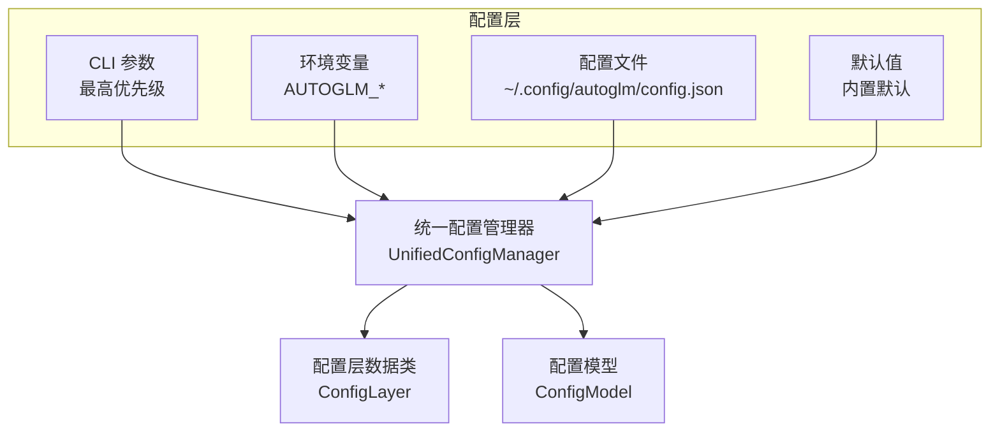
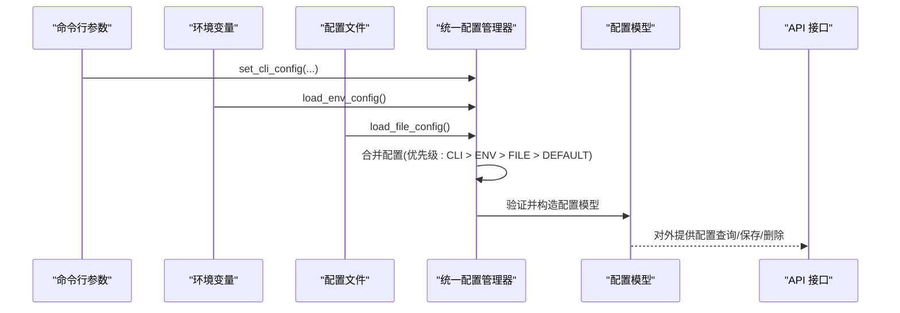
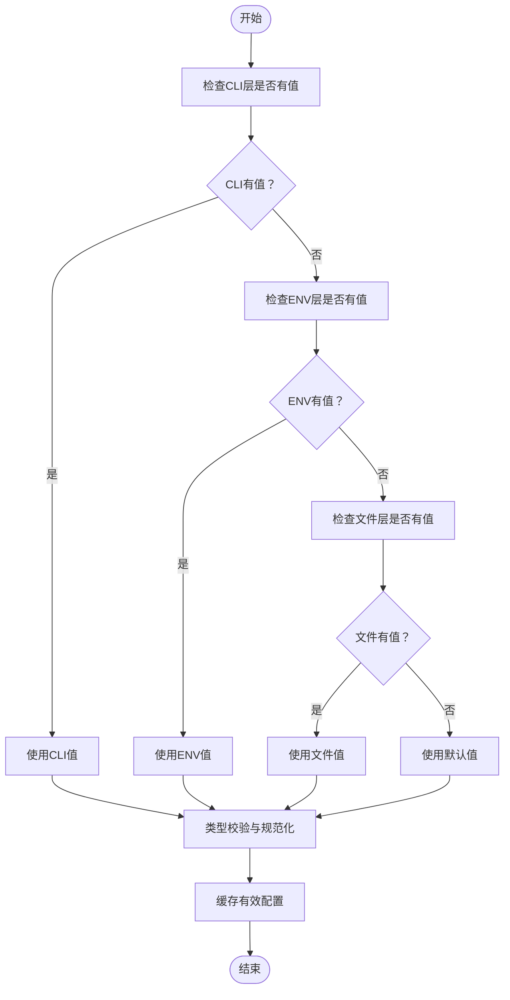
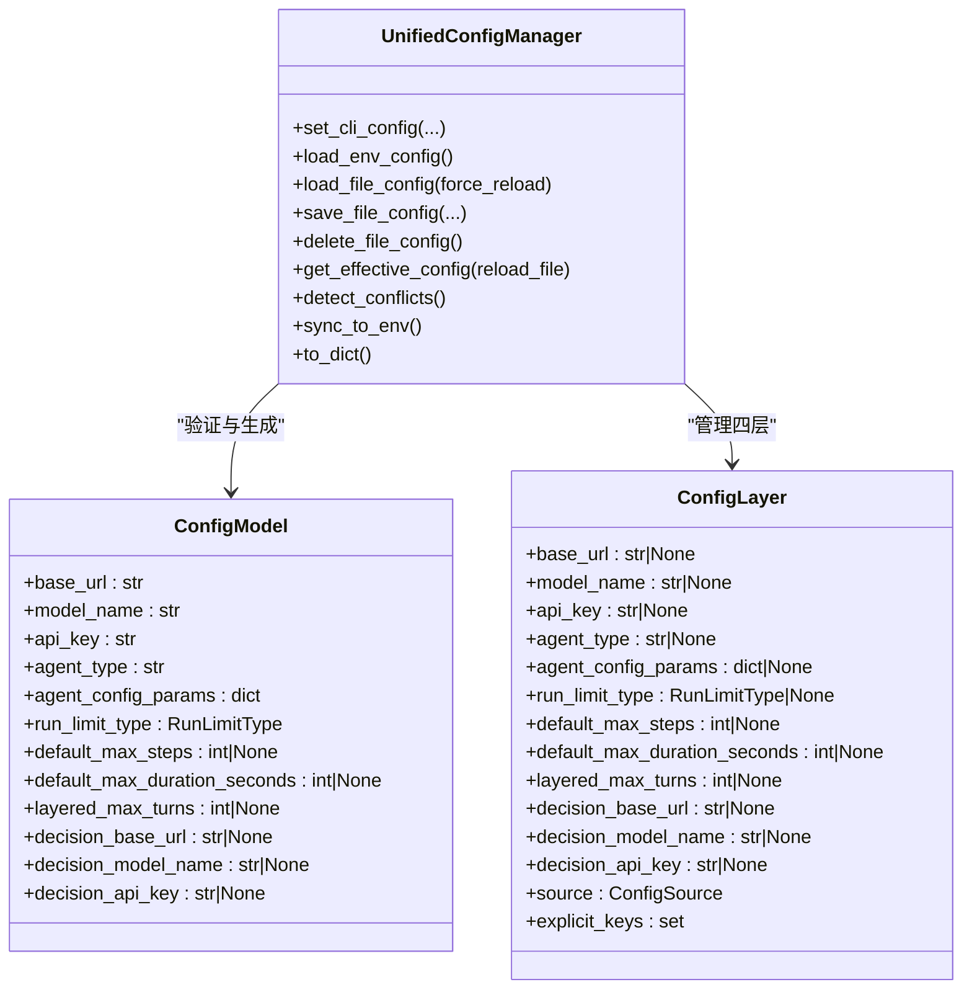

# 配置管理

<cite>
**本文引用的文件**
- [config.py](file://AutoGLM_GUI/config.py)
- [config_manager.py](file://AutoGLM_GUI/config_manager.py)
- [prompt_config.py](file://AutoGLM_GUI/prompt_config.py)
- [__main__.py](file://AutoGLM_GUI/__main__.py)
- [adb_terminal_repl.py](file://AutoGLM_GUI/adb_terminal_repl.py)
- [adb_terminal_service.py](file://AutoGLM_GUI/adb_terminal_service.py)
- [api/__init__.py](file://AutoGLM_GUI/api/__init__.py)
- [api/terminal.py](file://AutoGLM_GUI/api/terminal.py)
- [api/agents.py](file://AutoGLM_GUI/api/agents.py)
- [exceptions.py](file://AutoGLM_GUI/exceptions.py)
- [tests/test_service_entry_coverage.py](file://tests/test_service_entry_coverage.py)
- [tests/test_layered_max_turns_config.py](file://tests/test_layered_max_turns_config.py)
- [tests/test_agents_chat_config_api.py](file://tests/test_agents_chat_config_api.py)
- [configuration.md](file://docs/docs/configuration.md)
- [model-config.md](file://docs/docs/getting-started/model-config.md)
- [deployment/desktop.md](file://docs/docs/deployment/desktop.md)
</cite>

## 目录
1. [简介](#简介)
2. [项目结构](#项目结构)
3. [核心组件](#核心组件)
4. [架构总览](#架构总览)
5. [详细组件分析](#详细组件分析)
6. [依赖关系分析](#依赖关系分析)
7. [性能考量](#性能考量)
8. [故障排除指南](#故障排除指南)
9. [结论](#结论)
10. [附录](#附录)

## 简介
本文件面向AutoGLM-GUI的配置管理，系统化阐述系统配置、模型配置、设备与运行限制配置以及用户偏好设置的管理方式。内容覆盖配置文件结构、参数语义与默认值、优先级与覆盖规则、配置验证与热重载、版本兼容与迁移策略、最佳实践与安全建议、故障排除与版本管理指引，并提供配置模板与示例，帮助用户快速建立正确配置。

## 项目结构
AutoGLM-GUI的配置体系由“统一配置管理器”驱动，采用四层优先级：CLI参数 > 环境变量 > 配置文件 > 默认值。核心文件包括：
- 配置模型与数据类：定义配置项、默认值与校验规则
- 统一配置管理器：负责多层配置加载、合并、冲突检测、热重载与原子写入
- 提示词与国际化：系统提示词与消息获取
- 运行入口与服务：命令行参数注入环境变量、服务启动时读取环境变量
- API接口：对外暴露配置查询、保存、删除与冲突检测
- 测试用例：覆盖优先级、环境变量解析、冲突检测与保存流程

图表来源
- [config_manager.py:37-44](file://AutoGLM_GUI/config_manager.py#L37-L44)
- [config_manager.py:262-295](file://AutoGLM_GUI/config_manager.py#L262-L295)
- [config_manager.py:71-93](file://AutoGLM_GUI/config_manager.py#L71-L93)

章节来源
- [config_manager.py:1-12](file://AutoGLM_GUI/config_manager.py#L1-L12)
- [config.py:18-89](file://AutoGLM_GUI/config.py#L18-L89)

## 核心组件
- 配置模型与数据类
  - ModelConfig：OpenAI兼容API的模型参数（基础URL、API Key、模型名、最大token、采样温度、top-p、频率惩罚、额外参数、语言）
  - AgentConfig：Agent行为控制参数（最大步数、运行上限类型、最大持续时长、设备ID、语言、系统提示、详细日志）
  - StepResult：单步执行结果（成功与否、完成与否、动作、思考、消息）
- 统一配置管理器
  - 四层配置：CLI、环境变量、配置文件、默认值
  - 类型安全：基于Pydantic的配置模型与字段校验
  - 冲突检测：识别文件与CLI/ENV之间的覆盖冲突
  - 热重载：基于mtime缓存的文件变更感知
  - 原子写入：临时文件+替换，避免部分写入
  - 环境变量同步：将有效配置回写到环境变量，支持reload模式

章节来源
- [config.py:18-89](file://AutoGLM_GUI/config.py#L18-L89)
- [config_manager.py:71-166](file://AutoGLM_GUI/config_manager.py#L71-L166)
- [config_manager.py:237-295](file://AutoGLM_GUI/config_manager.py#L237-L295)

## 架构总览
配置系统通过统一配置管理器聚合多源配置，按优先级合并并进行类型校验，最终形成可被业务层使用的有效配置对象。同时，配置变更会触发冲突检测与必要的重启提示，保证运行一致性。

图表来源
- [config_manager.py:299-334](file://AutoGLM_GUI/config_manager.py#L299-L334)
- [config_manager.py:335-420](file://AutoGLM_GUI/config_manager.py#L335-L420)
- [config_manager.py:421-520](file://AutoGLM_GUI/config_manager.py#L421-L520)
- [config_manager.py:676-747](file://AutoGLM_GUI/config_manager.py#L676-L747)

## 详细组件分析

### 配置模型与参数定义
- 基础模型参数
  - base_url：模型API端点URL，必须以http://或https://开头，末尾斜杠会被去除
  - model_name：模型标识符，不能为空
  - api_key：API认证密钥，默认值为"EMPTY"
- 运行与Agent控制参数
  - agent_type：Agent类型，默认"glm-async"
  - agent_config_params：Agent特定配置参数（字典）
  - run_limit_type：运行上限类型，取值"steps"/"duration"/"unlimited"
  - default_max_steps：单次任务最大执行步数，None表示不限制
  - default_max_duration_seconds：单次任务最大持续时长（秒），None表示不限制
  - layered_max_turns：分层代理最大轮数，默认50，最小1
  - decision_*：决策模型的base_url/model_name/api_key（可选）

章节来源
- [config_manager.py:71-166](file://AutoGLM_GUI/config_manager.py#L71-L166)
- [config_manager.py:94-121](file://AutoGLM_GUI/config_manager.py#L94-L121)
- [config_manager.py:122-157](file://AutoGLM_GUI/config_manager.py#L122-L157)
- [config_manager.py:158-166](file://AutoGLM_GUI/config_manager.py#L158-L166)

### 统一配置管理器（四层优先级）
- 配置来源与优先级
  - CLI参数：最高优先级，用于临时覆盖
  - 环境变量：AUTOGLM_*系列变量，适合容器/CI场景
  - 配置文件：~/.config/autoglm/config.json，持久化配置
  - 默认值：内置默认，确保最小可用配置
- 加载与合并
  - load_env_config：解析AUTOGLM_*环境变量，含运行限制与分层轮数等
  - load_file_config：JSON文件读取，支持mtime缓存与热重载
  - get_effective_config：按优先级合并，生成类型安全的ConfigModel
- 冲突检测与环境同步
  - detect_conflicts：识别文件与CLI/ENV的覆盖冲突
  - sync_to_env：将有效配置写回环境变量，便于其他组件读取
- 文件操作
  - save_file_config：原子写入，支持合并模式与显式null保留
  - delete_file_config：删除配置文件并清理缓存

图表来源
- [config_manager.py:676-747](file://AutoGLM_GUI/config_manager.py#L676-L747)

章节来源
- [config_manager.py:237-295](file://AutoGLM_GUI/config_manager.py#L237-L295)
- [config_manager.py:335-420](file://AutoGLM_GUI/config_manager.py#L335-L420)
- [config_manager.py:421-520](file://AutoGLM_GUI/config_manager.py#L421-L520)
- [config_manager.py:676-747](file://AutoGLM_GUI/config_manager.py#L676-L747)
- [config_manager.py:788-800](file://AutoGLM_GUI/config_manager.py#L788-L800)
- [config_manager.py:851-875](file://AutoGLM_GUI/config_manager.py#L851-L875)

### 系统配置与用户偏好
- 系统提示词与语言
  - 通过prompt_config模块根据语言选择系统提示词
- 用户界面与交互偏好
  - 语言设置（lang）影响系统提示与UI消息
  - 详细日志开关（verbose）影响Agent行为日志输出

章节来源
- [prompt_config.py:1-16](file://AutoGLM_GUI/prompt_config.py#L1-L16)
- [config.py:48-70](file://AutoGLM_GUI/config.py#L48-L70)

### 设备配置与运行限制
- 设备标识符（device_id）：用于指定目标设备（USB序列号或IP:端口）
- 运行限制类型与数值
  - run_limit_type：steps/duration/unlimited
  - default_max_steps/default_max_duration_seconds：与run_limit_type配合控制任务边界
- 分层代理轮数（layered_max_turns）：控制分层Agent的思考轮次

章节来源
- [config.py:48-70](file://AutoGLM_GUI/config.py#L48-L70)
- [config_manager.py:30-32](file://AutoGLM_GUI/config_manager.py#L30-L32)
- [config_manager.py:71-93](file://AutoGLM_GUI/config_manager.py#L71-L93)

### 环境变量与运行时配置
- 命令行入口
  - 在启动早期将日志级别、日志文件等注入环境变量
- 服务侧读取
  - API服务与终端服务从环境变量读取主机地址、ADB路径、CORS来源、日志级别等
- 配置同步
  - 统一配置管理器可将有效配置回写到环境变量，便于其他组件读取

章节来源
- [__main__.py:102-106](file://AutoGLM_GUI/__main__.py#L102-L106)
- [__main__.py:132](file://AutoGLM_GUI/__main__.py#L132)
- [__main__.py:280-281](file://AutoGLM_GUI/__main__.py#L280-L281)
- [api/__init__.py:45](file://AutoGLM_GUI/api/__init__.py#L45)
- [api/__init__.py:142-146](file://AutoGLM_GUI/api/__init__.py#L142-L146)
- [api/terminal.py:32-36](file://AutoGLM_GUI/api/terminal.py#L32-L36)
- [api/terminal.py:56](file://AutoGLM_GUI/api/terminal.py#L56)
- [adb_terminal_repl.py:11](file://AutoGLM_GUI/adb_terminal_repl.py#L11)
- [adb_terminal_service.py:85-89](file://AutoGLM_GUI/adb_terminal_service.py#L85-L89)
- [config_manager.py:851-875](file://AutoGLM_GUI/config_manager.py#L851-L875)

### 配置API与前端交互
- 查询配置：返回当前有效配置、来源与冲突信息
- 保存配置：支持合并模式与显式null保留；保存后销毁旧Agent并在下次使用时重建
- 删除配置：删除配置文件并清理缓存
- 冲突检测：返回字段级覆盖冲突详情，前端可据此提示用户

章节来源
- [tests/test_agents_chat_config_api.py:573-601](file://tests/test_agents_chat_config_api.py#L573-L601)
- [tests/test_agents_chat_config_api.py:603-665](file://tests/test_agents_chat_config_api.py#L603-L665)
- [api/agents.py:354-393](file://AutoGLM_GUI/api/agents.py#L354-L393)

## 依赖关系分析
- 统一配置管理器依赖
  - 配置模型（Pydantic）：提供类型安全与字段校验
  - 日志模块：记录加载、校验与错误信息
  - 文件系统：配置文件读写与mtime监控
- 业务层依赖
  - Agent、设备管理、调度器等模块通过统一配置管理器获取有效配置
- API层依赖
  - 配置查询、保存、删除接口依赖统一配置管理器与冲突检测

图表来源
- [config_manager.py:237-295](file://AutoGLM_GUI/config_manager.py#L237-L295)
- [config_manager.py:71-166](file://AutoGLM_GUI/config_manager.py#L71-L166)
- [config_manager.py:171-220](file://AutoGLM_GUI/config_manager.py#L171-L220)

章节来源
- [config_manager.py:237-295](file://AutoGLM_GUI/config_manager.py#L237-L295)
- [config_manager.py:71-166](file://AutoGLM_GUI/config_manager.py#L71-L166)
- [config_manager.py:171-220](file://AutoGLM_GUI/config_manager.py#L171-L220)

## 性能考量
- 文件热重载：基于mtime缓存减少重复解析，仅在文件变更时重新加载
- 配置缓存：合并后的有效配置对象缓存，避免重复计算
- 原子写入：保存配置时使用临时文件+替换，降低I/O开销与损坏风险
- 类型校验：在合并阶段集中进行，避免运行期反复校验

章节来源
- [config_manager.py:444-454](file://AutoGLM_GUI/config_manager.py#L444-L454)
- [config_manager.py:697-747](file://AutoGLM_GUI/config_manager.py#L697-L747)
- [config_manager.py:633-645](file://AutoGLM_GUI/config_manager.py#L633-L645)

## 故障排除指南
- 常见问题定位
  - 配置文件格式错误：JSON解析失败时会记录警告并清空文件层缓存
  - 字段校验失败：base_url需以http://或https://开头，model_name不可为空，运行限制需为正数或None
  - 未配置base_url：异常信息会提示检查配置文件路径
- 冲突与覆盖
  - 当CLI或ENV覆盖文件中的字段时，冲突检测会返回字段级覆盖详情
  - 保存配置后可能需要销毁旧Agent并在下次使用时重建
- 环境变量不生效
  - 确认环境变量名称与前缀是否正确（AUTOGLM_*）
  - 若使用reload模式，可通过sync_to_env将有效配置回写到环境变量

章节来源
- [config_manager.py:506-520](file://AutoGLM_GUI/config_manager.py#L506-L520)
- [config_manager.py:122-128](file://AutoGLM_GUI/config_manager.py#L122-L128)
- [config_manager.py:130-136](file://AutoGLM_GUI/config_manager.py#L130-L136)
- [exceptions.py:72](file://AutoGLM_GUI/exceptions.py#L72)
- [exceptions.py:87-87](file://AutoGLM_GUI/exceptions.py#L87-L87)
- [tests/test_agents_chat_config_api.py:573-601](file://tests/test_agents_chat_config_api.py#L573-L601)
- [api/agents.py:354-393](file://AutoGLM_GUI/api/agents.py#L354-L393)

## 结论
AutoGLM-GUI的配置管理通过统一配置管理器实现了清晰的四层优先级、严格的类型校验、完善的冲突检测与热重载能力。结合环境变量与配置文件，既满足开发调试的灵活性，也满足生产部署的稳定性与安全性。遵循本文的最佳实践与安全建议，可显著提升配置的可靠性与可维护性。

## 附录

### 配置优先级与覆盖规则
- 优先级顺序：CLI参数 > 环境变量 > 配置文件 > 默认值
- 覆盖检测：当文件与CLI/ENV存在不同值时，冲突检测会记录字段级覆盖来源
- 环境同步：可将有效配置写回环境变量，便于其他组件读取

章节来源
- [config_manager.py:37-44](file://AutoGLM_GUI/config_manager.py#L37-L44)
- [config_manager.py:788-800](file://AutoGLM_GUI/config_manager.py#L788-L800)
- [config_manager.py:851-875](file://AutoGLM_GUI/config_manager.py#L851-L875)

### 配置文件结构与默认值
- 配置文件位置：~/.config/autoglm/config.json
- 关键字段与默认值
  - base_url：默认空字符串（需显式配置）
  - model_name：默认"autoglm-phone-9b"
  - api_key：默认"EMPTY"
  - agent_type：默认"glm-async"
  - run_limit_type：默认"steps"
  - default_max_steps：默认100（None表示不限制）
  - default_max_duration_seconds：默认None
  - layered_max_turns：默认50（最小1）
  - decision_base_url/model_name/api_key：默认None

章节来源
- [config_manager.py:253](file://AutoGLM_GUI/config_manager.py#L253)
- [config_manager.py:271-285](file://AutoGLM_GUI/config_manager.py#L271-L285)
- [config_manager.py:71-93](file://AutoGLM_GUI/config_manager.py#L71-L93)
- [config_manager.py:30-32](file://AutoGLM_GUI/config_manager.py#L30-L32)

### 环境变量清单
- AUTOGLM_BASE_URL：模型API基础URL
- AUTOGLM_MODEL_NAME：模型名称
- AUTOGLM_API_KEY：API密钥
- AUTOGLM_DECISION_BASE_URL：决策模型基础URL
- AUTOGLM_DECISION_MODEL_NAME：决策模型名称
- AUTOGLM_DECISION_API_KEY：决策模型密钥
- AUTOGLM_RUN_LIMIT_TYPE：运行限制类型（steps/duration/unlimited）
- AUTOGLM_DEFAULT_MAX_STEPS：默认最大步数
- AUTOGLM_DEFAULT_MAX_DURATION_SECONDS：默认最大持续时长（秒）
- AUTOGLM_LAYERED_MAX_TURNS：分层代理最大轮数
- AUTOGLM_LOG_LEVEL/AUTOGLM_NO_LOG_FILE/AUTOGLM_LOG_FILE：日志级别与日志文件路径
- AUTOGLM_ADB_PATH：ADB可执行文件路径
- AUTOGLM_SERVER_HOST：服务器监听地址
- AUTOGLM_CORS_ORIGINS：CORS允许的来源
- AUTOGLM_ENABLE_WEB_TERMINAL：启用Web终端

章节来源
- [config_manager.py:339-349](file://AutoGLM_GUI/config_manager.py#L339-L349)
- [__main__.py:102-106](file://AutoGLM_GUI/__main__.py#L102-L106)
- [__main__.py:280-281](file://AutoGLM_GUI/__main__.py#L280-L281)
- [api/__init__.py:45](file://AutoGLM_GUI/api/__init__.py#L45)
- [api/__init__.py:142-146](file://AutoGLM_GUI/api/__init__.py#L142-L146)
- [api/terminal.py:32-36](file://AutoGLM_GUI/api/terminal.py#L32-L36)
- [api/terminal.py:56](file://AutoGLM_GUI/api/terminal.py#L56)
- [adb_terminal_repl.py:11](file://AutoGLM_GUI/adb_terminal_repl.py#L11)
- [adb_terminal_service.py:85-89](file://AutoGLM_GUI/adb_terminal_service.py#L85-L89)

### 配置验证与测试要点
- 优先级覆盖测试：验证CLI优先于ENV与文件
- 环境变量解析测试：验证运行限制与分层轮数解析
- 冲突检测测试：验证字段级覆盖冲突返回
- 保存流程测试：验证合并模式与显式null保留

章节来源
- [tests/test_service_entry_coverage.py:227-260](file://tests/test_service_entry_coverage.py#L227-L260)
- [tests/test_layered_max_turns_config.py:132-170](file://tests/test_layered_max_turns_config.py#L132-L170)
- [tests/test_agents_chat_config_api.py:573-601](file://tests/test_agents_chat_config_api.py#L573-L601)
- [tests/test_agents_chat_config_api.py:603-665](file://tests/test_agents_chat_config_api.py#L603-L665)

### 最佳实践与安全建议
- 最小权限与密钥管理
  - API Key尽量通过环境变量注入，避免硬编码在配置文件中
  - 在CI/CD中使用密钥管理服务，避免泄露
- 配置隔离
  - 开发、测试、生产分别使用独立的配置文件或环境变量
  - 使用容器编排时，通过环境变量覆盖默认值
- 变更与回滚
  - 保存配置前先备份原配置文件
  - 发生问题时可快速回滚至上一个版本
- 日志与可观测性
  - 启用详细日志观察配置加载与冲突情况
  - 在API层记录配置来源与冲突，便于排查

### 版本管理与迁移
- 配置文件版本
  - 支持热重载与mtime缓存，无需手动重启即可生效
  - 保存配置采用原子写入，避免部分写入导致的版本不一致
- 兼容性迁移
  - 配置文件中发现已弃用的agent_type时会自动迁移并告警

章节来源
- [config_manager.py:464-478](file://AutoGLM_GUI/config_manager.py#L464-L478)
- [config_manager.py:633-645](file://AutoGLM_GUI/config_manager.py#L633-L645)

### 配置模板与示例
- 示例配置文件（路径：~/.config/autoglm/config.json）
  - 包含基础模型参数、Agent类型与参数、运行限制、分层轮数与决策模型配置
- 快速开始
  - 本地部署：设置base_url指向本地推理服务，model_name为本地模型标识
  - 远程服务：设置base_url与api_key，保持run_limit_type与default_max_steps合理范围
- 常见场景
  - CI/CD：通过AUTOGLM_*环境变量注入配置，避免提交敏感信息
  - 多设备：通过device_id指定目标设备，结合run_limit_type控制任务边界

章节来源
- [docs/docs/configuration.md](file://docs/docs/configuration.md)
- [docs/docs/getting-started/model-config.md](file://docs/docs/getting-started/model-config.md)
- [docs/docs/deployment/desktop.md](file://docs/docs/deployment/desktop.md)