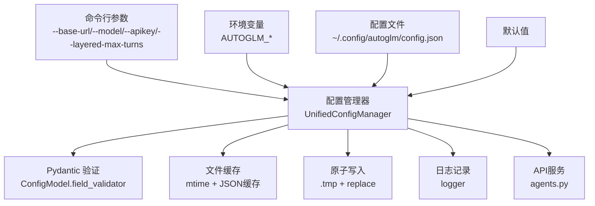
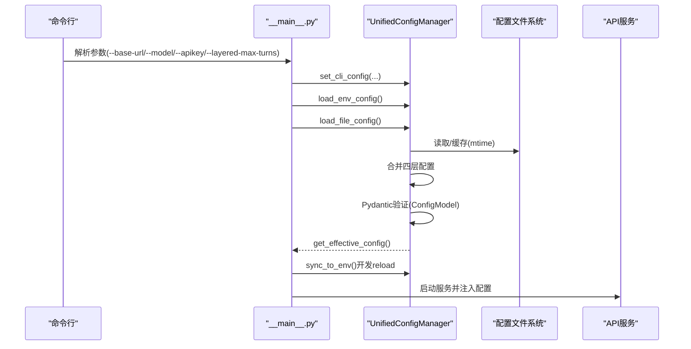
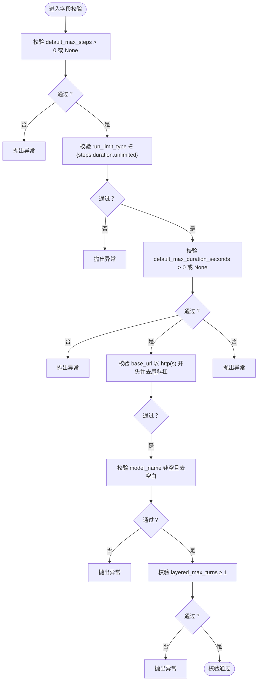
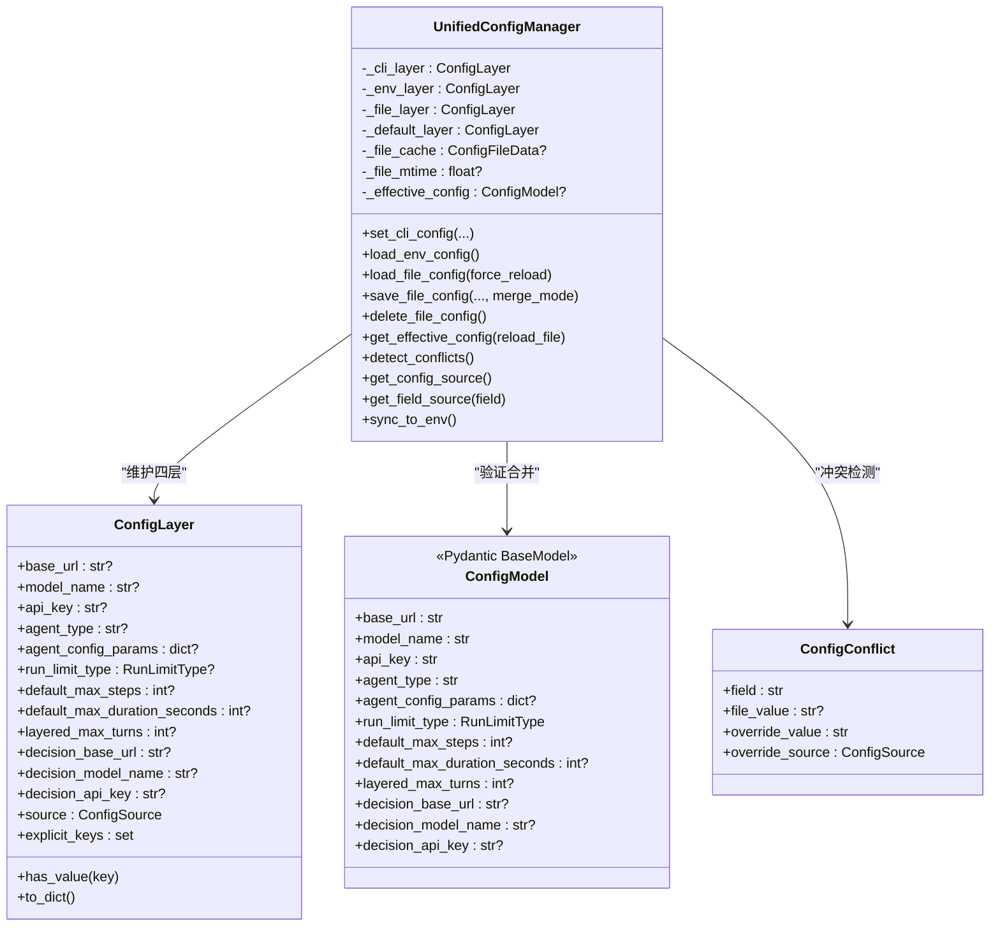
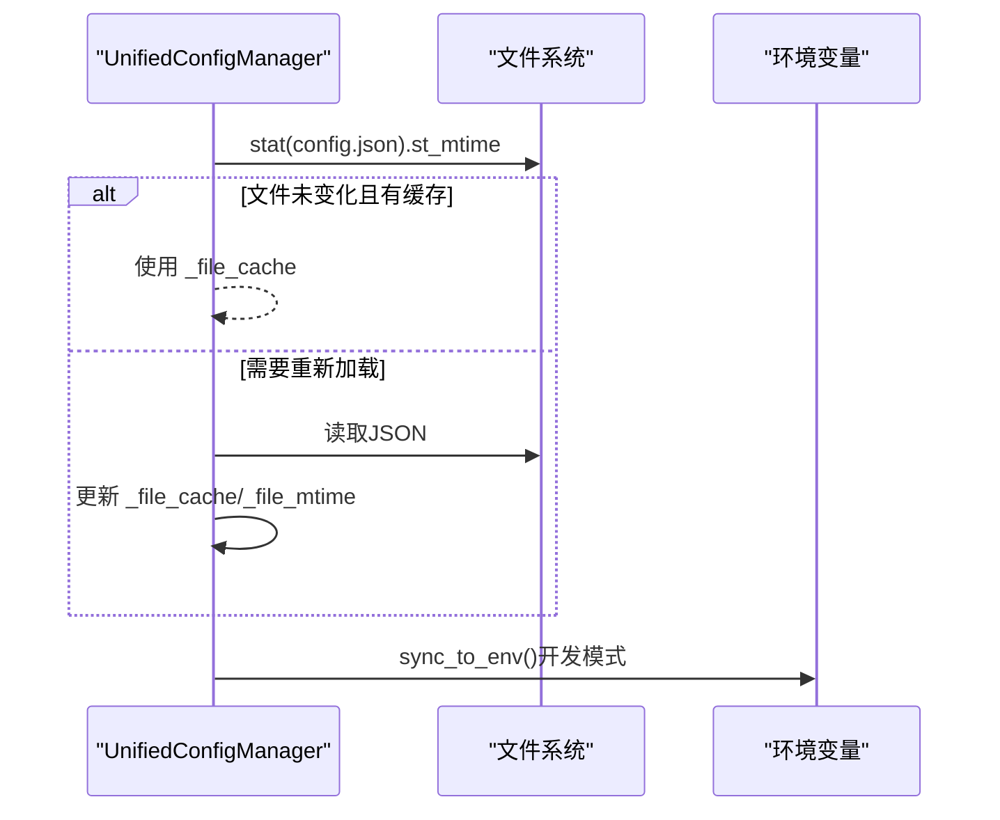
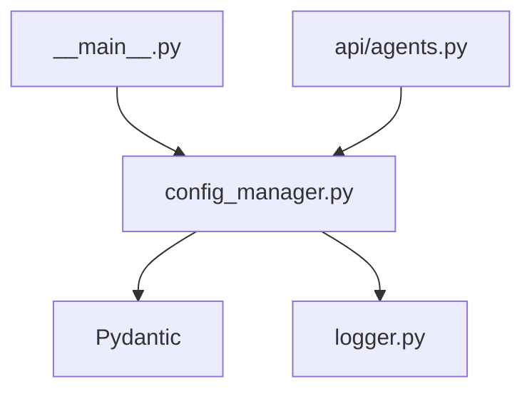

# 配置验证与管理

<cite>
**本文引用的文件**
- [config.py](file://AutoGLM_GUI/config.py)
- [config_manager.py](file://AutoGLM_GUI/config_manager.py)
- [schemas.py](file://AutoGLM_GUI/schemas.py)
- [__main__.py](file://AutoGLM_GUI/__main__.py)
- [logger.py](file://AutoGLM_GUI/logger.py)
- [agents.py](file://AutoGLM_GUI/api/agents.py)
</cite>

## 目录
1. [简介](#简介)
2. [项目结构](#项目结构)
3. [核心组件](#核心组件)
4. [架构总览](#架构总览)
5. [详细组件分析](#详细组件分析)
6. [依赖分析](#依赖分析)
7. [性能考虑](#性能考虑)
8. [故障排除指南](#故障排除指南)
9. [结论](#结论)
10. [附录](#附录)

## 简介
本文件面向AutoGLM-GUI的配置验证与管理，系统化阐述以下主题：
- 配置验证机制：类型安全、字段范围校验、URL格式校验、枚举约束等
- 数据类型检查与参数合法性验证：Pydantic字段校验器与运行时校验
- 配置管理器工作原理：四层优先级（CLI > 环境变量 > 配置文件 > 默认）、缓存与热重载、原子写入
- 配置错误诊断与故障排除：日志记录、冲突检测、降级策略
- 配置版本管理、向后兼容与迁移：配置文件字段迁移与兼容策略
- 配置热重载、运行时修改与审计日志：mtime缓存、变更追踪与日志记录

## 项目结构
与配置验证和管理直接相关的模块与职责如下：
- config.py：定义核心配置数据类（ModelConfig、AgentConfig、StepResult），用于业务层参数传递
- config_manager.py：统一配置管理器，实现四层优先级、类型验证、冲突检测、文件热重载、原子写入
- schemas.py：API层共享的Pydantic模型，包含配置读取/保存请求的字段校验
- __main__.py：CLI入口，负责初始化配置管理器并设置CLI层配置
- logger.py：集中日志配置，为配置管理提供统一的日志输出
- api/agents.py：API服务端点，调用配置管理器进行冲突检测与配置读取

图表来源
- [__main__.py:216-231](file://AutoGLM_GUI/__main__.py#L216-L231)
- [config_manager.py:267-295](file://AutoGLM_GUI/config_manager.py#L267-L295)
- [config_manager.py:71-166](file://AutoGLM_GUI/config_manager.py#L71-L166)
- [config_manager.py:421-520](file://AutoGLM_GUI/config_manager.py#L421-L520)
- [config_manager.py:521-650](file://AutoGLM_GUI/config_manager.py#L521-L650)
- [logger.py:16-80](file://AutoGLM_GUI/logger.py#L16-L80)
- [agents.py:215-240](file://AutoGLM_GUI/api/agents.py#L215-L240)

章节来源
- [__main__.py:216-231](file://AutoGLM_GUI/__main__.py#L216-L231)
- [config_manager.py:267-295](file://AutoGLM_GUI/config_manager.py#L267-L295)

## 核心组件
- 配置数据类（业务层）
  - ModelConfig：模型访问参数（base_url、api_key、model_name、max_tokens、temperature、top_p、frequency_penalty、extra_body、lang）
  - AgentConfig：Agent行为参数（max_steps、run_limit_type、max_duration_seconds、device_id、lang、system_prompt、verbose）
  - StepResult：单步执行结果（success、finished、action、thinking、message）
- 配置管理器（核心）
  - 四层优先级：CLI > 环境变量 > 配置文件 > 默认值
  - 类型安全与字段校验：Pydantic ConfigModel.field_validator
  - 冲突检测：ConfigConflict
  - 文件热重载：基于mtime缓存
  - 原子写入：临时文件+替换
  - 环境变量同步：sync_to_env（开发模式reload）
- API模型（接口层）
  - ConfigResponse/ConfigSaveRequest：配置读取与保存的请求/响应模型，包含字段校验

章节来源
- [config.py:18-89](file://AutoGLM_GUI/config.py#L18-L89)
- [config_manager.py:71-166](file://AutoGLM_GUI/config_manager.py#L71-L166)
- [config_manager.py:237-787](file://AutoGLM_GUI/config_manager.py#L237-L787)
- [schemas.py:274-394](file://AutoGLM_GUI/schemas.py#L274-L394)

## 架构总览
配置系统采用“四层优先级 + 类型验证 + 缓存与热重载”的架构，确保配置来源清晰、验证严格、变更可控。

图表来源
- [__main__.py:216-234](file://AutoGLM_GUI/__main__.py#L216-L234)
- [config_manager.py:299-333](file://AutoGLM_GUI/config_manager.py#L299-L333)
- [config_manager.py:335-420](file://AutoGLM_GUI/config_manager.py#L335-L420)
- [config_manager.py:421-520](file://AutoGLM_GUI/config_manager.py#L421-L520)
- [config_manager.py:676-747](file://AutoGLM_GUI/config_manager.py#L676-L747)

## 详细组件分析

### 配置验证机制与数据类型检查
- 类型安全与字段校验（Pydantic）
  - default_max_steps：必须为正数或None
  - run_limit_type：必须为"steps"|"duration"|"unlimited"
  - default_max_duration_seconds：必须为正数或None
  - base_url/decision_base_url：必须以"http://"或"https://"开头，末尾去除"/"
  - model_name/decision_model_name：非空且去空白
  - layered_max_turns：≥1（默认50，最小1）
- 接口层校验（API模型）
  - ConfigSaveRequest同样对上述字段进行范围与格式校验
  - ConfigResponse用于对外返回配置，包含source与可选conflicts

图表来源
- [config_manager.py:94-120](file://AutoGLM_GUI/config_manager.py#L94-L120)
- [config_manager.py:104-111](file://AutoGLM_GUI/config_manager.py#L104-L111)
- [config_manager.py:113-120](file://AutoGLM_GUI/config_manager.py#L113-L120)
- [config_manager.py:122-128](file://AutoGLM_GUI/config_manager.py#L122-L128)
- [config_manager.py:130-136](file://AutoGLM_GUI/config_manager.py#L130-L136)
- [config_manager.py:158-165](file://AutoGLM_GUI/config_manager.py#L158-L165)
- [schemas.py:328-354](file://AutoGLM_GUI/schemas.py#L328-L354)
- [schemas.py:356-373](file://AutoGLM_GUI/schemas.py#L356-L373)
- [schemas.py:375-393](file://AutoGLM_GUI/schemas.py#L375-L393)

章节来源
- [config_manager.py:94-165](file://AutoGLM_GUI/config_manager.py#L94-L165)
- [schemas.py:328-393](file://AutoGLM_GUI/schemas.py#L328-L393)

### 配置管理器工作原理
- 四层配置层
  - CLI层：set_cli_config设置，最高优先级
  - 环境变量层：load_env_config从AUTOGLM_*读取并做基础校验
  - 文件层：load_file_config从~/.config/autoglm/config.json读取，支持mtime缓存与热重载
  - 默认层：内置默认值
- 配置合并与验证
  - get_effective_config按优先级合并，最终由Pydantic ConfigModel验证
  - 验证失败时降级为默认配置，避免启动失败
- 冲突检测
  - detect_conflicts：当文件层与CLI/ENV存在不同值时生成冲突列表
  - API侧在响应中携带conflicts字段
- 文件操作
  - save_file_config：原子写入（.tmp + replace），支持合并模式
  - delete_file_config：删除配置文件并清理缓存
- 环境变量同步
  - sync_to_env：开发模式下将当前有效配置同步到环境变量，便于子进程读取

图表来源
- [config_manager.py:237-787](file://AutoGLM_GUI/config_manager.py#L237-L787)
- [config_manager.py:171-219](file://AutoGLM_GUI/config_manager.py#L171-L219)
- [config_manager.py:71-166](file://AutoGLM_GUI/config_manager.py#L71-L166)
- [config_manager.py:224-232](file://AutoGLM_GUI/config_manager.py#L224-L232)

章节来源
- [config_manager.py:237-787](file://AutoGLM_GUI/config_manager.py#L237-L787)

### 配置加载、缓存与更新策略
- 首次访问自动加载：首次调用get_effective_config时若文件层为空且文件存在，则自动加载
- 热重载：load_file_config支持force_reload或根据mtime判断是否使用缓存
- 原子写入：save_file_config写入临时文件后替换原文件，保证一致性
- 环境变量同步：sync_to_env在开发reload模式下将有效配置同步到环境变量

图表来源
- [config_manager.py:444-462](file://AutoGLM_GUI/config_manager.py#L444-L462)
- [config_manager.py:693-696](file://AutoGLM_GUI/config_manager.py#L693-L696)
- [config_manager.py:642-644](file://AutoGLM_GUI/config_manager.py#L642-L644)

章节来源
- [config_manager.py:421-520](file://AutoGLM_GUI/config_manager.py#L421-L520)
- [config_manager.py:642-644](file://AutoGLM_GUI/config_manager.py#L642-L644)

### 配置错误诊断与故障排除
- 日志记录
  - logger模块集中配置控制台与文件日志，支持旋转与错误分离
  - 配置管理器在关键路径记录调试/警告/错误信息（文件解析失败、字段校验失败、冲突等）
- 冲突检测与响应
  - detect_conflicts生成冲突列表，API侧在ConfigResponse中返回conflicts
- 降级策略
  - 配置验证失败时回退到默认配置，避免启动中断
- 常见问题定位
  - base_url为空：启动时会给出警告提示
  - 配置文件JSON解析失败：记录warning并清空文件层缓存
  - 环境变量数值非法：记录warning并忽略该字段

章节来源
- [logger.py:16-80](file://AutoGLM_GUI/logger.py#L16-L80)
- [config_manager.py:506-519](file://AutoGLM_GUI/config_manager.py#L506-L519)
- [config_manager.py:742-746](file://AutoGLM_GUI/config_manager.py#L742-L746)
- [config_manager.py:789-836](file://AutoGLM_GUI/config_manager.py#L789-L836)
- [__main__.py:260-264](file://AutoGLM_GUI/__main__.py#L260-L264)

### 配置版本管理、向后兼容与迁移
- 字段迁移
  - 旧版配置文件中的agent_type为"glm"时，自动迁移到"glm-async"并记录警告
  - 当run_limit_type缺失但default_max_steps为None时，推断为"unlimited"
- 兼容策略
  - 仅对已知字段进行迁移，未知字段保持不变
  - 通过ConfigModel字段校验确保新增字段符合约束

章节来源
- [config_manager.py:464-477](file://AutoGLM_GUI/config_manager.py#L464-L477)

### 配置热重载、运行时修改与配置审计
- 热重载
  - load_file_config基于mtime缓存，支持强制重载
  - save_file_config采用原子写入，触发文件变更后下次读取生效
- 运行时修改
  - CLI层set_cli_config即时生效，优先级最高
  - 环境变量层load_env_config可动态更新
- 审计与追踪
  - ConfigSource与get_field_source可用于追踪字段来源
  - 日志记录配置加载、冲突、校验失败等事件，便于审计

章节来源
- [config_manager.py:421-520](file://AutoGLM_GUI/config_manager.py#L421-L520)
- [config_manager.py:521-650](file://AutoGLM_GUI/config_manager.py#L521-L650)
- [config_manager.py:748-787](file://AutoGLM_GUI/config_manager.py#L748-L787)

## 依赖分析
- 组件耦合
  - config_manager依赖Pydantic进行字段校验，依赖logger进行日志输出
  - __main__.py在启动阶段完成配置初始化并注入服务
  - api/agents.py在服务端点中使用配置管理器进行冲突检测与配置读取
- 外部依赖
  - Pydantic：字段校验与模型序列化
  - loguru：统一日志输出
  - Python标准库：json、os、pathlib、typing等

图表来源
- [config_manager.py:23-27](file://AutoGLM_GUI/config_manager.py#L23-L27)
- [logger.py:7-7](file://AutoGLM_GUI/logger.py#L7-L7)
- [__main__.py:211-212](file://AutoGLM_GUI/__main__.py#L211-L212)
- [agents.py:251-251](file://AutoGLM_GUI/api/agents.py#L251-L251)

章节来源
- [config_manager.py:23-27](file://AutoGLM_GUI/config_manager.py#L23-L27)
- [__main__.py:211-212](file://AutoGLM_GUI/__main__.py#L211-L212)
- [agents.py:251-251](file://AutoGLM_GUI/api/agents.py#L251-L251)

## 性能考虑
- 文件缓存与mtime：避免频繁磁盘IO，提升热重载效率
- 原子写入：减少文件损坏风险，避免中间态读取
- 验证降级：配置验证失败时快速回退默认值，保障启动稳定性
- 日志级别控制：通过logger配置控制输出量，避免生产环境过度日志

## 故障排除指南
- 启动时base_url为空
  - 现象：启动日志出现警告
  - 处理：通过前端或CLI参数设置base_url
- 配置文件JSON解析失败
  - 现象：记录warning并清空文件层缓存
  - 处理：修复JSON语法或删除文件
- 环境变量数值非法
  - 现象：记录warning并忽略该字段
  - 处理：修正环境变量为合法数值
- 配置冲突
  - 现象：API响应中包含conflicts字段
  - 处理：统一来源或调整CLI/ENV配置

章节来源
- [__main__.py:260-264](file://AutoGLM_GUI/__main__.py#L260-L264)
- [config_manager.py:506-519](file://AutoGLM_GUI/config_manager.py#L506-L519)
- [config_manager.py:367-397](file://AutoGLM_GUI/config_manager.py#L367-L397)
- [agents.py:215-240](file://AutoGLM_GUI/api/agents.py#L215-L240)

## 结论
AutoGLM-GUI的配置验证与管理通过“四层优先级 + Pydantic类型验证 + mtime缓存 + 原子写入 + 冲突检测 + 日志审计”构建了稳定、可追溯、可热重载的配置体系。业务层与API层均具备严格的参数校验，确保配置在进入核心逻辑前即被验证与规范化。配合完善的错误诊断与降级策略，系统在复杂运行环境中仍能保持高可靠与易运维性。

## 附录
- 关键实现路径参考
  - 配置管理器初始化与合并：[config_manager.py:262-295](file://AutoGLM_GUI/config_manager.py#L262-L295)，[config_manager.py:676-747](file://AutoGLM_GUI/config_manager.py#L676-L747)
  - 文件热重载与原子写入：[config_manager.py:421-520](file://AutoGLM_GUI/config_manager.py#L421-L520)，[config_manager.py:521-650](file://AutoGLM_GUI/config_manager.py#L521-L650)
  - 冲突检测与API响应：[config_manager.py:789-836](file://AutoGLM_GUI/config_manager.py#L789-L836)，[schemas.py:274-300](file://AutoGLM_GUI/schemas.py#L274-L300)
  - CLI初始化与配置注入：[__main__.py:216-234](file://AutoGLM_GUI/__main__.py#L216-L234)