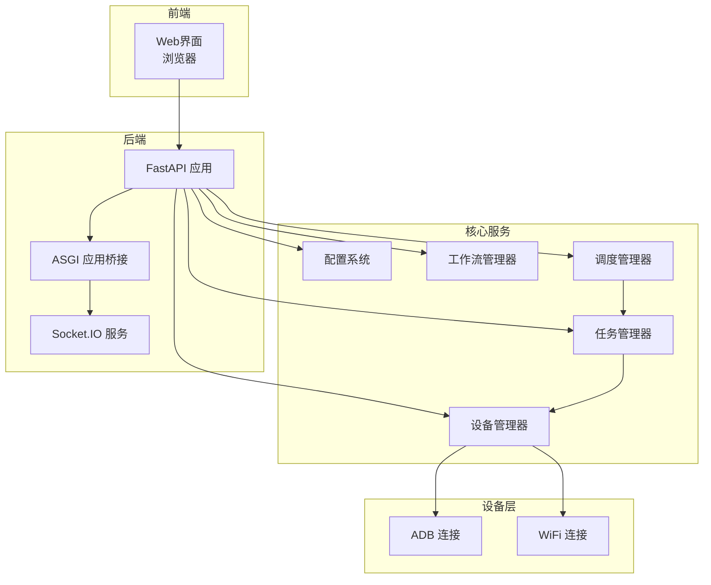
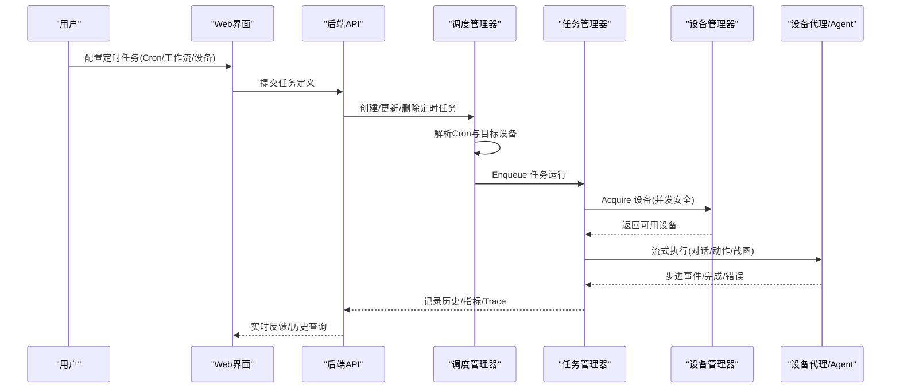
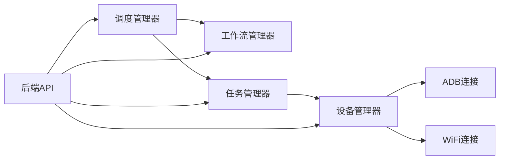

# 应用场景

<cite>
**本文引用的文件**
- [AutoGLM_GUI/__main__.py](file://AutoGLM_GUI/__main__.py)
- [AutoGLM_GUI/server.py](file://AutoGLM_GUI/server.py)
- [AutoGLM_GUI/config.py](file://AutoGLM_GUI/config.py)
- [AutoGLM_GUI/scheduler_manager.py](file://AutoGLM_GUI/scheduler_manager.py)
- [AutoGLM_GUI/models/scheduled_task.py](file://AutoGLM_GUI/models/scheduled_task.py)
- [AutoGLM_GUI/workflow_manager.py](file://AutoGLM_GUI/workflow_manager.py)
- [AutoGLM_GUI/task_manager.py](file://AutoGLM_GUI/task_manager.py)
- [AutoGLM_GUI/device_manager.py](file://AutoGLM_GUI/device_manager.py)
- [AutoGLM_GUI/adb/connection.py](file://AutoGLM_GUI/adb/connection.py)
- [docs/docs/features/scheduler.md](file://docs/docs/features/scheduler.md)
- [docs/docs/features/multi-device.md](file://docs/docs/features/multi-device.md)
- [docs/docs/deployment/server.md](file://docs/docs/deployment/server.md)
- [docs/docs/getting-started/install.md](file://docs/docs/getting-started/install.md)
</cite>

## 目录
1. [简介](#简介)
2. [项目结构](#项目结构)
3. [核心组件](#核心组件)
4. [架构总览](#架构总览)
5. [详细场景分析](#详细场景分析)
6. [依赖关系分析](#依赖关系分析)
7. [性能考量](#性能考量)
8. [故障排查指南](#故障排查指南)
9. [结论](#结论)
10. [附录](#附录)

## 简介
本文件面向AutoGLM-GUI项目的实际应用，围绕“服务器定时自动化”“多设备批量管理”“开发调试与CI/CD”“个人效率提升”四大场景，给出可落地的配置方案、典型任务示例与实施步骤，并说明场景间的组合使用方式与最佳实践。文档以仓库现有能力为基础，结合调度、设备管理、工作流与任务执行等模块，帮助用户快速构建稳定高效的自动化流水线。

## 项目结构
AutoGLM-GUI采用“Web界面 + 后端服务 + 设备与任务编排”的分层架构。前端通过浏览器访问，后端由FastAPI + Socket.IO提供REST与实时通信能力；设备侧通过ADB与WiFi连接管理，任务侧通过队列与执行器实现串并行控制；调度器负责周期性触发任务，工作流管理器负责任务模板持久化。

图示来源
- [AutoGLM_GUI/server.py:1-13](file://AutoGLM_GUI/server.py#L1-L13)
- [AutoGLM_GUI/__main__.py:293-300](file://AutoGLM_GUI/__main__.py#L293-L300)
- [AutoGLM_GUI/device_manager.py:249-314](file://AutoGLM_GUI/device_manager.py#L249-L314)
- [AutoGLM_GUI/workflow_manager.py:33-52](file://AutoGLM_GUI/workflow_manager.py#L33-L52)
- [AutoGLM_GUI/scheduler_manager.py:31-58](file://AutoGLM_GUI/scheduler_manager.py#L31-L58)
- [AutoGLM_GUI/task_manager.py:30-60](file://AutoGLM_GUI/task_manager.py#L30-L60)

章节来源
- [AutoGLM_GUI/server.py:1-13](file://AutoGLM_GUI/server.py#L1-L13)
- [AutoGLM_GUI/__main__.py:213-238](file://AutoGLM_GUI/__main__.py#L213-L238)

## 核心组件
- 配置系统：统一管理模型与运行参数，支持CLI/环境变量/文件/默认值四层优先级，便于在不同场景下灵活切换。
- 设备管理器：后台轮询设备状态，支持USB/WiFi/远程连接，具备mDNS发现与优先级选择能力。
- 工作流管理器：持久化工作流模板，支持增删改查与原子写入，保障任务执行一致性。
- 调度管理器：基于APScheduler的Cron表达式调度，支持单设备与设备分组两种目标模式。
- 任务管理器：按设备分发任务队列，注册多种执行器（经典对话、分层对话、经验报告、定时工作流等），支持取消与中断处理。
- ADB/WiFi：提供TCP/IP开启、IP获取、直连与配对连接等能力，支撑跨网络设备接入。

章节来源
- [AutoGLM_GUI/config.py:18-89](file://AutoGLM_GUI/config.py#L18-L89)
- [AutoGLM_GUI/device_manager.py:249-314](file://AutoGLM_GUI/device_manager.py#L249-L314)
- [AutoGLM_GUI/workflow_manager.py:33-52](file://AutoGLM_GUI/workflow_manager.py#L33-L52)
- [AutoGLM_GUI/scheduler_manager.py:31-58](file://AutoGLM_GUI/scheduler_manager.py#L31-L58)
- [AutoGLM_GUI/task_manager.py:30-60](file://AutoGLM_GUI/task_manager.py#L30-L60)
- [AutoGLM_GUI/adb/connection.py:240-281](file://AutoGLM_GUI/adb/connection.py#L240-L281)

## 架构总览
下图展示从“定时触发”到“设备执行”的完整链路，以及与工作流、设备管理的关系。

图示来源
- [AutoGLM_GUI/scheduler_manager.py:355-467](file://AutoGLM_GUI/scheduler_manager.py#L355-L467)
- [AutoGLM_GUI/task_manager.py:647-800](file://AutoGLM_GUI/task_manager.py#L647-L800)
- [AutoGLM_GUI/device_manager.py:670-756](file://AutoGLM_GUI/device_manager.py#L670-L756)

## 详细场景分析

### 场景一：服务器定时自动化（VPS/NAS部署、7×24小时运行、定时任务执行）
适用对象：需要在远程服务器长期运行、集中管理设备并按计划执行任务的用户。

- 典型目标
  - 7×24小时稳定运行，自动重启与健康检查
  - 周期性执行固定工作流（如每日签到、数据备份、巡检）
  - 支持Cron表达式与设备分组，降低维护成本

- 配置方案
  - 服务端部署：参考“服务端运行说明”，建议使用容器化部署以简化环境。
  - 模型配置：通过CLI/环境变量/文件统一注入模型地址与密钥，避免硬编码。
  - 设备接入：优先USB直连，必要时启用WiFi直连或无线调试配对。
  - 调度策略：使用“定时任务”页面创建任务，选择工作流与设备或设备分组，设置Cron表达式。

- 典型任务示例
  - 每日早8点对一组设备执行“签到+截图+上报”工作流
  - 每周日凌晨2点对全部在线设备执行“清理+缓存回收”工作流

- 实施步骤
  1) 服务器部署与端口开放
     - 使用容器部署，映射端口与日志目录
     - 如需HTTPS，准备证书与私钥文件
  2) 模型与运行参数
     - 通过环境变量或配置文件设置base_url、model_name、api_key
     - CLI参数用于覆盖默认值（如host/port/ssl）
  3) 设备准备
     - USB直连或WiFi直连/配对，确保设备在线
     - 通过设备管理器查看状态与优先级
  4) 工作流与定时任务
     - 在“工作流”中创建模板，保存UUID
     - 在“定时任务”中绑定工作流、设备或设备分组，设置Cron
  5) 观察与告警
     - 查看“历史”与“日志”，关注失败与耗时异常

- 最佳实践
  - 将Cron表达式与设备分组解耦，优先使用分组管理设备变更
  - 对关键任务开启Trace与指标采集，便于回放与优化
  - 为不同业务域划分独立工作流，避免相互干扰

章节来源
- [docs/docs/deployment/server.md:1-14](file://docs/docs/deployment/server.md#L1-L14)
- [docs/docs/features/scheduler.md:1-33](file://docs/docs/features/scheduler.md#L1-L33)
- [docs/docs/features/multi-device.md:1-22](file://docs/docs/features/multi-device.md#L1-L22)
- [AutoGLM_GUI/__main__.py:117-193](file://AutoGLM_GUI/__main__.py#L117-L193)
- [AutoGLM_GUI/config.py:18-89](file://AutoGLM_GUI/config.py#L18-L89)
- [AutoGLM_GUI/scheduler_manager.py:60-113](file://AutoGLM_GUI/scheduler_manager.py#L60-L113)
- [AutoGLM_GUI/models/scheduled_task.py:30-63](file://AutoGLM_GUI/models/scheduled_task.py#L30-L63)
- [AutoGLM_GUI/workflow_manager.py:73-92](file://AutoGLM_GUI/workflow_manager.py#L73-L92)
- [AutoGLM_GUI/device_manager.py:315-376](file://AutoGLM_GUI/device_manager.py#L315-L376)

### 场景二：多设备批量管理（设备连接、批量操作、任务分配）
适用对象：同时管理多台设备，需要按分组批量执行任务、动态分配与负载均衡的用户。

- 典型目标
  - 设备分组：按用途/区域/优先级分组，动态增删
  - 批量操作：一键下发工作流，自动过滤离线设备
  - 任务分配：按设备状态与优先级选择最优连接

- 配置方案
  - 设备分组：在“多设备与分组管理”入口创建/编辑分组
  - 设备连接：优先USB，其次WiFi；支持无线调试配对
  - 任务目标：定时任务可选择“设备分组”而非逐一设备

- 典型任务示例
  - 将“测试机A/B/C”归入“测试分组”，每晚批量执行“回归测试”
  - 将“海外服设备”归入“海外分组”，定时执行“日志采集”

- 实施步骤
  1) 设备分组
     - 在“管理分组”中创建分组，添加/移除设备
     - “默认分组”表示未分配到其他分组的设备集合
  2) 设备连接
     - USB直连或WiFi直连；无线调试配对适用于Android 11+
  3) 定时任务
     - 选择“选择分组”，设置Cron与工作流
     - 调度器自动解析分组内在线设备并排队执行

- 最佳实践
  - 为不同业务域建立专用分组，避免误触
  - 定期清理离线设备，保持分组准确性
  - 对高优先级设备使用更严格的连接策略（如USB优先）

章节来源
- [docs/docs/features/multi-device.md:1-22](file://docs/docs/features/multi-device.md#L1-L22)
- [AutoGLM_GUI/scheduler_manager.py:324-354](file://AutoGLM_GUI/scheduler_manager.py#L324-L354)
- [AutoGLM_GUI/device_manager.py:685-855](file://AutoGLM_GUI/device_manager.py#L685-L855)

### 场景三：开发调试与CI/CD（自动化测试、回归测试、性能测试）
适用对象：研发团队希望将AutoGLM-GUI集成到CI/CD流程，实现自动化测试与回归验证。

- 典型目标
  - 自动化测试：在流水线中拉起服务，连接设备，执行工作流并产出报告
  - 回归测试：对关键路径进行重复执行，对比截图与日志
  - 性能测试：统计任务耗时、步骤数、Trace指标，定位瓶颈

- 配置方案
  - 服务启动：使用CLI参数指定host/port/ssl，或通过环境变量注入
  - 模型配置：通过文件或环境变量统一管理，避免硬编码
  - 任务执行：通过任务管理器提交任务，支持取消与中断

- 典型任务示例
  - CI阶段：启动服务 → 连接设备 → 执行“登录+校验”工作流 → 产出Trace与历史
  - 回归测试：执行“多步骤导航”工作流，断言关键页面出现与截图保存
  - 性能测试：执行“高频循环任务”，收集Trace指标并生成报告

- 实施步骤
  1) 服务启动
     - 在CI环境中以非交互方式启动，避免打开浏览器
     - 配置日志级别与日志文件路径
  2) 设备准备
     - 通过ADB连接设备，必要时启用TCP/IP与配对
  3) 工作流与任务
     - 在流水线中创建/更新工作流模板
     - 提交任务并等待完成，读取历史与Trace
  4) 报告与归档
     - 导出Trace与历史，作为Artifacts归档

- 最佳实践
  - 将模型配置与密钥通过环境变量注入，避免明文
  - 使用“分层对话”执行器进行复杂任务，便于中断与恢复
  - 对关键任务开启Trace与指标，便于回放与分析

章节来源
- [AutoGLM_GUI/__main__.py:117-193](file://AutoGLM_GUI/__main__.py#L117-L193)
- [AutoGLM_GUI/config_manager.py:399-420](file://AutoGLM_GUI/config_manager.py#L399-L420)
- [AutoGLM_GUI/task_manager.py:60-88](file://AutoGLM_GUI/task_manager.py#L60-L88)
- [AutoGLM_GUI/adb/connection.py:240-281](file://AutoGLM_GUI/adb/connection.py#L240-L281)

### 场景四：个人效率提升（日常任务自动化、重复性工作减少）
适用对象：个人用户希望通过图形界面快速完成重复性任务，减少手工操作。

- 典型目标
  - 快速连接设备，一键执行常用工作流
  - 通过聊天式交互与Agent协作，完成日常任务
  - 记录历史与截图，便于回顾与分享

- 配置方案
  - 桌面版启动：自动打开界面，按提示完成设备连接与模型配置
  - 工作流模板：将常用流程保存为模板，提高复用率
  - 任务执行：通过聊天会话或定时任务执行

- 典型任务示例
  - 每日早晨：自动执行“设备自检+通知”工作流
  - 周末：批量执行“截图+总结”工作流，生成个人报告

- 实施步骤
  1) 安装与启动
     - 使用桌面版，完成设备连接与模型配置
  2) 创建工作流
     - 在界面中编写并保存常用工作流
  3) 执行与回顾
     - 通过聊天或定时任务执行，查看历史与截图

- 最佳实践
  - 将高频任务封装为工作流模板，减少重复输入
  - 使用“经验报告”功能，沉淀可复用的执行策略
  - 定期清理历史，保持界面整洁

章节来源
- [docs/docs/getting-started/install.md:1-18](file://docs/docs/getting-started/install.md#L1-L18)
- [docs/docs/features/scheduler.md:16-23](file://docs/docs/features/scheduler.md#L16-L23)

## 依赖关系分析
- 组件耦合
  - 调度管理器依赖工作流管理器与任务管理器，实现“模板驱动的周期执行”
  - 任务管理器依赖设备管理器，实现“设备级并发与资源占用控制”
  - 设备管理器依赖ADB/WiFi连接层，实现“多连接方式与状态聚合”
- 外部依赖
  - ADB工具链与系统网络栈
  - APScheduler用于Cron调度
  - FastAPI/Socket.IO提供接口与实时通信

图示来源
- [AutoGLM_GUI/scheduler_manager.py:355-467](file://AutoGLM_GUI/scheduler_manager.py#L355-L467)
- [AutoGLM_GUI/task_manager.py:615-646](file://AutoGLM_GUI/task_manager.py#L615-L646)
- [AutoGLM_GUI/device_manager.py:435-454](file://AutoGLM_GUI/device_manager.py#L435-L454)

章节来源
- [AutoGLM_GUI/scheduler_manager.py:31-58](file://AutoGLM_GUI/scheduler_manager.py#L31-L58)
- [AutoGLM_GUI/task_manager.py:30-60](file://AutoGLM_GUI/task_manager.py#L30-L60)
- [AutoGLM_GUI/device_manager.py:249-314](file://AutoGLM_GUI/device_manager.py#L249-L314)

## 性能考量
- 设备轮询与背压
  - 设备管理器采用后台线程与指数退避，避免频繁ADB调用造成压力
  - 任务管理器按设备分发队列，避免并发冲突
- 执行器选择
  - 经典对话适合简单任务；分层对话适合复杂路径与可中断场景
- Trace与指标
  - 开启Trace可记录步骤级耗时，辅助性能分析与瓶颈定位
- 网络与连接
  - WiFi直连与配对连接需考虑网络抖动与超时，建议在任务中增加重试与降级策略

## 故障排查指南
- 无法找到可用端口
  - 启动时自动寻找可用端口，若连续端口被占用会报错；可通过CLI参数指定端口
- 设备离线或连接失败
  - 检查ADB服务、USB直连、WiFi直连或无线调试配对流程
  - 使用设备管理器查看设备状态与优先级
- 定时任务未执行
  - 检查Cron表达式格式与目标设备在线情况
  - 查看最近执行状态与消息
- 模型配置无效
  - 确认CLI/环境变量/文件配置的优先级与同步状态
  - 通过配置管理器同步到环境变量，确保热重载模式下生效

章节来源
- [AutoGLM_GUI/__main__.py:17-46](file://AutoGLM_GUI/__main__.py#L17-L46)
- [AutoGLM_GUI/device_manager.py:670-756](file://AutoGLM_GUI/device_manager.py#L670-L756)
- [AutoGLM_GUI/scheduler_manager.py:469-490](file://AutoGLM_GUI/scheduler_manager.py#L469-L490)
- [AutoGLM_GUI/config_manager.py:841-850](file://AutoGLM_GUI/config_manager.py#L841-L850)

## 结论
AutoGLM-GUI通过“配置—设备—工作流—调度—任务—执行器”的完整链路，为服务器定时自动化、多设备批量管理、开发调试与CI/CD、个人效率提升提供了可扩展的解决方案。建议在生产环境采用容器化部署与分组化管理，在开发与个人场景中充分利用工作流模板与Trace能力，持续优化Cron与执行器策略，以获得更高的稳定性与可维护性。

## 附录
- 快速入口
  - 定时任务：在界面中创建/编辑任务，设置Cron与目标设备或分组
  - 多设备与分组：在“管理分组”中维护设备归属
  - 服务端部署：参考“服务端运行说明”，建议使用容器部署
  - 安装与启动：桌面版默认推荐，服务端方式适用于高级用户