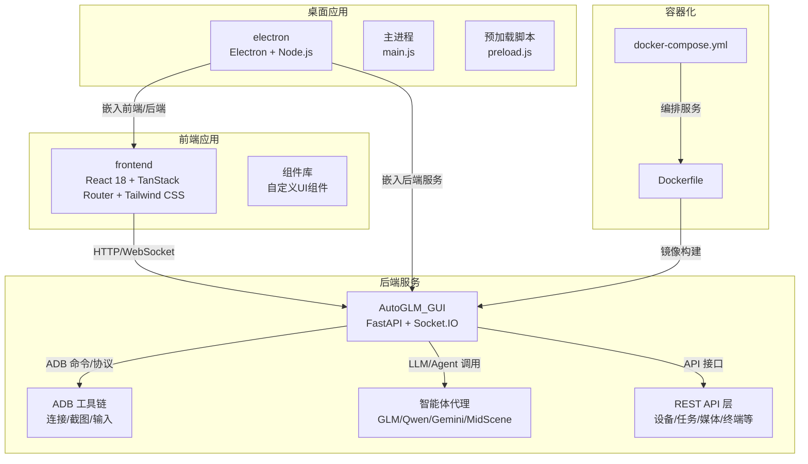
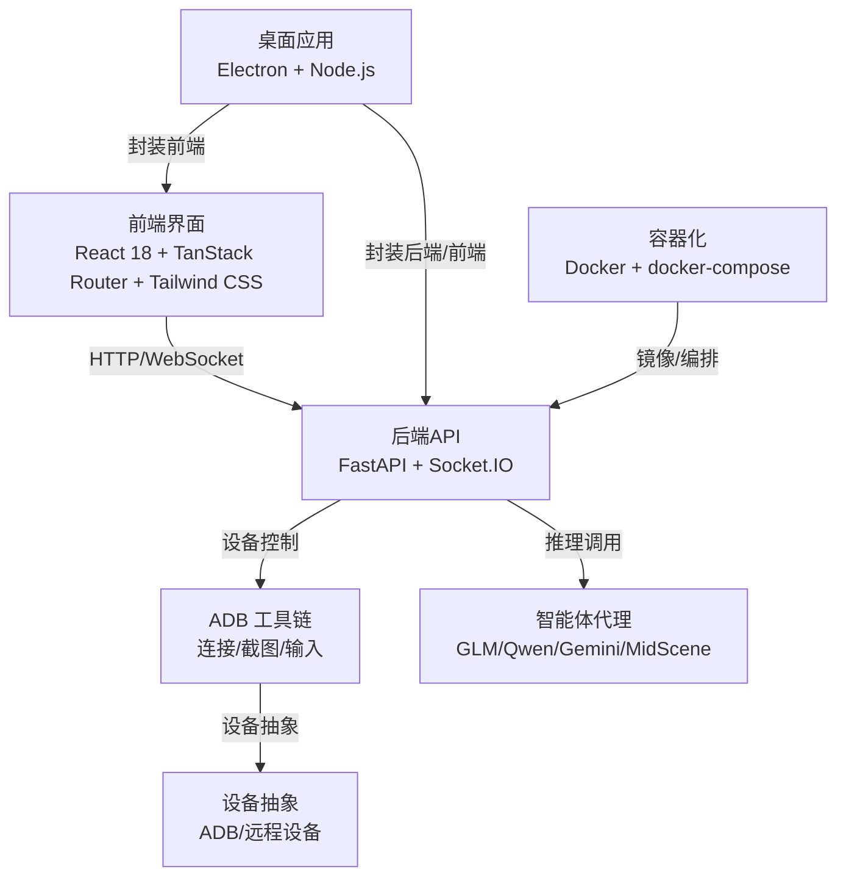
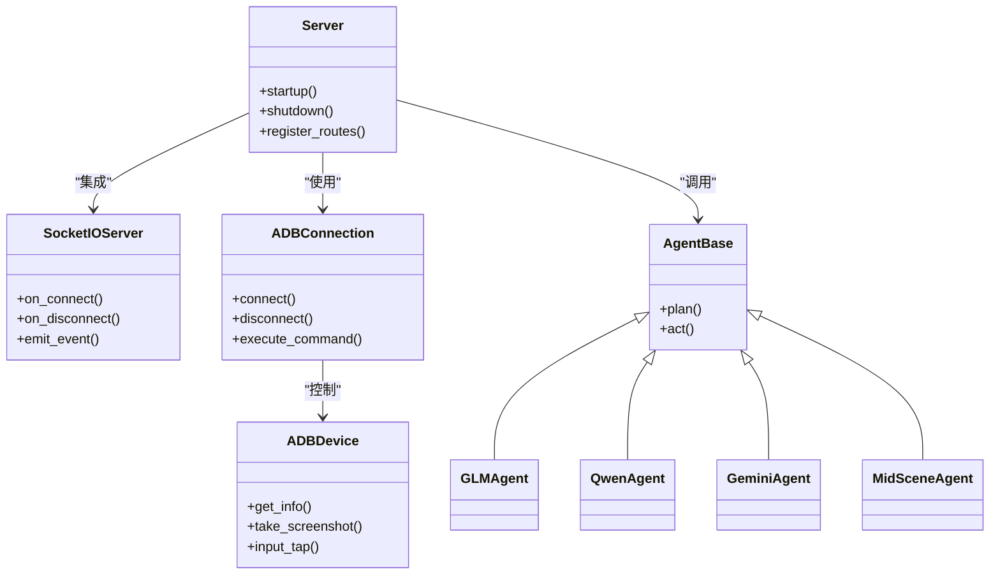
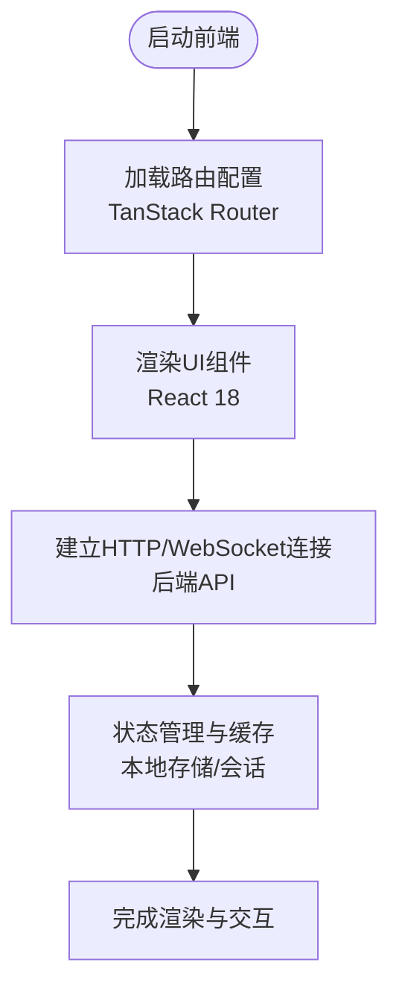
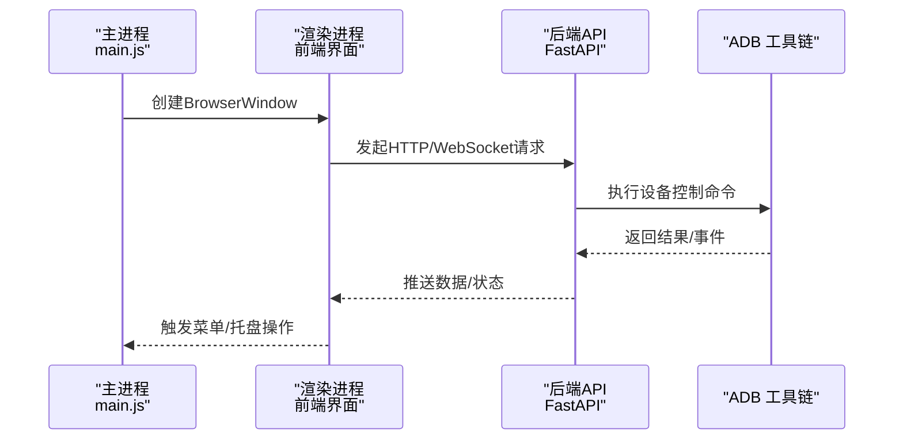
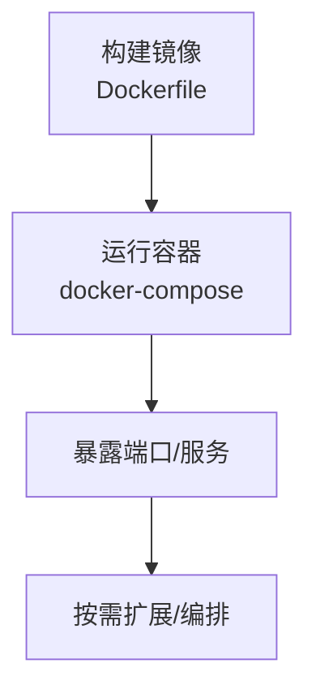
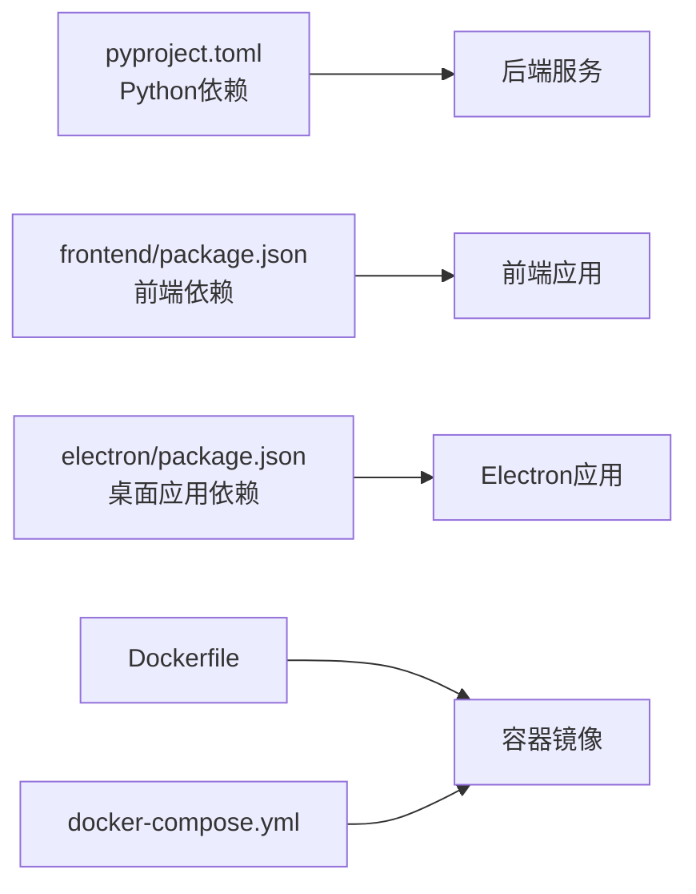

# 技术栈概览

<cite>
**本文档引用的文件**
- [main.py](file://main.py)
- [pyproject.toml](file://pyproject.toml)
- [Dockerfile](file://Dockerfile)
- [docker-compose.yml](file://docker-compose.yml)
- [electron/package.json](file://electron/package.json)
- [frontend/package.json](file://frontend/package.json)
- [electron/main.js](file://electron/main.js)
- [frontend/vite.config.js](file://frontend/vite.config.js)
- [AutoGLM_GUI/server.py](file://AutoGLM_GUI/server.py)
- [AutoGLM_GUI/socketio_server.py](file://AutoGLM_GUI/socketio_server.py)
- [AutoGLM_GUI/adb/connection.py](file://AutoGLM_GUI/adb/connection.py)
- [AutoGLM_GUI/adb/device.py](file://AutoGLM_GUI/adb/device.py)
- [AutoGLM_GUI/adb/screenshot.py](file://AutoGLM_GUI/adb/screenshot.py)
- [AutoGLM_GUI/adb_plus/device.py](file://AutoGLM_GUI/adb_plus/device.py)
- [AutoGLM_GUI/adb_plus/touch.py](file://AutoGLM_GUI/adb_plus/touch.py)
- [AutoGLM_GUI/adb_plus/screenshot.py](file://AutoGLM_GUI/adb_plus/screenshot.py)
- [AutoGLM_GUI/devices/adb_device.py](file://AutoGLM_GUI/devices/adb_device.py)
- [AutoGLM_GUI/devices/remote_device.py](file://AutoGLM_GUI/devices/remote_device.py)
- [AutoGLM_GUI/agents/glm/async_agent.py](file://AutoGLM_GUI/agents/glm/async_agent.py)
- [AutoGLM_GUI/agents/qwen/async_agent.py](file://AutoGLM_GUI/agents/qwen/async_agent.py)
- [AutoGLM_GUI/agents/gemini/async_agent.py](file://AutoGLM_GUI/agents/gemini/async_agent.py)
- [AutoGLM_GUI/agents/midscene/async_agent.py](file://AutoGLM_GUI/agents/midscene/async_agent.py)
- [AutoGLM_GUI/api/agents.py](file://AutoGLM_GUI/api/agents.py)
- [AutoGLM_GUI/api/control.py](file://AutoGLM_GUI/api/control.py)
- [AutoGLM_GUI/api/devices.py](file://AutoGLM_GUI/api/devices.py)
- [AutoGLM_GUI/api/workflows.py](file://AutoGLM_GUI/api/workflows.py)
- [AutoGLM_GUI/api/tasks.py](file://AutoGLM_GUI/api/tasks.py)
- [AutoGLM_GUI/api/media.py](file://AutoGLM_GUI/api/media.py)
- [AutoGLM_GUI/api/terminal.py](file://AutoGLM_GUI/api/terminal.py)
- [AutoGLM_GUI/api/version.py](file://AutoGLM_GUI/api/version.py)
- [AutoGLM_GUI/api/health.py](file://AutoGLM_GUI/api/health.py)
- [AutoGLM_GUI/api/history.py](file://AutoGLM_GUI/api/history.py)
- [AutoGLM_GUI/api/metrics.py](file://AutoGLM_GUI/api/metrics.py)
- [AutoGLM_GUI/api/experience.py](file://AutoGLM_GUI/api/experience.py)
- [AutoGLM_GUI/api/scheduled_tasks.py](file://AutoGLM_GUI/api/scheduled_tasks.py)
- [AutoGLM_GUI/api/layered_agent.py](file://AutoGLM_GUI/api/layered_agent.py)
- [AutoGLM_GUI/api/mcp.py](file://AutoGLM_GUI/api/mcp.py)
- [AutoGLM_GUI/api/terminal.py](file://AutoGLM_GUI/api/terminal.py)
- [AutoGLM_GUI/api/version.py](file://AutoGLM_GUI/api/version.py)
- [AutoGLM_GUI/api/health.py](file://AutoGLM_GUI/api/health.py)
- [AutoGLM_GUI/api/history.py](file://AutoGLM_GUI/api/history.py)
- [AutoGLM_GUI/api/metrics.py](file://AutoGLM_GUI/api/metrics.py)
- [AutoGLM_GUI/api/experience.py](file://AutoGLM_GUI/api/experience.py)
- [AutoGLM_GUI/api/scheduled_tasks.py](file://AutoGLM_GUI/api/scheduled_tasks.py)
- [AutoGLM_GUI/api/layered_agent.py](file://AutoGLM_GUI/api/layered_agent.py)
- [AutoGLM_GUI/api/mcp.py](file://AutoGLM_GUI/api/mcp.py)
</cite>

## 目录
1. [引言](#引言)
2. [项目结构](#项目结构)
3. [核心组件](#核心组件)
4. [架构总览](#架构总览)
5. [详细组件分析](#详细组件分析)
6. [依赖关系分析](#依赖关系分析)
7. [性能考虑](#性能考虑)
8. [故障排除指南](#故障排除指南)
9. [结论](#结论)

## 引言
本文件面向AutoGLM-GUI项目的开发者与维护者，系统梳理并解释项目采用的技术架构与核心技术组件，涵盖后端技术栈（Python FastAPI、Socket.IO、ADB工具链）、前端技术栈（React 18、TanStack Router、Tailwind CSS）、桌面应用技术栈（Electron、Node.js）以及容器化技术（Docker、docker-compose）。文档将说明各技术选型的原因与优势，并展示技术栈之间的协同工作机制，同时提供版本要求、依赖关系与兼容性信息，辅以架构图与组件关系图，帮助读者快速理解整体技术布局。

## 项目结构
AutoGLM-GUI采用多模块分层的工程组织方式：后端服务位于AutoGLM_GUI目录，负责设备管理、任务调度、代理交互与API暴露；前端位于frontend目录，基于Vite构建，使用React 18与TanStack Router实现路由与状态管理；桌面应用封装在electron目录，通过Electron与Node.js桥接前后端；容器化部署由Dockerfile与docker-compose.yml统一管理。

图表来源
- [main.py](file://main.py)
- [pyproject.toml](file://pyproject.toml)
- [Dockerfile](file://Dockerfile)
- [docker-compose.yml](file://docker-compose.yml)
- [electron/main.js](file://electron/main.js)
- [frontend/vite.config.js](file://frontend/vite.config.js)

章节来源
- [main.py](file://main.py)
- [pyproject.toml](file://pyproject.toml)
- [Dockerfile](file://Dockerfile)
- [docker-compose.yml](file://docker-compose.yml)
- [electron/main.js](file://electron/main.js)
- [frontend/vite.config.js](file://frontend/vite.config.js)

## 核心组件
- 后端服务（Python FastAPI）
  - 使用FastAPI作为Web框架，提供REST接口与WebSocket支持，承载设备管理、任务调度、媒体流、终端会话等功能。
  - 集成Socket.IO用于实时通信，支持设备状态推送、日志流与实时预览。
- ADB工具链
  - 提供设备连接、截图、输入模拟、串口/无线配对等能力，支撑跨平台移动设备自动化。
- 智能体代理
  - 支持GLM、Qwen、Gemini、MidScene等多个推理模型的异步代理实现，负责对话解析、动作映射与轨迹记忆。
- 前端应用（React 18 + TanStack Router + Tailwind CSS）
  - 使用React 18与现代Hooks生态，TanStack Router提供声明式路由与状态同步，Tailwind CSS实现可定制UI设计。
- 桌面应用（Electron + Node.js）
  - Electron封装浏览器窗口与Node.js运行时，通过preload脚本安全暴露后端接口给渲染进程。
- 容器化（Docker + docker-compose）
  - Dockerfile定义后端镜像构建流程，docker-compose统一编排服务与环境变量。

章节来源
- [AutoGLM_GUI/server.py](file://AutoGLM_GUI/server.py)
- [AutoGLM_GUI/socketio_server.py](file://AutoGLM_GUI/socketio_server.py)
- [AutoGLM_GUI/adb/connection.py](file://AutoGLM_GUI/adb/connection.py)
- [AutoGLM_GUI/adb/device.py](file://AutoGLM_GUI/adb/device.py)
- [AutoGLM_GUI/adb/screenshot.py](file://AutoGLM_GUI/adb/screenshot.py)
- [AutoGLM_GUI/adb_plus/device.py](file://AutoGLM_GUI/adb_plus/device.py)
- [AutoGLM_GUI/adb_plus/touch.py](file://AutoGLM_GUI/adb_plus/touch.py)
- [AutoGLM_GUI/adb_plus/screenshot.py](file://AutoGLM_GUI/adb_plus/screenshot.py)
- [AutoGLM_GUI/devices/adb_device.py](file://AutoGLM_GUI/devices/adb_device.py)
- [AutoGLM_GUI/devices/remote_device.py](file://AutoGLM_GUI/devices/remote_device.py)
- [AutoGLM_GUI/agents/glm/async_agent.py](file://AutoGLM_GUI/agents/glm/async_agent.py)
- [AutoGLM_GUI/agents/qwen/async_agent.py](file://AutoGLM_GUI/agents/qwen/async_agent.py)
- [AutoGLM_GUI/agents/gemini/async_agent.py](file://AutoGLM_GUI/agents/gemini/async_agent.py)
- [AutoGLM_GUI/agents/midscene/async_agent.py](file://AutoGLM_GUI/agents/midscene/async_agent.py)
- [AutoGLM_GUI/api/agents.py](file://AutoGLM_GUI/api/agents.py)
- [AutoGLM_GUI/api/control.py](file://AutoGLM_GUI/api/control.py)
- [AutoGLM_GUI/api/devices.py](file://AutoGLM_GUI/api/devices.py)
- [AutoGLM_GUI/api/workflows.py](file://AutoGLM_GUI/api/workflows.py)
- [AutoGLM_GUI/api/tasks.py](file://AutoGLM_GUI/api/tasks.py)
- [AutoGLM_GUI/api/media.py](file://AutoGLM_GUI/api/media.py)
- [AutoGLM_GUI/api/terminal.py](file://AutoGLM_GUI/api/terminal.py)
- [AutoGLM_GUI/api/version.py](file://AutoGLM_GUI/api/version.py)
- [AutoGLM_GUI/api/health.py](file://AutoGLM_GUI/api/health.py)
- [AutoGLM_GUI/api/history.py](file://AutoGLM_GUI/api/history.py)
- [AutoGLM_GUI/api/metrics.py](file://AutoGLM_GUI/api/metrics.py)
- [AutoGLM_GUI/api/experience.py](file://AutoGLM_GUI/api/experience.py)
- [AutoGLM_GUI/api/scheduled_tasks.py](file://AutoGLM_GUI/api/scheduled_tasks.py)
- [AutoGLM_GUI/api/layered_agent.py](file://AutoGLM_GUI/api/layered_agent.py)
- [AutoGLM_GUI/api/mcp.py](file://AutoGLM_GUI/api/mcp.py)

## 架构总览
下图展示了AutoGLM-GUI的整体架构：前端通过HTTP与WebSocket与后端交互；后端通过ADB工具链控制真实设备；智能体代理负责推理与动作执行；Electron封装桌面应用；Docker与docker-compose提供容器化部署。

图表来源
- [AutoGLM_GUI/server.py](file://AutoGLM_GUI/server.py)
- [AutoGLM_GUI/socketio_server.py](file://AutoGLM_GUI/socketio_server.py)
- [AutoGLM_GUI/adb/connection.py](file://AutoGLM_GUI/adb/connection.py)
- [AutoGLM_GUI/adb/device.py](file://AutoGLM_GUI/adb/device.py)
- [AutoGLM_GUI/agents/glm/async_agent.py](file://AutoGLM_GUI/agents/glm/async_agent.py)
- [AutoGLM_GUI/devices/adb_device.py](file://AutoGLM_GUI/devices/adb_device.py)
- [electron/main.js](file://electron/main.js)
- [Dockerfile](file://Dockerfile)
- [docker-compose.yml](file://docker-compose.yml)

## 详细组件分析

### 后端技术栈（Python FastAPI、Socket.IO、ADB工具链）
- FastAPI服务
  - 提供REST API与WebSocket端点，覆盖设备管理、任务调度、媒体流、终端会话、健康检查、指标采集等。
  - 通过类型注解与自动文档生成提升开发效率与API可观测性。
- Socket.IO集成
  - 实现设备状态推送、日志流、实时预览等低延迟通信场景。
- ADB工具链
  - 设备连接与发现：支持USB/无线配对、mDNS广播、二维码配对。
  - 截图与显示：获取屏幕截图、分辨率与DPI信息。
  - 输入与触摸：模拟点击、滑动、文本输入等操作。
  - 远程设备：抽象远程设备接口，统一本地与远程设备操作。

图表来源
- [AutoGLM_GUI/server.py](file://AutoGLM_GUI/server.py)
- [AutoGLM_GUI/socketio_server.py](file://AutoGLM_GUI/socketio_server.py)
- [AutoGLM_GUI/adb/connection.py](file://AutoGLM_GUI/adb/connection.py)
- [AutoGLM_GUI/adb/device.py](file://AutoGLM_GUI/adb/device.py)
- [AutoGLM_GUI/agents/glm/async_agent.py](file://AutoGLM_GUI/agents/glm/async_agent.py)
- [AutoGLM_GUI/agents/qwen/async_agent.py](file://AutoGLM_GUI/agents/qwen/async_agent.py)
- [AutoGLM_GUI/agents/gemini/async_agent.py](file://AutoGLM_GUI/agents/gemini/async_agent.py)
- [AutoGLM_GUI/agents/midscene/async_agent.py](file://AutoGLM_GUI/agents/midscene/async_agent.py)

章节来源
- [AutoGLM_GUI/server.py](file://AutoGLM_GUI/server.py)
- [AutoGLM_GUI/socketio_server.py](file://AutoGLM_GUI/socketio_server.py)
- [AutoGLM_GUI/adb/connection.py](file://AutoGLM_GUI/adb/connection.py)
- [AutoGLM_GUI/adb/device.py](file://AutoGLM_GUI/adb/device.py)
- [AutoGLM_GUI/adb/screenshot.py](file://AutoGLM_GUI/adb/screenshot.py)
- [AutoGLM_GUI/adb_plus/device.py](file://AutoGLM_GUI/adb_plus/device.py)
- [AutoGLM_GUI/adb_plus/touch.py](file://AutoGLM_GUI/adb_plus/touch.py)
- [AutoGLM_GUI/adb_plus/screenshot.py](file://AutoGLM_GUI/adb_plus/screenshot.py)
- [AutoGLM_GUI/devices/adb_device.py](file://AutoGLM_GUI/devices/adb_device.py)
- [AutoGLM_GUI/devices/remote_device.py](file://AutoGLM_GUI/devices/remote_device.py)

### 前端技术栈（React 18、TanStack Router、Tailwind CSS）
- React 18
  - 使用最新并发特性与自动批处理，提升渲染性能与用户体验。
- TanStack Router
  - 提供声明式路由、状态同步、代码分割与SSR友好能力，适配复杂页面导航。
- Tailwind CSS
  - 原子化CSS工具，快速构建一致且可维护的UI风格。

图表来源
- [frontend/vite.config.js](file://frontend/vite.config.js)
- [frontend/src/main.tsx](file://frontend/src/main.tsx)
- [frontend/src/routes/__root.tsx](file://frontend/src/routes/__root.tsx)

章节来源
- [frontend/vite.config.js](file://frontend/vite.config.js)
- [frontend/package.json](file://frontend/package.json)

### 桌面应用技术栈（Electron、Node.js）
- Electron
  - 封装浏览器窗口与Node.js运行时，提供跨平台桌面应用体验。
- Node.js
  - 在主进程中管理应用生命周期、菜单、托盘与系统通知。
- 预加载脚本
  - 通过contextBridge安全暴露受限API给渲染进程，保障隔离与安全。

图表来源
- [electron/main.js](file://electron/main.js)
- [electron/preload.js](file://electron/preload.js)
- [AutoGLM_GUI/server.py](file://AutoGLM_GUI/server.py)
- [AutoGLM_GUI/socketio_server.py](file://AutoGLM_GUI/socketio_server.py)

章节来源
- [electron/main.js](file://electron/main.js)
- [electron/package.json](file://electron/package.json)

### 容器化技术（Docker、docker-compose）
- Dockerfile
  - 定义后端镜像构建流程，包含Python依赖安装、工作目录设置与入口命令。
- docker-compose.yml
  - 统一编排后端服务、数据库（如需）与相关依赖，管理环境变量与端口映射。

图表来源
- [Dockerfile](file://Dockerfile)
- [docker-compose.yml](file://docker-compose.yml)

章节来源
- [Dockerfile](file://Dockerfile)
- [docker-compose.yml](file://docker-compose.yml)

## 依赖关系分析
- Python后端依赖
  - 通过pyproject.toml集中管理依赖，包含FastAPI、Socket.IO、ADB相关库与第三方工具。
- 前端依赖
  - 通过frontend/package.json管理React、TanStack Router、Tailwind CSS及相关开发工具。
- 桌面应用依赖
  - 通过electron/package.json管理Electron、node-loader与打包工具。
- 容器化依赖
  - Dockerfile与docker-compose.yml共同定义运行时环境与服务编排。

图表来源
- [pyproject.toml](file://pyproject.toml)
- [frontend/package.json](file://frontend/package.json)
- [electron/package.json](file://electron/package.json)
- [Dockerfile](file://Dockerfile)
- [docker-compose.yml](file://docker-compose.yml)

章节来源
- [pyproject.toml](file://pyproject.toml)
- [frontend/package.json](file://frontend/package.json)
- [electron/package.json](file://electron/package.json)

## 性能考虑
- 前端性能
  - 使用React 18并发特性与懒加载策略，结合Tailwind原子化样式减少CSS体积。
  - TanStack Router提供路由级代码分割，降低首屏负载。
- 后端性能
  - FastAPI的异步I/O与类型校验减少运行时错误，Socket.IO用于高频事件推送，降低轮询开销。
  - ADB操作采用批量命令与缓存策略，避免重复截图与输入。
- 桌面应用性能
  - Electron通过预加载脚本限制渲染进程权限，减少不必要的IPC通信。
- 容器化性能
  - 多阶段构建减少镜像体积，Compose按需启动服务，避免资源浪费。

## 故障排除指南
- ADB连接问题
  - 确认设备已启用开发者选项与USB调试；检查USB驱动与权限；尝试无线配对或二维码配对。
- Socket.IO连接失败
  - 检查后端WebSocket端口与防火墙设置；确认客户端与服务端版本兼容。
- 前端路由异常
  - 清理浏览器缓存与localStorage；检查TanStack Router配置与路由守卫。
- 桌面应用无法启动
  - 查看Electron主进程日志；确认Node.js版本与依赖安装完整。
- 容器化部署异常
  - 检查Dockerfile构建日志与镜像层；核对docker-compose.yml服务端口与网络配置。

章节来源
- [AutoGLM_GUI/adb/connection.py](file://AutoGLM_GUI/adb/connection.py)
- [AutoGLM_GUI/socketio_server.py](file://AutoGLM_GUI/socketio_server.py)
- [frontend/src/lib/utils.ts](file://frontend/src/lib/utils.ts)
- [electron/main.js](file://electron/main.js)
- [Dockerfile](file://Dockerfile)
- [docker-compose.yml](file://docker-compose.yml)

## 结论
AutoGLM-GUI采用“前后端分离 + 桌面封装 + 容器化”的技术架构，后端以FastAPI为核心，结合Socket.IO与ADB工具链实现设备控制与实时通信；前端以React 18与TanStack Router提供现代化用户界面；桌面应用通过Electron整合前后端形成独立客户端；容器化技术确保部署一致性与可扩展性。该架构在功能完整性、开发效率与运维便利性之间取得平衡，适合持续演进与规模化部署。