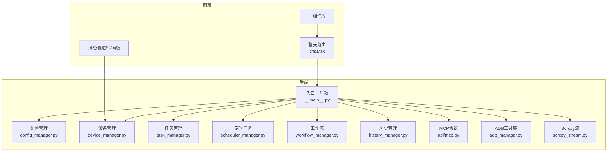
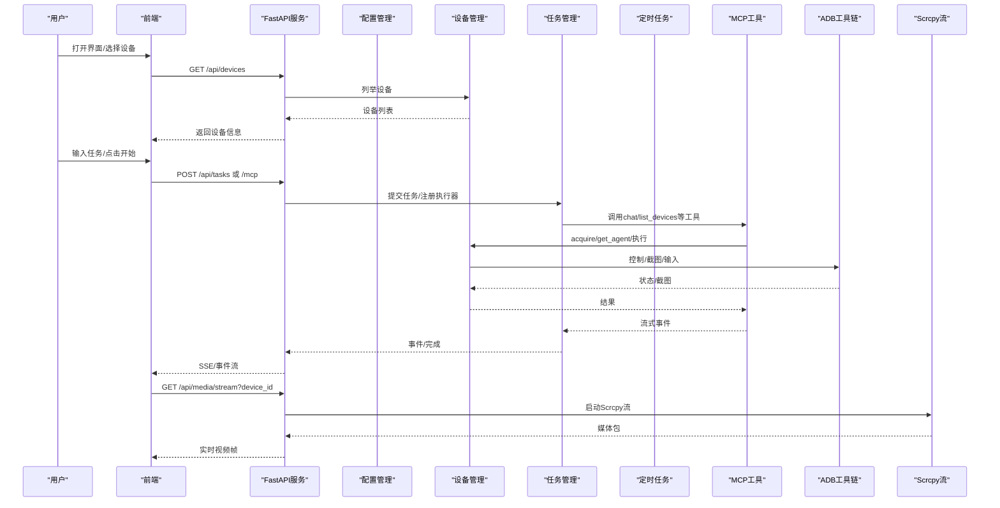
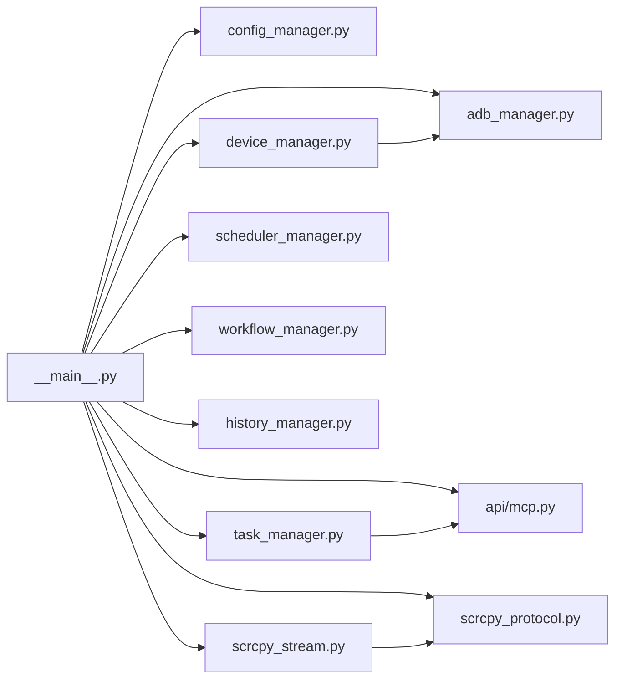

# 核心特性

<cite>
**本文引用的文件**
- [AutoGLM_GUI/__main__.py](file://AutoGLM_GUI/__main__.py)
- [AutoGLM_GUI/layered_agent_service.py](file://AutoGLM_GUI/layered_agent_service.py)
- [AutoGLM_GUI/workflow_manager.py](file://AutoGLM_GUI/workflow_manager.py)
- [AutoGLM_GUI/scheduler_manager.py](file://AutoGLM_GUI/scheduler_manager.py)
- [AutoGLM_GUI/adb_manager.py](file://AutoGLM_GUI/adb_manager.py)
- [AutoGLM_GUI/scrcpy_protocol.py](file://AutoGLM_GUI/scrcpy_protocol.py)
- [AutoGLM_GUI/scrcpy_stream.py](file://AutoGLM_GUI/scrcpy_stream.py)
- [AutoGLM_GUI/api/mcp.py](file://AutoGLM_GUI/api/mcp.py)
- [AutoGLM_GUI/history_manager.py](file://AutoGLM_GUI/history_manager.py)
- [AutoGLM_GUI/task_manager.py](file://AutoGLM_GUI/task_manager.py)
- [AutoGLM_GUI/config_manager.py](file://AutoGLM_GUI/config_manager.py)
- [AutoGLM_GUI/device_manager.py](file://AutoGLM_GUI/device_manager.py)
- [Dockerfile](file://Dockerfile)
- [docker-compose.yml](file://docker-compose.yml)
- [frontend/src/routes/chat.tsx](file://frontend/src/routes/chat.tsx)
</cite>

## 目录
1. [简介](#简介)
2. [项目结构](#项目结构)
3. [核心组件](#核心组件)
4. [架构总览](#架构总览)
5. [详细组件分析](#详细组件分析)
6. [依赖关系分析](#依赖关系分析)
7. [性能考量](#性能考量)
8. [故障排查指南](#故障排查指南)
9. [结论](#结论)
10. [附录](#附录)

## 简介
本文件面向AutoGLM-GUI项目，系统梳理并深入解析其核心特性与实现原理，涵盖生产力增强（定时任务、Docker部署、对话历史管理、立即打断）、AI自动化能力（分层代理模式、完全无线配对、多设备并发控制、对话式任务管理、Workflow工作流）、技术特性（实时屏幕预览、直接操控手机、零配置部署、MCP协议支持、ADB深度集成、模块化界面）。文档以“代码即文档”的方式，结合图示与路径引用，帮助不同技术背景的读者快速理解并高效应用。

## 项目结构
AutoGLM-GUI采用前后端分离与模块化设计：
- 后端Python服务：统一入口、配置管理、设备管理、任务编排、历史与调度、ADB工具链等。
- 前端React应用：设备面板、聊天面板、配置与预设、分组管理、实时预览等。
- 部署：Docker多阶段构建，支持容器内ADB与静态资源打包；docker-compose提供一键部署方案。

图表来源
- [AutoGLM_GUI/__main__.py:78-305](file://AutoGLM_GUI/__main__.py#L78-L305)
- [AutoGLM_GUI/config_manager.py:237-747](file://AutoGLM_GUI/config_manager.py#L237-L747)
- [AutoGLM_GUI/device_manager.py:249-377](file://AutoGLM_GUI/device_manager.py#L249-L377)
- [AutoGLM_GUI/task_manager.py:30-120](file://AutoGLM_GUI/task_manager.py#L30-L120)
- [AutoGLM_GUI/scheduler_manager.py:31-87](file://AutoGLM_GUI/scheduler_manager.py#L31-L87)
- [AutoGLM_GUI/workflow_manager.py:33-93](file://AutoGLM_GUI/workflow_manager.py#L33-L93)
- [AutoGLM_GUI/history_manager.py:23-75](file://AutoGLM_GUI/history_manager.py#L23-L75)
- [AutoGLM_GUI/api/mcp.py:24-54](file://AutoGLM_GUI/api/mcp.py#L24-L54)
- [AutoGLM_GUI/adb_manager.py:33-106](file://AutoGLM_GUI/adb_manager.py#L33-L106)
- [AutoGLM_GUI/scrcpy_stream.py:119-156](file://AutoGLM_GUI/scrcpy_stream.py#L119-L156)

章节来源
- [AutoGLM_GUI/__main__.py:78-305](file://AutoGLM_GUI/__main__.py#L78-L305)
- [frontend/src/routes/chat.tsx:180-338](file://frontend/src/routes/chat.tsx#L180-L338)

## 核心组件
- 统一配置管理：四层优先级（CLI > 环境变量 > 配置文件 > 默认值），类型安全与热重载。
- 设备管理：后台轮询、连接优先级选择、mDNS发现、WiFi配对与直连、远程设备桥接。
- 任务编排：队列驱动的设备级工作者、经典/分层两种执行模式、取消与中断、事件回放。
- 定时任务：基于APScheduler的Cron调度，支持单机/多机、设备分组、失败重试与记录。
- 工作流：本地JSON持久化、原子写入、UUID管理、缓存与mtime感知。
- 历史管理：设备维度JSON文件持久化、路径安全、原子写入、缓存与追踪。
- 实时预览：Scrcpy协议对齐、服务端启动、端口占用清理、TCP连接与媒体包解析。
- MCP协议：标准化工具接口（chat/list_devices/screenshot/create_task等），与任务系统打通。
- Docker部署：多阶段构建、健康检查、卷挂载、主机网络与USB直通。

章节来源
- [AutoGLM_GUI/config_manager.py:237-747](file://AutoGLM_GUI/config_manager.py#L237-L747)
- [AutoGLM_GUI/device_manager.py:249-377](file://AutoGLM_GUI/device_manager.py#L249-L377)
- [AutoGLM_GUI/task_manager.py:30-120](file://AutoGLM_GUI/task_manager.py#L30-L120)
- [AutoGLM_GUI/scheduler_manager.py:31-87](file://AutoGLM_GUI/scheduler_manager.py#L31-L87)
- [AutoGLM_GUI/workflow_manager.py:33-93](file://AutoGLM_GUI/workflow_manager.py#L33-L93)
- [AutoGLM_GUI/history_manager.py:23-75](file://AutoGLM_GUI/history_manager.py#L23-L75)
- [AutoGLM_GUI/scrcpy_stream.py:119-156](file://AutoGLM_GUI/scrcpy_stream.py#L119-L156)
- [AutoGLM_GUI/api/mcp.py:24-54](file://AutoGLM_GUI/api/mcp.py#L24-L54)
- [Dockerfile:1-64](file://Dockerfile#L1-L64)
- [docker-compose.yml:1-32](file://docker-compose.yml#L1-L32)

## 架构总览
AutoGLM-GUI通过统一入口启动服务，初始化配置、ADB与设备管理器，随后提供REST/MCP接口与WebSocket/Scrcpy流，支撑前端交互与设备控制。

图表来源
- [AutoGLM_GUI/__main__.py:210-300](file://AutoGLM_GUI/__main__.py#L210-L300)
- [AutoGLM_GUI/api/mcp.py:32-115](file://AutoGLM_GUI/api/mcp.py#L32-L115)
- [AutoGLM_GUI/task_manager.py:635-800](file://AutoGLM_GUI/task_manager.py#L635-L800)
- [AutoGLM_GUI/scrcpy_stream.py:203-245](file://AutoGLM_GUI/scrcpy_stream.py#L203-L245)

## 详细组件分析

### 生产力增强特性

#### 定时任务（Cron调度）
- 功能要点
  - 支持Cron表达式、启用/禁用、下次运行时间查询。
  - 支持单设备与设备分组两种目标模式。
  - 与任务系统集成，按classic/layered模式执行。
  - 原子文件写入、mtime缓存、失败记录与部分成功统计。
- 技术实现
  - 使用AsyncIOScheduler，按任务cron重建作业。
  - 解析目标设备：分组或直接序列号列表。
  - 在线设备校验与离线跳过，逐设备排队执行。
- 使用场景
  - 定时巡检、周期性任务、批量设备运维。
- 配置与调用
  - 创建/更新/删除任务与开关；通过任务ID查询事件与结果。
- 代码参考
  - [创建任务:60-87](file://AutoGLM_GUI/scheduler_manager.py#L60-L87)
  - [更新任务:88-113](file://AutoGLM_GUI/scheduler_manager.py#L88-L113)
  - [执行流程:355-467](file://AutoGLM_GUI/scheduler_manager.py#L355-L467)
  - [原子持久化:505-520](file://AutoGLM_GUI/scheduler_manager.py#L505-L520)

章节来源
- [AutoGLM_GUI/scheduler_manager.py:31-155](file://AutoGLM_GUI/scheduler_manager.py#L31-L155)
- [AutoGLM_GUI/scheduler_manager.py:156-320](file://AutoGLM_GUI/scheduler_manager.py#L156-L320)
- [AutoGLM_GUI/scheduler_manager.py:355-467](file://AutoGLM_GUI/scheduler_manager.py#L355-L467)
- [AutoGLM_GUI/scheduler_manager.py:505-520](file://AutoGLM_GUI/scheduler_manager.py#L505-L520)

#### Docker部署（零配置部署）
- 功能要点
  - 多阶段构建：Node前端构建 + Python后端打包。
  - 健康检查、默认端口、环境变量、卷挂载。
  - docker-compose支持主机网络、USB直通、持久化配置与日志。
- 部署步骤
  - 构建镜像或直接拉取GHCR镜像。
  - 启动容器，映射端口或使用host网络。
  - 挂载~/.config/autoglm与/app/logs，必要时挂载/dev/bus/usb。
- 代码参考
  - [Dockerfile:1-64](file://Dockerfile#L1-L64)
  - [docker-compose.yml:1-32](file://docker-compose.yml#L1-L32)

章节来源
- [Dockerfile:1-64](file://Dockerfile#L1-L64)
- [docker-compose.yml:1-32](file://docker-compose.yml#L1-L32)

#### 对话历史管理（设备维度持久化）
- 功能要点
  - 每台设备独立JSON文件，路径安全（哈希与相对路径校验）。
  - 原子写入（.tmp + replace），mtime缓存，避免竞态。
  - 支持增删改查、清空、总数统计。
- 技术实现
  - 序列号清洗与哈希保护，防止路径穿越。
  - 读取时缓存与mtime对比，写入时临时文件替换。
- 代码参考
  - [历史文件路径与安全:61-75](file://AutoGLM_GUI/history_manager.py#L61-L75)
  - [原子写入:102-132](file://AutoGLM_GUI/history_manager.py#L102-L132)
  - [清理设备历史:178-192](file://AutoGLM_GUI/history_manager.py#L178-L192)

章节来源
- [AutoGLM_GUI/history_manager.py:23-75](file://AutoGLM_GUI/history_manager.py#L23-L75)
- [AutoGLM_GUI/history_manager.py:102-132](file://AutoGLM_GUI/history_manager.py#L102-L132)
- [AutoGLM_GUI/history_manager.py:178-192](file://AutoGLM_GUI/history_manager.py#L178-L192)

#### 立即打断（任务取消与中断）
- 功能要点
  - 支持取消排队/运行中任务，触发设备级Abort处理器。
  - 设备锁释放、上下文清理，避免资源泄漏。
- 技术实现
  - 任务状态机与终止事件，设备级abort handler注册。
  - 取消请求标记与异步处理。
- 代码参考
  - [取消任务:408-433](file://AutoGLM_GUI/task_manager.py#L408-L433)
  - [设备worker与执行器:603-634](file://AutoGLM_GUI/task_manager.py#L603-L634)

章节来源
- [AutoGLM_GUI/task_manager.py:408-433](file://AutoGLM_GUI/task_manager.py#L408-L433)
- [AutoGLM_GUI/task_manager.py:603-634](file://AutoGLM_GUI/task_manager.py#L603-L634)

### AI自动化能力

#### 分层代理模式（Layered Agent）
- 功能要点
  - 上层规划器（决策模型）负责任务拆解与工具调用。
  - 下层手机Agent执行具体动作与对话，Fail-Fast限制步数。
  - 支持会话级内存追踪、工具调用事件流、取消与中断。
- 技术实现
  - 规划器指令模板、工具：list_devices、chat。
  - MCP步数限制与超限提示，设备锁acquire/release。
  - 事件流封装：tool_call/tool_result/message/done/cancelled/error。
- 代码参考
  - [规划器指令与工具:31-80](file://AutoGLM_GUI/layered_agent_service.py#L31-L80)
  - [list_devices工具:223-245](file://AutoGLM_GUI/layered_agent_service.py#L223-L245)
  - [chat工具（MCP）:247-387](file://AutoGLM_GUI/layered_agent_service.py#L247-L387)
  - [事件流封装:465-726](file://AutoGLM_GUI/layered_agent_service.py#L465-L726)

章节来源
- [AutoGLM_GUI/layered_agent_service.py:31-80](file://AutoGLM_GUI/layered_agent_service.py#L31-L80)
- [AutoGLM_GUI/layered_agent_service.py:223-245](file://AutoGLM_GUI/layered_agent_service.py#L223-L245)
- [AutoGLM_GUI/layered_agent_service.py:247-387](file://AutoGLM_GUI/layered_agent_service.py#L247-L387)
- [AutoGLM_GUI/layered_agent_service.py:465-726](file://AutoGLM_GUI/layered_agent_service.py#L465-L726)

#### 完全无线配对（WiFi直连与mDNS发现）
- 功能要点
  - 从USB切换到WiFi，自动enable tcpip、获取IP、建立连接。
  - mDNS发现可用设备，过滤重复与非最优连接。
  - 支持手动WiFi直连与断开。
- 技术实现
  - ADB命令封装、IP正则校验、端口范围校验。
  - 设备状态与连接优先级计算，主连接选择。
- 代码参考
  - [WiFi切换:687-736](file://AutoGLM_GUI/device_manager.py#L687-L736)
  - [手动WiFi直连:758-791](file://AutoGLM_GUI/device_manager.py#L758-L791)
  - [mDNS发现与过滤:601-669](file://AutoGLM_GUI/device_manager.py#L601-L669)

章节来源
- [AutoGLM_GUI/device_manager.py:687-736](file://AutoGLM_GUI/device_manager.py#L687-L736)
- [AutoGLM_GUI/device_manager.py:758-791](file://AutoGLM_GUI/device_manager.py#L758-L791)
- [AutoGLM_GUI/device_manager.py:601-669](file://AutoGLM_GUI/device_manager.py#L601-L669)

#### 多设备并发控制（队列与工作者）
- 功能要点
  - 每设备独立工作者，串行执行队列任务，避免并发冲突。
  - 支持经典/分层/经验报告/计划任务等多种执行器。
  - 任务事件回放、Trace指标采集、完成事件通知。
- 技术实现
  - 任务存储与事件表，设备级claim与执行。
  - 事件写入与回放任务，Trace上下文与指标。
- 代码参考
  - [工作者与执行器注册:30-56](file://AutoGLM_GUI/task_manager.py#L30-L56)
  - [设备worker循环:603-634](file://AutoGLM_GUI/task_manager.py#L603-L634)
  - [经典聊天执行:635-800](file://AutoGLM_GUI/task_manager.py#L635-L800)

章节来源
- [AutoGLM_GUI/task_manager.py:30-56](file://AutoGLM_GUI/task_manager.py#L30-L56)
- [AutoGLM_GUI/task_manager.py:603-634](file://AutoGLM_GUI/task_manager.py#L603-L634)
- [AutoGLM_GUI/task_manager.py:635-800](file://AutoGLM_GUI/task_manager.py#L635-L800)

#### 对话式任务管理（MCP工具）
- 功能要点
  - chat：将自然语言转为设备操作，Fail-Fast限制步数。
  - list_devices/screenshot：设备枚举与只读截图。
  - create_task/get_task/cancel_task：异步任务提交与查询。
- 技术实现
  - FastMCP工具注册，设备锁acquire/release。
  - 任务状态与事件持久化，过滤内部事件。
- 代码参考
  - [chat工具:32-115](file://AutoGLM_GUI/api/mcp.py#L32-L115)
  - [list_devices工具:117-154](file://AutoGLM_GUI/api/mcp.py#L117-L154)
  - [screenshot工具:156-245](file://AutoGLM_GUI/api/mcp.py#L156-L245)
  - [任务工具:252-416](file://AutoGLM_GUI/api/mcp.py#L252-L416)

章节来源
- [AutoGLM_GUI/api/mcp.py:32-115](file://AutoGLM_GUI/api/mcp.py#L32-L115)
- [AutoGLM_GUI/api/mcp.py:117-154](file://AutoGLM_GUI/api/mcp.py#L117-L154)
- [AutoGLM_GUI/api/mcp.py:156-245](file://AutoGLM_GUI/api/mcp.py#L156-L245)
- [AutoGLM_GUI/api/mcp.py:252-416](file://AutoGLM_GUI/api/mcp.py#L252-L416)

#### Workflow工作流（本地持久化）
- 功能要点
  - JSON文件持久化，UUID唯一标识，支持增删改查。
  - 原子写入与mtime缓存，避免竞态与重复加载。
- 技术实现
  - 单例管理器，TypedDict结构，缓存与mtime感知。
- 代码参考
  - [工作流CRUD:73-134](file://AutoGLM_GUI/workflow_manager.py#L73-L134)
  - [原子写入:162-192](file://AutoGLM_GUI/workflow_manager.py#L162-L192)

章节来源
- [AutoGLM_GUI/workflow_manager.py:33-93](file://AutoGLM_GUI/workflow_manager.py#L33-L93)
- [AutoGLM_GUI/workflow_manager.py:162-192](file://AutoGLM_GUI/workflow_manager.py#L162-L192)

### 技术特性

#### 实时屏幕预览（Scrcpy协议对齐）
- 功能要点
  - 自动清理旧进程与端口，推送server，建立端口转发与TCP连接。
  - 解析设备名/分辨率/编码元数据，按PTS区分关键帧与配置包。
- 技术实现
  - 协议常量与数据结构，缓冲区与异步读取。
  - 智能重试与回退（display_id）。
- 代码参考
  - [协议常量与结构:23-46](file://AutoGLM_GUI/scrcpy_protocol.py#L23-L46)
  - [启动与连接:203-245](file://AutoGLM_GUI/scrcpy_stream.py#L203-L245)
  - [媒体包读取:541-572](file://AutoGLM_GUI/scrcpy_stream.py#L541-L572)

章节来源
- [AutoGLM_GUI/scrcpy_protocol.py:23-46](file://AutoGLM_GUI/scrcpy_protocol.py#L23-L46)
- [AutoGLM_GUI/scrcpy_stream.py:203-245](file://AutoGLM_GUI/scrcpy_stream.py#L203-L245)
- [AutoGLM_GUI/scrcpy_stream.py:541-572](file://AutoGLM_GUI/scrcpy_stream.py#L541-L572)

#### 直接操控手机（ADB深度集成）
- 功能要点
  - 自动下载/缓存ADB工具链，跨平台支持。
  - 设备列表轮询、状态缓存、异常指数退避。
- 技术实现
  - 平台映射与二进制定位，下载进度与解压。
  - 轮询线程、反向映射、mDNS支持检测。
- 代码参考
  - [ADB自动下载:33-106](file://AutoGLM_GUI/adb_manager.py#L33-L106)
  - [设备轮询与mDNS:435-669](file://AutoGLM_GUI/device_manager.py#L435-L669)

章节来源
- [AutoGLM_GUI/adb_manager.py:33-106](file://AutoGLM_GUI/adb_manager.py#L33-L106)
- [AutoGLM_GUI/device_manager.py:435-669](file://AutoGLM_GUI/device_manager.py#L435-L669)

#### 零配置部署（Docker）
- 功能要点
  - 健康检查、默认CMD、环境变量、卷挂载。
  - docker-compose一键启动，支持host网络与USB直通。
- 代码参考
  - [Dockerfile:58-64](file://Dockerfile#L58-L64)
  - [docker-compose.yml:21-27](file://docker-compose.yml#L21-L27)

章节来源
- [Dockerfile:58-64](file://Dockerfile#L58-L64)
- [docker-compose.yml:21-27](file://docker-compose.yml#L21-L27)

#### MCP协议支持（标准化工具接口）
- 功能要点
  - 与FastMCP集成，提供chat/list_devices/screenshot/create_task等工具。
  - 与任务系统、设备管理、截图工具无缝衔接。
- 代码参考
  - [MCP工具注册:24-54](file://AutoGLM_GUI/api/mcp.py#L24-L54)
  - [ASGI应用导出:444-454](file://AutoGLM_GUI/api/mcp.py#L444-L454)

章节来源
- [AutoGLM_GUI/api/mcp.py:24-54](file://AutoGLM_GUI/api/mcp.py#L24-L54)
- [AutoGLM_GUI/api/mcp.py:444-454](file://AutoGLM_GUI/api/mcp.py#L444-L454)

#### 模块化界面（前端路由与配置）
- 功能要点
  - 路由级URL参数持久化（serial、mode），设备选择与模式切换。
  - 预设模型与Agent类型，配置热保存与连通性测试。
- 代码参考
  - [路由与URL同步:180-338](file://frontend/src/routes/chat.tsx#L180-L338)
  - [配置保存与预设:339-422](file://frontend/src/routes/chat.tsx#L339-L422)

章节来源
- [frontend/src/routes/chat.tsx:180-338](file://frontend/src/routes/chat.tsx#L180-L338)
- [frontend/src/routes/chat.tsx:339-422](file://frontend/src/routes/chat.tsx#L339-L422)

## 依赖关系分析

图表来源
- [AutoGLM_GUI/__main__.py:210-300](file://AutoGLM_GUI/__main__.py#L210-L300)
- [AutoGLM_GUI/api/mcp.py:24-54](file://AutoGLM_GUI/api/mcp.py#L24-L54)
- [AutoGLM_GUI/scrcpy_stream.py:119-156](file://AutoGLM_GUI/scrcpy_stream.py#L119-L156)
- [AutoGLM_GUI/scrcpy_protocol.py:23-46](file://AutoGLM_GUI/scrcpy_protocol.py#L23-L46)

章节来源
- [AutoGLM_GUI/__main__.py:210-300](file://AutoGLM_GUI/__main__.py#L210-L300)

## 性能考量
- 设备轮询与指数退避：降低ADB压力，提升稳定性。
- 任务队列与设备级工作者：避免并发冲突，提高吞吐。
- Scrcpy媒体包解析：缓冲区与异步读取，减少阻塞。
- 配置与历史文件：mtime缓存与原子写入，降低IO抖动。
- Docker镜像：多阶段构建减少体积，健康检查保障可用性。

## 故障排查指南
- ADB不可用
  - 现象：无法发现设备或启动失败。
  - 排查：检查ADB路径与版本，查看自动下载日志。
  - 参考：[ADB自动下载:33-106](file://AutoGLM_GUI/adb_manager.py#L33-L106)
- 设备离线/断连
  - 现象：设备状态为OFFLINE/DISCONNECTED。
  - 排查：检查USB/WiFi连接、mDNS支持、轮询间隔。
  - 参考：[设备轮询与状态:435-669](file://AutoGLM_GUI/device_manager.py#L435-L669)
- Scrcpy端口占用
  - 现象：启动失败或连接拒绝。
  - 排查：清理旧进程、移除端口转发、等待端口释放。
  - 参考：[端口占用清理与等待:246-285](file://AutoGLM_GUI/scrcpy_stream.py#L246-L285)
- 任务卡住/无法取消
  - 现象：任务长时间运行或无法中断。
  - 排查：确认设备锁释放、Abort处理器注册、取消请求。
  - 参考：[任务取消与Abort:408-433](file://AutoGLM_GUI/task_manager.py#L408-L433)
- 定时任务未执行
  - 现象：Cron未触发或设备离线。
  - 排查：核对cron表达式、设备在线状态、任务启用状态。
  - 参考：[定时任务执行:355-467](file://AutoGLM_GUI/scheduler_manager.py#L355-L467)

章节来源
- [AutoGLM_GUI/adb_manager.py:33-106](file://AutoGLM_GUI/adb_manager.py#L33-L106)
- [AutoGLM_GUI/device_manager.py:435-669](file://AutoGLM_GUI/device_manager.py#L435-L669)
- [AutoGLM_GUI/scrcpy_stream.py:246-285](file://AutoGLM_GUI/scrcpy_stream.py#L246-L285)
- [AutoGLM_GUI/task_manager.py:408-433](file://AutoGLM_GUI/task_manager.py#L408-L433)
- [AutoGLM_GUI/scheduler_manager.py:355-467](file://AutoGLM_GUI/scheduler_manager.py#L355-L467)

## 结论
AutoGLM-GUI通过统一配置、设备与任务编排、MCP协议与Scrcpy流，实现了从“设备接入—任务执行—可视化反馈”的完整闭环。其模块化设计与Docker部署降低了使用门槛，分层代理与多设备并发控制提升了自动化效率与稳定性。建议在生产环境中结合定时任务与历史管理，配合Docker卷与健康检查，实现长期稳定运行。

## 附录
- 快速启动
  - 使用Docker：拉取镜像或构建后启动容器，访问 http://localhost:8000。
  - docker-compose：按需启用host网络与USB直通，挂载配置与日志卷。
- 前端配置
  - 通过聊天页选择模型预设或自定义，保存后热更新生效。
- API参考
  - MCP工具：chat/list_devices/screenshot/create_task/get_task/cancel_task。
  - 任务系统：提交、查询、取消与事件流。

章节来源
- [Dockerfile:58-64](file://Dockerfile#L58-L64)
- [docker-compose.yml:21-27](file://docker-compose.yml#L21-L27)
- [frontend/src/routes/chat.tsx:339-422](file://frontend/src/routes/chat.tsx#L339-L422)
- [AutoGLM_GUI/api/mcp.py:252-416](file://AutoGLM_GUI/api/mcp.py#L252-L416)