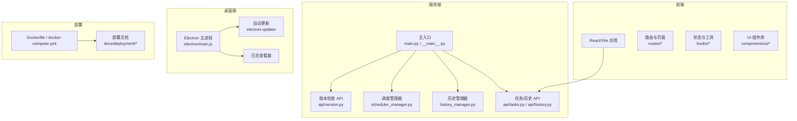
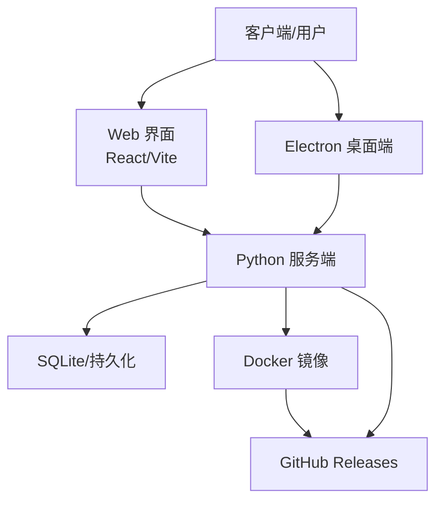
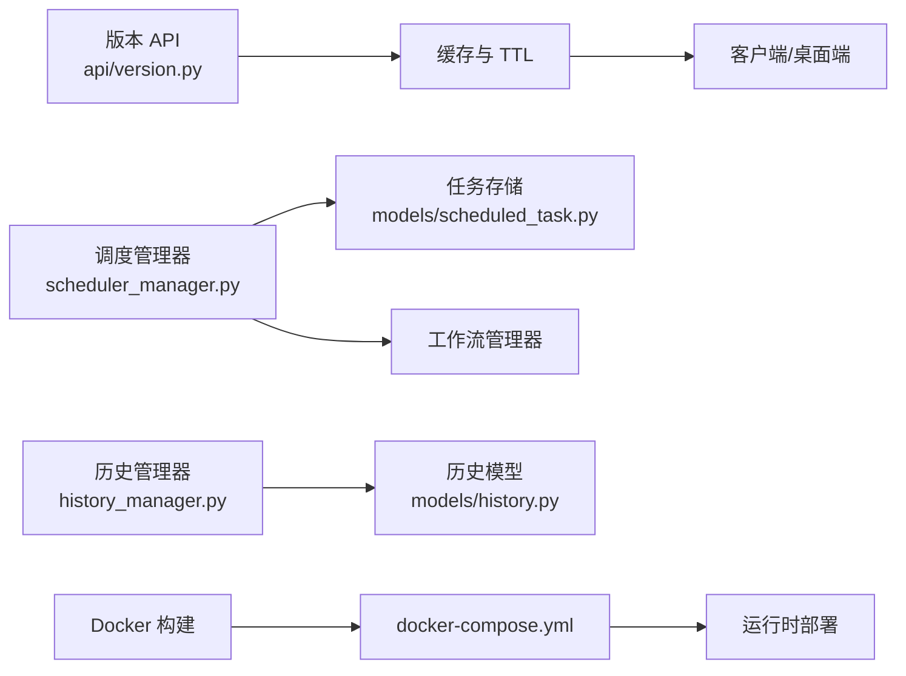

# 版本发展历程

<cite>
**本文引用的文件**
- [release-notes-v1.5.md](file://docs/docs/release-notes-v1.5.md)
- [README.md](file://README.md)
- [README_EN.md](file://README_EN.md)
- [installation.md](file://docs/docs/installation.md)
- [version.py](file://AutoGLM_GUI/version.py)
- [version.py](file://AutoGLM_GUI/api/version.py)
- [test_version_api.py](file://tests/test_version_api.py)
- [scheduler_manager.py](file://AutoGLM_GUI/scheduler_manager.py)
- [scheduled_tasks.py](file://AutoGLM_GUI/api/scheduled_tasks.py)
- [test_scheduler_manager.py](file://tests/test_scheduler_manager.py)
- [test_scheduler_manager.py](file://tests/test_scheduler_manager.py)
- [test_service_entry_coverage.py](file://tests/test_service_entry_coverage.py)
- [Dockerfile](file://Dockerfile)
- [docker-compose.yml](file://docker-compose.yml)
- [docker.md](file://docs/docs/deployment/docker.md)
- [main.py](file://main.py)
- [__main__.py](file://AutoGLM_GUI/__main__.py)
- [history_manager.py](file://AutoGLM_GUI/history_manager.py)
- [models/history.py](file://AutoGLM_GUI/models/history.py)
- [models/scheduled_task.py](file://AutoGLM_GUI/models/scheduled_task.py)
- [history.py](file://AutoGLM_GUI/api/history.py)
- [tasks.py](file://AutoGLM_GUI/api/tasks.py)
- [interrupt.md](file://docs/docs/features/interrupt.md)
- [workflow.md](file://docs/docs/features/workflow.md)
- [multi-device.md](file://docs/docs/features/multi-device.md)
- [realtime-preview.md](file://docs/docs/features/realtime-preview.md)
- [chat-control.md](file://docs/docs/features/chat-control.md)
- [terminal.md](file://docs/docs/features/web-terminal.md)
- [scheduler.md](file://docs/docs/features/scheduler.md)
- [docker.md](file://docs/docs/deployment/docker.md)
- [desktop.md](file://docs/docs/deployment/desktop.md)
- [server.md](file://docs/docs/deployment/server.md)
- [upgrade.md](file://docs/docs/upgrade.md)
</cite>

## 目录
1. [引言](#引言)
2. [项目结构](#项目结构)
3. [核心组件](#核心组件)
4. [架构总览](#架构总览)
5. [详细组件分析](#详细组件分析)
6. [依赖关系分析](#依赖关系分析)
7. [性能考量](#性能考量)
8. [故障排查指南](#故障排查指南)
9. [结论](#结论)
10. [附录](#附录)

## 引言
本文件系统梳理 AutoGLM-GUI 项目的版本演进历程，重点聚焦 v1.5 版本的重大更新，包括生产力工具升级、定时任务调度系统、对话历史管理、立即打断执行、Docker 一键部署、模拟器零配置等新增功能。文档同时提供版本升级指南、迁移注意事项以及未来发展规划，帮助用户理解功能演进轨迹并选择合适版本。

## 项目结构
AutoGLM-GUI 采用前后端分离与模块化架构设计，核心由 Python 后端服务、Electron 桌面应用、前端 React/Vite 界面、测试与文档体系构成。v1.5 版本在服务端引入定时任务调度、对话历史持久化、Docker 多架构支持、模拟器直连等能力；在桌面端引入自动更新、日志查看器等体验增强功能；在前端提供更友好的设备管理与实时预览界面。

图表来源
- [main.py](file://main.py)
- [__main__.py](file://AutoGLM_GUI/__main__.py)
- [version.py](file://AutoGLM_GUI/api/version.py)
- [scheduler_manager.py](file://AutoGLM_GUI/scheduler_manager.py)
- [history_manager.py](file://AutoGLM_GUI/history_manager.py)
- [tasks.py](file://AutoGLM_GUI/api/tasks.py)
- [history.py](file://AutoGLM_GUI/api/history.py)
- [Dockerfile](file://Dockerfile)
- [docker-compose.yml](file://docker-compose.yml)

章节来源
- [main.py](file://main.py)
- [__main__.py](file://AutoGLM_GUI/__main__.py)

## 核心组件
- 版本检查与更新：内置版本 API 用于查询最新版本并缓存结果，支持失败回退与 TTL 控制，便于用户了解可用更新。
- 定时任务调度系统：基于调度管理器实现 Cron 表达式驱动的任务编排，支持任务 CRUD、启停、下次运行时间计算与执行摘要记录。
- 对话历史管理：历史管理器与数据库模型配合，提供会话持久化、检索与统计分析能力。
- 立即打断执行：AsyncAgent 支持快速取消，改善长任务等待体验。
- Docker 一键部署：多架构镜像与 compose 编排，简化生产部署。
- 模拟器零配置：本地模拟器直连，无需配对或网络配置。
- 电子桌面前端：自动更新、日志查看器、菜单快捷入口等增强体验。

章节来源
- [version.py](file://AutoGLM_GUI/api/version.py)
- [test_version_api.py](file://tests/test_version_api.py)
- [scheduler_manager.py](file://AutoGLM_GUI/scheduler_manager.py)
- [scheduled_tasks.py](file://AutoGLM_GUI/api/scheduled_tasks.py)
- [history_manager.py](file://AutoGLM_GUI/history_manager.py)
- [models/history.py](file://AutoGLM_GUI/models/history.py)
- [models/scheduled_task.py](file://AutoGLM_GUI/models/scheduled_task.py)
- [Dockerfile](file://Dockerfile)
- [docker-compose.yml](file://docker-compose.yml)

## 架构总览
v1.5 版本在服务端引入调度与历史两大子系统，结合前端与桌面端能力，形成“服务端能力 + 前端界面 + 桌面体验”的统一平台。版本检查与更新贯穿全渠道，确保用户始终获得最新能力。

图表来源
- [version.py](file://AutoGLM_GUI/api/version.py)
- [Dockerfile](file://Dockerfile)
- [docker-compose.yml](file://docker-compose.yml)

## 详细组件分析

### v1.5.0 里程碑大版本
v1.5.0 是本次演进的里程碑版本，引入多项核心能力与架构重构：

- 对话历史与定时任务系统
  - 持久化存储完整对话历史，支持检索与统计分析。
  - 定时任务调度系统，基于 Cron 表达式，支持任务启停、下次运行时间计算与执行摘要记录。
- Agent 自动初始化
  - 首次使用时自动初始化设备，简化生命周期管理，移除手动 init API。
- Docker 多架构支持
  - 支持 x86_64 与 ARM64，GHCR 托管镜像，简化部署。
- 模拟器直接连接支持
  - 本地模拟器无需配对即可直连，简化开发环境配置。
- 设备监视器宽度控制
  - 可调整设备监视器面板宽度，支持宽度预设与用户偏好保存。
- HTTPS 支持
  - 新增 SSL 密钥与证书参数，支持生产环境安全连接。
- Electron 日志查看器
  - 桌面应用内集成日志查看器，支持实时日志流与过滤搜索。
- “在浏览器中打开”菜单选项
  - 快速切换到 Web 界面，实现桌面版与 Web 版无缝切换。
- 架构清理与重构
  - 标准化 Agent 协议接口，消除跨层依赖，移除协议注入模式，模块化架构升级。
  - 移除双模型模式，简化代码库，聚焦核心功能。
  - 实现原生 GLM Agent，解耦配置层，为后续升级铺路。
- Bug 修复与稳定性
  - 改进 scrcpy 视频流稳定性与重试逻辑。
  - 修复 Docker 部署静态文件与配置覆盖问题。
  - 设备不存在时截图接口返回明确错误。

章节来源
- [release-notes-v1.5.md](file://docs/docs/release-notes-v1.5.md)
- [scheduler_manager.py](file://AutoGLM_GUI/scheduler_manager.py)
- [scheduled_tasks.py](file://AutoGLM_GUI/api/scheduled_tasks.py)
- [history_manager.py](file://AutoGLM_GUI/history_manager.py)
- [models/history.py](file://AutoGLM_GUI/models/history.py)
- [models/scheduled_task.py](file://AutoGLM_GUI/models/scheduled_task.py)
- [Dockerfile](file://Dockerfile)
- [docker-compose.yml](file://docker-compose.yml)

### v1.5.1 功能与重构版
- 多轮对话支持：增强多轮对话的消息传递与上下文管理。
- 对话历史系统：完善历史检索与统计能力。
- 架构微调：进一步强化领域边界与模块化。

章节来源
- [release-notes-v1.5.md](file://docs/docs/release-notes-v1.5.md)

### v1.5.2 Electron 增强版
- Electron 桌面版自动更新系统：启动时自动检查 GitHub Releases，后台静默下载更新包，支持多平台（Windows NSIS、macOS DMG、Linux AppImage），DevTools 可配置日志。
- AsyncAgent 立即取消功能：取消响应时间小于 1 秒，中断正在进行的 LLM API 请求，显著改善长任务体验。
- 多轮对话消息传递修复：改进多轮对话中消息传递与上下文管理。
- 文档改进：添加贡献指南、修正许可证、添加 Mock 服务器启动脚本。

章节来源
- [release-notes-v1.5.md](file://docs/docs/release-notes-v1.5.md)
- [interrupt.md](file://docs/docs/features/interrupt.md)

### v1.5.3 稳定性增强版
- 为 chat 与 chat stream 端点启用设备自动初始化，简化设备使用流程，减少手动初始化步骤。
- 增强预发布清理流程，为 Docker E2E 测试添加重试逻辑，处理 Docker Hub 瞬时超时。
- 升级 urllib3 以提升安全性与稳定性。

章节来源
- [release-notes-v1.5.md](file://docs/docs/release-notes-v1.5.md)

### v1.5.4 接口优化版
- 多轮对话支持：持续优化多轮对话体验。
- 对话历史系统：进一步完善历史检索与统计能力。

章节来源
- [release-notes-v1.5.md](file://docs/docs/release-notes-v1.5.md)

### v1.5.5 最新稳定版
- 修复 Docusaurus v3.9.2 的 Mermaid 图表支持问题，确保文档渲染稳定。

章节来源
- [release-notes-v1.5.md](file://docs/docs/release-notes-v1.5.md)

## 依赖关系分析
- 版本检查依赖：服务端通过版本 API 查询 GitHub Releases，采用缓存与 TTL 控制，失败时回退到过期缓存。
- 调度系统依赖：调度管理器依赖任务存储与工作流管理器，执行时记录最新运行摘要。
- 历史系统依赖：历史管理器与数据库模型协同，提供会话持久化与检索。
- 部署依赖：Dockerfile 与 docker-compose.yml 提供多架构镜像与编排，部署文档指导生产环境配置。

图表来源
- [version.py](file://AutoGLM_GUI/api/version.py)
- [scheduler_manager.py](file://AutoGLM_GUI/scheduler_manager.py)
- [models/scheduled_task.py](file://AutoGLM_GUI/models/scheduled_task.py)
- [history_manager.py](file://AutoGLM_GUI/history_manager.py)
- [models/history.py](file://AutoGLM_GUI/models/history.py)
- [Dockerfile](file://Dockerfile)
- [docker-compose.yml](file://docker-compose.yml)

章节来源
- [test_version_api.py](file://tests/test_version_api.py)
- [test_scheduler_manager.py](file://tests/test_scheduler_manager.py)
- [test_service_entry_coverage.py](file://tests/test_service_entry_coverage.py)

## 性能考量
- 版本检查缓存：通过 TTL 与失败回退机制减少频繁请求，提升用户体验。
- 调度系统：任务持久化与摘要记录避免重复计算，提高调度效率。
- 视频流稳定性：改进 scrcpy 连接与重试逻辑，降低卡顿与断流概率。
- Docker 部署：多架构镜像与静态资源打包，缩短部署时间与降低运维复杂度。

## 故障排查指南
- 版本检查失败
  - 现象：无法获取最新版本或提示网络异常。
  - 排查：确认网络可达 GitHub，检查缓存是否过期；若失败，系统会回退到过期缓存。
  - 参考路径：[版本 API 测试](file://tests/test_version_api.py)
- 定时任务不生效
  - 现象：任务未按预期执行或状态异常。
  - 排查：确认 Cron 表达式语法正确，检查任务启停状态与下次运行时间；查看任务存储文件与摘要记录。
  - 参考路径：[调度管理器](file://AutoGLM_GUI/scheduler_manager.py)，[任务 API 响应](file://AutoGLM_GUI/api/scheduled_tasks.py)
- 对话历史缺失
  - 现象：历史记录无法检索或为空。
  - 排查：确认历史管理器初始化与数据库连接正常，检查历史模型字段映射。
  - 参考路径：[历史管理器](file://AutoGLM_GUI/history_manager.py)，[历史模型](file://AutoGLM_GUI/models/history.py)
- Docker 部署异常
  - 现象：容器启动失败或静态资源加载错误。
  - 排查：确认镜像架构匹配、compose 文件配置正确、静态资源打包完整。
  - 参考路径：[Dockerfile](file://Dockerfile)，[docker-compose.yml](file://docker-compose.yml)，[部署文档](file://docs/docs/deployment/docker.md)

章节来源
- [test_version_api.py](file://tests/test_version_api.py)
- [scheduler_manager.py](file://AutoGLM_GUI/scheduler_manager.py)
- [scheduled_tasks.py](file://AutoGLM_GUI/api/scheduled_tasks.py)
- [history_manager.py](file://AutoGLM_GUI/history_manager.py)
- [models/history.py](file://AutoGLM_GUI/models/history.py)
- [Dockerfile](file://Dockerfile)
- [docker-compose.yml](file://docker-compose.yml)
- [docker.md](file://docs/docs/deployment/docker.md)

## 结论
v1.5 版本标志着 AutoGLM-GUI 在生产力工具、自动化与易用性方面的重大跃升。通过引入定时任务、对话历史、立即打断、Docker 一键部署与模拟器零配置等能力，项目在功能完整性与用户体验上达到新的高度。建议用户优先选择 v1.5.5 作为当前稳定版本，以获得最佳的功能与稳定性平衡。

## 附录

### 版本升级指南与迁移注意事项
- 从 v1.4.x 升级至 v1.5.x
  - 自动初始化：移除了手动 init API，首次使用将自动完成设备初始化；如需自定义初始化流程，请参考迁移文档。
  - 定时任务：旧版本任务需重新导入或迁移；建议在升级前备份任务配置。
  - 对话历史：历史数据将自动迁移至新模型；如遇兼容性问题，请检查历史模型字段映射。
  - Docker 部署：使用多架构镜像与 compose 编排，建议先在测试环境验证。
  - 参考路径：[升级文档](file://docs/docs/upgrade.md)，[部署文档](file://docs/docs/deployment.md)

章节来源
- [upgrade.md](file://docs/docs/upgrade.md)
- [deployment.md](file://docs/docs/deployment.md)

### 版本下载与安装
- 官方发布页提供多平台可执行文件与安装包，建议根据操作系统选择对应版本。
- 参考路径：[README（中文）](file://README.md)，[README（英文）](file://README_EN.md)，[安装文档](file://docs/docs/installation.md)

章节来源
- [README.md](file://README.md)
- [README_EN.md](file://README_EN.md)
- [installation.md](file://docs/docs/installation.md)

### 功能与特性概览
- 定时任务调度：支持 Cron 表达式与任务启停控制，适合周期性自动化场景。
- 对话历史管理：提供会话持久化与检索，便于审计与复盘。
- 立即打断执行：AsyncAgent 支持快速取消，显著改善长任务等待体验。
- Docker 一键部署：多架构镜像与 compose 编排，简化生产部署。
- 模拟器零配置：本地模拟器直连，无需配对或网络配置。
- 参考路径：[调度功能文档](file://docs/docs/features/scheduler.md)，[中断功能文档](file://docs/docs/features/interrupt.md)，[Docker 部署文档](file://docs/docs/deployment/docker.md)

章节来源
- [scheduler.md](file://docs/docs/features/scheduler.md)
- [interrupt.md](file://docs/docs/features/interrupt.md)
- [docker.md](file://docs/docs/deployment/docker.md)