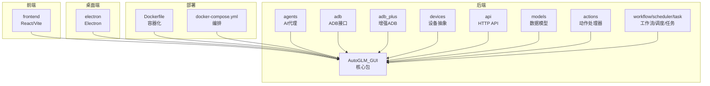
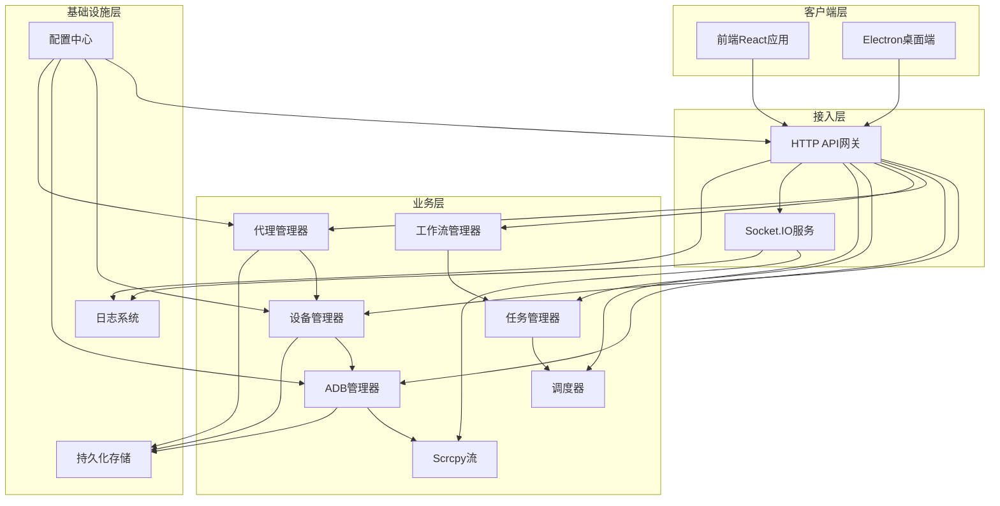
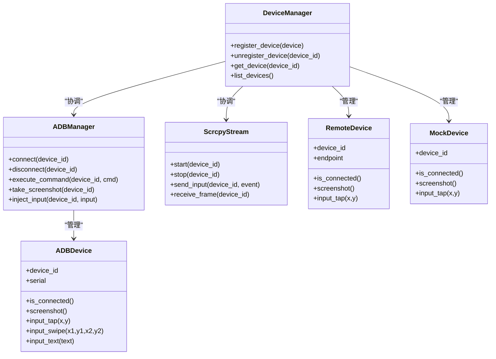
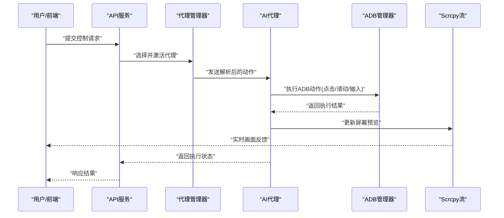
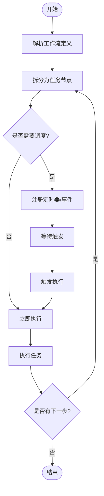
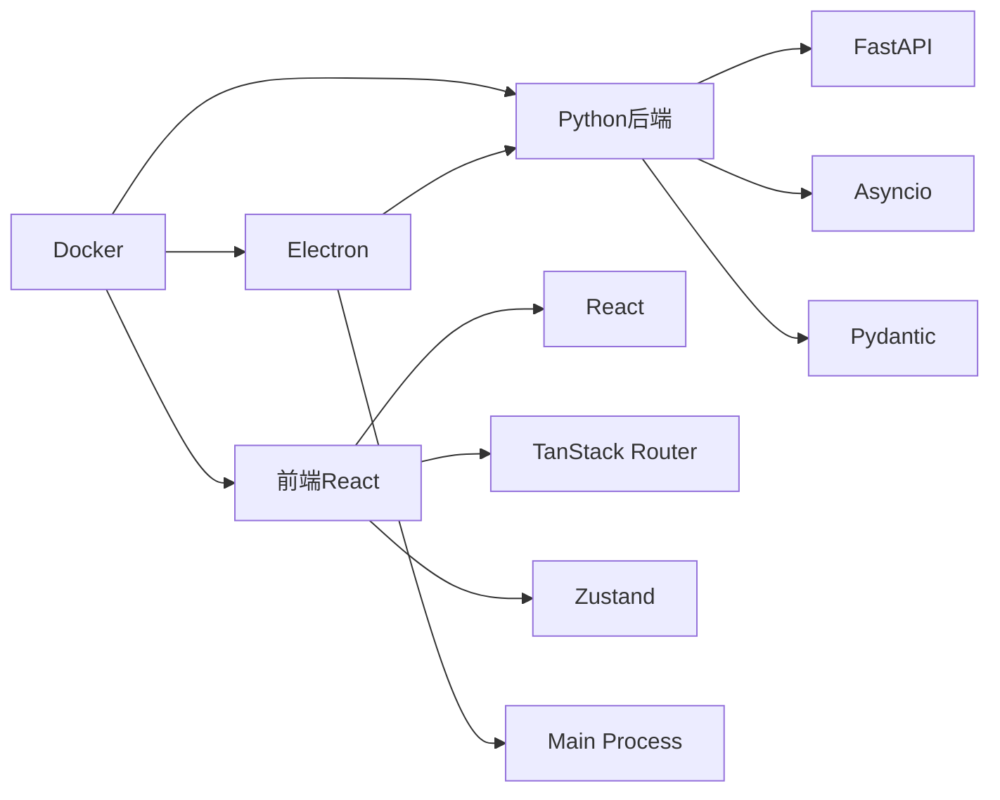

# 项目概述

<cite>
**本文档引用的文件**
- [README.md](file://README.md)
- [main.py](file://main.py)
- [AutoGLM_GUI/__main__.py](file://AutoGLM_GUI/__main__.py)
- [AutoGLM_GUI/server.py](file://AutoGLM_GUI/server.py)
- [AutoGLM_GUI/device_manager.py](file://AutoGLM_GUI/device_manager.py)
- [AutoGLM_GUI/device_group_manager.py](file://AutoGLM_GUI/device_group_manager.py)
- [AutoGLM_GUI/adb_manager.py](file://AutoGLM_GUI/adb_manager.py)
- [AutoGLM_GUI/phone_agent_manager.py](file://AutoGLM_GUI/phone_agent_manager.py)
- [AutoGLM_GUI/layered_agent_service.py](file://AutoGLM_GUI/layered_agent_service.py)
- [AutoGLM_GUI/workflow_manager.py](file://AutoGLM_GUI/workflow_manager.py)
- [AutoGLM_GUI/task_manager.py](file://AutoGLM_GUI/task_manager.py)
- [AutoGLM_GUI/scheduler_manager.py](file://AutoGLM_GUI/scheduler_manager.py)
- [AutoGLM_GUI/socketio_server.py](file://AutoGLM_GUI/socketio_server.py)
- [AutoGLM_GUI/scrcpy_protocol.py](file://AutoGLM_GUI/scrcpy_protocol.py)
- [AutoGLM_GUI/scrcpy_stream.py](file://AutoGLM_GUI/scrcpy_stream.py)
- [AutoGLM_GUI/devices/adb_device.py](file://AutoGLM_GUI/devices/adb_device.py)
- [AutoGLM_GUI/devices/mock_device.py](file://AutoGLM_GUI/devices/mock_device.py)
- [AutoGLM_GUI/devices/remote_device.py](file://AutoGLM_GUI/devices/remote_device.py)
- [AutoGLM_GUI/agents/factory.py](file://AutoGLM_GUI/agents/factory.py)
- [AutoGLM_GUI/agents/glm/async_agent.py](file://AutoGLM_GUI/agents/glm/async_agent.py)
- [AutoGLM_GUI/agents/qwen/async_agent.py](file://AutoGLM_GUI/agents/qwen/async_agent.py)
- [AutoGLM_GUI/agents/gemini/async_agent.py](file://AutoGLM_GUI/agents/gemini/async_agent.py)
- [AutoGLM_GUI/agents/droidrun/async_agent.py](file://AutoGLM_GUI/agents/droidrun/async_agent.py)
- [AutoGLM_GUI/agents/midscene/async_agent.py](file://AutoGLM_GUI/agents/midscene/async_agent.py)
- [AutoGLM_GUI/agents/mai/async_agent.py](file://AutoGLM_GUI/agents/mai/async_agent.py)
- [AutoGLM_GUI/adb/device.py](file://AutoGLM_GUI/adb/device.py)
- [AutoGLM_GUI/adb/input.py](file://AutoGLM_GUI/adb/input.py)
- [AutoGLM_GUI/adb/screenshot.py](file://AutoGLM_GUI/adb/screenshot.py)
- [AutoGLM_GUI/adb_plus/device.py](file://AutoGLM_GUI/adb_plus/device.py)
- [AutoGLM_GUI/adb_plus/touch.py](file://AutoGLM_GUI/adb_plus/touch.py)
- [AutoGLM_GUI/adb_plus/screenshot.py](file://AutoGLM_GUI/adb_plus/screenshot.py)
- [AutoGLM_GUI/api/devices.py](file://AutoGLM_GUI/api/devices.py)
- [AutoGLM_GUI/api/control.py](file://AutoGLM_GUI/api/control.py)
- [AutoGLM_GUI/api/workflows.py](file://AutoGLM_GUI/api/workflows.py)
- [AutoGLM_GUI/api/tasks.py](file://AutoGLM_GUI/api/tasks.py)
- [AutoGLM_GUI/api/terminal.py](file://AutoGLM_GUI/api/terminal.py)
- [AutoGLM_GUI/api/health.py](file://AutoGLM_GUI/api/health.py)
- [AutoGLM_GUI/api/version.py](file://AutoGLM_GUI/api/version.py)
- [AutoGLM_GUI/api/history.py](file://AutoGLM_GUI/api/history.py)
- [AutoGLM_GUI/api/experience.py](file://AutoGLM_GUI/api/experience.py)
- [AutoGLM_GUI/api/metrics.py](file://AutoGLM_GUI/api/metrics.py)
- [AutoGLM_GUI/api/mcp.py](file://AutoGLM_GUI/api/mcp.py)
- [AutoGLM_GUI/api/layered_agent.py](file://AutoGLM_GUI/api/layered_agent.py)
- [AutoGLM_GUI/api/scheduled_tasks.py](file://AutoGLM_GUI/api/scheduled_tasks.py)
- [AutoGLM_GUI/api/media.py](file://AutoGLM_GUI/api/media.py)
- [AutoGLM_GUI/api/agents.py](file://AutoGLM_GUI/api/agents.py)
- [AutoGLM_GUI/api/control.py](file://AutoGLM_GUI/api/control.py)
- [AutoGLM_GUI/config.py](file://AutoGLM_GUI/config.py)
- [AutoGLM_GUI/config_manager.py](file://AutoGLM_GUI/config_manager.py)
- [AutoGLM_GUI/version.py](file://AutoGLM_GUI/version.py)
- [frontend/src/main.tsx](file://frontend/src/main.tsx)
- [frontend/package.json](file://frontend/package.json)
- [electron/package.json](file://electron/package.json)
- [Dockerfile](file://Dockerfile)
- [docker-compose.yml](file://docker-compose.yml)
- [pyproject.toml](file://pyproject.toml)
- [scripts/build.py](file://scripts/build.py)
- [scripts/release.py](file://scripts/release.py)
- [docs/docs/intro.md](file://docs/docs/intro.md)
- [docs/docs/getting-started/install.md](file://docs/docs/getting-started/install.md)
- [docs/docs/features/chat-control.md](file://docs/docs/features/chat-control.md)
- [docs/docs/features/realtime-preview.md](file://docs/docs/features/realtime-preview.md)
- [docs/docs/features/multi-device.md](file://docs/docs/features/multi-device.md)
- [docs/docs/features/workflow.md](file://docs/docs/features/workflow.md)
- [docs/docs/features/scheduler.md](file://docs/docs/features/scheduler.md)
- [docs/docs/features/web-terminal.md](file://docs/docs/features/web-terminal.md)
- [docs/docs/features/layered-agent.md](file://docs/docs/features/layered-agent.md)
- [docs/docs/troubleshooting/common-issues.md](file://docs/docs/troubleshooting/common-issues.md)
- [docs/docs/configuration.md](file://docs/docs/configuration.md)
- [docs/docs/deployment/desktop.md](file://docs/docs/deployment/desktop.md)
- [docs/docs/deployment/docker.md](file://docs/docs/deployment/docker.md)
- [docs/docs/deployment/server.md](file://docs/docs/deployment/server.md)
</cite>

## 目录
1. [引言](#引言)
2. [项目结构](#项目结构)
3. [核心组件](#核心组件)
4. [架构总览](#架构总览)
5. [详细组件分析](#详细组件分析)
6. [依赖关系分析](#依赖关系分析)
7. [性能考虑](#性能考虑)
8. [故障排除指南](#故障排除指南)
9. [结论](#结论)
10. [附录](#附录)

## 引言
AutoGLM-GUI是一个基于人工智能的Android自动化控制系统，旨在通过多模态大模型实现对Android设备的智能操作与控制。该项目的核心价值在于将自然语言指令转化为可执行的设备操作，支持实时预览、多设备协同、工作流编排与调度等能力，适用于游戏自动化、应用测试、批量任务处理等多种场景。

项目采用前后端分离架构：后端基于Python构建，提供设备管理、ADB连接、Scrcpy视频流、多代理（Agent）系统以及RESTful API；前端基于React/Vite构建，提供Web终端、设备监控、历史记录、计划任务等功能界面；桌面端通过Electron封装，提供跨平台桌面应用体验；同时支持Docker部署与服务器模式运行。

AutoGLM-GUI的主要特性包括：
- 多模态AI代理：集成GLM、Qwen、Gemini、DroidRun、MidScene、MAI等多个AI模型的异步代理，支持不同场景下的决策与动作执行。
- 实时预览与交互：通过Scrcpy协议实现实时屏幕捕获与输入反馈，结合ADB输入模拟实现精准点击、滑动与文本输入。
- 多设备管理：支持单机多设备、远程设备与Mock设备，统一抽象为设备接口，便于扩展与维护。
- 工作流与调度：提供工作流编排与定时任务调度能力，支持复杂业务流程的自动化执行。
- Web终端与日志：内置Web终端服务与日志系统，便于调试与运维。
- 部署灵活：支持桌面端、Docker容器与服务器模式部署，满足不同环境需求。

**章节来源**
- [README.md](file://README.md)
- [docs/docs/intro.md](file://docs/docs/intro.md)

## 项目结构
AutoGLM-GUI采用模块化分层设计，主要目录与职责如下：
- AutoGLM_GUI：后端核心包，包含设备管理、ADB与Scrcpy协议、AI代理工厂、API路由、配置管理、任务与工作流管理等。
- frontend：React前端应用，提供设备面板、聊天控制、历史记录、计划任务、Web终端等界面。
- electron：Electron打包脚本与配置，用于生成桌面端应用。
- scripts：构建、发布与辅助脚本。
- tests：集成测试与单元测试，覆盖设备、代理、API、任务系统等。
- docs：Docusaurus文档站点，包含安装、功能、部署、故障排除等文档。
- docker-compose.yml与Dockerfile：容器化部署配置。

**图表来源**
- [AutoGLM_GUI/__main__.py](file://AutoGLM_GUI/__main__.py)
- [frontend/src/main.tsx](file://frontend/src/main.tsx)
- [electron/package.json](file://electron/package.json)
- [Dockerfile](file://Dockerfile)
- [docker-compose.yml](file://docker-compose.yml)

**章节来源**
- [main.py](file://main.py)
- [AutoGLM_GUI/__main__.py](file://AutoGLM_GUI/__main__.py)
- [frontend/package.json](file://frontend/package.json)
- [electron/package.json](file://electron/package.json)
- [Dockerfile](file://Dockerfile)
- [docker-compose.yml](file://docker-compose.yml)

## 核心组件
- 设备管理层：负责设备发现、连接、状态管理与生命周期控制，支持ADB设备、远程设备与Mock设备。
- ADB与Scrcpy：提供ADB命令执行、截图、输入模拟与Scrcpy视频流传输，支撑实时预览与交互。
- AI代理系统：通过工厂模式创建不同模型的异步代理，统一动作映射与解析接口，支持多模态理解与决策。
- API服务：提供设备、控制、工作流、任务、终端、健康检查、版本、历史、指标、MCP、分层代理等REST API。
- 任务与工作流：支持任务编排、定时调度与会话管理，实现复杂业务流程的自动化执行。
- 前端与桌面端：提供Web界面、实时预览、设备监控、历史记录、计划任务与Web终端，支持桌面端打包。

**章节来源**
- [AutoGLM_GUI/device_manager.py](file://AutoGLM_GUI/device_manager.py)
- [AutoGLM_GUI/adb_manager.py](file://AutoGLM_GUI/adb_manager.py)
- [AutoGLM_GUI/phone_agent_manager.py](file://AutoGLM_GUI/phone_agent_manager.py)
- [AutoGLM_GUI/workflow_manager.py](file://AutoGLM_GUI/workflow_manager.py)
- [AutoGLM_GUI/task_manager.py](file://AutoGLM_GUI/task_manager.py)
- [AutoGLM_GUI/scheduler_manager.py](file://AutoGLM_GUI/scheduler_manager.py)
- [AutoGLM_GUI/socketio_server.py](file://AutoGLM_GUI/socketio_server.py)
- [AutoGLM_GUI/scrcpy_protocol.py](file://AutoGLM_GUI/scrcpy_protocol.py)
- [AutoGLM_GUI/scrcpy_stream.py](file://AutoGLM_GUI/scrcpy_stream.py)
- [AutoGLM_GUI/devices/adb_device.py](file://AutoGLM_GUI/devices/adb_device.py)
- [AutoGLM_GUI/devices/mock_device.py](file://AutoGLM_GUI/devices/mock_device.py)
- [AutoGLM_GUI/devices/remote_device.py](file://AutoGLM_GUI/devices/remote_device.py)
- [AutoGLM_GUI/agents/factory.py](file://AutoGLM_GUI/agents/factory.py)

## 架构总览
AutoGLM-GUI采用分层架构与微服务风格的模块划分，后端以事件驱动与异步处理为核心，前端通过WebSocket与Socket.IO实现实时通信，桌面端通过Electron桥接后端服务。

**图表来源**
- [AutoGLM_GUI/server.py](file://AutoGLM_GUI/server.py)
- [AutoGLM_GUI/socketio_server.py](file://AutoGLM_GUI/socketio_server.py)
- [AutoGLM_GUI/device_manager.py](file://AutoGLM_GUI/device_manager.py)
- [AutoGLM_GUI/adb_manager.py](file://AutoGLM_GUI/adb_manager.py)
- [AutoGLM_GUI/phone_agent_manager.py](file://AutoGLM_GUI/phone_agent_manager.py)
- [AutoGLM_GUI/workflow_manager.py](file://AutoGLM_GUI/workflow_manager.py)
- [AutoGLM_GUI/task_manager.py](file://AutoGLM_GUI/task_manager.py)
- [AutoGLM_GUI/scheduler_manager.py](file://AutoGLM_GUI/scheduler_manager.py)
- [AutoGLM_GUI/scrcpy_stream.py](file://AutoGLM_GUI/scrcpy_stream.py)

## 详细组件分析

### 设备管理与ADB/Scrcpy子系统
- 设备抽象：统一ADB设备、远程设备与Mock设备接口，屏蔽底层差异，便于扩展与测试。
- ADB子系统：提供设备连接、命令执行、截图、输入模拟与ADB键盘安装等能力。
- Scrcpy子系统：通过Scrcpy协议实现屏幕捕获、输入事件转发与视频流传输，支持实时预览与交互。

**图表来源**
- [AutoGLM_GUI/device_manager.py](file://AutoGLM_GUI/device_manager.py)
- [AutoGLM_GUI/adb_manager.py](file://AutoGLM_GUI/adb_manager.py)
- [AutoGLM_GUI/scrcpy_stream.py](file://AutoGLM_GUI/scrcpy_stream.py)
- [AutoGLM_GUI/devices/adb_device.py](file://AutoGLM_GUI/devices/adb_device.py)
- [AutoGLM_GUI/devices/remote_device.py](file://AutoGLM_GUI/devices/remote_device.py)
- [AutoGLM_GUI/devices/mock_device.py](file://AutoGLM_GUI/devices/mock_device.py)

**章节来源**
- [AutoGLM_GUI/device_manager.py](file://AutoGLM_GUI/device_manager.py)
- [AutoGLM_GUI/adb_manager.py](file://AutoGLM_GUI/adb_manager.py)
- [AutoGLM_GUI/scrcpy_protocol.py](file://AutoGLM_GUI/scrcpy_protocol.py)
- [AutoGLM_GUI/scrcpy_stream.py](file://AutoGLM_GUI/scrcpy_stream.py)
- [AutoGLM_GUI/devices/adb_device.py](file://AutoGLM_GUI/devices/adb_device.py)
- [AutoGLM_GUI/devices/remote_device.py](file://AutoGLM_GUI/devices/remote_device.py)
- [AutoGLM_GUI/devices/mock_device.py](file://AutoGLM_GUI/devices/mock_device.py)

### AI代理系统与动作执行
- 代理工厂：根据配置选择合适的AI模型代理，统一异步接口与动作映射。
- 多模型支持：集成GLM、Qwen、Gemini、DroidRun、MidScene、MAI等代理，适配不同场景与需求。
- 动作解析：将自然语言或结构化指令解析为具体的ADB/Scrcpy动作序列。

**图表来源**
- [AutoGLM_GUI/api/control.py](file://AutoGLM_GUI/api/control.py)
- [AutoGLM_GUI/phone_agent_manager.py](file://AutoGLM_GUI/phone_agent_manager.py)
- [AutoGLM_GUI/agents/factory.py](file://AutoGLM_GUI/agents/factory.py)
- [AutoGLM_GUI/agents/glm/async_agent.py](file://AutoGLM_GUI/agents/glm/async_agent.py)
- [AutoGLM_GUI/agents/qwen/async_agent.py](file://AutoGLM_GUI/agents/qwen/async_agent.py)
- [AutoGLM_GUI/agents/gemini/async_agent.py](file://AutoGLM_GUI/agents/gemini/async_agent.py)
- [AutoGLM_GUI/adb/input.py](file://AutoGLM_GUI/adb/input.py)
- [AutoGLM_GUI/scrcpy_stream.py](file://AutoGLM_GUI/scrcpy_stream.py)

**章节来源**
- [AutoGLM_GUI/phone_agent_manager.py](file://AutoGLM_GUI/phone_agent_manager.py)
- [AutoGLM_GUI/agents/factory.py](file://AutoGLM_GUI/agents/factory.py)
- [AutoGLM_GUI/agents/glm/async_agent.py](file://AutoGLM_GUI/agents/glm/async_agent.py)
- [AutoGLM_GUI/agents/qwen/async_agent.py](file://AutoGLM_GUI/agents/qwen/async_agent.py)
- [AutoGLM_GUI/agents/gemini/async_agent.py](file://AutoGLM_GUI/agents/gemini/async_agent.py)
- [AutoGLM_GUI/agents/droidrun/async_agent.py](file://AutoGLM_GUI/agents/droidrun/async_agent.py)
- [AutoGLM_GUI/agents/midscene/async_agent.py](file://AutoGLM_GUI/agents/midscene/async_agent.py)
- [AutoGLM_GUI/agents/mai/async_agent.py](file://AutoGLM_GUI/agents/mai/async_agent.py)
- [AutoGLM_GUI/adb/input.py](file://AutoGLM_GUI/adb/input.py)

### 工作流、任务与调度
- 工作流编排：定义步骤化的自动化流程，支持条件判断、重试与回滚。
- 任务系统：将具体操作拆分为任务单元，支持并发与串行组合。
- 调度器：基于时间或事件触发任务执行，支持周期性与一次性任务。

**图表来源**
- [AutoGLM_GUI/workflow_manager.py](file://AutoGLM_GUI/workflow_manager.py)
- [AutoGLM_GUI/task_manager.py](file://AutoGLM_GUI/task_manager.py)
- [AutoGLM_GUI/scheduler_manager.py](file://AutoGLM_GUI/scheduler_manager.py)

**章节来源**
- [AutoGLM_GUI/workflow_manager.py](file://AutoGLM_GUI/workflow_manager.py)
- [AutoGLM_GUI/task_manager.py](file://AutoGLM_GUI/task_manager.py)
- [AutoGLM_GUI/scheduler_manager.py](file://AutoGLM_GUI/scheduler_manager.py)

### API与服务接口
- 设备API：设备列表、连接、断开、信息查询与元数据管理。
- 控制API：执行点击、滑动、文本输入、截图等操作。
- 工作流与任务API：创建工作流、查询状态、执行与取消。
- 终端API：提供Web终端服务，支持命令执行与输出。
- 健康检查与版本API：服务可用性检测与版本信息查询。
- 指标与媒体API：性能指标上报与媒体资源访问。
- MCP与分层代理API：多模型协作与代理会话管理。

**章节来源**
- [AutoGLM_GUI/api/devices.py](file://AutoGLM_GUI/api/devices.py)
- [AutoGLM_GUI/api/control.py](file://AutoGLM_GUI/api/control.py)
- [AutoGLM_GUI/api/workflows.py](file://AutoGLM_GUI/api/workflows.py)
- [AutoGLM_GUI/api/tasks.py](file://AutoGLM_GUI/api/tasks.py)
- [AutoGLM_GUI/api/terminal.py](file://AutoGLM_GUI/api/terminal.py)
- [AutoGLM_GUI/api/health.py](file://AutoGLM_GUI/api/health.py)
- [AutoGLM_GUI/api/version.py](file://AutoGLM_GUI/api/version.py)
- [AutoGLM_GUI/api/history.py](file://AutoGLM_GUI/api/history.py)
- [AutoGLM_GUI/api/experience.py](file://AutoGLM_GUI/api/experience.py)
- [AutoGLM_GUI/api/metrics.py](file://AutoGLM_GUI/api/metrics.py)
- [AutoGLM_GUI/api/mcp.py](file://AutoGLM_GUI/api/mcp.py)
- [AutoGLM_GUI/api/layered_agent.py](file://AutoGLM_GUI/api/layered_agent.py)
- [AutoGLM_GUI/api/scheduled_tasks.py](file://AutoGLM_GUI/api/scheduled_tasks.py)
- [AutoGLM_GUI/api/media.py](file://AutoGLM_GUI/api/media.py)
- [AutoGLM_GUI/api/agents.py](file://AutoGLM_GUI/api/agents.py)

## 依赖关系分析
- 后端依赖：Python生态中的FastAPI、Pydantic、Asyncio、NumPy、Pillow等，用于API、数据校验与异步处理。
- 前端依赖：React、Vite、TanStack Router、Zustand、TailwindCSS等，提供现代化UI与状态管理。
- 桌面端依赖：Electron、@electron/remote等，用于桌面应用打包与主进程IPC。
- 容器化：Dockerfile与docker-compose.yml，支持容器化部署与服务编排。
- 构建与发布：scripts目录下的构建与发布脚本，支持跨平台打包与版本管理。

**图表来源**
- [pyproject.toml](file://pyproject.toml)
- [frontend/package.json](file://frontend/package.json)
- [electron/package.json](file://electron/package.json)
- [Dockerfile](file://Dockerfile)
- [docker-compose.yml](file://docker-compose.yml)

**章节来源**
- [pyproject.toml](file://pyproject.toml)
- [frontend/package.json](file://frontend/package.json)
- [electron/package.json](file://electron/package.json)
- [Dockerfile](file://Dockerfile)
- [docker-compose.yml](file://docker-compose.yml)

## 性能考虑
- 异步处理：大量使用Asyncio与异步API，减少阻塞，提升并发处理能力。
- 流式传输：Scrcpy视频流采用高效编码与缓冲策略，降低延迟。
- 缓存与复用：设备连接、代理会话与截图结果进行缓存，减少重复开销。
- 资源池：ADB命令与网络连接采用连接池管理，避免频繁建立/销毁。
- 前端优化：React组件按需加载、状态最小化与事件节流，提升交互流畅度。

## 故障排除指南
- 常见问题：包含ADB连接失败、设备识别异常、代理调用错误、Scrcpy启动失败等问题排查与解决方案。
- 日志与监控：通过API与Web终端查看日志，结合健康检查与指标API定位问题。
- 配置检查：确认ADB路径、设备权限、网络连通性与代理模型配置正确。

**章节来源**
- [docs/docs/troubleshooting/common-issues.md](file://docs/docs/troubleshooting/common-issues.md)
- [AutoGLM_GUI/api/health.py](file://AutoGLM_GUI/api/health.py)
- [AutoGLM_GUI/api/metrics.py](file://AutoGLM_GUI/api/metrics.py)
- [AutoGLM_GUI/api/terminal.py](file://AutoGLM_GUI/api/terminal.py)

## 结论
AutoGLM-GUI通过将AI代理与Android自动化控制深度融合，提供了从自然语言到设备操作的完整链路。其模块化架构、多模型代理支持、实时预览与多设备管理能力，使其在游戏自动化、应用测试与批量任务处理等领域具备显著优势。未来将持续优化性能与稳定性，并扩展更多AI模型与设备支持，以满足更广泛的自动化需求。

## 附录
- 快速开始：包含安装、首次运行、设备连接与模型配置等基础操作指南。
- 功能特性：涵盖聊天控制、实时预览、多设备、工作流、调度、Web终端与分层代理等特性说明。
- 部署方案：提供桌面端、Docker与服务器模式的部署指导。
- 配置参考：涵盖全局配置、设备配置与代理配置的详细说明。

**章节来源**
- [docs/docs/getting-started/install.md](file://docs/docs/getting-started/install.md)
- [docs/docs/features/chat-control.md](file://docs/docs/features/chat-control.md)
- [docs/docs/features/realtime-preview.md](file://docs/docs/features/realtime-preview.md)
- [docs/docs/features/multi-device.md](file://docs/docs/features/multi-device.md)
- [docs/docs/features/workflow.md](file://docs/docs/features/workflow.md)
- [docs/docs/features/scheduler.md](file://docs/docs/features/scheduler.md)
- [docs/docs/features/web-terminal.md](file://docs/docs/features/web-terminal.md)
- [docs/docs/features/layered-agent.md](file://docs/docs/features/layered-agent.md)
- [docs/docs/deployment/desktop.md](file://docs/docs/deployment/desktop.md)
- [docs/docs/deployment/docker.md](file://docs/docs/deployment/docker.md)
- [docs/docs/deployment/server.md](file://docs/docs/deployment/server.md)
- [docs/docs/configuration.md](file://docs/docs/configuration.md)